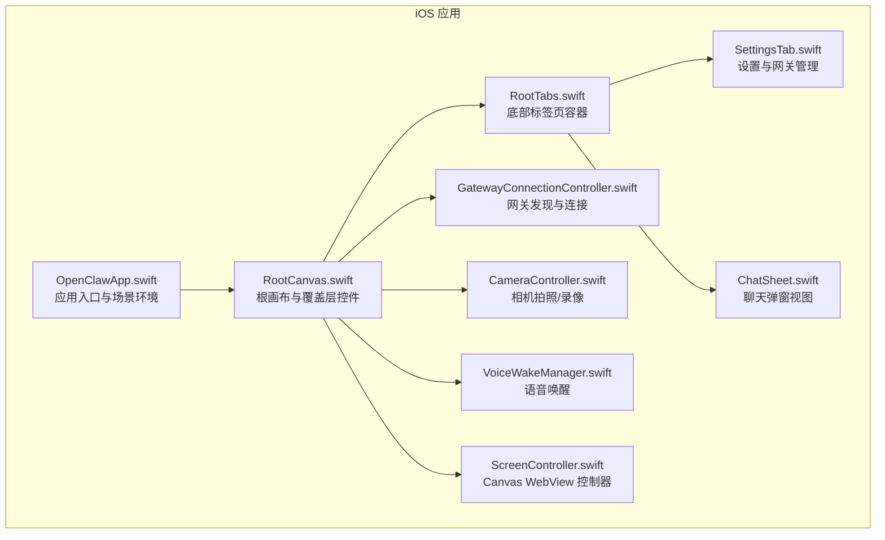
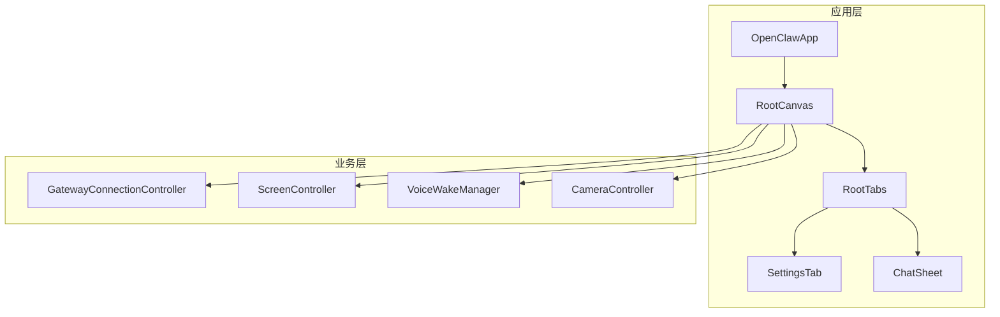
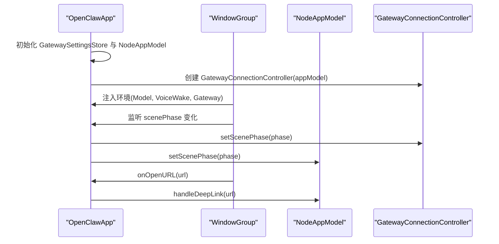
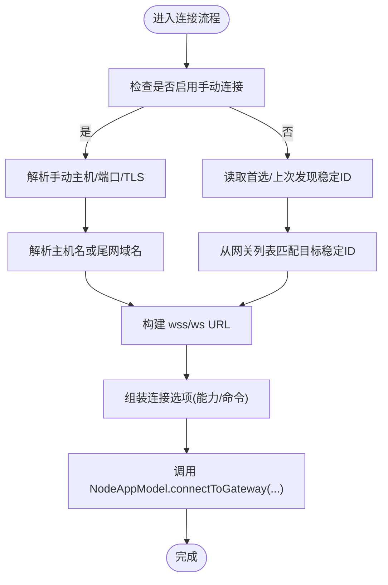
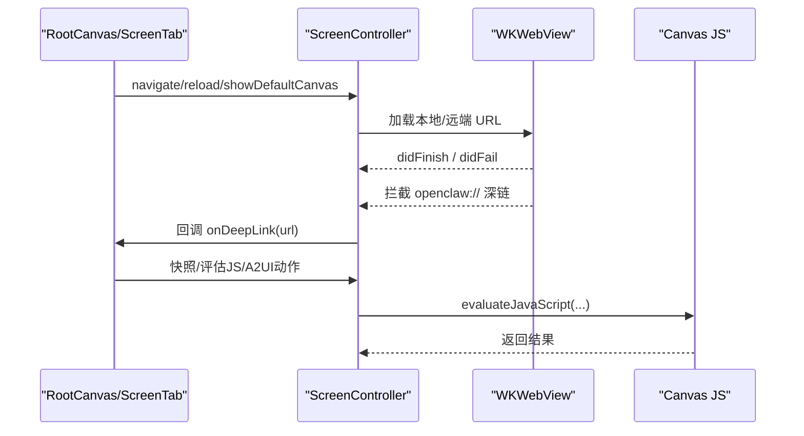
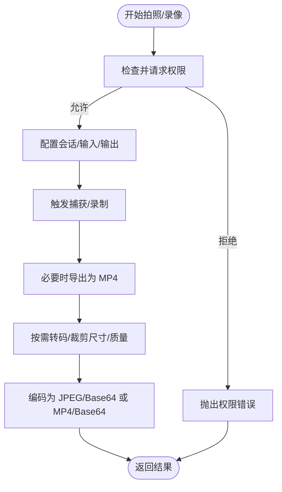
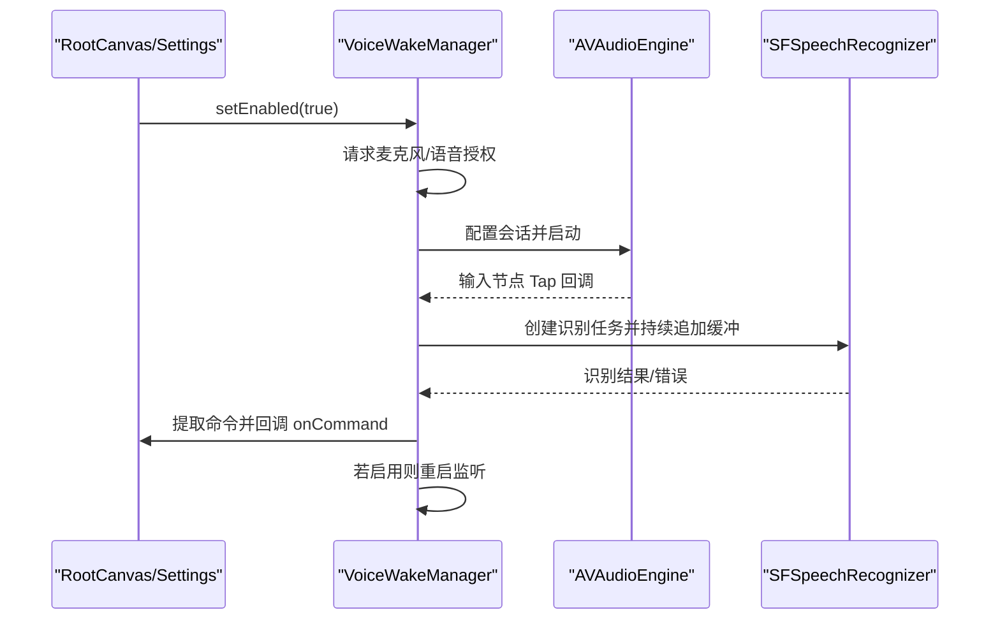
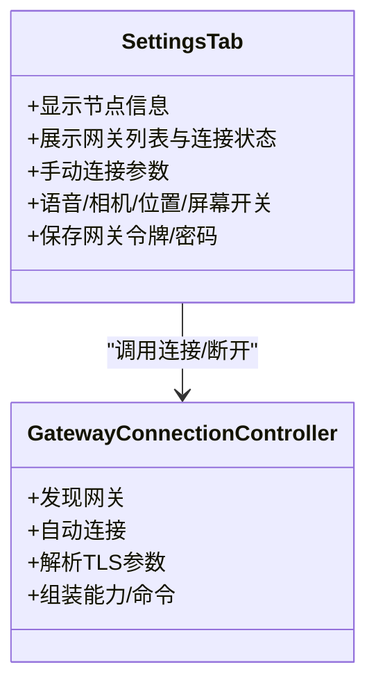
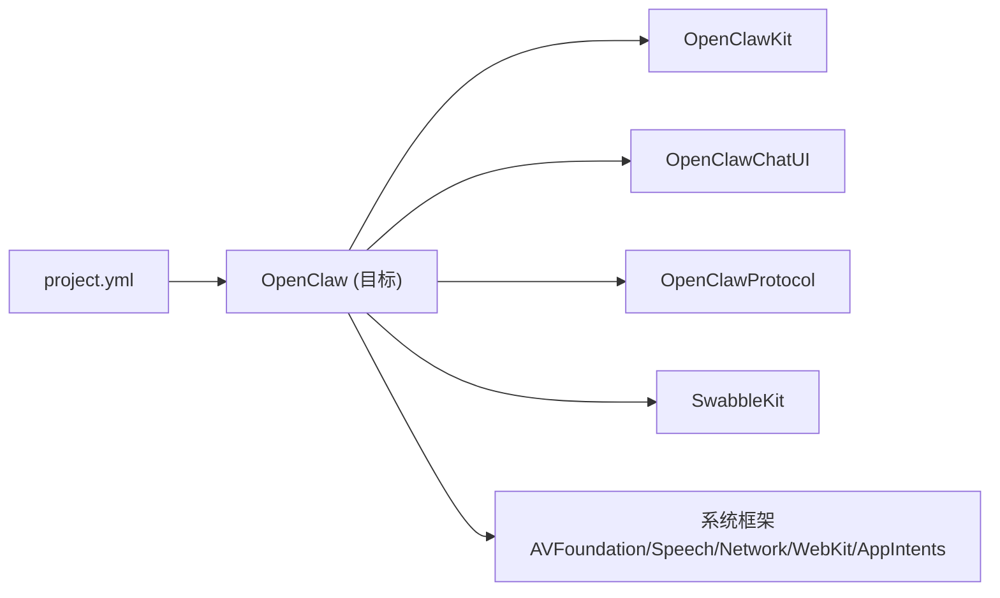

# iOS 应用

## 目录
1. [简介](#简介)
2. [项目结构](#项目结构)
3. [核心组件](#核心组件)
4. [架构总览](#架构总览)
5. [详细组件分析](#详细组件分析)
6. [依赖关系分析](#依赖关系分析)
7. [性能与电池优化](#性能与电池优化)
8. [故障排查指南](#故障排查指南)
9. [结论](#结论)
10. [附录：安装与分发指南](#附录安装与分发指南)

## 简介
本文件面向 OpenClaw 的 iOS 节点应用，系统性阐述其功能特性、架构设计与移动端适配策略。重点覆盖以下方面：
- 启动流程与场景生命周期管理
- 后台运行机制与系统权限
- 相机访问与语音唤醒
- 移动端 Canvas 访问与聊天界面
- 节点管理与远程控制能力
- 安装配置（App Store 分发、企业签名与开发调试）
- 用户界面设计规范、手势与通知管理

## 项目结构
iOS 应用位于 `apps/ios`，采用 Swift 包与 XcodeGen 工程生成方式组织，核心目录与职责如下：
- Sources：应用主体源码，按功能域划分（Gateway、Camera、Voice、Screen、Settings、Chat、Status、Root 等）
- Tests：单元测试与集成测试
- fastlane：自动化构建与上传（TestFlight）配置
- `project.yml`：Xcode 工程定义（目标、依赖、设置、权限声明等）

## 核心组件
- 应用入口与场景环境：负责初始化模型、网关控制器，并在场景状态变化时同步到各子系统。
- 根画布与覆盖层：承载 Canvas WebView、悬浮按钮、状态指示与语音唤醒提示。
- 标签页容器：屏幕录制、语音、设置三大主功能区。
- 网关连接控制器：本地网络发现、自动连接、TLS 参数解析、能力与命令集动态组装。
- 相机控制器：统一的拍照/录像流程，权限校验与质量/时长裁剪。
- 语音唤醒管理器：麦克风与语音识别授权、音频引擎与识别任务、触发词匹配与回调。
- 屏幕控制器：WKWebView 承载 Canvas，支持导航拦截、深链处理、快照、A2UI 动作通道。
- 设置与网关管理：节点信息、网关列表、手动连接、位置权限、屏幕常亮、调试开关。
- 聊天弹窗：基于共享 UI 组件的聊天视图封装。

## 架构总览
应用采用“观察者 + 主线程可变”的模式，通过环境注入在视图树中传递 NodeAppModel、VoiceWakeManager、GatewayConnectionController 等状态对象。Canvas 以 WKWebView 承载，配合 A2UI 消息通道实现与网关的双向交互；语音唤醒与相机访问分别由独立模块管理并在 UI 中反馈状态。

## 详细组件分析

### 启动流程与场景生命周期
- 应用入口初始化网关设置持久化、NodeAppModel 与 GatewayConnectionController，并在窗口组中注入环境。
- 监听场景状态变化（active/background），用于控制网关发现启停与 UI 行为。
- 支持深链打开，交由 NodeAppModel 处理。

### 网关发现与自动连接
- 基于本地网络服务发现，维护网关列表与状态文本。
- 自动连接优先级：首选稳定 ID > 上次发现 > 手动配置 > 首选显示名。
- 解析 TLS 参数（指纹/允许临时信任），构建 WebSocket URL（wss/ws）。
- 动态组装能力与命令集，包含 Canvas、Screen、Camera、Location、VoiceWake 等。

### Canvas 访问与屏幕录制
- 使用 WKWebView 承载 Canvas，支持默认脚手架页面与外部 URL。
- 导航拦截 `openclaw://` 深链并转交上层处理。
- 提供快照（PNG/JPEG）与 A2UI 动作消息通道，支持本地网络来源校验。
- 支持调试状态注入与滚动行为控制。

### 相机访问与拍摄流程
- 权限前置：视频/音频授权状态检查与请求。
- 拍照：选择摄像头、设置输出格式、压缩质量与最大宽度，限制负载大小。
- 录像：可选音频输入，导出为 MP4，限制时长与负载。
- 错误处理：统一错误类型与用户可读描述。

### 语音唤醒与触发词匹配
- 音频会话配置：录音+测量模式，混音与蓝牙支持。
- 麦克风与语音识别授权：失败则停止并更新状态。
- 音频引擎：安装输入节点 Tap，周期性将缓冲区推送到队列，再交给识别请求。
- 触发词匹配：基于分段与最小后置间隔，提取命令并回调上层。

### 设置与节点管理
- 节点信息：名称、实例 ID、平台版本、机型标识、本机 IP。
- 网关管理：发现状态、连接状态、服务器名与地址、断开连接、手动连接。
- 语音与相机：开关、触发词设置、侧边按钮显隐。
- 位置权限：离线/使用期间/始终三种模式，精确度开关。
- 屏幕：防止休眠、Canvas 调试状态开关。
- 网络安全：TLS 参数存储与指纹校验，手动连接与调试日志。

### 聊天界面与会话
- 基于共享 UI 组件的聊天视图，支持会话切换器与用户强调色。
- 通过网关传输层与后端会话关联，弹窗形式呈现。

## 依赖关系分析
- 工程定义：目标 OpenClaw 依赖 OpenClawKit（共享类型/协议）、OpenClawChatUI（聊天 UI）、OpenClawProtocol（协议）、SwabbleKit（语音唤醒算法）。
- 运行时权限与系统框架：AppIntents.framework、AVFoundation、Speech、Network、WebKit 等。
- 信息属性列表：声明后台模式（音频）、本地网络使用说明、Bonjour 服务、相机/麦克风/语音识别权限文案、接口方向等。

## 性能与电池优化
- 屏幕常亮：受“防止休眠”开关与当前场景状态影响，仅在前台且开启时禁用系统空闲计时器。
- 语音唤醒：在后台暂停，避免持续占用音频资源；外部音频捕获（如相机）时主动让渡麦克风使用权。
- 相机捕获：短延迟预热、合理质量与最大宽度裁剪，避免超大负载；导出阶段进行网络优化与格式转换。
- Canvas 渲染：WebView 默认不透明并关闭透明底，减少合成开销；滚动行为按来源页面动态调整。

## 故障排查指南
- 无法连接网关
  - 检查本地网络连通性与 mDNS/Bonjour 是否可用；若不可用，启用“手动连接”并填写主机/端口/TLS。
  - 查看“发现日志”与调试开关，确认稳定 ID 与端口映射。
- 语音唤醒无效
  - 确认已授予麦克风与语音识别权限；查看状态文本中的授权提示。
  - 在相机或其他音频应用占用麦克风时，语音唤醒会暂停，释放后自动恢复。
- 相机无法拍照/录像
  - 确认相机与麦克风权限；注意不同设备/模拟器差异。
  - 检查参数（质量、时长、最大宽度）是否导致导出失败。
- Canvas 无法加载或深链无效
  - 确认 URL 正确；本地 Canvas 仅允许来自可信资源；外部页面支持深链拦截。
  - 开启 Canvas 调试状态以便在页面内显示连接状态。

## 结论
该 iOS 应用围绕“节点即网关客户端”的定位，提供了完整的移动端体验：本地网络发现与连接、Canvas 与聊天、相机与语音唤醒、位置与屏幕控制等。通过清晰的模块边界与环境注入，实现了良好的可维护性与扩展性；同时在权限、后台与电池优化方面遵循 iOS 最佳实践，确保用户体验与系统兼容性。

## 附录：安装与分发指南
- 开发与调试
  - 安装 SwiftFormat/SwiftLint 后，使用 XcodeGen 生成工程并打开。
  - 通过工程设置中的签名与配置文件完成本地签名与设备部署。
- App Store 分发（TestFlight）
  - 使用 fastlane 上传 Beta 版本至 TestFlight，需配置 App Store Connect API Key 或 P8 文件。
  - lane beta 会自动构建并上传，metadata lane 可上传元数据与截图。
- 企业签名与分发
  - 本仓库未包含企业签名相关脚本；如需企业分发，请在本地工程中配置对应证书与描述文件，并通过企业分发渠道打包发布。