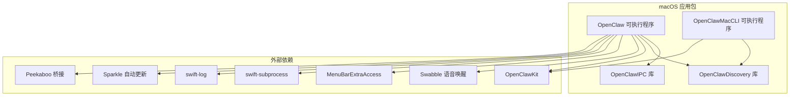
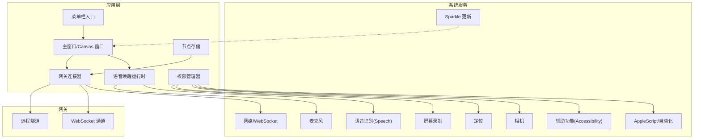
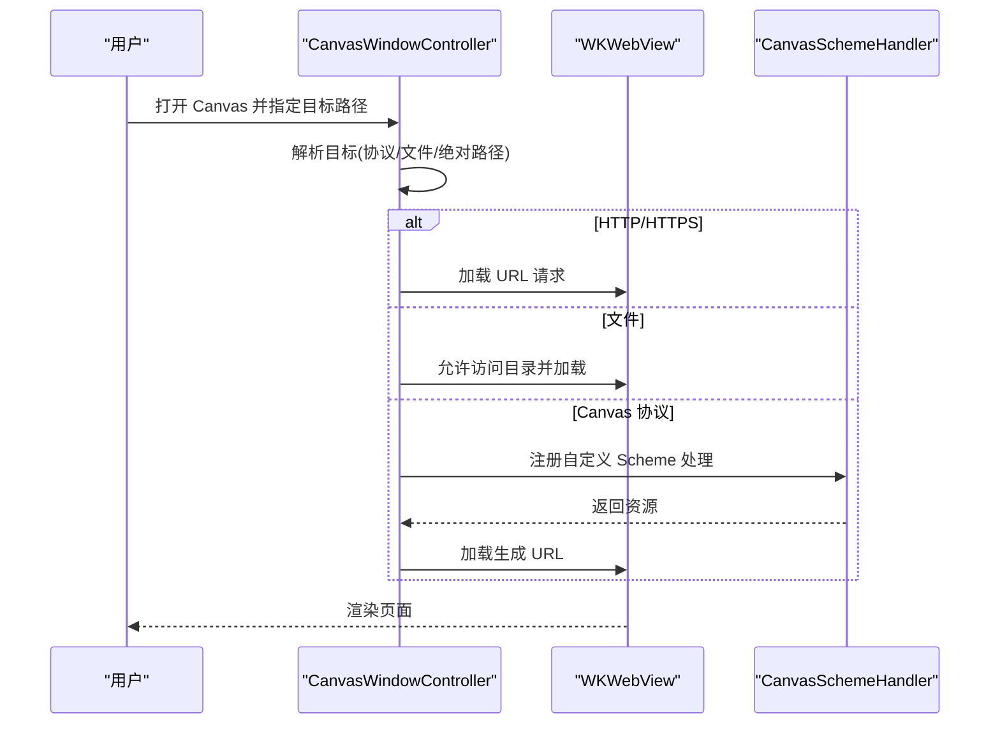
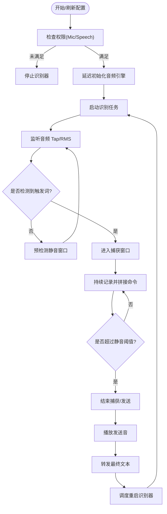
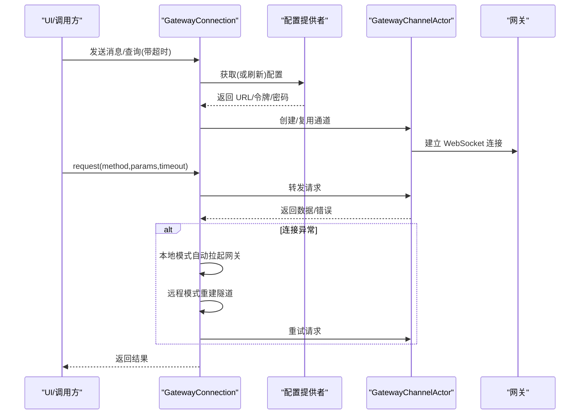
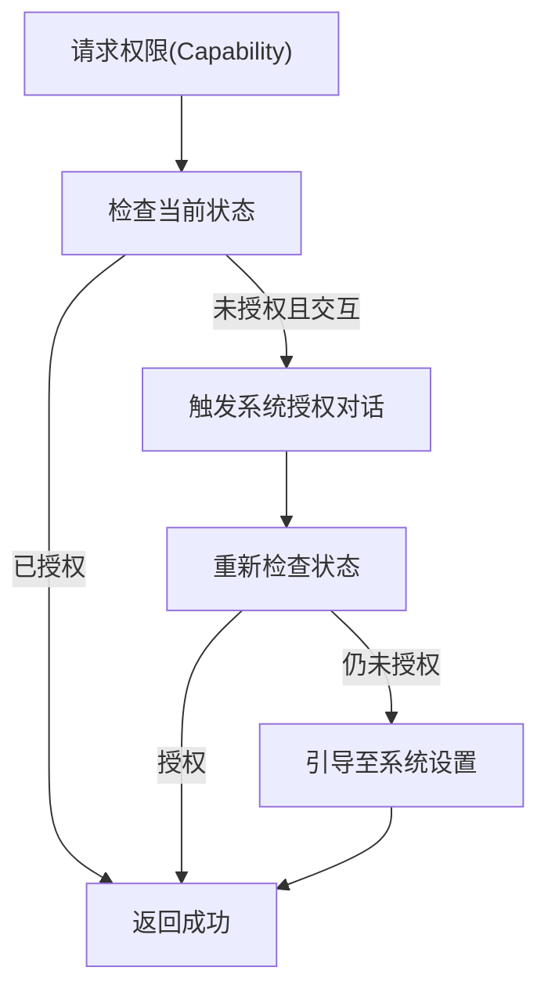
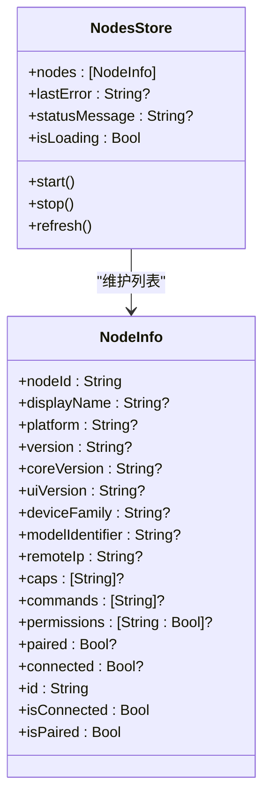
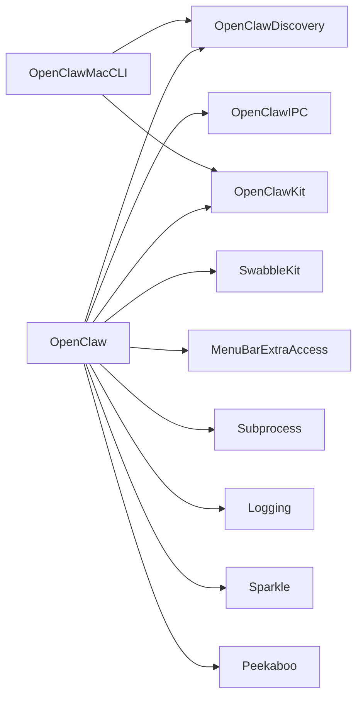

# macOS 应用

## 目录
1. [简介](#简介)
2. [项目结构](#项目结构)
3. [核心组件](#核心组件)
4. [架构总览](#架构总览)
5. [详细组件分析](#详细组件分析)
6. [依赖关系分析](#依赖关系分析)
7. [性能考量](#性能考量)
8. [故障排查指南](#故障排查指南)
9. [结论](#结论)
10. [附录：安装与配置步骤](#附录安装与配置步骤)

## 简介
本文件面向 macOS 用户与开发者，系统性介绍 OpenClaw macOS 菜单栏应用的功能特性、架构设计与用户体验。内容覆盖启动流程、菜单栏集成、主窗口布局与标签页管理、Canvas 访问能力、语音唤醒设置、节点与设备管理、远程控制通道、与网关的通信机制、权限请求与安全模型，并提供安装配置步骤（含签名验证、权限设置与网关连接），以及操作示例与截图指引，帮助用户快速上手。

## 项目结构
OpenClaw macOS 应用位于 `apps/macos` 目录，采用 Swift Package Manager 组织多目标产物：菜单栏可执行程序、IPC 库、发现库与 CLI 工具；同时通过脚本完成打包、签名与公证流程。

## 核心组件
- 菜单栏集成与窗口管理
  - 通过菜单栏入口打开主界面与 Canvas 窗口，支持面板式锚定与常规窗口模式。
- Canvas 访问与本地会话
  - 内置 WKWebView 容器，支持本地文件与受控协议加载，自动监听会话目录变更并重载。
- 语音唤醒（Voice Wake）
  - 基于系统 SFSpeech 与 AVAudioEngine 的实时识别与降噪，支持触发音、发送提示音与会话叠加层。
- 网关通信
  - 单例 WebSocket 连接封装，统一方法调用与订阅推送，支持本地/远程模式自动恢复与隧道重连。
- 权限管理
  - 集中处理通知、AppleScript、辅助功能、屏幕录制、麦克风、语音识别、相机、位置等权限。
- 节点与设备管理
  - 定时轮询网关节点列表，展示连接状态与配对信息，支持批准/拒绝配对请求。

## 架构总览
下图展示了 macOS 应用与网关、系统服务与 UI 的交互关系。

## 详细组件分析

### Canvas 窗口与本地会话
- 功能要点
  - 支持本地文件与受控协议加载，自动监听会话目录变更并重载页面。
  - 提供快照截图、JS 评估、调试状态注入等能力。
  - 支持面板式锚定与常规窗口两种呈现方式。
- 关键流程
  - 初始化：创建 WKWebView、注入 A2UI 行为桥、安装自定义 URL Scheme 处理器。
  - 加载：根据目标路径解析为 HTTP/HTTPS、file 或 Canvas 协议地址。
  - 会话：按会话键隔离资源目录，自动重载与调试状态同步。
- 适用场景
  - 本地开发与调试、A2UI 交互桥接、Canvas 主题化 UI 场景。

### 语音唤醒（Voice Wake）运行时
- 功能要点
  - 延迟初始化音频引擎，避免启动即占用蓝牙耳机导致质量下降。
  - 实时 RMS 噪声估计与阈值调整，静音窗口检测与触发后静音停止。
  - 触发音与发送音播放、叠加层会话展示、冷却去抖动。
- 关键流程
  - 启动：配置语言、创建输入节点 Tap、启动引擎、建立识别任务。
  - 识别：分段转写、触发词匹配、触发后命令拼接、静音窗口判定。
  - 结束：停止引擎、播放发送音、转发最终文本、调度重启识别器。

### 网关连接与远程控制
- 功能要点
  - 单例 `GatewayConnection` 封装 WebSocket 通道，统一方法调用与订阅。
  - 支持本地/远程模式自动恢复：本地模式自动拉起网关；远程模式自动建立隧道。
  - 提供会话预览、聊天历史、技能管理、定时任务、节点/设备配对等接口。
- 关键流程
  - 配置获取：从存储中读取 URL、令牌与密码。
  - 连接建立：创建 `GatewayChannelActor` 并注册推送处理器。
  - 方法调用：统一 `request`/`requestRaw`/`requestDecoded`，带超时与自动恢复。
  - 订阅：AsyncStream 推送快照与增量事件。

### 权限管理与安全模型
- 功能要点
  - 统一权限检查与交互式授权：通知、AppleScript、辅助功能、屏幕录制、麦克风、语音识别、相机、位置。
  - 语音唤醒专用权限校验：麦克风与语音识别双权限。
  - 提供权限状态监控与定时刷新。
- 安全模型
  - 权限与签名绑定：应用签名、Bundle ID、路径共同决定权限持久性。
  - 开发签名与发布签名差异：开发签名无法持久 TCC 权限，需重新授权。

### 节点与设备管理
- 功能要点
  - 定时轮询网关节点列表，展示连接与配对状态。
  - 支持批准/拒绝节点与设备配对请求。
- 数据模型
  - `NodeInfo` 包含节点标识、显示名、平台、版本、设备型号、远端 IP、能力与权限等字段。

## 依赖关系分析
- 目标与产品
  - OpenClaw：菜单栏应用，依赖 IPC、Discovery、OpenClawKit、Swabble、MenuBarExtraAccess、Subprocess、Logging、Sparkle、Peekaboo。
  - OpenClawIPC：跨进程通信库。
  - OpenClawDiscovery：网关/节点发现库。
  - OpenClawMacCLI：命令行工具，用于发现与网关交互。
- 外部依赖
  - MenuBarExtraAccess：菜单栏扩展。
  - Subprocess：子进程执行。
  - Logging：日志。
  - Sparkle：自动更新。
  - Peekaboo：桥接与自动化。
  - OpenClawKit：UI、协议与资源。
  - Swabble：语音唤醒相关能力。

## 性能考量
- 语音唤醒
  - 延迟初始化音频引擎，避免启动时占用音频资源；基于 RMS 的自适应噪声门限减少误触发。
- Canvas
  - 仅在展示本地 Canvas 内容时启用自动重载，降低不必要的渲染压力。
- 网关连接
  - 本地模式自动拉起网关并重试；远程模式自动重建隧道，提升可用性。
- 权限
  - 定时状态轮询最小化频率，避免频繁系统调用。

## 故障排查指南
- 无法持久权限（开发签名）
  - 现象：每次重启应用需要重新授权。
  - 原因：开发签名无法持久 TCC 权限。
  - 处理：使用正式证书签名或在系统设置中重新授予权限。
- 语音唤醒无反应
  - 检查麦克风与语音识别权限是否已授权。
  - 确认未处于“按住说话”冷却期。
  - 查看日志中识别回调与音频 Tap 输出。
- Canvas 页面不更新
  - 确认会话目录存在且有 `index.html`。
  - 检查是否为本地文件加载并允许访问目录。
- 网关连接失败
  - 本地模式：确认网关进程已启动；等待自动重试。
  - 远程模式：检查隧道是否建立；查看错误日志并重试。
- 权限引导
  - 使用内置引导打开系统设置对应权限页。

## 结论
OpenClaw macOS 应用以菜单栏为核心入口，结合 Canvas 本地渲染、语音唤醒、权限管理与网关通信，形成完整的本地智能代理体验。通过严格的权限模型与自动更新机制，兼顾易用性与安全性；通过模块化的包结构与清晰的目标划分，便于扩展与维护。

## 附录：安装与配置步骤
- 快速开发运行
  - 在仓库根目录执行重启脚本，支持跳过签名或强制签名两种模式。
- 打包与签名
  - 打包：构建并生成 `.app`，复制资源与框架，进行签名与 Team ID 校验。
  - 签名：自动选择证书，支持禁用库验证与跳过 Team ID 校验（开发用途）。
  - 公证：提交制品进行公证，可选为应用打上公证戳。
- 权限设置
  - 通知、AppleScript、辅助功能、屏幕录制、麦克风、语音识别、相机、位置等权限需按需授权。
- 网关连接
  - 本地模式：确保网关进程可用；远程模式：确保隧道建立成功。
- 操作示例与截图
  - 菜单栏点击打开主窗口与 Canvas。
  - 在 Canvas 中加载本地页面并观察自动重载。
  - 启动语音唤醒测试，观察叠加层与提示音。
  - 在设置中查看权限状态与引导系统设置。