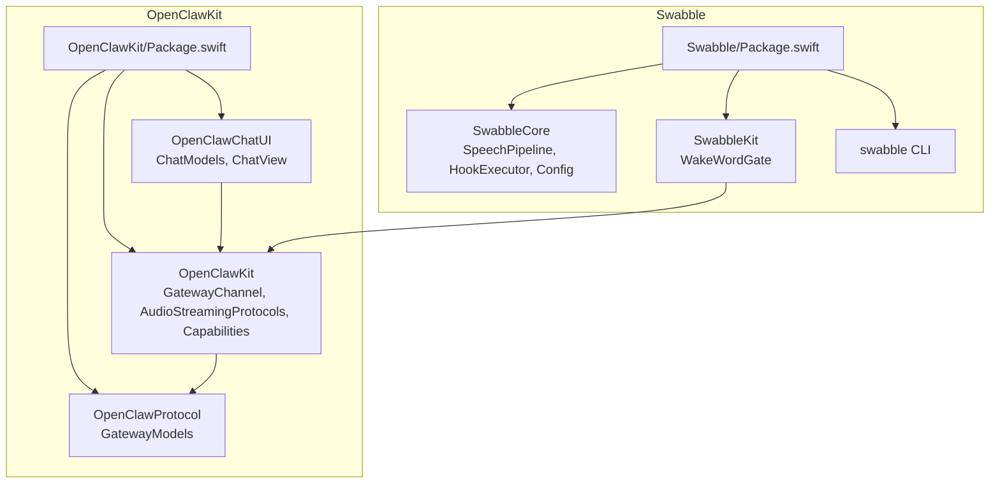
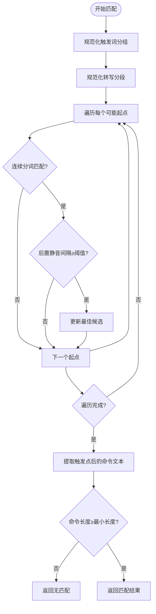
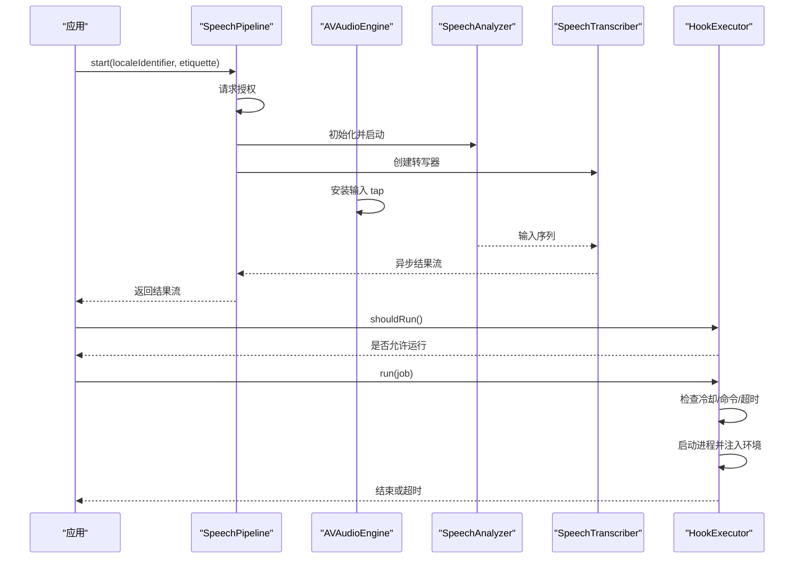
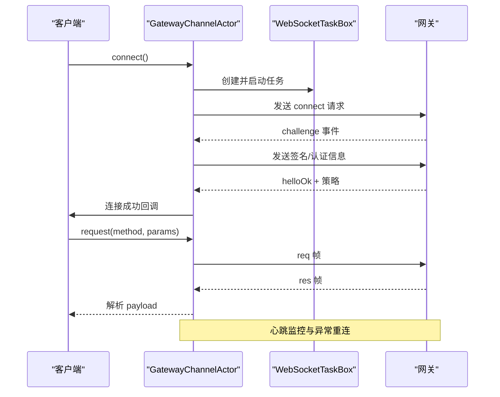
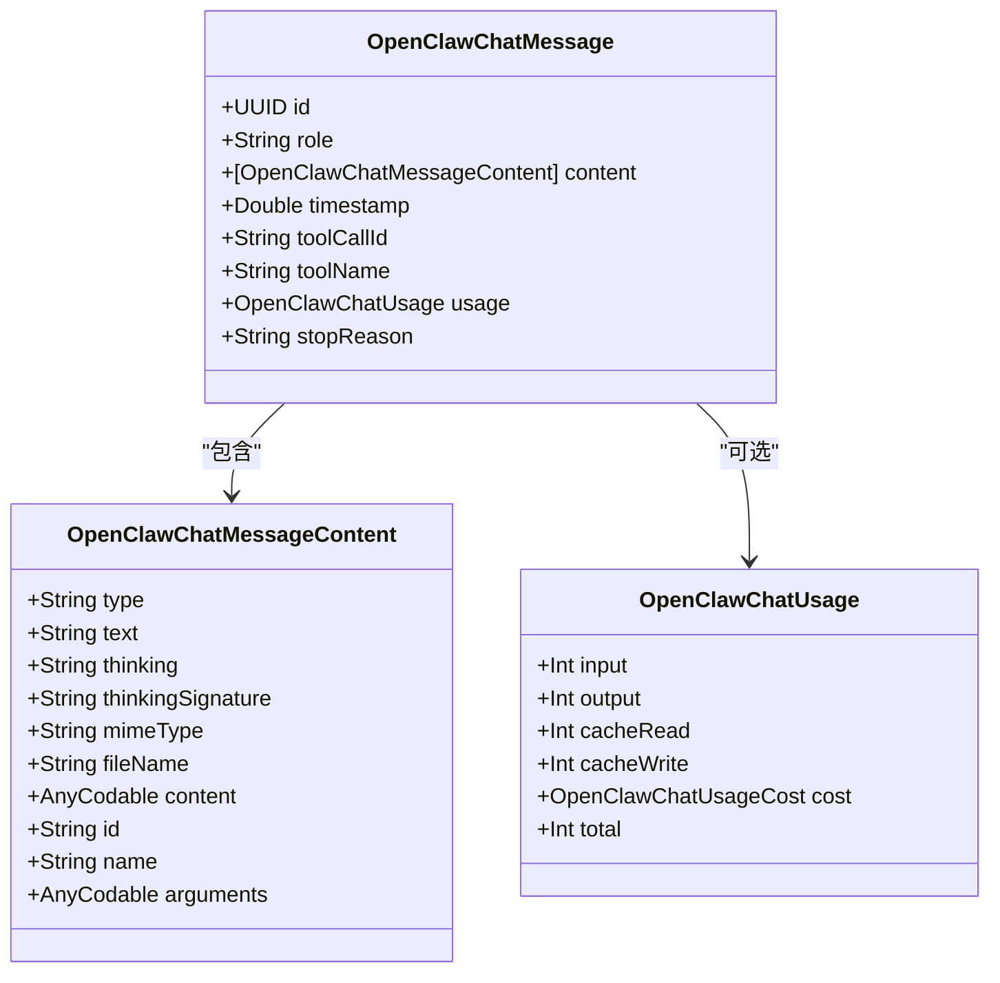
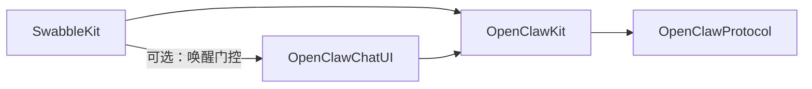

# 共享组件库

## 目录
1. [引言](#引言)
2. [项目结构](#项目结构)
3. [核心组件](#核心组件)
4. [架构总览](#架构总览)
5. [详细组件分析](#详细组件分析)
6. [依赖关系分析](#依赖关系分析)
7. [性能考量](#性能考量)
8. [故障排查指南](#故障排查指南)
9. [结论](#结论)
10. [附录](#附录)

## 引言
本文件面向 OpenClaw 跨平台共享组件库，系统性阐述其设计理念、架构模式与组件复用策略。重点覆盖以下方面：
- Swabble：本地语音唤醒与钩子执行的跨平台共享库（SwabbleKit）与平台专用实现（SwabbleCore）。
- OpenClawKit：统一的协议、网关通道、聊天 UI 与通用工具模块，支撑多端一致的会话体验。
- Swift Package Manager 集成与模块依赖管理，以及版本与兼容性策略。
- 开发指南、接口定义、平台特定实现与测试策略。
- 集成示例、最佳实践与性能优化建议。

## 项目结构
共享组件库由两大部分构成：
- Swabble：包含跨平台的 SwabbleKit（唤醒门控等工具）与平台专用的 SwabbleCore（麦克风、转写、钩子执行等）。
- OpenClawKit：包含 OpenClawProtocol（协议模型）、OpenClawKit（网关通道、命令、资源等）与 OpenClawChatUI（聊天视图与模型）。



## 核心组件
- SwabbleKit（跨平台）
  - `WakeWordGate`：基于分段文本的触发词匹配与后置静音间隔判定，支持纯文本匹配与从语音转写中提取分段。
- SwabbleCore（平台专用）
  - `SpeechPipeline`：基于 AVFoundation/Speech 的实时音频流处理与转写，提供异步结果流。
  - `HookExecutor`：按配置执行外部命令，支持前缀、环境变量、冷却时间与超时。
  - `Config`：集中式配置结构与加载/保存逻辑。
- OpenClawProtocol
  - 网关协议模型（连接参数、请求/响应帧、事件帧、错误码、快照等），用于客户端与网关通信。
- OpenClawKit
  - `GatewayChannel`：基于 WebSocket 的网关通道封装，含重连、心跳、超时、鉴权与推送处理。
  - `AudioStreamingProtocols`：流式音频播放协议抽象，便于在不同平台上实现。
  - `Capabilities`：设备能力枚举（画布、相机、屏幕、语音唤醒、位置）。
- OpenClawChatUI
  - `ChatModels`：消息、会话、附件、用量等模型，兼容多种历史格式。
  - `ChatView`：基于 SwiftUI 的聊天界面，包含消息列表、输入框、会话切换、空态与错误提示等。

## 架构总览
OpenClaw 共享组件库采用“协议/模型层 + 平台抽象 + UI 层”的分层设计：
- 协议与模型层：OpenClawProtocol 定义跨端一致的网关通信协议与数据模型。
- 平台抽象层：OpenClawKit 提供网关通道、音频播放协议、设备能力等跨平台抽象。
- UI 层：OpenClawChatUI 基于 SwiftUI 实现聊天界面，复用 OpenClawKit 的模型与通道。
- Swabble：SwabbleKit 提供唤醒门控与纯文本匹配；SwabbleCore 提供平台专用的语音管道与钩子执行。

```mermaid
graph TB
UI["OpenClawChatUI<br/>ChatView/Models"] --> KIT["OpenClawKit<br/>GatewayChannel/AudioStreamingProtocols"]
KIT --> PROTO["OpenClawProtocol<br/>GatewayModels"]
subgraph "Swabble"
KIT <- --> KIT2["SwabbleKit<br/>WakeWordGate"]
CORE["SwabbleCore<br/>SpeechPipeline/HookExecutor/Config"] -.-> KIT2
end
KIT2 --> |"可选：通过 SwabbleKit 的门控逻辑"| UI
```

## 详细组件分析

### SwabbleKit：唤醒门控
- 设计要点
  - `WakeWordGateConfig`：触发词集合、最小后置静音间隔、最小命令长度。
  - `WakeWordSegment`：转写分段（文本、起止时间、范围），用于定位触发词后的命令片段。
  - 匹配算法：遍历触发词分词序列，检查相邻分段是否匹配，并计算触发结束到下一个分段的间隔是否满足阈值。
  - 文本匹配与去触发：支持纯文本匹配与去除触发词。
- 复杂度
  - 匹配复杂度近似 O(T×S×L)，T 为分段数，S 为触发词分词数，L 为滑动窗口长度。
- 可扩展性
  - 支持从语音转写（Speech) 或纯文本输入构建分段，便于在不同场景复用。



### SwabbleCore：语音管道与钩子执行
- SpeechPipeline
  - 使用 AVAudioEngine 捕获麦克风输入，BufferConverter 转换格式，SpeechAnalyzer + SpeechTranscriber 进行实时转写。
  - 授权状态自动请求，支持可选的礼貌替换选项。
- HookExecutor
  - 按配置执行外部命令，支持前缀拼接、环境变量注入、最小字符数与冷却时间控制、超时终止。
- Config
  - 音频、唤醒、钩子、日志、转录、语音等配置项，支持默认路径与加载/保存。



### OpenClawProtocol：网关协议模型
- 关键类型
  - 连接参数、握手响应、请求/响应帧、事件帧、Presence/快照、错误形状、代理事件、发送/轮询/代理调用参数等。
  - 协议版本常量，确保客户端与服务端兼容。
- 设计要点
  - 所有模型均遵循 Sendable/Equatable，便于并发安全使用。
  - AnyCodable 作为协议中的动态字段容器，避免桥接到 ObjC 导致的异常。

### OpenClawKit：网关通道与音频协议
- GatewayChannel
  - WebSocket 任务封装与会话盒，支持最大消息尺寸调整以避免大负载断开。
  - 连接流程：构造连接参数 → 发送 connect 请求 → 等待挑战/响应 → 处理握手与心跳 → 分发事件。
  - 超时与重连：请求超时、接收失败、心跳缺失均触发指数退避重连。
  - 错误包装：对底层 URLError/其他错误进行上下文包装，便于 UI 展示。
- AudioStreamingProtocols
  - StreamingAudioPlaying/PCMStreamingAudioPlaying 抽象，便于在不同平台实现流式播放。



### OpenClawChatUI：聊天视图与模型
- ChatModels
  - 消息内容、消息体、用量统计、会话预览、附件、事件载荷等模型，兼容多种历史格式。
- ChatView
  - 基于 SwiftUI 的聊天界面，支持消息列表滚动、输入框、会话切换、空态与错误提示、打字指示与工具调用合并显示。
  - 自动滚动至底部、错误分类展示、平台差异布局适配。



## 依赖关系分析
- Swabble
  - 产品：Swabble（平台专用）、SwabbleKit（跨平台）、swabble（CLI）。
  - 依赖：Commander（CLI）、swift-testing（测试）。
- OpenClawKit
  - 产品：OpenClawProtocol、OpenClawKit、OpenClawChatUI。
  - 依赖：ElevenLabsKit（语音合成）、textual（文本渲染，仅 macOS/iOS）。
- 模块耦合
  - OpenClawChatUI 依赖 OpenClawKit；OpenClawKit 依赖 OpenClawProtocol；SwabbleKit 可与 OpenClawKit 协同用于唤醒门控与钩子联动。



## 性能考量
- 语音处理
  - 使用 AVAudioEngine tap 与 BufferConverter，降低格式转换开销；SpeechPipeline 在授权与格式可用性上做早失败处理。
- 网关通信
  - WebSocket 最大消息尺寸提升至 16MB，避免大负载断开；心跳与指数退避重连减少抖动。
  - 请求超时与等待队列管理，避免阻塞 UI。
- UI 渲染
  - ChatView 使用 LazyVStack 与滚动锚定，配合动画平滑滚动；错误与空态提示减少无效重绘。

[本节为通用指导，无需具体文件分析]

## 故障排查指南
- Swabble
  - 配置缺失：ConfigLoader 加载失败抛出缺失配置错误，需先执行初始化命令生成默认配置。
  - 钩子执行：命令为空、冷却时间未过、超时终止、环境变量注入失败等均可能导致执行失败。
- OpenClawKit
  - 网关连接：连接超时、接收失败、心跳缺失、签名/认证失败等会触发重连与错误包装。
  - 请求失败：响应错误码与错误详情可用于定位问题；必要时清理缓存令牌并重试。
- OpenClawChatUI
  - 错误提示：根据错误文本关键词区分断开、超时与一般错误，提供刷新与关闭操作。
  - 工具调用合并：若工具结果未合并，检查消息角色与工具调用 ID 对齐。

## 结论
OpenClaw 共享组件库通过清晰的分层与模块化设计，在保证跨平台一致性的同时，提供了强大的平台抽象能力。Swabble 提供本地化的语音与钩子能力，OpenClawKit 提供协议与网关通道，OpenClawChatUI 则以 SwiftUI 实现高质量的聊天界面。借助 Swift Package Manager 的产品与目标组织，组件复用与版本管理更加清晰可控。

[本节为总结，无需具体文件分析]

## 附录

### Swift Package Manager 使用与模块依赖管理
- Swabble
  - 产品：Swabble（平台专用）、SwabbleKit（跨平台）、swabble（CLI）。
  - 依赖：Commander、swift-testing。
- OpenClawKit
  - 产品：OpenClawProtocol、OpenClawKit、OpenClawChatUI。
  - 依赖：ElevenLabsKit、textual（macOS/iOS）。
- 版本与兼容性
  - Swift 工具链版本：6.2。
  - 平台最低版本：iOS 18、macOS 15（OpenClawKit）；iOS 17、macOS 15（SwabbleKit）。
  - 协议版本：`GATEWAY_PROTOCOL_VERSION=3`，确保客户端与服务端兼容。

### 开发指南与测试策略
- 接口定义
  - 使用 Sendable/Equatable 类型，确保并发安全；协议抽象（如 AudioStreamingProtocols）隔离平台差异。
- 平台特定实现
  - SwabbleKit 通过条件编译与平台宏适配不同 UI 类型；OpenClawKit 通过 URLSession/WebSocket 封装实现跨平台网络。
- 测试策略
  - 使用 swift-testing 进行单元测试；SwabbleKit 与 OpenClawKit 均启用 StrictConcurrency 与实验特性以保障并发正确性。
- 集成示例
  - 参考 Swabble README 中的库引入方式与命令行使用示例，结合 OpenClawKit 的产品名称进行依赖声明。