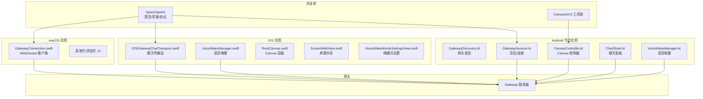
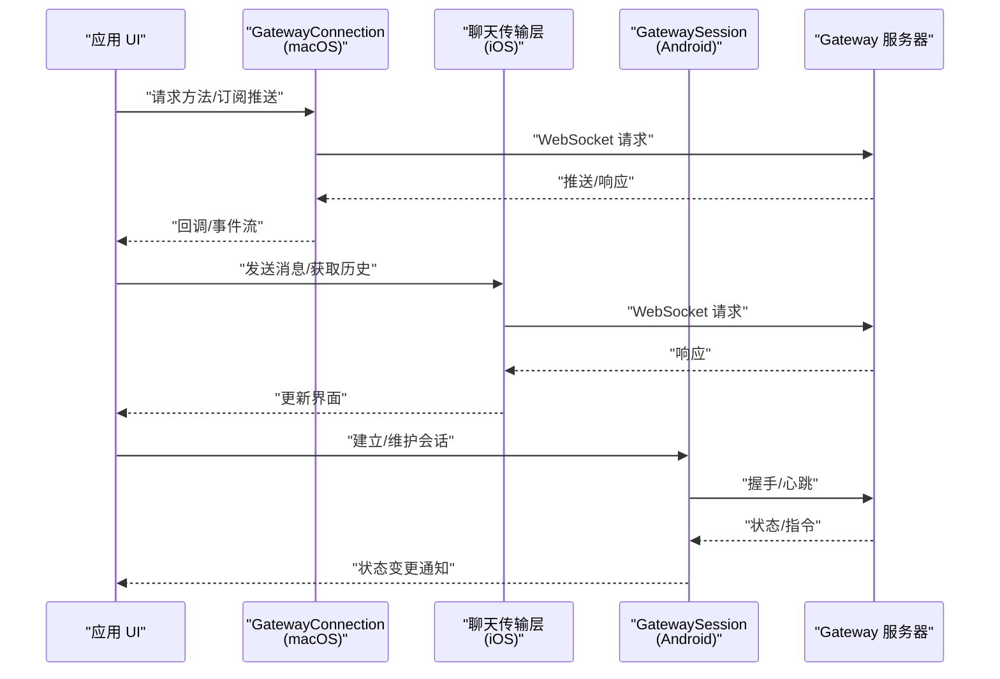
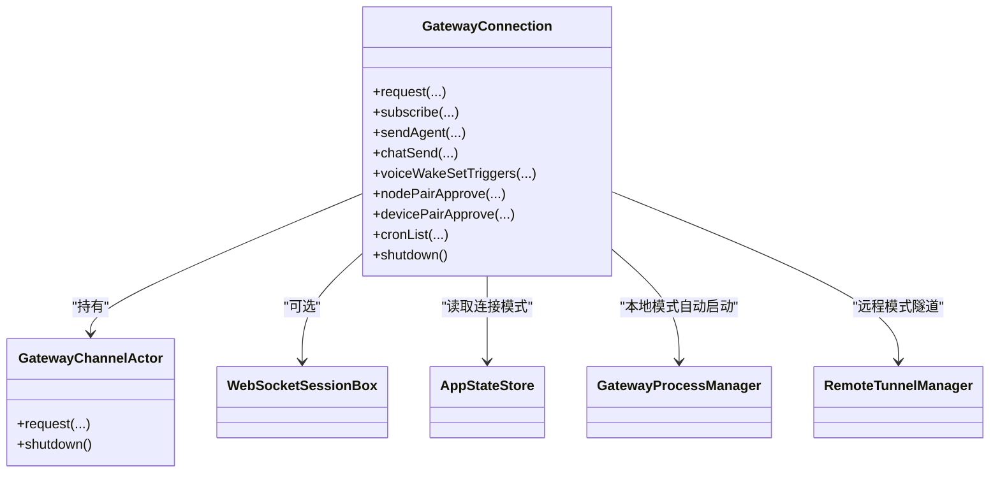
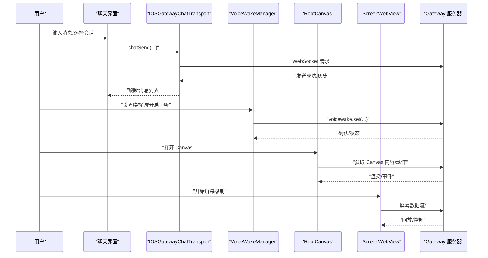
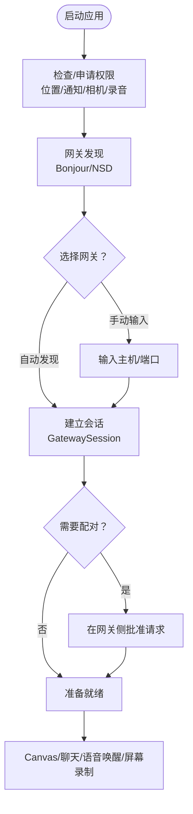
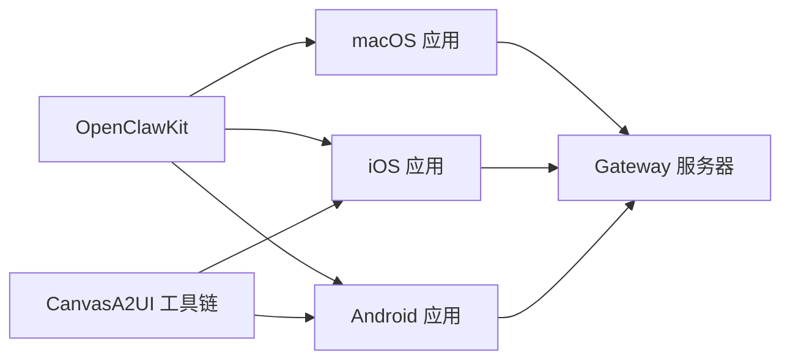

# 配套应用

## 目录
1. [简介](#简介)
2. [项目结构](#项目结构)
3. [核心组件](#核心组件)
4. [架构总览](#架构总览)
5. [详细组件分析](#详细组件分析)
6. [依赖关系分析](#依赖关系分析)
7. [性能考虑](#性能考虑)
8. [故障排除指南](#故障排除指南)
9. [结论](#结论)
10. [附录](#附录)

## 简介
本文件系统性梳理 OpenClaw 的配套应用：macOS 菜单栏应用、iOS 节点应用与 Android 节点应用。内容覆盖三类应用的功能特性、架构设计、模块划分、用户界面与交互体验；并详述安装配置、权限管理、设备配对与远程控制流程；最后提供可操作的使用示例（菜单栏控制、语音唤醒设置、Canvas 访问、节点管理）以及与网关的通信机制、数据同步与状态管理说明。

## 项目结构
配套应用位于 `apps/` 目录下，分别包含：
- macOS 应用：菜单栏常驻、与网关通过 WebSocket 通信，支持 Canvas、聊天、语音唤醒、远程隧道等能力。
- iOS 应用：SwiftUI 架构，提供聊天、Canvas、屏幕录制、语音唤醒、网关发现与设置等。
- Android 节点应用：现代 Android（API 31+），前台服务保持连接，暴露 Canvas、聊天、相机等能力。

## 核心组件
- macOS 网关连接器（GatewayConnection）
  - 单例 Actor 模式封装 WebSocket 连接，统一请求方法、订阅推送、自动重连与本地/远程模式切换。
  - 提供聊天、会话预览、技能管理、定时任务、语音唤醒、节点/设备配对等 API 的强类型封装。
- iOS 聊天传输层（IOSGatewayChatTransport）
  - 将 SwiftUI 聊天界面与网关 WebSocket 对接，负责消息发送、历史拉取、中断控制等。
- iOS 语音唤醒（VoiceWakeManager / VoiceWakePreferences）
  - 管理唤醒词触发、偏好设置、UI 提示与状态展示。
- iOS Canvas 容器（RootCanvas）
  - 承载 Canvas 内容，作为跨平台交互入口。
- iOS 屏幕分享（ScreenWebView）
  - 基于 WebView 的屏幕共享实现。
- Android 网关发现与会话（GatewayDiscovery / GatewaySession）
  - 基于 Bonjour 的网关发现、TLS/凭据管理、持久化会话。
- Android Canvas 控制器（CanvasController）
  - 管理 Canvas 渲染、A2UI 动作与状态同步。
- Android 聊天面板（ChatSheet）
  - 会话列表、消息渲染、输入与发送。
- Android 语音唤醒（VoiceWakeManager）
  - 与 iOS 类似的唤醒词管理与触发逻辑。
- 共享库 OpenClawKit
  - 统一类型定义、常量、协议与工具（含 CanvasA2UI 工具链）。

## 架构总览
三类应用均通过 OpenClawKit 与网关进行通信，采用 WebSocket 推送/请求模型，支持本地直连、远程隧道与自动恢复。Canvas 通过 A2UI 工具链在移动端渲染，聊天与语音唤醒贯穿多端。

## 详细组件分析

### macOS 菜单栏应用
- 功能特性
  - 菜单栏常驻，提供快捷控制入口。
  - 与网关建立长连接，支持 Canvas 访问、聊天、语音唤醒、远程隧道、节点/设备配对、定时任务等。
  - 自动恢复：本地模式自动启动/附加网关；远程模式自动建立隧道并重试。
- 架构设计
  - GatewayConnection 作为单例 Actor，统一封装请求、订阅、缓存快照与会话键解析。
  - 支持多通道消息投递（如微信、Telegram、Discord 等），并区分可投递与不可投递通道。
- 用户界面与交互
  - 通过状态栏图标显示连接状态、会话键、版本信息等。
  - 支持菜单项触发系统事件、健康检查、技能管理、定时任务等。
- 使用示例
  - 启动/停止本地网关、切换本地/远程模式、查看健康快照、发送代理消息、设置心跳、管理技能与定时任务。
- 权限与签名
  - 开发运行与打包签名脚本，支持自签与代码签名，团队 ID 校验与库验证绕过仅用于开发。

### iOS 节点应用
- 功能特性
  - SwiftUI 应用，提供聊天、Canvas、屏幕录制、语音唤醒、网关发现与设置。
  - 与网关保持稳定连接，支持跨平台会话键“main”，确保多端一致体验。
- 架构设计
  - IOSGatewayChatTransport 负责聊天请求与历史拉取。
  - VoiceWakeManager 管理唤醒词与触发逻辑，VoiceWakePreferences 提供偏好设置 UI。
  - RootCanvas 作为 Canvas 容器，ScreenWebView 实现屏幕共享。
- 用户界面与交互
  - 标签页导航：聊天、Canvas、语音、屏幕、设置。
  - 聊天面板支持 Markdown 渲染、会话筛选与消息列表。
  - 语音唤醒设置支持添加/删除唤醒词与提示展示。
- 使用示例
  - 在设置中配置网关地址与凭据，启用/禁用语音唤醒，打开 Canvas 进行交互，使用屏幕录制功能。

### Android 节点应用
- 功能特性
  - 现代 Android（API 31+），前台服务维持连接，支持 Canvas、聊天、相机、屏幕录制、语音唤醒。
  - 通过 Bonjour 发现网关，支持手动输入主机与端口。
- 架构设计
  - GatewayDiscovery：基于 NSD/Bonjour 的网关发现。
  - GatewaySession：管理 TLS、凭据、会话生命周期与心跳。
  - CanvasController：处理 Canvas 渲染与 A2UI 动作。
  - ChatSheet：聊天面板与会话管理。
  - VoiceWakeManager：唤醒词管理与触发。
- 用户界面与交互
  - 设置页：网关发现、手动配置、权限申请（位置、通知、相机、录音）。
  - 聊天：消息列表、Markdown 渲染、会话筛选。
  - Canvas：A2UI 渲染与交互。
- 使用示例
  - 在设置中选择已发现网关或手动输入地址端口，批准配对请求，进入聊天/Canvas/语音唤醒界面。

### 共享库 OpenClawKit 与 CanvasA2UI
- OpenClawKit
  - 提供跨平台类型、常量与协议，支撑三端一致性。
- CanvasA2UI 工具链
  - 生成与分发 Canvas A2UI 资源，配合 CanvasController 在移动端渲染。

## 依赖关系分析
- 三端均依赖 OpenClawKit，确保类型与协议一致。
- CanvasA2UI 作为工具链，被 CanvasController 引用以渲染 Canvas 内容。
- 网关通信统一通过 GatewayConnection（macOS）、IOSGatewayChatTransport（iOS）与 GatewaySession（Android）实现。

## 性能考虑
- 连接复用与自动恢复
  - macOS 端通过单例 Actor 复用连接，失败时按指数退避重试，并在本地模式自动启动网关、在远程模式重建隧道。
- 推送缓冲与快照
  - GatewayConnection 使用异步流缓冲最新推送，首次订阅即返回快照，降低首屏等待时间。
- 会话键解析
  - 对“main”等别名进行解析，避免重复查询配置，提升聊天与会话相关操作的响应速度。
- 前台服务与资源占用
  - Android 前台服务维持连接，注意通知与电量优化；Canvas/A2UI 渲染需合理限制帧率与内存占用。

## 故障排除指南
- macOS
  - 开发运行与签名：参考脚本与环境变量，必要时关闭库验证或跳过团队 ID 校验（开发场景）。
  - 自动恢复：若本地网关未运行，GatewayConnection 会在本地模式自动尝试启动并重试；远程模式会尝试重建隧道。
- iOS
  - 网关发现：若 Bonjour 不可用，可在设置中使用手动输入方式；确保网络与防火墙允许 mDNS。
  - 语音唤醒：检查权限与偏好设置，确认触发词正确配置。
- Android
  - 权限：Android 13+ 需要“附近设备/通知/相机/录音”权限；根据系统提示授权。
  - 发现与配对：使用“发现网关”或“高级→手动网关”，在网关侧批准节点配对请求。
- 通用
  - 网关协议与认证：遵循网关协议与认证流程，确保凭据有效。
  - 文档参考：平台与节点相关文档提供了更详细的配置与排错建议。

## 结论
OpenClaw 的配套应用以 OpenClawKit 为统一基础，围绕网关 WebSocket 通信构建了跨平台的一致体验。macOS 提供菜单栏控制与自动恢复能力；iOS 提供完整的聊天、Canvas、语音唤醒与屏幕录制；Android 则专注于现代 Android 平台的前台服务与多能力集成。通过共享的 CanvasA2UI 工具链与统一的网关协议，三端实现了无缝协作与状态同步。

## 附录
- 安装与打包（macOS）
  - 开发运行：使用仓库根目录脚本快速重启应用与权限。
  - 打包签名：使用打包脚本生成并签名应用，支持多种签名身份与校验选项。
- 平台与节点文档索引
  - macOS：平台文档提供系统级配置与使用建议。
  - iOS：平台文档涵盖应用结构与开发流程。
  - Android：平台文档提供权限、发现与配对细节。
  - 节点与语音唤醒：节点文档详解 Canvas、语音唤醒等能力。
  - 网关：协议、认证、发现与配对等文档为应用集成提供依据。
- 工具与脚本
  - CanvasA2UI 打包与复制脚本，辅助移动端 Canvas 渲染资源的生成与分发。
  - 移动端重新认证与同步脚本，便于调试与自动化。