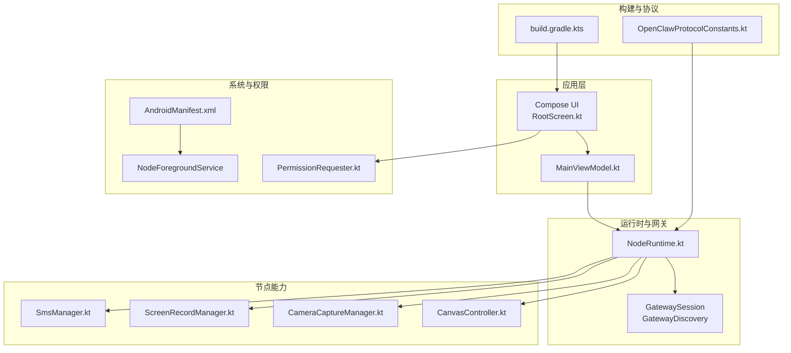
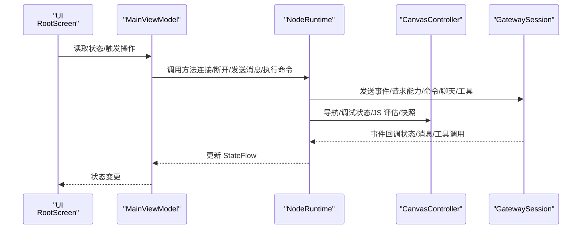
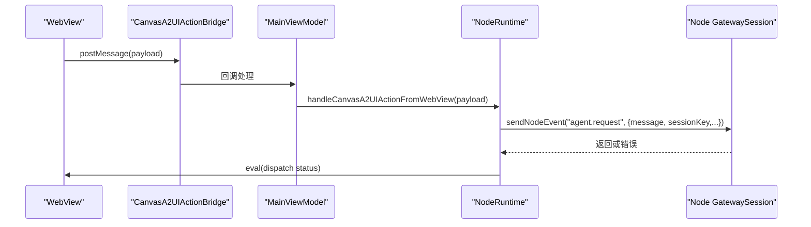
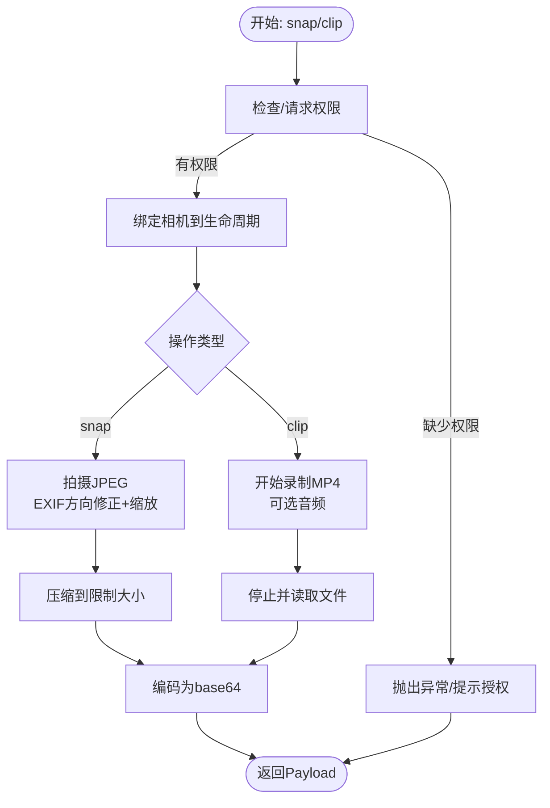
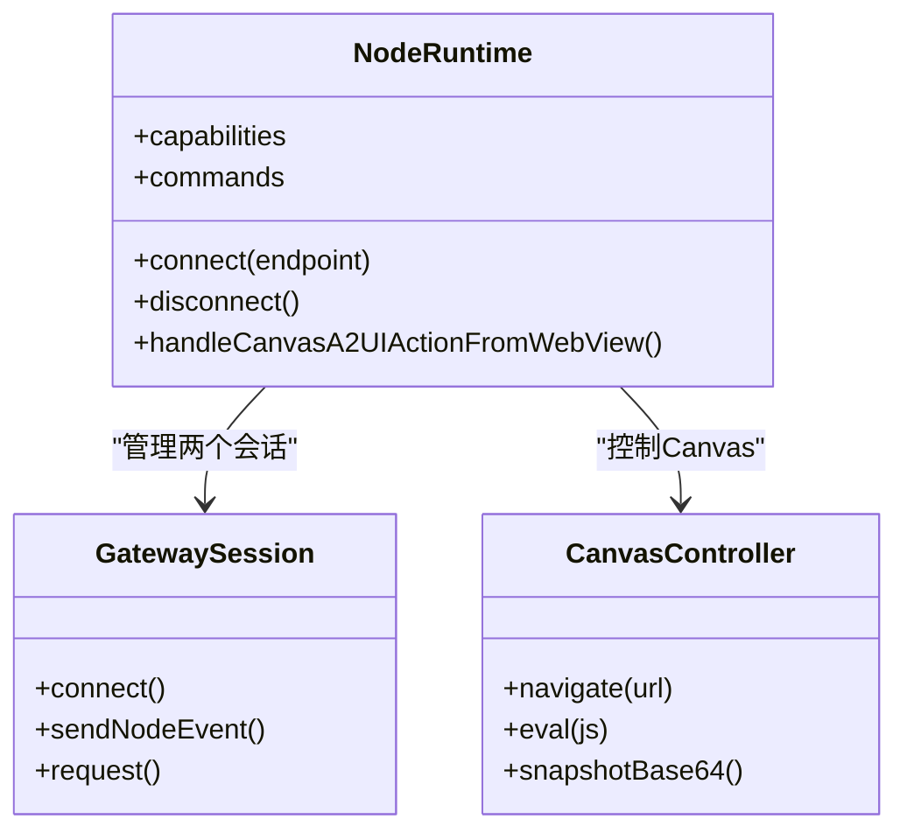
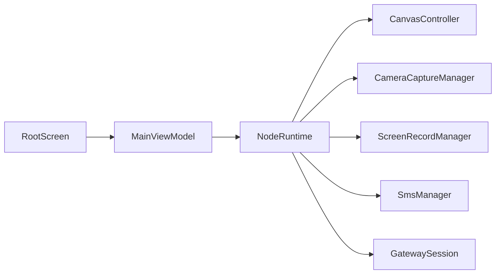

# Android 应用

## 目录
1. [简介](#简介)
2. [项目结构](#项目结构)
3. [核心组件](#核心组件)
4. [架构总览](#架构总览)
5. [详细组件分析](#详细组件分析)
6. [依赖关系分析](#依赖关系分析)
7. [性能考虑](#性能考虑)
8. [故障排查指南](#故障排查指南)
9. [结论](#结论)
10. [附录](#附录)

## 简介
本文件面向 OpenClaw Android 节点应用，系统性阐述其功能特性与技术实现，涵盖：
- Canvas 图形界面与 A2UI 协议桥接
- 推拉模式交互（语音唤醒、Talk 模式）
- 相机访问与截图/视频录制
- 屏幕录制（含音频）
- 可选短信发送能力
- 权限管理（相机、录音、存储、悬浮窗、定位、通知）
- 后台服务与前台服务类型
- 与网关的通信协议、能力声明、命令集与实时状态更新
- Android 开发环境、Gradle 构建、签名与发布流程要点
- 关键功能的代码路径与实现思路（不直接粘贴源码）

## 项目结构
Android 应用位于 `apps/android/app`，采用 Kotlin + Jetpack Compose，使用 CameraX 进行相机与视频录制，OkHttp 作为网络栈，WebView 承载 Canvas 与 A2UI 动作桥接。

## 核心组件
- 应用入口与生命周期
  - MainActivity：初始化 WebView、沉浸式窗口、权限请求、启动前台服务、绑定 ViewModel 与各节点管理器。
  - NodeApp：Application，注入 NodeRuntime；调试模式启用 StrictMode。
- 视图模型与运行时
  - MainViewModel：聚合 NodeRuntime 的状态流与操作，暴露给 UI。
  - NodeRuntime：核心运行时，负责网关发现与连接、能力/命令集构建、A2UI 动作分发、Canvas 调试状态、语音唤醒与 Talk 模式、聊天与工具调用等。
- Canvas 与 A2UI
  - CanvasController：WebView 容器、导航、调试状态注入、JS 评估、快照（PNG/JPEG）。
  - RootScreen：Compose 根界面，承载 WebView、状态浮层、底部面板、Talk 模式覆盖。
- 节点能力管理
  - CameraCaptureManager：相机拍照、录制短视频（含音频），EXIF 方向旋转与尺寸压缩。
  - ScreenRecordManager：屏幕录制（MP4，含音频），虚拟显示与 MediaRecorder 配置。
  - SmsManager：短信发送（多段拆分），权限校验与错误封装。
- 权限与前台服务
  - PermissionRequester：统一的权限请求与引导（设置页）。
  - AndroidManifest：声明 INTERNET、位置、相机、录音、短信、通知、前台服务类型等权限与服务。
- 协议常量
  - OpenClawProtocolConstants：能力、命令命名空间与枚举。

## 架构总览
应用采用 MVVM + 运行时单例模式：
- UI 使用 Jetpack Compose，通过 MainViewModel 订阅 NodeRuntime 的 StateFlow。
- NodeRuntime 作为中枢，协调网关会话、能力/命令集、Canvas/A2UI、相机/屏幕/短信、语音唤醒/Talk 模式。
- WebView 作为 Canvas 容器，通过 JavaScript 接口桥接 A2UI 动作到 NodeRuntime。

## 详细组件分析

### Canvas 图形界面与 A2UI 桥接
- WebView 容器：RootScreen 中创建并配置 WebView，启用 JS 与 DOM 存储，注册 CanvasA2UIAction 桥接接口。
- CanvasController：负责加载本地 scaffold 或远端 URL，注入调试状态，执行 JS 评估，生成 PNG/JPEG 快照，并对宽高进行缩放与质量控制。
- A2UI 动作：WebView 侧通过 openclawCanvasA2UIAction.postMessage 传递用户动作，NodeRuntime 解析后构造 agent.request 并发送至网关，同时回写 UI 状态。

### 相机访问与截图/录制
- 权限与生命周期：CameraCaptureManager 依赖 PermissionRequester 与 LifecycleOwner，在调用前确保相机与麦克风权限。
- 截图：使用 ProcessCameraProvider + ImageCapture，读取 EXIF 方向并旋转，按需缩放，使用 JpegSizeLimiter 控制大小，最终返回 base64。
- 录制：VideoCapture + MediaRecorder，支持包含音频，超时停止并返回 base64。

### 屏幕录制（含音频）
- 通过 MediaProjectionManager 获取投影，创建 VirtualDisplay，配置 MediaRecorder 输出 MP4，支持音频通道与采样率。
- 支持参数校验（格式、帧率、时长、是否包含音频），并进行比特率估算。

### 短信发送（可选）
- 仅在具备 Telephony 特性且拥有 SEND_SMS 权限时可用。
- 参数解析严格校验 to 与 message 字段，使用 SmsManager.divideMessage 自动拆分多段，统一返回 JSON 包裹的结果。

### 权限管理系统
- 统一由 PermissionRequester 处理，支持“理由对话框”与“设置页引导”，合并已授权与当前状态。
- Manifest 声明了相机、录音、短信、位置、通知、前台服务等权限；部分权限在运行时动态请求。

### 后台服务与前台服务类型
- NodeForegroundService 在 Manifest 中声明，前台服务类型包含 dataSync、microphone、mediaProjection，满足后台数据同步、录音与屏幕录制场景。
- MainActivity 启动前台服务，保持应用在后台活跃。

### 与网关通信协议与数据同步
- 能力与命令：NodeRuntime 构建 ConnectOptions，根据开关与权限动态填充 capabilities 与 commands。
- 事件处理：operatorSession 与 nodeSession 分别维护连接状态与事件回调；NodeRuntime 将网关事件映射到语音唤醒、Talk 模式、聊天与工具调用。
- A2UI：WebView 侧动作经 NodeRuntime 解析后，构造 agent.request 并发送，同时在 Canvas 内回写状态。

### 语音唤醒与 Talk 模式
- 语音唤醒：基于 VoiceWakeManager，根据 VoiceWakeMode、前后台状态与外部音频占用决定是否监听；触发后向网关发送 agent.request。
- Talk 模式：基于 SpeechRecognizer 识别，结合 GatewaySession.chat.subscribe 与 chat.history 查询，播放文本（优先 ElevenLabs 流式 PCM/MP3，失败回退系统 TTS）。

## 依赖关系分析
- 构建与依赖
  - Compose、Kotlin Coroutines、Kotlinx Serialization、OkHttp、CameraX、ExifInterface、安全加密库等。
  - Gradle 配置包含 Compose 编译、Java 17、资源排除、测试平台与输出命名定制。
- 运行时耦合
  - NodeRuntime 作为中心枢纽，依赖 GatewaySession、CanvasController、CameraCaptureManager、ScreenRecordManager、SmsManager、Talk/VoiceWake 管理器。
  - UI 通过 MainViewModel 订阅 NodeRuntime 的状态流，避免直接耦合底层实现。

## 性能考虑
- UI 渲染与主线程
  - Canvas 快照与 WebView JS 评估在主线程执行，注意避免长时间阻塞；必要时将耗时计算移至 Dispatchers.Main/IO。
- 网络与序列化
  - 使用 OkHttp 与 kotlinx.serialization，合理缓存与复用连接；避免频繁构建大对象。
- 媒体录制
  - MediaRecorder 与 VirtualDisplay 的创建/释放需及时清理，避免内存泄漏；比特率与分辨率应按设备能力动态调整。
- 权限与体验
  - 权限请求采用异步与超时策略，减少 UI 卡顿；对被拒绝权限提供设置页引导。

[本节为通用指导，无需特定文件引用]

## 故障排查指南
- WebView 相关
  - 页面错误与 HTTP 错误会在 Debuggable 模式下记录日志；页面完成回调用于触发 Canvas 调试状态更新。
- 权限相关
  - PermissionRequester 提供理由对话框与设置页引导；若权限被永久拒绝，将弹出设置页对话框。
- 网关连接
  - NodeRuntime.updateStatus 综合 operator 与 node 两端状态；TLS 参数根据稳定 ID、手动 TLS 与指纹策略解析。
- 语音与录音
  - 语音唤醒与 Talk 模式均依赖 RECORD_AUDIO 权限；无权限时会提示并暂停。

## 结论
OpenClaw Android 应用以 NodeRuntime 为核心，整合 Canvas、相机、屏幕录制、短信、语音唤醒与 Talk 模式，通过 WebView 与 A2UI 实现与网关的深度交互。应用遵循现代 Android 架构，使用 Kotlin、Jetpack Compose、CameraX 与 OkHttp，具备完善的权限管理与前台服务支持，适合在后台持续运行并提供丰富的多媒体与交互能力。

[本节为总结，无需特定文件引用]

## 附录

### 开发环境与构建
- SDK 与编译选项
  - compileSdk/targetSdk/minSdk、Java 17、Compose、BuildConfig。
- 资源与打包
  - 资产目录指向共享资源；打包产物命名包含版本名与构建类型。
- 测试
  - 单元测试启用 Android 资源，Kotest 与 Robolectric 支持。

### 签名与发布流程（建议）
- 生成密钥库与签名配置（参考 Android Gradle 插件文档）。
- 在构建类型中配置 storeFile、storePassword、keyAlias、keyPassword。
- 使用 release 构建类型生成 APK，上传至应用商店或分发渠道。

[本节为通用流程建议，无需特定文件引用]