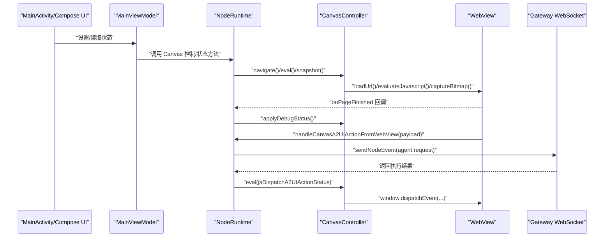
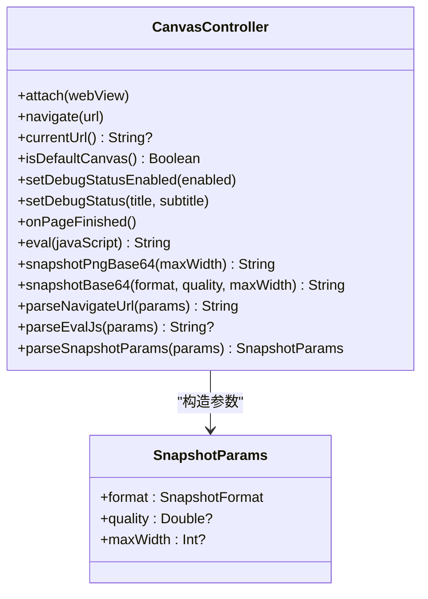
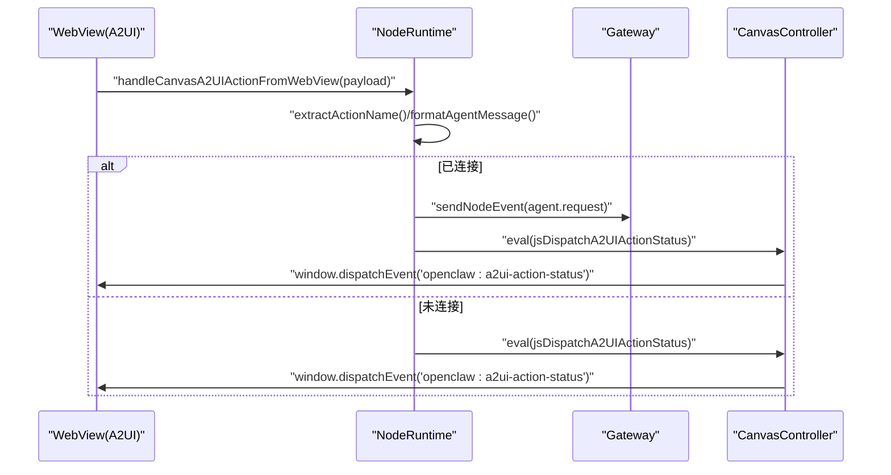
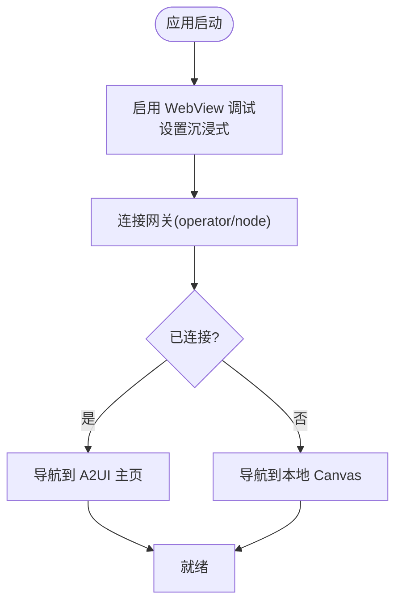

# Canvas 图形界面

## 目录
1. [简介](#简介)
2. [项目结构](#项目结构)
3. [核心组件](#核心组件)
4. [架构总览](#架构总览)
5. [详细组件分析](#详细组件分析)
6. [依赖关系分析](#依赖关系分析)
7. [性能考虑](#性能考虑)
8. [故障排查指南](#故障排查指南)
9. [结论](#结论)
10. [附录](#附录)

## 简介
本文件面向 OpenClaw Android 平台的 Canvas 图形界面，系统性阐述其渲染架构、输入处理与用户交互设计。重点包括：
- 基于 WebView 的 Canvas 渲染管线与本地/远程内容加载策略
- 触摸与手势在 WebView 中的传递与拦截机制
- A2UI（Agent-to-UI）消息推送与事件回传通道
- 布局管理、视图层次与沉浸式体验
- 性能优化策略（截图压缩、主线程调度、尺寸缩放）
- 与主应用的通信机制、数据同步与实时更新策略

## 项目结构
Android Canvas 相关代码集中在 `apps/android/app` 模块中，核心文件如下：
- 渲染与控制：`CanvasController`（负责 WebView 附加、导航、调试状态注入、JS 执行、截图）
- 协议与事件：`OpenClawCanvasA2UIAction`（从 WebView 提交的用户动作格式化为代理请求）
- 应用入口与生命周期：`MainActivity`（设置沉浸式、权限、服务启动）
- VM 与运行时：`MainViewModel`、`NodeRuntime`（连接网关、自动导航到 A2UI、转发 A2UI 动作）
- 构建与资源复制：`scripts/canvas-a2ui-copy.ts`（将 A2UI 资产复制到分发目录）
- 文档参考：`docs/platforms/mac/canvas.md`（跨平台 Canvas 行为与 A2UI 版本）

```mermaid
graph TB
subgraph "Android 应用"
MA["MainActivity<br/>生命周期与沉浸式"]
VM["MainViewModel<br/>状态与转发"]
NR["NodeRuntime<br/>网关会话/命令/事件"]
CC["CanvasController<br/>WebView/JS/截图"]
WV["WebView<br/>Canvas 渲染宿主"]
end
subgraph "网关与 A2UI"
GW["Gateway WebSocket"]
A2UI["A2UI Host<br/>dist/canvas-host/a2ui/*"]
end
MA --> VM
VM --> NR
NR --> CC
CC --> WV
NR <- --> GW
WV <- --> A2UI
```

## 核心组件
- `CanvasController`：封装 WebView 生命周期、导航、调试状态注入、JS 评估、截图生成（PNG/JPEG，支持质量与最大宽度限制）。提供参数解析工具，确保输入健壮性。
- `OpenClawCanvasA2UIAction`：将 WebView 内部的用户动作标准化为代理可识别的消息格式，并生成用于回传执行结果的 JS 事件。
- `NodeRuntime`：持有 `CanvasController` 实例，负责在连接/断开网关时自动导航至 A2UI 或本地 Canvas；接收来自 WebView 的动作并转发给网关；维护调试状态与状态栏信息。
- `MainViewModel`：对外暴露状态流与操作方法，桥接 UI 与 `NodeRuntime`；提供处理 WebView 动作的入口。
- `MainActivity`：初始化 WebView 调试开关、沉浸式模式、权限请求与前台服务。

## 架构总览
Android Canvas 采用“WebView 宿主 + A2UI 推送”的轻量渲染方案：
- WebView 作为 Canvas 渲染容器，支持本地 scaffold 页面与外部 http(s)/file URL 导航
- `NodeRuntime` 在网关连接成功后自动导航到 A2UI 主页，断开时退回本地 Canvas
- WebView 内部通过全局对象暴露 API，支持调试状态注入与动作回传
- 用户在 Canvas 中的操作经由 `OpenClawCanvasA2UIAction` 格式化为代理请求，通过网关发送到代理端



## 详细组件分析

### CanvasController 分析
职责与能力
- WebView 附加与重载：`attach()` 初始化并加载 scaffold 或自定义 URL
- 导航控制：`navigate()` 支持空/根路径切换到本地 scaffold
- 调试状态注入：`setDebugStatusEnabled()`/`setDebugStatus()` 将状态写入 WebView 全局对象
- JS 评估：`eval()` 在主线程安全执行 JS 并获取结果
- 截图生成：`snapshotPngBase64()`/`snapshotBase64()` 支持 PNG/JPEG，质量与最大宽度裁剪

参数解析与健壮性
- 解析导航 URL、JS、截图参数，对非法值进行默认或裁剪处理
- JPEG 质量在 [0.1, 1.0] 区间内强制约束，避免异常值

线程与性能
- 所有 WebView 操作在主线程执行，使用主线程调度器保证线程安全
- 截图前按最大宽度等比缩放，降低内存占用与传输成本



### A2UI 动作协议与回传
- 从 WebView 提交的动作对象提取名称与上下文，标准化标签值，拼装为代理请求字符串
- 通过 `NodeRuntime` 发送到网关，再由 WebView 回发执行状态（成功/失败与错误信息）



### 运行时集成与生命周期
- `MainActivity` 启动时启用 WebView 调试、设置沉浸式、请求必要权限、启动前台服务
- `NodeRuntime` 在连接网关后自动导航到 A2UI，断开时退回本地 Canvas
- 调试状态开关与状态文本联动，通过 `CanvasController` 注入到 WebView



### 输入处理与手势识别
- WebView 默认处理触摸与手势事件，`CanvasController` 不直接拦截或重写事件分发
- 若需在 WebView 外层处理手势（如滑动关闭、边缘触发），可在上层 Compose 层或 Activity 层添加手势监听，并根据业务需求决定是否透传给 WebView
- 对于 Canvas 内部的交互，建议通过 JS 事件与代理通信，保持输入路径清晰可控

### 布局管理与视图层次
- WebView 作为 Canvas 的唯一渲染容器，承载 A2UI 或本地 scaffold
- `MainActivity` 使用 Compose 的 Surface 包裹 RootScreen，WebView 作为底层渲染视图叠加在 UI 之上
- 沉浸式模式通过 WindowInsetsController 隐藏系统栏，最大化 Canvas 可视区域

### 数据同步与实时更新
- `NodeRuntime` 在连接/断开时自动切换 Canvas 内容，确保状态一致性
- 调试状态通过状态流联动，`CanvasController` 在页面加载完成后注入
- A2UI 的推送消息在 WebView 内部被解析并渲染，UI 更新由 A2UI 自身驱动

### 与主应用的通信机制
- `MainViewModel` 将 Canvas 控制与状态暴露给 UI
- `NodeRuntime` 统一处理网关连接、命令下发与事件回传
- WebView 与代理之间的消息通过 `NodeRuntime` 中转，确保线程安全与错误回传

## 依赖关系分析
- `NodeRuntime` 依赖 `CanvasController`、`GatewaySession`、`SecurePrefs` 等模块
- `MainViewModel` 仅通过 `NodeRuntime` 访问 `CanvasController`，避免直接耦合
- `OpenClawCanvasA2UIAction` 与 `NodeRuntime` 协作完成动作格式化与回传
- A2UI 资产由脚本复制到 dist 目录供 WebView 加载

```mermaid
graph LR
VM["MainViewModel"] --> RT["NodeRuntime"]
RT --> CC["CanvasController"]
RT --> GS["GatewaySession"]
RT --> PR["SecurePrefs"]
CC --> WV["WebView"]
RT --> OA["OpenClawCanvasA2UIAction"]
SC["scripts/canvas-a2ui-copy.ts"] --> DIST["dist/canvas-host/a2ui/*"]
WV <- --> DIST
```

## 性能考虑
- 截图优化
  - 等比缩放：当目标宽度大于原图宽度时，按比例计算高度，避免超大位图
  - 质量裁剪：JPEG 质量限制在 [0.1, 1.0]，超出范围强制约束
  - 编码选择：PNG 无损但体积较大；JPEG 适合照片类内容
- 线程安全
  - WebView 操作统一在主线程执行，避免跨线程访问导致崩溃
- 资源复制
  - A2UI 资产复制脚本检查必需文件存在性，缺失时报错并可选择跳过

## 故障排查指南
- WebView 无法加载 A2UI
  - 确认 A2UI 资产已复制到 dist 目录
  - 检查 `NodeRuntime` 是否在连接后尝试导航
- 截图为空或异常
  - 确认 WebView 已完成页面加载后再截图
  - 检查 `maxWidth` 与 `format`/`quality` 参数合法性
- A2UI 动作未生效
  - 检查 WebView 是否正确注入全局对象
  - 确认 `NodeRuntime` 已收到动作并转发到网关
- 调试状态不显示
  - 确认调试开关已开启且 `onPageFinished` 已回调
  - 检查状态文本是否为空

## 结论
OpenClaw Android Canvas 采用 WebView 作为统一渲染载体，结合 `NodeRuntime` 的自动导航与状态同步，实现了与 A2UI 的无缝对接。通过严格的参数校验、主线程调度与截图优化，保障了稳定性与性能。建议在上层 UI 增强手势与输入拦截策略，同时完善日志与错误回传，持续提升用户体验。

## 附录
- A2UI 版本与消息类型参考（跨平台文档）
  - A2UI v0.8 支持 `beginRendering`、`surfaceUpdate`、`dataModelUpdate`、`deleteSurface`
  - `createSurface`（v0.9）暂不支持