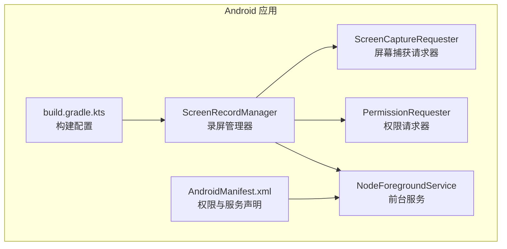
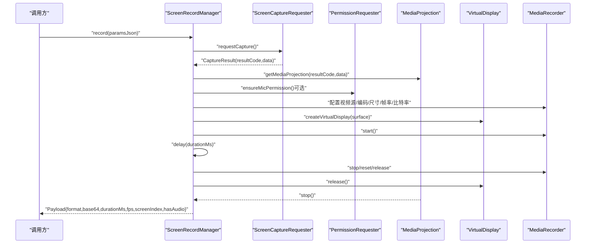
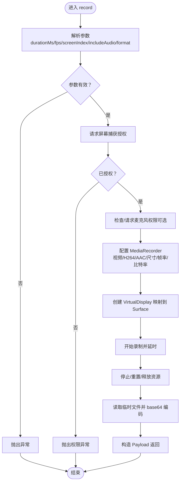
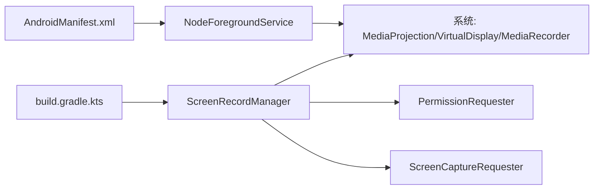

# 屏幕录制功能

## 目录
1. [简介](#简介)
2. [项目结构](#项目结构)
3. [核心组件](#核心组件)
4. [架构总览](#架构总览)
5. [组件详解](#组件详解)
6. [依赖关系分析](#依赖关系分析)
7. [性能考量](#性能考量)
8. [故障排查指南](#故障排查指南)
9. [结论](#结论)
10. [附录](#附录)

## 简介
本文件面向 OpenClaw Android 屏幕录制能力，系统性阐述录屏服务的架构设计、录屏 API 使用与视频编码流程；深入解析屏幕捕获服务的实现原理、录屏权限申请与系统兼容性处理；详细说明视频编码参数配置、帧率控制与分辨率适配策略；涵盖录屏状态管理、后台录制机制与电池优化考虑；并提供实际的调用流程图与关键实现位置索引，帮助开发者快速理解与扩展。

## 项目结构
Android 录屏相关代码集中在应用模块中，主要由以下几类文件构成：
- 录屏管理器：负责参数解析、权限校验、MediaProjection 创建、VirtualDisplay 搭建、MediaRecorder 配置与录制生命周期管理。
- 权限请求器：封装 Android 动态权限申请流程，支持理由说明与系统设置跳转。
- 屏幕捕获请求器：封装系统屏幕捕获授权意图的发起与结果回调。
- 前台服务：维持前台通知与必要的前台服务类型声明，确保后台稳定运行。
- 清单与构建：声明所需权限与前台服务类型，定义最小 SDK 与目标 SDK。

## 核心组件
- 录屏管理器（ScreenRecordManager）
  - 负责解析 JSON 参数、校验格式与范围、请求屏幕捕获授权、创建 MediaProjection、搭建 VirtualDisplay、配置 MediaRecorder、执行录制与收尾、读取临时文件并返回 base64 编码的 MP4 数据。
  - 关键职责：参数解析、权限校验、投影与显示、编码与输出、生命周期管理。
- 屏幕捕获请求器（ScreenCaptureRequester）
  - 发起系统屏幕捕获授权意图，弹出理由对话框，等待用户确认后接收结果。
- 权限请求器（PermissionRequester）
  - 统一封装动态权限申请流程，支持理由说明、超时与系统设置跳转。
- 前台服务（NodeForegroundService）
  - 维持前台通知，根据是否需要麦克风动态调整前台服务类型，保证后台稳定运行。
- 清单与构建
  - 声明网络、通知、前台服务、媒体投影、麦克风等权限；定义最小 SDK 与目标 SDK；声明前台服务类型。

## 架构总览
下图展示了从调用到产出录屏数据的整体流程，包括参数解析、权限校验、屏幕捕获授权、投影与显示、编码与输出、以及返回 payload 的关键步骤。

## 组件详解

### 录屏管理器（ScreenRecordManager）
- 参数解析
  - 支持 `durationMs`、`fps`、`screenIndex`、`includeAudio`、`format` 等字段；对非法格式与越界参数抛出异常；`screenIndex` 必须为 0。
- 权限与授权
  - 若需要音频，先检查并请求 `RECORD_AUDIO` 权限；若未授予则抛出异常。
  - 通过 `ScreenCaptureRequester` 获取屏幕捕获授权；未授权则抛出异常。
- 投影与显示
  - 通过 `MediaProjectionManager` 创建 `MediaProjection`；基于设备密度与屏幕尺寸创建 `VirtualDisplay`，镜像到 `MediaRecorder` 的 `Surface`。
- 编码与输出
  - 输出格式为 `MPEG_4`，视频编码 `H264`；若包含音频则使用 `AAC`，单声道，采样率 44100，编码比特率 96kbps。
  - 视频尺寸与帧率来自设备分辨率与参数 `fps`；编码比特率按像素数与 `fps` 估算并在合理区间内裁剪。
- 生命周期与收尾
  - 录制完成后停止 `MediaRecorder`、重置释放、释放 `VirtualDisplay` 与投影；读取临时文件字节并进行 base64 编码，构造 `Payload` 返回。

### 屏幕捕获请求器（ScreenCaptureRequester）
- 负责弹出理由对话框提示用户屏幕录制用途，随后通过 `MediaProjectionManager` 创建屏幕捕获意图并启动，等待用户授权结果。
- 结果通过 `CompletableDeferred` 回传，若用户拒绝或超时则返回空值。

### 权限请求器（PermissionRequester）
- 过滤缺失权限，必要时弹出理由对话框；通过 `ActivityResultLauncher` 请求权限；支持超时等待与合并已授予状态。
- 对被永久拒绝且不在理由列表中的权限，弹出引导前往系统设置的对话框。

### 前台服务（NodeForegroundService）
- 在应用启动时创建并显示连接状态通知；根据是否需要麦克风动态设置前台服务类型（数据同步/麦克风/媒体投影），持续运行以保障后台稳定性。
- 提供启动与停止入口，停止时触发断开连接并自停。

### 清单与构建（AndroidManifest.xml / build.gradle.kts）
- 清单声明网络、通知、前台服务、媒体投影、麦克风等权限，并在前台服务节点声明所需类型。
- 构建脚本定义最小 SDK 与目标 SDK，确保在较新系统上获得更好的兼容性与特性支持。

### iOS/macOS 侧对比参考
- iOS 侧通过 `ReplayKit` 进行屏幕录制，采用 `AVAssetWriter` 写入 `H264` 视频流，支持按帧率阈值丢帧与写入错误处理。
- macOS 侧同样采用 `AVAssetWriter` 写入，具备相似的参数与错误处理逻辑。
- iOS 端 `NodeAppModel` 中对录屏参数进行校验与状态标记，最终读取临时文件并返回 base64 数据。

## 依赖关系分析
- `ScreenRecordManager` 依赖 `ScreenCaptureRequester` 与 `PermissionRequester` 完成授权与权限流程；依赖系统 `MediaProjection` 与 `VirtualDisplay` 完成屏幕镜像；依赖 `MediaRecorder` 完成编码与输出。
- `NodeForegroundService` 依赖系统通知与前台服务类型，配合权限状态动态调整前台类型。
- 清单与构建文件为上述组件提供运行时所需的权限与平台能力声明。

## 性能考量
- 帧率控制
  - 通过参数 `fps` 控制录制帧率，内部强制在 1–60 范围内；过高帧率会显著增加 CPU/GPU 与存储压力。
- 分辨率与比特率
  - 视频尺寸直接采用设备当前分辨率；编码比特率按像素数与帧率估算并在 1–12Mbps 区间裁剪，避免极端值导致编码失败或质量异常。
- 录制时长
  - 默认 10 秒，最大不超过 60 秒；过长录制会增加电量与发热风险。
- 后台与前台
  - 前台服务类型包含数据同步与媒体投影，有助于在后台稳定运行；若包含音频，前台类型会额外包含麦克风类型。
- 电池优化
  - 建议在设备充电或高电量场景下进行录制；避免同时进行高负载任务；录制结束后及时释放资源。

## 故障排查指南
- 屏幕录制权限未授予
  - 现象：抛出“需要屏幕录制权限”异常。
  - 排查：确认 `ScreenCaptureRequester` 已正确发起授权；检查用户是否拒绝或未完成授权。
- 麦克风权限未授予
  - 现象：抛出“需要麦克风权限”异常。
  - 排查：确认 `PermissionRequester` 已正确发起授权；检查用户是否拒绝或永久拒绝。
- 不支持的格式或参数
  - 现象：抛出“请求无效”异常（如 `format` 非 mp4 或 `screenIndex` 非 0）。
  - 排查：确认参数格式与取值范围符合要求。
- 录制失败或无法停止
  - 现象：录制异常终止或资源未释放。
  - 排查：检查 `finally` 分支是否执行；确认 `MediaRecorder.stop`/重置/释放顺序正确。
- 前台服务类型未生效
  - 现象：后台运行不稳定或被系统回收。
  - 排查：确认清单中前台服务类型声明完整；确认 `NodeForegroundService` 正确设置类型。

## 结论
OpenClaw Android 屏幕录制功能以 `ScreenRecordManager` 为核心，结合 `ScreenCaptureRequester` 与 `PermissionRequester` 实现完整的授权与权限流程，依托系统 `MediaProjection` 与 `MediaRecorder` 完成高质量录屏输出。通过前台服务与合理的参数约束，兼顾了稳定性与用户体验。iOS/macOS 侧采用 `AVAssetWriter` 与 `AVAudioEngine` 的组合，形成跨平台一致的录屏体验。建议在实际部署中关注参数边界、后台稳定性与电池优化，确保在不同设备与系统版本上的可靠性。

## 附录
- 录屏服务启动流程（代码路径索引）
  - 录屏管理器入口：`ScreenRecordManager.kt`
  - 屏幕捕获授权流程：`ScreenCaptureRequester.kt`
  - 麦克风权限申请流程：`PermissionRequester.kt`
  - 前台服务类型设置：`NodeForegroundService.kt`
  - 清单权限与服务声明：`AndroidManifest.xml`
  - 构建配置与 SDK 版本：`build.gradle.kts`
- iOS/macOS 录屏参考
  - iOS 录屏服务与写入逻辑：`ScreenRecordService.swift`
  - iOS 调用与参数校验：`NodeAppModel.swift`
  - macOS 录屏服务（参考实现）：`ScreenRecordService.swift`