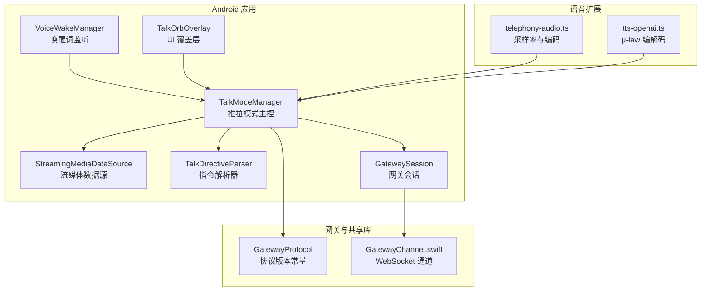
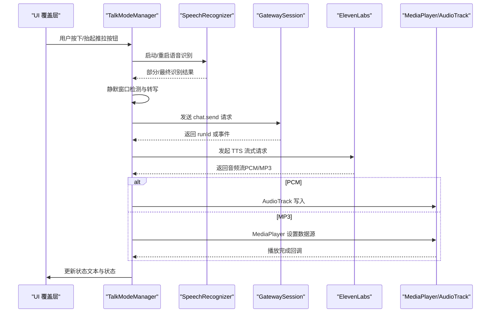
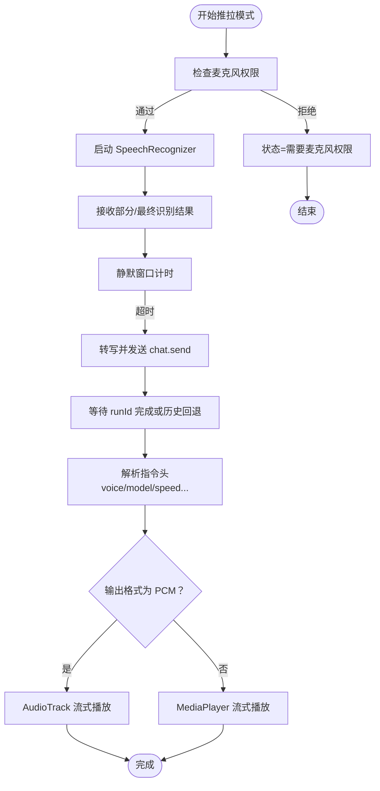
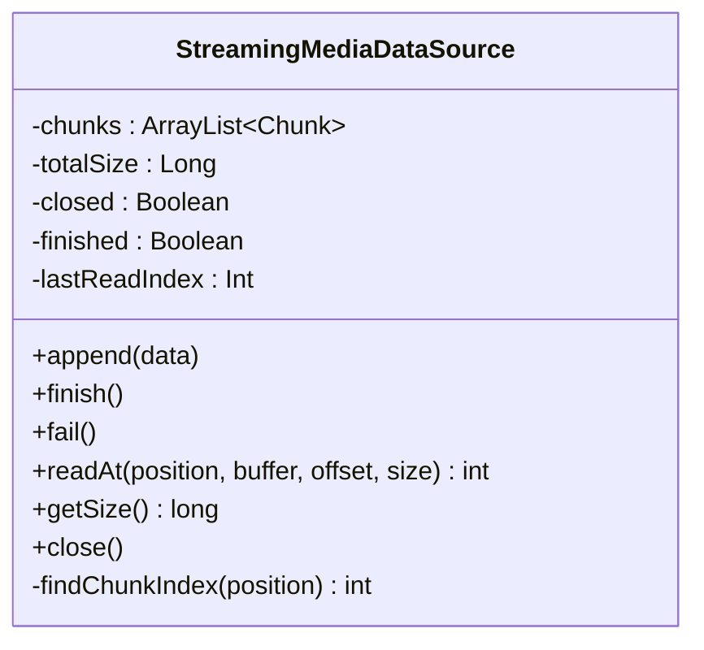
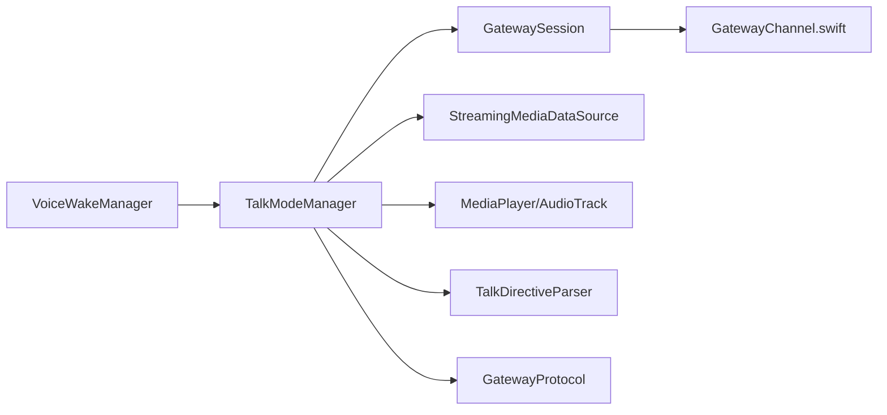

# 推拉模式交互

## 目录
1. [简介](#简介)
2. [项目结构](#项目结构)
3. [核心组件](#核心组件)
4. [架构总览](#架构总览)
5. [详细组件分析](#详细组件分析)
6. [依赖关系分析](#依赖关系分析)
7. [性能考量](#性能考量)
8. [故障排查指南](#故障排查指南)
9. [结论](#结论)
10. [附录](#附录)

## 简介
本文件面向 OpenClaw Android 平台的“推拉模式”（Push-to-Talk）交互功能，系统性阐述其实现原理、音频录制与播放机制、用户交互设计、实时音频处理与缓冲管理、回音消除策略、推拉按钮状态管理、录音触发与播放控制逻辑、音频权限申请、录音配置优化与音频质量控制策略，并结合代码路径给出可直接定位到源码位置的示例片段。同时，解释推拉模式与网关的音频数据传输协议与实时通信机制。

## 项目结构
Android 推拉模式相关代码主要位于 `apps/android/app/src/main/java/ai/openclaw/android` 下，围绕语音识别、TTS 播放、流式媒体数据源、UI 覆盖层等模块协同工作；网关侧协议与通道在 `shared/OpenClawKit` 中实现，语音扩展在 `extensions/voice-call` 中提供编解码与采样率转换能力。

## 核心组件
- 推拉模式主控：负责麦克风权限检查、语音识别启动/重启、静默窗口检测、与网关通信、TTS 文本解析与播放、PCM/MP3 流式播放、中断控制与状态管理。
- 流媒体数据源：为 MediaPlayer 提供可等待的分块音频数据，支持追加、完成与失败标记，内部使用同步队列与通知唤醒。
- 指令解析器：从网关返回文本中提取 JSON 指令（如 `voice`/`model`/`speed` 等），剥离指令后保留纯文本用于 TTS。
- 唤醒词监听：独立于推拉模式运行，监听触发词并回调上层切换到推拉模式或执行命令。
- UI 覆盖层：根据 `isListening`/`isSpeaking` 状态与状态文本绘制脉动球形 UI，提供视觉反馈。
- 网关协议与通道：定义协议版本常量，网关通道负责 WebSocket 消息收发、事件分发与重连处理。
- 语音扩展：提供 16kHz→8kHz 重采样、μ-law 编解码与 20ms 分片等工具，支撑电话级音频格式。

## 架构总览
下图展示了从用户触发录音到网关响应、TTS 播放与 UI 反馈的端到端流程。

## 详细组件分析

### 组件一：推拉模式主控（TalkModeManager）
- 权限与状态
  - 在启用时检查 RECORD_AUDIO 权限，否则提示“需要麦克风权限”。
  - 维护 `isEnabled`/`isListening`/`isSpeaking`/`statusText` 等状态流，供 UI 订阅。
- 录音与识别
  - 使用 SpeechRecognizer 启动识别，开启部分结果与最大结果数。
  - 通过静默窗口（默认 700ms）判断说话结束，触发转写与后续流程。
  - 错误处理覆盖多种识别错误码，自动重启识别。
- 与网关通信
  - 发送 `chat.send` 请求，携带 `sessionKey`、消息体、幂等键等参数。
  - 支持订阅 `chat` 事件以获取 `runId` 完成信号；若未收到，回退到历史查询。
- TTS 与播放
  - 解析指令头（TalkDirectiveParser），支持 `voice`/`model`/`speed`/`stability` 等参数。
  - 优先尝试 ElevenLabs PCM 输出（按 `outputFormat` 解析采样率），失败则回退 MP3。
  - PCM 使用 AudioTrack MODE_STREAM 实时写入；MP3 使用 MediaPlayer 异步准备与播放。
- 中断与回音消除
  - 当正在播放且检测到新语音片段时，可选择中断播放（由 `interruptOnSpeech` 控制）。
  - 回音消除未在该组件内实现，建议通过设备/系统音频路由与通话场景下的耳麦/蓝牙耳机配合降低回音。
- 关键路径参考
  - 启停与识别：`start`/`stop`/`startListeningInternal`
  - 静默检测与转写：`startSilenceMonitor`/`checkSilence`/`finalizeTranscript`
  - 网关交互与历史查询：`sendChat`/`waitForChatFinal`/`fetchLatestAssistantText`
  - 指令解析与播放：`playAssistant`/`streamAndPlay`/`streamAndPlayPcm`/`streamAndPlayMp3`
  - 中断控制：`stopSpeaking`/`shouldInterrupt`

### 组件二：流式媒体数据源（StreamingMediaDataSource）
- 功能要点
  - 多线程安全的分块缓冲区，支持 `append`/`finish`/`fail`/`close`。
  - `readAt` 基于位置索引查找块，阻塞等待直到有数据或完成。
  - 适用于 MediaPlayer 的 MediaDataSource 接口，实现边取边播。
- 关键路径参考
  - 追加数据与通知：`append`/`finish`/`fail`
  - 顺序读取与等待：`readAt`/`findChunkIndex`

### 组件三：指令解析器（TalkDirectiveParser）
- 功能要点
  - 从多行文本首行解析 JSON 指令，支持多种别名字段（如 `voice_id`、`model_id`、`latency_tier` 等）。
  - 剥离已识别的指令后，返回纯文本给 TTS。
- 关键路径参考
  - 解析入口与字段映射：`parse`
  - 类型提取辅助函数：`stringValue`/`doubleValue`/`intValue`/`longValue`/`boolValue`

### 组件四：UI 覆盖层（TalkOrbOverlay）
- 功能要点
  - 根据 `isListening`/`isSpeaking`/`statusText` 渲染脉动圆环与状态文字。
  - 无状态文本时显示 Listening/Thinking/Speaking 三态提示。
- 关键路径参考
  - 状态计算与渲染：`TalkOrbOverlay`

### 组件五：唤醒词监听（VoiceWakeManager）
- 功能要点
  - 独立监听触发词，成功后回调上层执行命令或切换模式。
  - 自动重启识别，避免长时间占用导致的忙/错乱状态。
- 关键路径参考
  - 启停与错误处理：`start`/`stop`/`listener`

### 组件六：网关协议与通道
- 协议版本
  - 定义协议版本常量，确保客户端与网关兼容。
- 通道处理
  - WebSocket 消息解码、事件分发、序列号校验、断线重连与挂起任务清理。
- 关键路径参考
  - 协议版本：`GATEWAY_PROTOCOL_VERSION`
  - 事件处理与重连：`handle`/`listen`

### 组件七：语音扩展（telephony-audio.ts 与 tts-openai.ts）
- 采样率与编码
  - 将 16-bit PCM 线性插值重采样至 8kHz；提供 μ-law 与线性互转；按 20ms 分片。
- 关键路径参考
  - 重采样与 μ-law 转换：`resamplePcmTo8k`/`pcmToMulaw`
  - μ-law 与线性互转及分片：`pcmToMulaw`/`mulawToLinear`/`chunkAudio`

## 依赖关系分析
- 组件耦合
  - TalkModeManager 依赖 GatewaySession 进行网关通信；依赖 StreamingMediaDataSource 与 MediaPlayer/AudioTrack 进行播放；依赖 TalkDirectiveParser 解析指令。
  - VoiceWakeManager 独立运行，通过回调影响上层状态切换。
- 外部依赖
  - ElevenLabs API 用于 TTS 流式输出；Android 原生 SpeechRecognizer 与 MediaPlayer/AudioTrack。
- 协议与兼容
  - GatewayProtocol 版本常量保证客户端与网关协议一致性；GatewayChannel 负责消息收发与事件分发。

## 性能考量
- 录音与识别
  - 使用部分结果与最大结果数提升响应速度；静默窗口 700ms 平衡打断灵敏度与误触。
- 播放路径
  - PCM 模式采用 AudioTrack MODE_STREAM，减少延迟；MP3 模式使用 MediaPlayer 异步 prepare，避免主线程阻塞。
- 缓冲与并发
  - StreamingMediaDataSource 使用同步队列与 wait/notify，保障读写线程协作；TalkModeManager 在 IO 线程进行网络与写盘操作。
- 采样率与编码
  - 通过 telephony-audio.ts 的 8kHz 重采样与 μ-law 编码，降低带宽与延迟，适合电话场景。

## 故障排查指南
- 麦克风权限
  - 现象：状态显示“需要麦克风权限”，无法启动识别。
  - 处理：引导用户授予 RECORD_AUDIO 权限；确认权限检查逻辑与状态更新。
  - 参考：`start`/权限检查
- 识别错误码
  - 现象：状态显示各类识别错误，如音频/网络/服务器错误。
  - 处理：根据错误码分支提示；自动重启识别；必要时提示用户网络或系统问题。
  - 参考：`listener.onError`
- 播放异常
  - 现象：MediaPlayer 报错或 AudioTrack 写入失败。
  - 处理：捕获异常并回退到系统 TTS；记录日志并清理资源。
  - 参考：`streamAndPlayMp3`/异常处理、`streamPcm`/写入失败处理
- 网关连接
  - 现象：事件丢失、序列号断层、接收失败。
  - 处理：检查 GatewayChannel 的事件分发与重连逻辑；关注断线与挂起任务清理。
  - 参考：`GatewayChannel.handle`/`listen`

## 结论
推拉模式通过“语音识别—网关对话—TTS 播放—UI 反馈”的闭环实现，具备完善的权限检查、错误恢复、静默检测与播放路径选择。在音频质量方面，结合 ElevenLabs 的 PCM 输出与 8kHz 重采样/μ-law 编码，兼顾低延迟与清晰度。建议在实际部署中进一步完善回音消除策略与网络稳定性保障，并持续监控网关事件序列号与重连行为。

## 附录
- 网关 RPC 方法（语音通话）
  - `voicecall.initiate` / `continue` / `speak` / `end` / `status`
  - 参考：`voice-call.md`
- 协议版本
  - `GATEWAY_PROTOCOL_VERSION` = 3
  - 参考：`GatewayProtocol.kt`