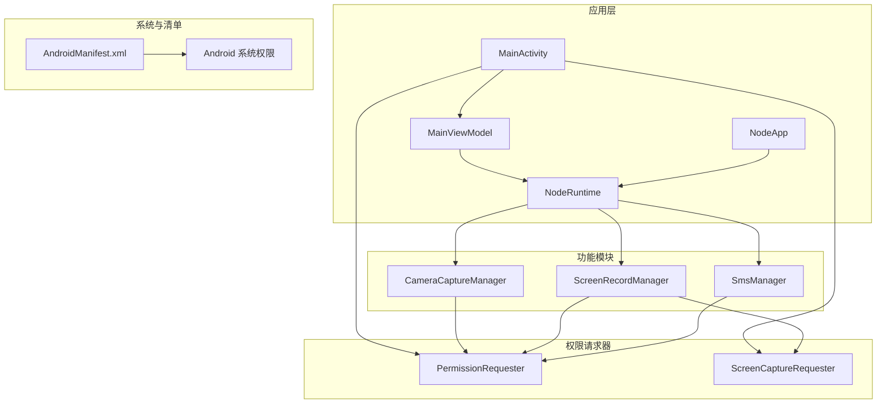
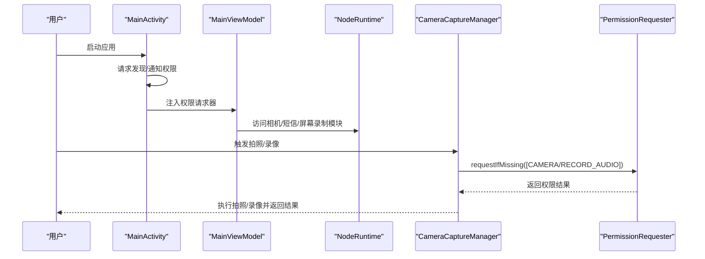
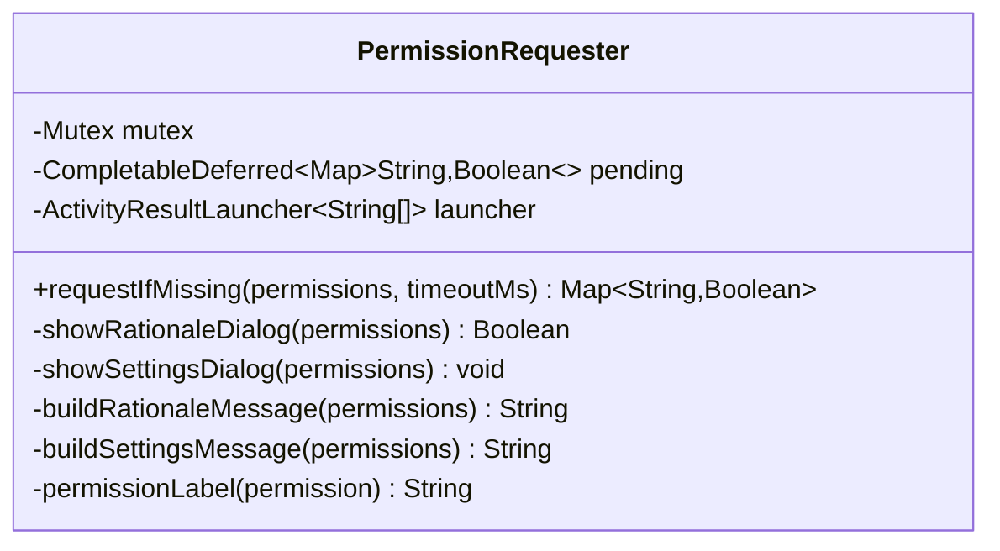
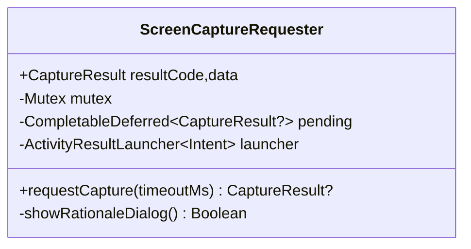
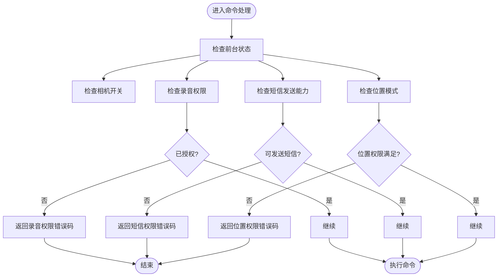
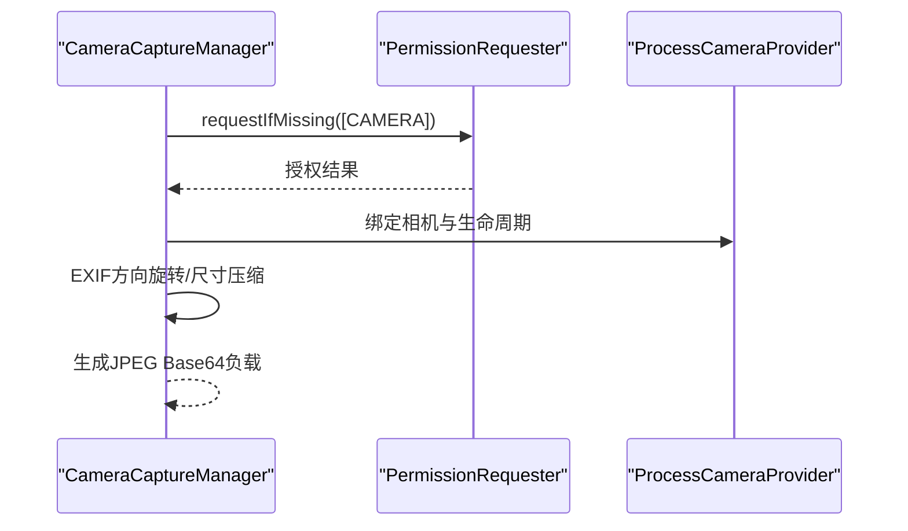
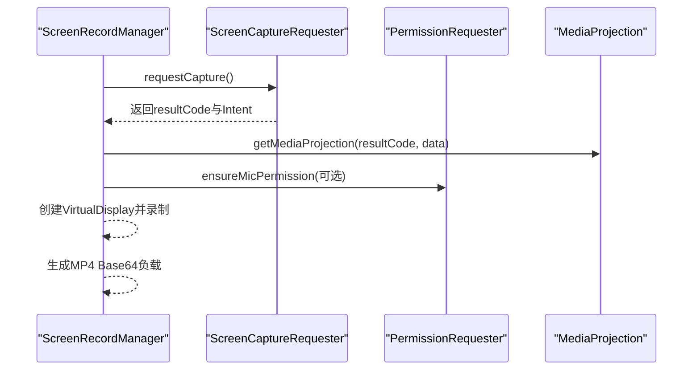
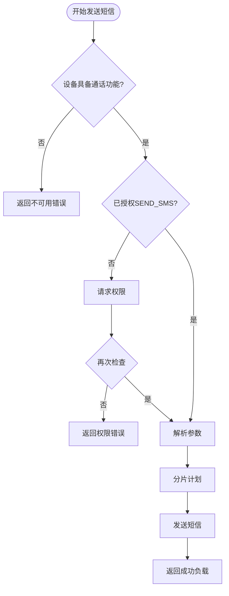
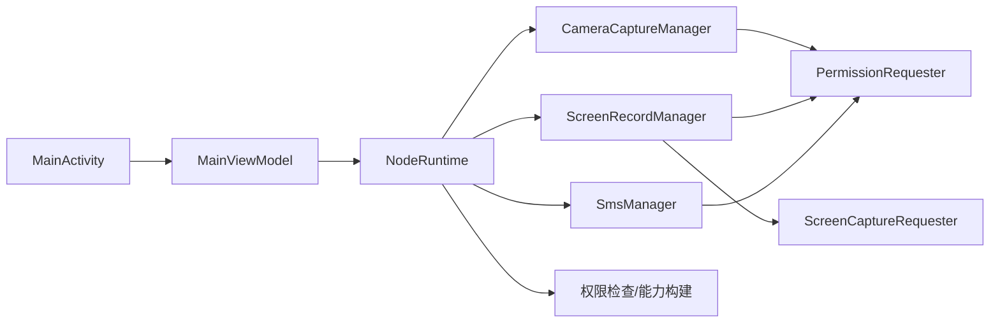

# 权限管理系统

## 目录
1. [简介](#简介)
2. [项目结构](#项目结构)
3. [核心组件](#核心组件)
4. [架构总览](#架构总览)
5. [详细组件分析](#详细组件分析)
6. [依赖关系分析](#依赖关系分析)
7. [性能考虑](#性能考虑)
8. [故障排查指南](#故障排查指南)
9. [结论](#结论)

## 简介
本文件系统性梳理 OpenClaw Android 权限管理系统，覆盖应用所需权限配置、权限请求流程与状态管理。重点解析相机权限、录音权限、存储权限、悬浮窗权限与短信权限的实现细节，包括权限检查机制、动态权限申请、权限拒绝处理策略，以及与各功能模块（相机、屏幕录制、短信）的集成方式与权限变更监听机制。同时提供用户体验设计建议、权限说明文案与用户引导机制，并通过序列图与类图直观展示关键流程。

## 项目结构
Android 权限管理位于 `apps/android/app` 模块中，采用“运行时权限 + 功能模块”的分层组织：
- 应用入口与生命周期：`MainActivity`、`MainViewModel`、`NodeApp`、`NodeRuntime`
- 权限请求器：`PermissionRequester`（多权限）、`ScreenCaptureRequester`（屏幕录制）
- 功能模块：`CameraCaptureManager`、`ScreenRecordManager`、`SmsManager`
- 权限声明：`AndroidManifest.xml`
- UI 层：`RootScreen` 等负责权限状态展示与引导

## 核心组件
- `PermissionRequester`：统一的多权限请求器，支持权限缺失检测、理由说明对话框、超时控制与设置页跳转。
- `ScreenCaptureRequester`：屏幕录制权限的专用请求器，封装 MediaProjection 流程并提供超时与取消处理。
- `NodeRuntime`：运行时权限检查与能力构建，根据权限状态决定功能可用性与错误码。
- `CameraCaptureManager`：相机拍照/录像前的权限校验与参数解析，必要时触发权限请求。
- `ScreenRecordManager`：屏幕录制前的权限校验与参数解析，必要时触发屏幕捕获与麦克风权限请求。
- `SmsManager`：短信发送前的权限校验与参数解析，必要时触发权限请求。
- `MainActivity`：应用启动时的发现与通知权限请求，以及将权限请求器注入到各功能模块。

## 架构总览
权限管理贯穿应用生命周期与功能调用链路：
- 应用启动：`MainActivity` 在 `onCreate` 中请求发现与通知权限，并将 `PermissionRequester`/`ScreenCaptureRequester` 注入到 `NodeRuntime` 的各模块。
- 运行时检查：`NodeRuntime` 在构建能力列表与执行命令时，依据权限状态返回相应错误码或允许操作。
- 功能调用：各功能模块在执行敏感操作前，先进行权限校验；若缺失则通过 `PermissionRequester` 或 `ScreenCaptureRequester` 触发系统权限对话框。
- 用户体验：`RootScreen` 基于权限状态与运行时状态展示状态提示与引导按钮。

## 详细组件分析

### 权限请求器（PermissionRequester）
职责与特性：
- 多权限一次性请求与超时控制
- 权限缺失检测与理由说明对话框
- 已授权合并与设置页跳转
- 协程互斥锁保证串行化请求

### 屏幕录制请求器（ScreenCaptureRequester）
职责与特性：
- 封装 MediaProjection 创建与结果等待
- 超时控制与取消处理
- 理由说明对话框与用户交互

### 运行时权限检查与能力构建（NodeRuntime）
职责与特性：
- 统一的权限查询方法（录音、位置、后台定位）
- 能力构建：根据权限与开关决定是否暴露能力
- 错误码策略：针对不同权限缺失返回明确错误码

### 相机权限与功能集成（CameraCaptureManager）
职责与特性：
- 拍照：确保相机权限，绑定生命周期，EXIF 方向旋转与尺寸压缩
- 录像：可选音频，必要时确保录音权限
- 参数解析：面向 JSON 的参数解析与范围约束

### 屏幕录制权限与功能集成（ScreenRecordManager）
职责与特性：
- 通过 `ScreenCaptureRequester` 获取屏幕捕获授权
- 可选音频：必要时确保录音权限
- 参数解析与虚拟显示创建

### 短信权限与功能集成（SmsManager）
职责与特性：
- 参数解析与分片发送策略
- 权限缺失时触发权限请求
- 明确的错误码与负载格式

### 权限清单与应用初始化（AndroidManifest.xml、NodeApp、MainActivity）
- 清单声明：INTERNET、网络状态、前台服务类型、位置、相机、录音、短信、WLAN 发现等
- 应用初始化：`NodeApp` 提供全局 `NodeRuntime` 实例
- 启动流程：`MainActivity` 在 `onCreate` 中请求发现与通知权限，并注入权限请求器到各模块

## 依赖关系分析
- `MainActivity` 依赖 `MainViewModel`，`MainViewModel` 持有 `NodeRuntime`，`NodeRuntime` 管理各功能模块
- 各功能模块依赖 `PermissionRequester` 与 `ScreenCaptureRequester` 完成权限请求
- `NodeRuntime` 在命令处理与能力构建阶段进行权限检查
- `RootScreen` 基于权限状态与运行时状态渲染 UI

## 性能考虑
- 权限请求超时控制：`PermissionRequester` 与 `ScreenCaptureRequester` 均提供超时机制，避免 UI 阻塞
- 协程调度分离：UI 线程用于对话框展示，IO 线程用于耗时任务，降低主线程压力
- 图像/视频处理：拍照前的 EXIF 旋转与尺寸压缩、屏幕录制的虚拟显示创建均在后台线程执行
- 权限合并策略：即使部分权限未在当前请求中出现，也会基于实时状态进行合并判断，减少重复请求

## 故障排查指南
常见问题与处理：
- 录音权限缺失导致语音唤醒暂停：`NodeRuntime` 在权限不足时停止语音唤醒并更新状态文本
- 位置权限缺失导致定位失败：返回 `LOCATION_PERMISSION_REQUIRED` 或 `LOCATION_BACKGROUND_UNAVAILABLE` 错误码
- 短信权限缺失：返回 `SMS_PERMISSION_REQUIRED` 错误码，建议引导至系统设置
- 屏幕录制权限被拒：通过设置页引导用户开启，避免无限重试

## 结论
OpenClaw Android 权限管理系统以 `PermissionRequester` 和 `ScreenCaptureRequester` 为核心，结合 `NodeRuntime` 的统一权限检查与能力构建，在功能模块层面实现了细粒度的权限控制与用户体验优化。通过清晰的错误码、理由说明与设置页跳转，系统在保障隐私安全的同时，提供了良好的用户引导与可恢复性。建议在后续版本中进一步完善权限变更监听与动态能力刷新，以提升权限状态变化的响应速度与一致性。