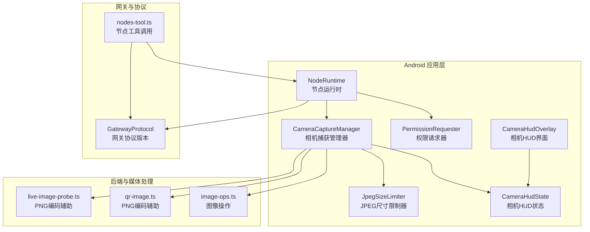
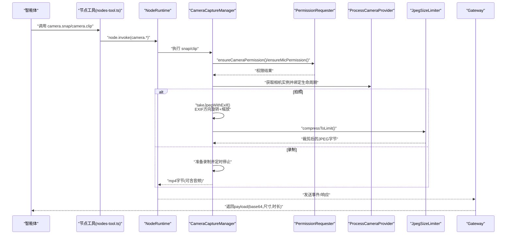
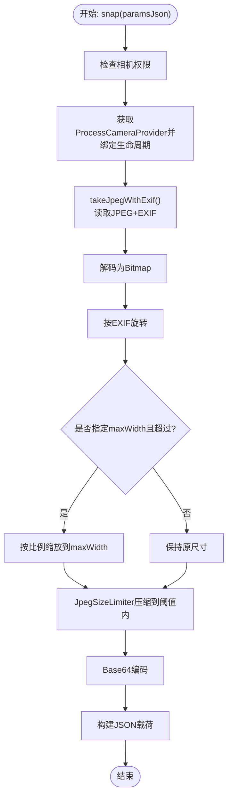
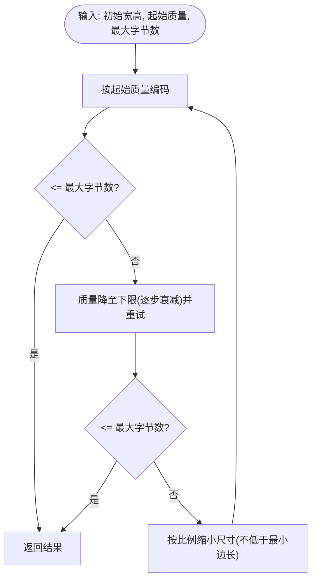
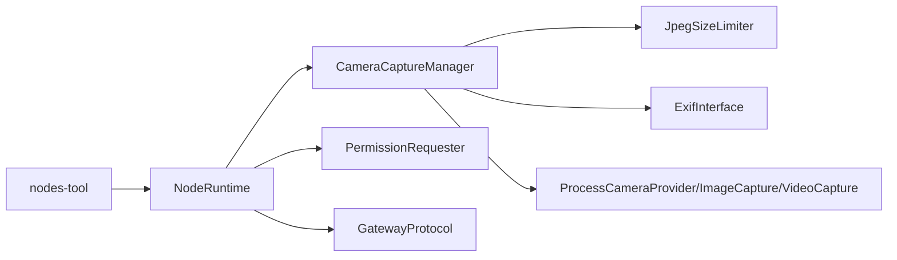

# 相机访问功能

## 目录
1. [简介](#简介)
2. [项目结构](#项目结构)
3. [核心组件](#核心组件)
4. [架构总览](#架构总览)
5. [详细组件分析](#详细组件分析)
6. [依赖关系分析](#依赖关系分析)
7. [性能考量](#性能考量)
8. [故障排查指南](#故障排查指南)
9. [结论](#结论)
10. [附录](#附录)

## 简介
本文件面向 OpenClaw Android 平台的相机访问功能，系统化阐述相机 API 使用、图像捕获流程与实时预览机制，解析相机控制器实现原理、参数配置、自动对焦与曝光控制策略，以及权限管理、硬件检测与兼容性处理。同时给出相机与网关的数据传输协议、图像压缩与实时传输优化方案，并覆盖安全与隐私保护要点。

## 项目结构
Android 相机相关代码主要位于应用模块中，围绕“相机控制器”“权限请求器”“负载压缩器”“UI HUD”等模块协作完成从设备到网关的完整链路。下图概览关键文件与职责：

## 核心组件
- 相机捕获管理器：负责权限校验、相机选择、拍照与视频录制、EXIF 方向旋转、尺寸缩放、JPEG 压缩与负载封装。
- 权限请求器：统一处理相机与麦克风权限申请、拒绝后的引导跳转设置页。
- JPEG 尺寸限制器：在保证质量与最小尺寸的前提下，二分搜索式地降低分辨率与质量，确保负载不超过阈值。
- 节点运行时：作为入口聚合相机、屏幕录制、位置等能力，维护与网关的连接与事件。
- HUD 状态与界面：提供拍照/录制/成功/错误提示与闪光反馈。
- 网关协议：固定协议版本号，配合节点工具调用完成跨平台一致的命令语义。

## 架构总览
下图展示从智能体发起到相机捕获再到网关传输的整体流程：

## 详细组件分析

### 相机捕获管理器（CameraCaptureManager）
- 职责
  - 权限保障：检查并请求相机与麦克风权限。
  - 设备选择：根据前置/后置参数选择对应摄像头。
  - 图像捕获：拍照（JPEG）与视频录制（MP4），支持可选音频。
  - EXIF 处理：读取方向信息并旋转位图，避免显示倒置。
  - 尺寸与质量：按最大宽度缩放，结合 JPEG 尺寸限制器动态调整质量与分辨率。
  - 负载封装：将二进制数据进行 Base64 编码，返回统一 JSON 结构。
- 关键流程
  - 拍照：绑定生命周期 → 拍照并读取 EXIF → 旋转 → 按需缩放 → 压缩至阈值以下 → Base64 包装。
  - 录制：绑定生命周期 → 准备录制 → 定时停止 → 等待最终事件 → 读取文件 → Base64 包装。
- 参数解析
  - `facing`：front/back
  - `quality`：0~1
  - `maxWidth`：像素
  - `durationMs`：毫秒
  - `includeAudio`：布尔
- 错误处理
  - 权限缺失抛出明确错误码前缀，便于上层识别。
  - 录制超时与失败均转换为可读错误。

### JPEG 尺寸限制器（JpegSizeLimiter）
- 策略
  - 先尝试以起始质量编码；若仍超限，则逐步降低质量；若仍超限，则按比例缩小尺寸，重复质量尝试。
  - 限制最小尺寸与质量下限，防止过度压缩导致不可接受画质。
- 输出
  - 返回最终字节、宽高与实际质量，用于载荷组装。

### 权限请求器（PermissionRequester）
- 功能
  - 统一申请相机与麦克风权限；对需要理由弹窗的情况先提示再申请。
  - 对被永久拒绝的权限，引导用户前往系统设置页面开启。
- 协作
  - 与相机管理器配合，在拍照/录音前进行权限校验与申请。

### 节点运行时与网关交互
- 运行时聚合相机、屏幕录制、位置等能力，维护与网关的连接状态与事件。
- 通过节点工具调用 `camera.list`/`camera.snap`/`camera.clip`，将命令转发至 NodeRuntime，再由相机管理器执行并回传 payload。

### HUD 状态与界面
- HUD 状态枚举：Photo/Recording/Success/Error。
- 界面组件：基于状态与令牌触发短暂闪光效果与消息展示，提升用户感知。

### 网关协议与数据传输
- 协议版本：固定常量，确保客户端与网关一致性。
- 数据格式：相机 payload 采用 JSON 字符串，包含 format/base64/尺寸/时长/音频标记等字段，便于上层统一处理。

## 依赖关系分析
- 组件耦合
  - NodeRuntime 依赖 CameraCaptureManager 与 PermissionRequester，形成“运行时-控制器-权限”的清晰分层。
  - CameraCaptureManager 内部依赖 CameraX（ProcessCameraProvider、ImageCapture、VideoCapture）、ExifInterface、JpegSizeLimiter。
- 外部依赖
  - 网关协议版本常量与节点工具调用链路，确保跨平台命令一致性。
  - 后端媒体处理脚本（PNG 编码辅助）用于对比与参考，Android 主要使用 JPEG 流程。

## 性能考量
- 拍照路径
  - 预缩放：在 JPEG 编码前按目标宽度缩放，减少后续压缩成本。
  - 二分搜索：先质量后尺寸，优先在质量上收敛，再降采样，兼顾体积与画质。
  - Base64 限制：预留约 4/3 的膨胀系数，确保整体负载不超过 5MB。
- 录制路径
  - 默认短时长，避免产生过大的 MP4 载荷；如需长时录制，建议在上层做分段处理。
- 后端参考
  - PNG 编码辅助脚本展示了无损/有损压缩的思路，Android 侧以 JPEG 为主，遵循相同“先质量后尺寸”的优化策略。

## 故障排查指南
- 权限问题
  - 现象：抛出 `CAMERA_PERMISSION_REQUIRED`/`MIC_PERMISSION_REQUIRED`。
  - 排查：确认已在运行时请求相机/麦克风权限；若被永久拒绝，引导用户前往设置页开启。
- 相机不可用
  - 现象：相机未就绪或绑定失败。
  - 排查：确保生命周期拥有者有效；检查相机选择参数（front/back）与设备可用性。
- 录制失败/超时
  - 现象：录制 finalize 超时或失败。
  - 排查：缩短时长、关闭音频、检查存储空间与后台限制。
- 载荷过大
  - 现象：Base64 超过 5MB。
  - 排查：降低质量、减小最大宽度、必要时分帧/分段上传。
- EXIF 旋转异常
  - 现象：图片方向不正确。
  - 排查：确认 EXIF 读取与矩阵旋转逻辑正常；必要时在上层补充方向修正。

## 结论
OpenClaw Android 相机访问功能以 CameraX 为核心，结合权限管理、EXIF 处理、尺寸与质量双维度压缩，实现了稳定高效的图像与视频捕获链路。通过统一的节点工具调用与网关协议，确保跨平台一致性与可扩展性。在性能与体验之间取得平衡的同时，严格遵循 5MB 载荷限制与安全隐私策略，满足智能体工作流对多媒体内容的需求。

## 附录
- 参数与行为参考
  - 相机节点文档（相机命令、参数与 CLI 辅助工具）
  - Android 平台相机命令说明
- 相关实现参考
  - 后端媒体处理脚本（PNG 编码辅助）
  - 图像操作工具（HEIC 转 JPEG、透明度检测、PNG 重采样）