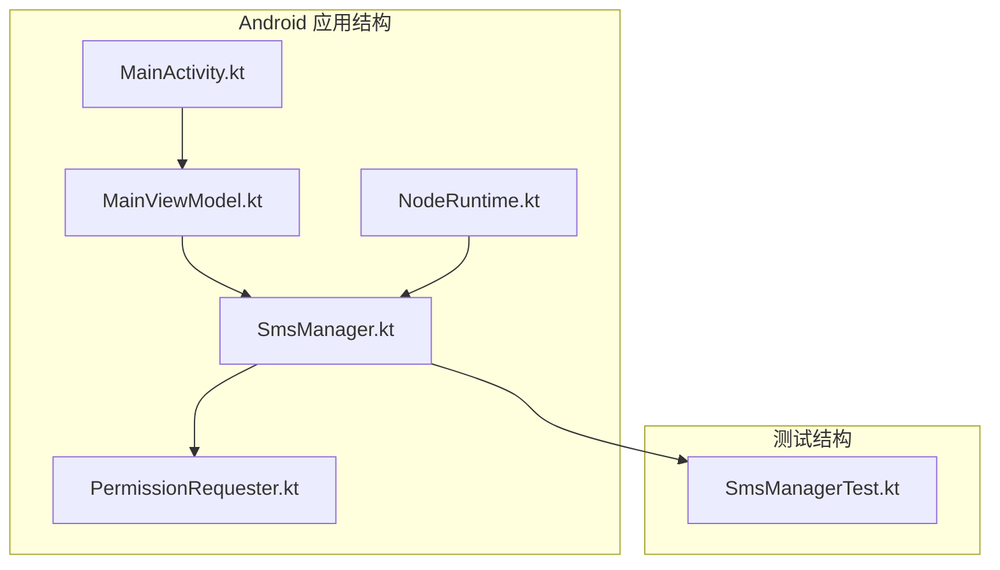
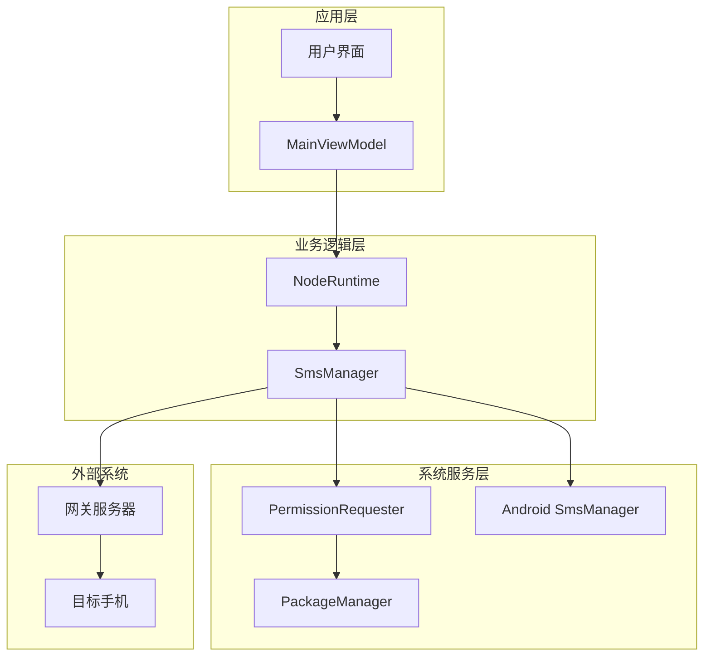
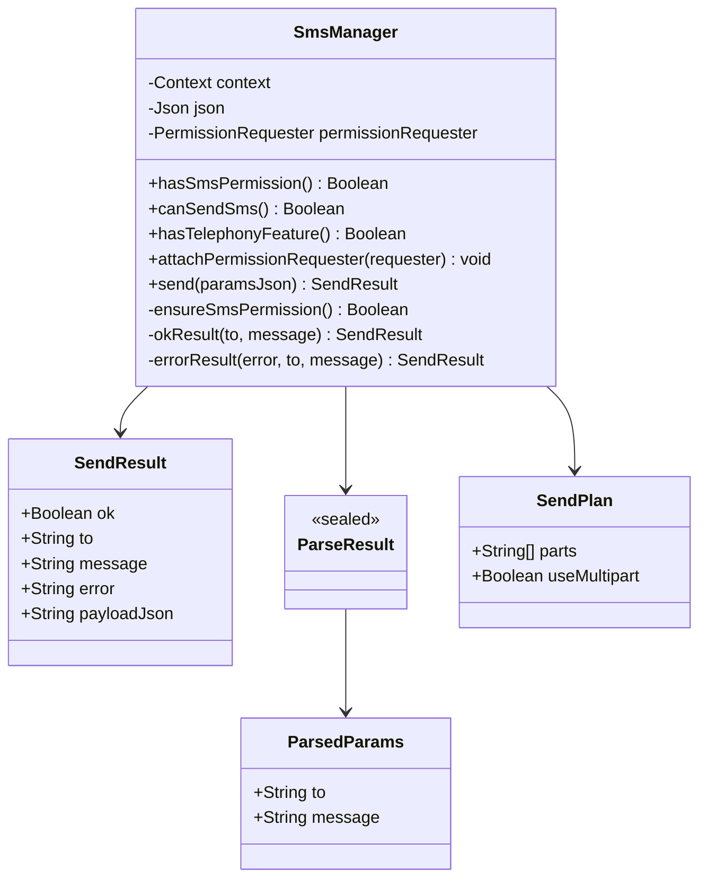
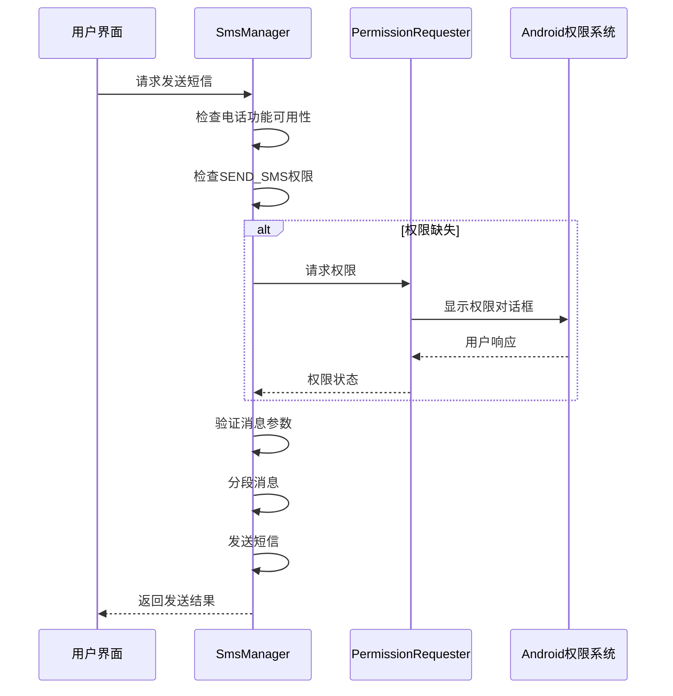
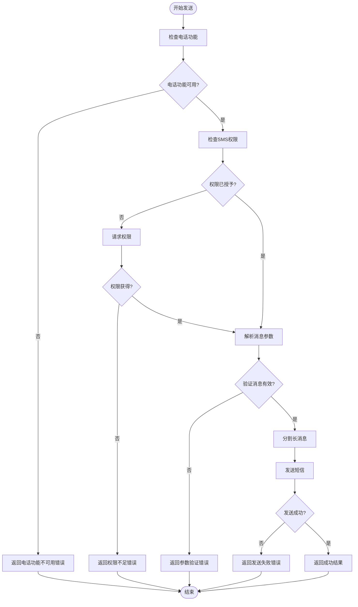
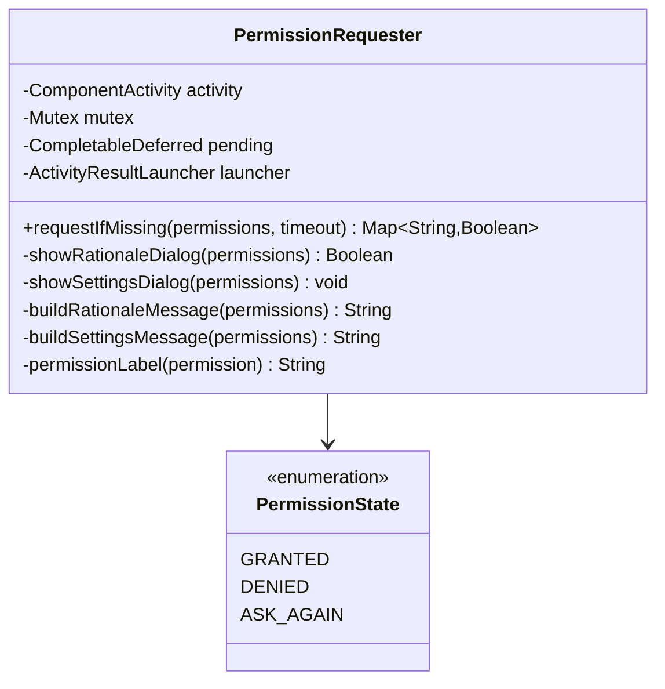
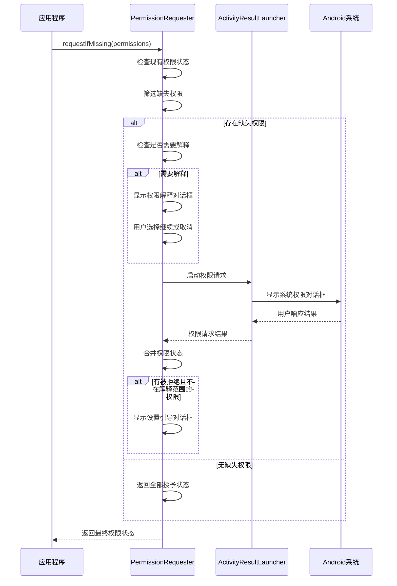
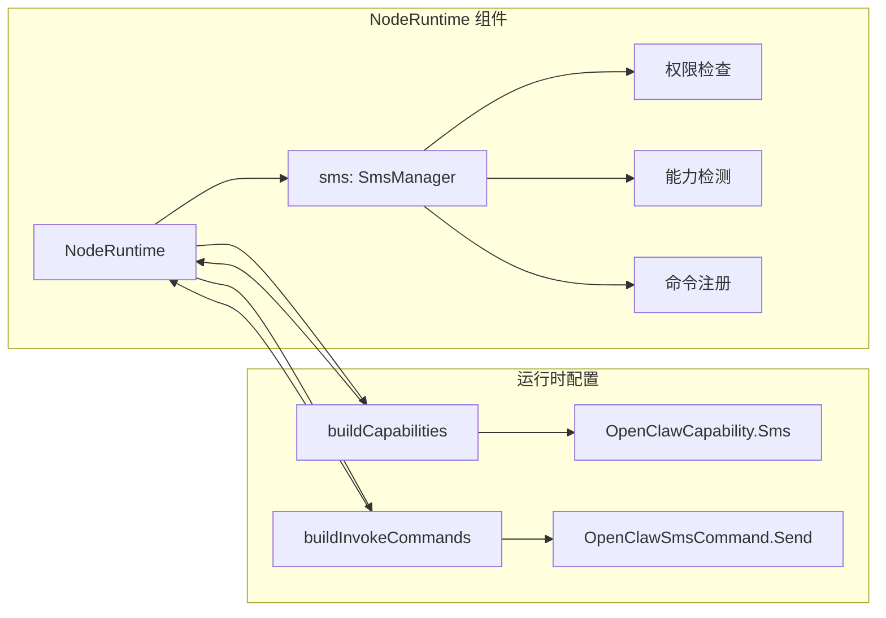
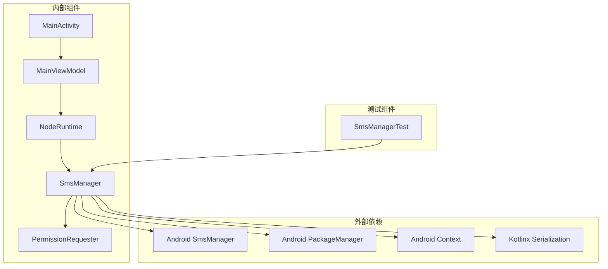

# 短信支持功能

## 目录
1. [简介](#简介)
2. [项目结构](#项目结构)
3. [核心组件](#核心组件)
4. [架构概览](#架构概览)
5. [详细组件分析](#详细组件分析)
6. [依赖关系分析](#依赖关系分析)
7. [性能考虑](#性能考虑)
8. [故障排除指南](#故障排除指南)
9. [结论](#结论)

## 简介

OpenClaw Android 短信支持功能是一个可选的通信模块，允许设备通过 Android 系统的 SMS API 发送文本消息。该功能实现了完整的权限管理、消息验证、分段发送和错误处理机制，为 OpenClaw 生态系统提供了可靠的移动通信能力。

短信功能采用模块化设计，独立于主应用运行时，通过权限请求器实现动态权限获取，确保在运行时根据设备能力和用户授权状态进行智能决策。

## 项目结构

OpenClaw Android 短信功能位于应用的 `apps/android/app/src/main/java/ai/openclaw/android/node/` 目录下，主要包含以下关键文件：

## 核心组件

### SmsManager 类

SmsManager 是短信功能的核心类，负责处理所有与短信发送相关的操作。它实现了完整的权限检查、参数验证、消息分段和结果处理机制。

**主要特性：**
- 权限状态检查和动态权限请求
- 消息参数的严格验证和清理
- 自动消息分段以适应短信长度限制
- 完整的错误处理和状态报告
- JSON 格式的标准化响应构建

### PermissionRequester 类

PermissionRequester 提供了统一的权限管理系统，支持动态权限请求、权限状态检查和用户交互流程。

**核心功能：**
- 多权限批量请求
- 运行时权限合理性说明
- 系统设置权限引导
- 权限状态合并和验证

### NodeRuntime 集成

NodeRuntime 将 SmsManager 集成为应用运行时的一部分，负责：
- 权限状态监控和更新
- 能力检测和命令注册
- 网关通信协议集成
- 生命周期管理

## 架构概览

短信功能采用分层架构设计，确保各组件职责清晰、耦合度低：

## 详细组件分析

### SmsManager 实现分析

SmsManager 类采用了函数式编程和密封类的设计模式，提供了类型安全的错误处理机制：

#### 权限管理机制

短信功能实现了多层次的权限检查和管理：

#### 消息发送流程

短信发送过程包含多个验证步骤和错误处理机制：

### 权限请求器实现

PermissionRequester 提供了完整的权限管理解决方案：

#### 权限请求流程

### NodeRuntime 集成分析

NodeRuntime 将短信功能无缝集成到应用的整体架构中：

## 依赖关系分析

短信功能的依赖关系相对简单但层次清晰：

## 性能考虑

短信功能在设计时充分考虑了性能和用户体验：

### 内存管理
- 使用 `@Volatile` 注解确保权限请求器实例的线程安全
- 采用惰性初始化避免不必要的资源消耗
- 及时释放临时对象和集合

### 异步处理
- 所有权限请求都使用协程异步处理
- 避免阻塞主线程，保持 UI 流畅
- 使用超时机制防止无限等待

### 错误恢复
- 实现分级错误处理，区分可恢复和不可恢复错误
- 提供详细的错误信息便于调试
- 支持重试机制和状态回滚

## 故障排除指南

### 常见问题及解决方案

#### 权限相关问题
- **问题**: 应用无法发送短信
- **原因**: 缺少 `SEND_SMS` 权限
- **解决**: 检查权限状态，重新触发权限请求

#### 设备兼容性问题
- **问题**: 在某些设备上无法使用短信功能
- **原因**: 设备不支持电话功能
- **解决**: 检查 `hasTelephonyFeature()` 返回值

#### 网络连接问题
- **问题**: 短信发送后无法确认状态
- **原因**: 网关连接中断
- **解决**: 检查网关连接状态，重新建立连接

## 结论

OpenClaw Android 短信支持功能展现了现代移动应用开发的最佳实践：

### 设计优势
- **模块化设计**: SmsManager 独立于主应用运行时，便于维护和测试
- **类型安全**: 使用密封类和数据类确保编译时类型检查
- **异步处理**: 全面采用协程和异步模式提升性能
- **错误处理**: 完善的错误分类和处理机制

### 功能完整性
- **权限管理**: 动态权限请求和状态监控
- **消息处理**: 参数验证、自动分段和格式化
- **状态跟踪**: 完整的成功/失败状态报告
- **测试覆盖**: 全面的单元测试确保代码质量

### 用户体验
- **透明性**: 清晰的错误信息和状态反馈
- **可靠性**: 稳定的连接和错误恢复机制
- **安全性**: 最小权限原则和用户控制

短信功能作为 OpenClaw 生态系统的重要组成部分，为用户提供了可靠、安全、易用的移动通信能力，同时保持了系统的整体稳定性和可扩展性。