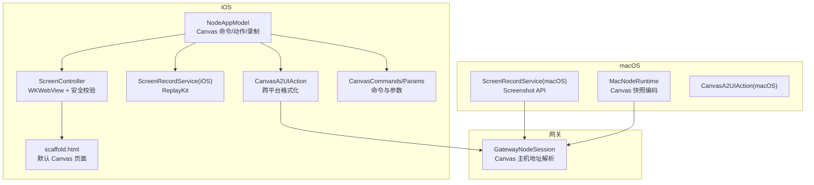
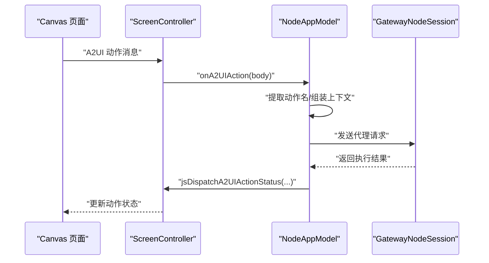
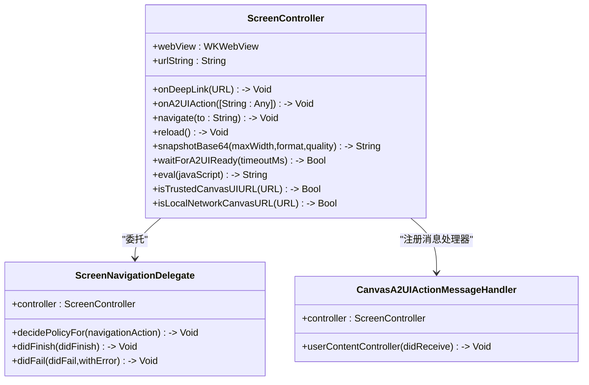
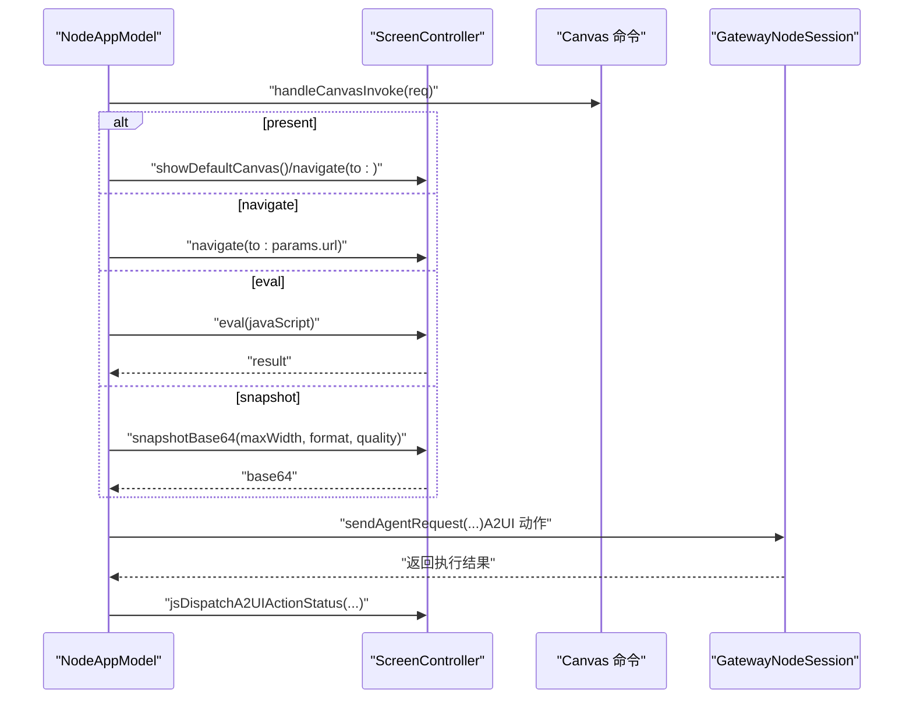
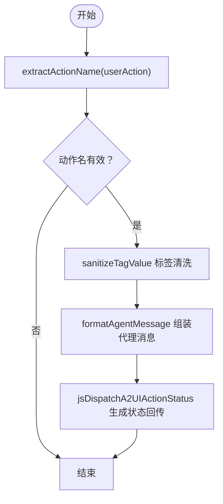
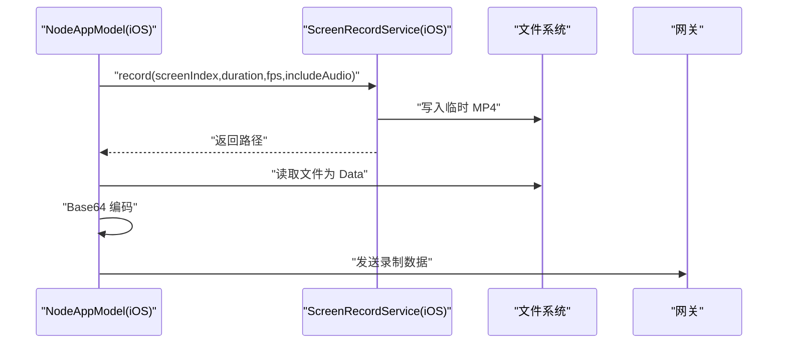
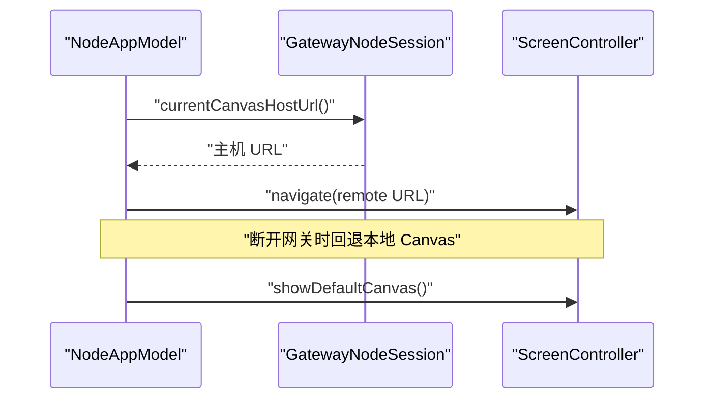
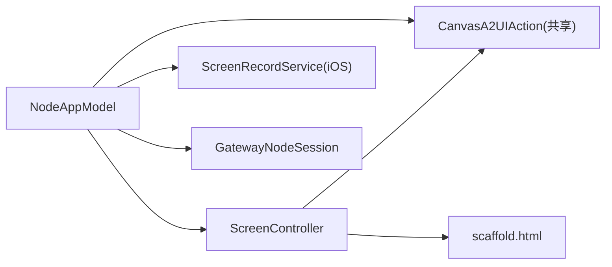

# Canvas 图形界面

## 目录
1. [简介](#简介)
2. [项目结构](#项目结构)
3. [核心组件](#核心组件)
4. [架构总览](#架构总览)
5. [详细组件分析](#详细组件分析)
6. [依赖关系分析](#依赖关系分析)
7. [性能考量](#性能考量)
8. [故障排查指南](#故障排查指南)
9. [结论](#结论)
10. [附录](#附录)

## 简介
本文件面向 OpenClaw iOS Canvas 图形界面，系统性阐述其技术实现，包括：
- 屏幕捕获与录制：iOS 使用 ReplayKit，macOS 使用 Screenshot API，统一输出 MP4 并进行 Base64 编码回传。
- 图形渲染与 Canvas 视图：基于 WKWebView 承载内置 `scaffold.html`，支持调试状态注入、滚动行为控制与安全来源校验。
- 用户交互处理：通过 A2UI 动作消息桥接，将 Canvas 内部按钮等点击事件转化为标准化的代理消息并反馈执行结果。
- 与 macOS 网关同步：通过网关会话管理 Canvas 主机地址、自动切换本地默认 Canvas 或远程 Canvas，并在连接断开时回退到本地 Canvas。

## 项目结构
围绕 Canvas 的关键文件分布如下：
- iOS 端
  - `ScreenController`：负责 WebView 初始化、导航、快照、A2UI 消息处理与安全来源校验。
  - `NodeAppModel`：应用模型，桥接 Canvas 命令、A2UI 动作转发至网关、屏幕录制调用与状态管理。
  - `ScreenRecordService`（iOS）：基于 ReplayKit 的屏幕录制服务。
  - `CanvasA2UIAction`（共享）：跨平台 A2UI 行为格式化与状态回传 JS 片段生成。
  - `CanvasCommands` / `CanvasCommandParams`（共享）：Canvas 命令与参数定义。
  - `scaffold.html`（共享资源）：Canvas 默认页面骨架，包含调试状态 UI 与基础样式。
- macOS 端
  - `ScreenRecordService`（macOS）：基于 Screenshot API 的录制实现。
  - `MacNodeRuntime`：Canvas 快照编码（PNG/JPEG）与尺寸缩放逻辑。
  - `CanvasA2UIAction`（macOS）：与 iOS 共享的 A2UI 行为处理。

## 核心组件
- `ScreenController`（iOS）
  - 初始化 WKWebView，配置非持久化网站数据存储与用户内容控制器，注册 A2UI 动作处理器。
  - 提供 `navigate`/`reload`/`showDefaultCanvas` 等导航能力；支持调试状态注入与滚动行为控制。
  - 提供 `snapshotPNGBase64`/`snapshotBase64` 快照接口，支持 PNG/JPEG 格式与质量控制。
  - 安全校验：`isTrustedCanvasUIURL` 与 `isLocalNetworkCanvasURL` 限制来源范围。
- `NodeAppModel`（iOS）
  - 注入 `ScreenController` 与 `ScreenRecordService`，桥接 Canvas 命令（`present`/`navigate`/`eval`/`snapshot`）。
  - 处理 A2UI 动作：提取动作名、组装代理消息、发送至网关并回传执行状态。
  - 自动切换 Canvas：连接网关时自动打开远程 Canvas，断开时回退本地 Canvas。
- `CanvasA2UIAction`（共享）
  - 统一提取动作名、标签值清洗、JSON 紧凑化与代理消息格式化。
  - 生成 JS 片段以向 Canvas 回传动作执行状态。
- `CanvasCommands` / `CanvasCommandParams`（共享）
  - 定义 `canvas.present`/`canvas.navigate`/`canvas.eval`/`canvas.snapshot` 等命令与参数。
- `scaffold.html`（共享资源）
  - 默认 Canvas 页面骨架，包含调试状态容器、画布元素与基础样式，支持平台差异化背景。

## 架构总览
Canvas 在 iOS 上采用“WebView 承载 + 应用模型桥接 + 网关通信”的分层设计：
- 视图层：`ScreenController` 管理 WKWebView 生命周期与安全策略。
- 控制层：`NodeAppModel` 负责命令解析、A2UI 动作处理、录制流程与状态同步。
- 协议层：`CanvasCommands`/`Params` 定义命令契约；`CanvasA2UIAction` 统一动作语义。
- 数据流：Canvas 页面通过 A2UI 动作消息触发 `NodeAppModel`，后者经网关发送代理请求并回传状态；录制与快照通过各自服务完成并回传数据。

## 详细组件分析

### ScreenController 分析
- 初始化与安全
  - 配置 WKWebView，设置非持久化网站数据存储，注册 `CanvasA2UIActionMessageHandler`，限制仅来自受信本地文件或局域网 URL 的 A2UI 动作。
  - 通过 `isTrustedCanvasUIURL` 与 `isLocalNetworkCanvasURL` 进行来源白名单校验。
- 导航与滚动
  - `navigate`/`reload` 支持加载内置 `scaffold.html` 或外部 URL；根据是否为空决定是否允许滚动与弹跳。
- 快照与调试
  - 提供 `snapshotBase64`/`pngData`/`jpegData` 接口，支持最大宽度与质量参数；支持调试状态注入 JS 片段。
- 与 NodeAppModel 的回调绑定
  - `onDeepLink` 与 `onA2UIAction` 回调由 `NodeAppModel` 注入，用于处理深链与 A2UI 动作。

### NodeAppModel 与 Canvas 命令处理
- Canvas 命令
  - `present`：显示默认 Canvas 或指定 URL。
  - `navigate`：跳转到指定 URL。
  - `eval`：在 Canvas 中执行 JavaScript 并返回结果。
  - `snapshot`：生成快照（PNG/JPEG），默认宽度按格式调整以适配网关负载。
- A2UI 动作处理
  - 解析 `userAction`，提取动作名与上下文，组装代理消息，发送至网关；通过 `jsDispatchA2UIActionStatus` 回传执行结果。
- 自动切换 Canvas
  - 连接网关时自动打开远程 Canvas，断开时回退本地 Canvas。

### CanvasA2UIAction 与跨平台一致性
- 动作提取与清洗
  - `extractActionName` 支持从 `name`/`action` 字段提取动作名，`sanitizeTagValue` 清洗非法字符。
- 代理消息格式化
  - `formatAgentMessage` 生成 `CANVAS_A2UI` 格式字符串，包含动作名、会话、组件与上下文。
- 状态回传 JS
  - `jsDispatchA2UIActionStatus` 生成自定义事件 JS，用于在 Canvas 内部回传执行状态。

### 屏幕录制与数据传输优化
- iOS 录制
  - `ScreenRecordService`（iOS）使用 ReplayKit，支持音频开关、帧率与时长约束，输出 MP4 文件并通过 `NodeAppModel` 返回 Base64。
- macOS 录制
  - `ScreenRecordService`（macOS）使用 Screenshot API，支持多显示器选择、帧间隔与音频采集，输出 MP4 文件。
- 传输优化
  - `NodeAppModel` 对录制结果进行 Base64 编码并封装为统一负载，便于网关侧传输与处理。
  - Canvas 快照默认宽度按格式调整，避免超大负载影响网关性能。

### Canvas 与 macOS 网关同步机制
- Canvas 主机解析
  - `NodeAppModel` 通过 `GatewayNodeSession` 获取 Canvas 主机 URL，并自动拼接平台参数。
- 自动切换策略
  - 连接网关时自动打开远程 Canvas；断开时回退本地 Canvas。
- 错误恢复
  - 导航失败与加载异常时记录错误文本；A2UI 动作执行失败时回传错误信息。

## 依赖关系分析
- 组件耦合
  - `NodeAppModel` 依赖 `ScreenController` 与 `ScreenRecordService`；`ScreenController` 依赖 `CanvasA2UIAction` 与 `scaffold.html`。
  - `CanvasA2UIAction` 为共享模块，确保 iOS/macOS 行为一致。
- 外部依赖
  - iOS：ReplayKit（录制）、WebKit（Canvas）、AVFoundation（媒体写入）。
  - macOS：Screenshot API（录制）、NSImage/NSBitmapImageRep（快照编码）。

## 性能考量
- 快照优化
  - 默认快照宽度按格式调整（PNG 900，JPEG 1600），避免超出网关客户端最大负载阈值。
  - JPEG 压缩质量在 0.1~1.0 区间内裁剪，兼顾清晰度与体积。
- 录制参数约束
  - iOS/macOS 录制时长与帧率均做边界约束，防止资源过度占用。
- 渲染与滚动
  - 默认 Canvas 不启用滚动，避免触摸事件穿透；外部页面允许滚动与弹跳。

## 故障排查指南
- A2UI 动作未生效
  - 检查来源 URL 是否为受信本地文件或局域网地址；确认 `CanvasA2UIActionMessageHandler` 已注册。
  - 确认 `NodeAppModel` 的 `onA2UIAction` 回调已注入。
- Canvas 无法加载
  - 检查 `navigate`/`reload` 的 URL 是否有效；导航失败时会记录错误文本。
- 录制失败
  - iOS：确认已授予屏幕录制权限；检查格式必须为 mp4。
  - macOS：确认显示器索引合法；检查是否有帧被捕获。
- 快照为空或编码失败
  - 检查截图配置与图像编码路径；确认返回 Base64 成功。

## 结论
OpenClaw iOS Canvas 通过 WKWebView 承载默认 Canvas 页面，结合 `NodeAppModel` 的命令与动作桥接、ReplayKit 录制与跨平台 A2UI 行为规范，实现了稳定、可扩展且高性能的图形界面方案。在与 macOS 网关同步方面，通过自动切换与错误恢复策略保障了用户体验的一致性与可靠性。

## 附录
- 代码示例路径（不直接展示代码内容）
  - 屏幕捕获权限与录制流程：`NodeAppModel.swift`
  - Canvas 命令处理（`present`/`navigate`/`eval`/`snapshot`）：`NodeAppModel.swift`
  - A2UI 动作提取与代理消息格式化：`CanvasA2UIAction.swift`
  - Canvas 默认页面骨架与调试状态容器：`scaffold.html`
  - macOS Canvas 快照编码与尺寸缩放：`MacNodeRuntime.swift`
  - 测试用例（Canvas 命令与导航）：`NodeAppModelInvokeTests.swift`