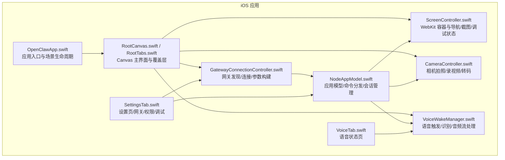
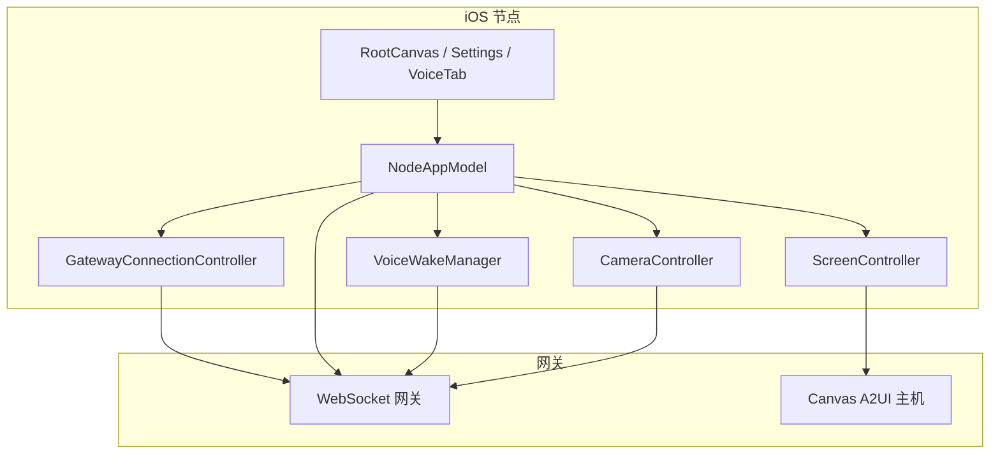
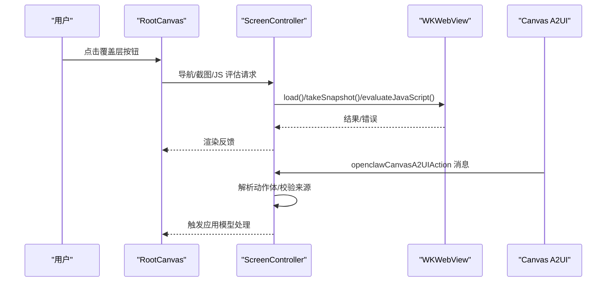
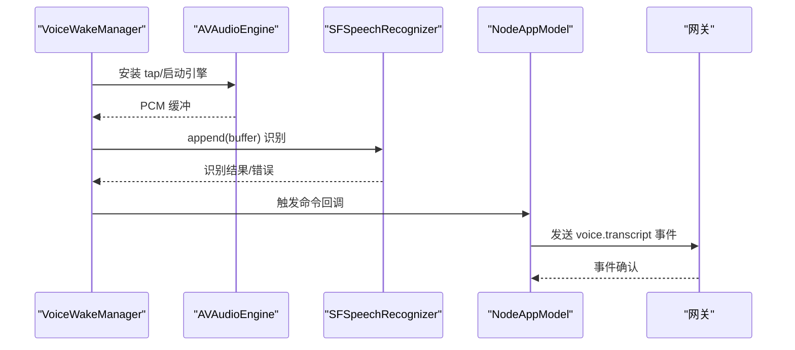
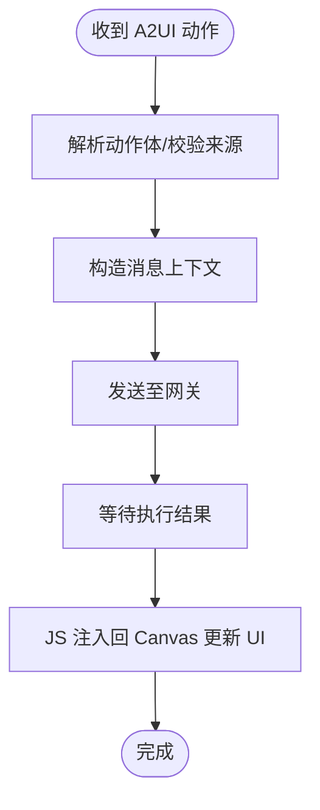
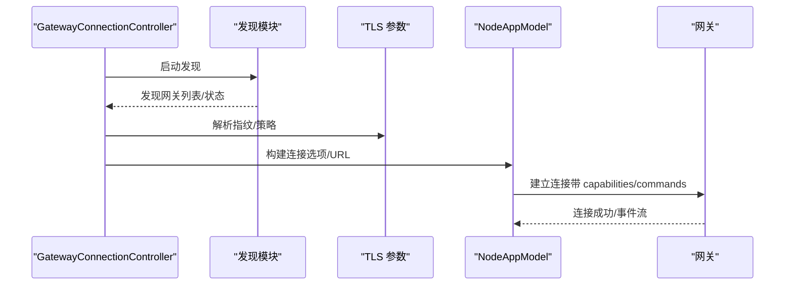
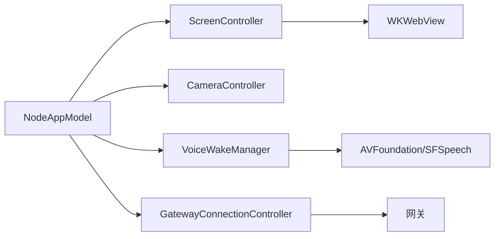

# iOS 应用

## 目录
1. [简介](#简介)
2. [项目结构](#项目结构)
3. [核心组件](#核心组件)
4. [架构总览](#架构总览)
5. [详细组件分析](#详细组件分析)
6. [依赖关系分析](#依赖关系分析)
7. [性能考虑](#性能考虑)
8. [故障排查指南](#故障排查指南)
9. [结论](#结论)
10. [附录](#附录)

## 简介
本文件面向 OpenClaw iOS 节点应用，系统化梳理其架构设计与关键实现，覆盖以下主题：
- Canvas 图形界面与 Web 内容承载
- 语音触发系统（Voice Wake）
- Canvas 表面渲染与交互（截图、JS 评估、A2UI）
- 与 macOS 网关的连接机制与同步
- 权限管理（相机、麦克风、定位、屏幕录制）
- 网络通信协议与后台任务处理
- 开发环境配置、证书与 App Store 发布流程
- 性能优化策略与常见问题排查

该应用采用 SwiftUI 构建用户界面，结合 WebKit 承载 Canvas，通过 WebSocket 与网关通信，并以独立的节点能力集进行受控调用。

## 项目结构
iOS 应用位于 `apps/ios`，采用 Swift 包与 XcodeGen 生成工程，核心目录组织如下：
- Sources：应用源码，按功能域分层（Screen、Camera、Voice、Gateway、Settings、Model、Status、Voice 等）
- Tests：单元测试与集成测试
- fastlane：自动化发布与上传配置
- `project.yml`：Xcode 工程定义（目标、依赖、构建脚本、Info.plist 字段等）

## 核心组件
- 应用入口与场景生命周期：负责初始化应用模型与网关控制器，注入到根视图并响应场景状态变化。
- Canvas 主界面：提供覆盖层按钮（聊天、设置、Talk 模式）、状态指示器、语音触发提示与相机闪光效果。
- ScreenController：封装 WKWebView，负责导航、截图、JS 评估、A2UI 动作拦截、本地网络校验与调试状态注入。
- CameraController：封装 AVFoundation，提供拍照、录视频、质量/时长限制、转码与权限检查。
- VoiceWakeManager：封装 SFSpeech 与 AVAudioEngine，实现唤醒词检测、音频缓冲队列、识别回调与状态管理。
- GatewayConnectionController：封装 Bonjour/mDNS 发现、TLS 参数解析、URL 构造、自动连接与能力/命令集构建。
- NodeAppModel：应用模型，统一调度 Canvas、Camera、Voice、Location、Screen 录制与网关会话；处理命令分发与错误回传。
- 设置与语音页：集中管理节点名称、实例 ID、网关连接、权限开关、调试日志与唤醒词配置。

## 架构总览
下图展示了 iOS 节点应用与网关之间的交互路径、权限与后台任务的关系：

## 详细组件分析

### Canvas 图形界面与渲染
- ScreenController 负责：
  - 导航：支持本地文件与远端 URL 加载；默认加载内置 Canvas 脚手架
  - 截图：支持 PNG/JPEG，可指定最大宽度与质量
  - JS 评估：在 WebView 中执行任意 JavaScript 并返回结果
  - A2UI 动作拦截：从 Canvas 注入的消息中提取动作体，转发给应用模型
  - 本地网络校验：仅允许来自本地网络或受信 Canvas URL 的 A2UI 动作
  - 调试状态：向 Canvas 注入调试状态（标题/副标题），用于可视化诊断
- RootCanvas 提供覆盖层 UI（聊天、设置、Talk 模式按钮），并在背景态时禁用部分高耗能命令。

### 语音触发系统（Voice Wake）
- VoiceWakeManager：
  - 使用 AVAudioEngine 在输入节点安装音频 tap，将 PCM 缓冲复制到队列
  - 使用 SFSpeechRecognizer 进行实时识别，匹配唤醒词
  - 支持暂停/恢复，避免与其他音频采集冲突
  - 状态文本与触发命令通过观察者通知 UI
- 与网关同步：
  - 启动后订阅服务器事件“voicewake.changed”，拉取/更新唤醒词
  - 可通过网关接口设置全局唤醒词

### Canvas 表面渲染与交互（A2UI）
- NodeAppModel 处理来自 Canvas 的 A2UI 动作：
  - 解析动作体，构造消息上下文，发送至网关
  - 将执行结果通过 JS 注入回 Canvas，更新 UI
- ScreenController 对 A2UI 动作进行来源校验（本地网络或受信 Canvas URL），确保安全

### 受控 via openclaw nodes 的连接机制
- GatewayConnectionController：
  - 自动发现：基于 Bonjour/mDNS 与本地网络服务名解析
  - TLS 参数：根据网关指纹或首次信任（TOFU）策略决定是否启用与存储
  - URL 构造：根据主机、端口与 TLS 决策生成 ws/wss
  - 能力与命令集：根据设置动态构建 capabilities 与 commands
- NodeAppModel：
  - 建立网关会话，处理连接/断开/重连
  - 订阅服务器事件，刷新品牌色与主会话键
  - 分发命令：Canvas、Camera、Location、Screen 等

### 权限管理（相机、麦克风、定位、屏幕录制）
- 相机与录音：
  - CameraController 在拍照/录视频前检查授权状态，必要时请求权限
  - 录视频时可选择是否包含音频，若需要音频则同时请求麦克风权限
- 语音唤醒：
  - VoiceWakeManager 请求麦克风与语音识别权限；模拟器不支持
- 定位：
  - NodeAppModel 根据设置模式（关闭/使用时/始终）请求授权，并在后台受限时拒绝相关命令
- 屏幕录制：
  - 通过 ScreenRecordService 与系统录屏 API 集成（具体实现位于 ScreenRecordService）

### 网络通信协议与后台任务
- WebSocket 连接：
  - NodeAppModel 统一发起连接，处理连接/断开/重连与错误回退
  - 事件订阅：订阅服务器事件（如 voicewake.changed）以保持状态同步
- 背景任务：
  - 场景进入后台时，NodeAppModel 标记 isBackgrounded，限制部分前台专用命令
  - 语音唤醒在后台暂停，避免与系统录音冲突

### 开发环境配置、证书与 App Store 发布
- 生成工程与依赖：
  - 使用 XcodeGen 生成 Xcode 工程，依赖 OpenClawKit 与 Swabble
- 代码签名与描述文件：
  - 工程配置包含开发团队、证书与 Provisioning Profile
- fastlane：
  - 提供发布与上传流水线，需配合 App Store Connect 凭证

## 依赖关系分析
- 模块耦合：
  - NodeAppModel 是中枢，协调 Screen、Camera、Voice、Gateway 与系统服务
  - ScreenController 与 VoiceWakeManager 通过 NodeAppModel 间接与网关交互
- 外部依赖：
  - OpenClawKit：跨平台协议、类型与资源
  - SwabbleKit：语音识别与唤醒词匹配
  - AVFoundation/SFSpeech：音频/语音处理
  - WebKit：Canvas 渲染与 JS 交互

## 性能考虑
- Canvas 截图与转码：
  - 默认限制最大宽度与质量，避免超大负载；JPEG/PNG 二选一，PNG 更适合高保真
- 语音识别：
  - 使用音频 tap 队列，避免主线程阻塞；识别结果处理在主线程更新 UI
- 网络重连：
  - 指数回退策略，避免频繁重试造成资源浪费
- 背景态限制：
  - 禁止前台专用命令（Canvas/Camera/Screen），减少后台功耗

## 故障排查指南
- 无法连接网关：
  - 检查发现状态与调试日志；确认主机/端口/TLS 设置；必要时切换手动连接
  - 查看连接 URL 构造与 TLS 参数（指纹/首次信任）
- 语音唤醒无效：
  - 确认麦克风与语音识别权限；模拟器不支持；监听状态文本
  - 检查唤醒词同步：确认网关事件“voicewake.changed”是否生效
- Canvas 无响应或 A2UI 不生效：
  - 校验 A2UI 动作来源（本地网络/受信 URL）；检查 JS 注入与 ready 状态
- 相机/录视频失败：
  - 检查相机/麦克风权限；确认设备存在且可用；注意录视频时长与质量限制
- 定位权限不足：
  - 根据后台需求选择“使用时/始终”；后台仅在“始终”授权下可用

## 结论
OpenClaw iOS 节点应用以 SwiftUI 与 WebKit 为核心，围绕 Canvas、语音与网关三要素构建了完整的交互闭环。通过严格的权限管理、可控的能力集与稳健的网络连接策略，实现了在前台与后台场景下的高效协作。建议在生产环境中持续关注 Canvas 负载、语音识别稳定性与网关事件同步的健壮性。

## 附录
- 开发与构建
  - 生成工程：使用 XcodeGen；安装 SwiftFormat/SwiftLint；运行 fastlane
  - 代码规范：遵循 .swiftformat 与 .swiftlint.yml
- 发布与分发
  - 使用 fastlane 管理 App Store Connect 凭证与上传流程