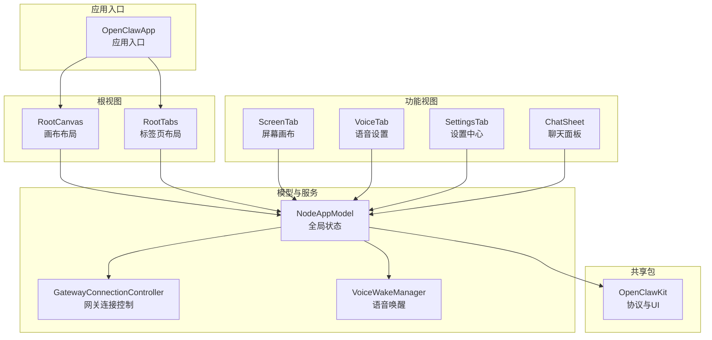
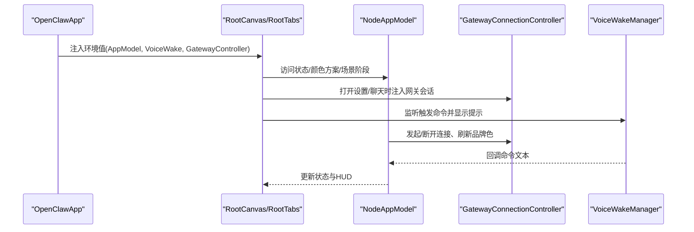
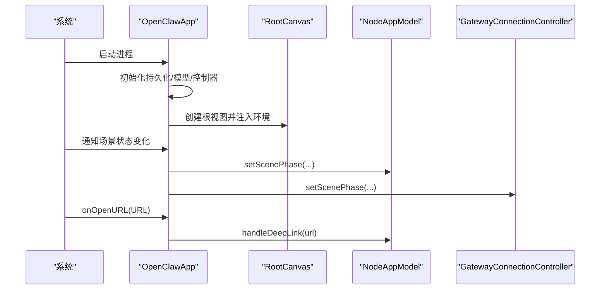
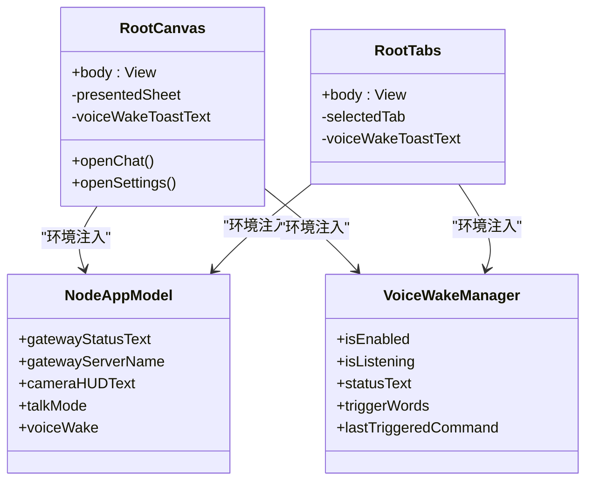
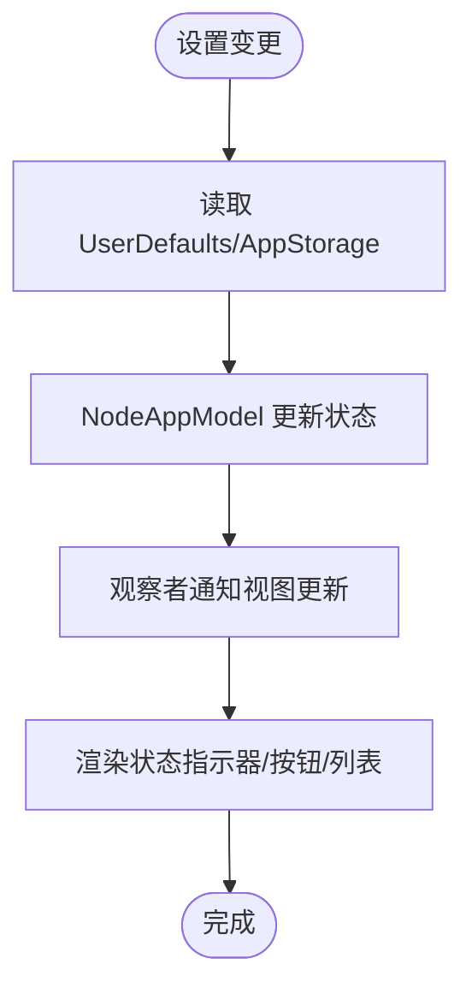
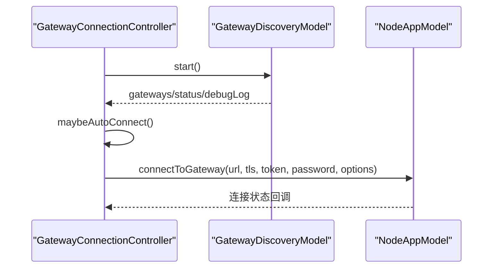
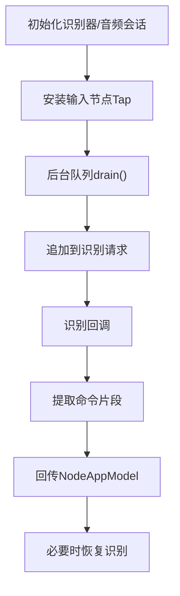
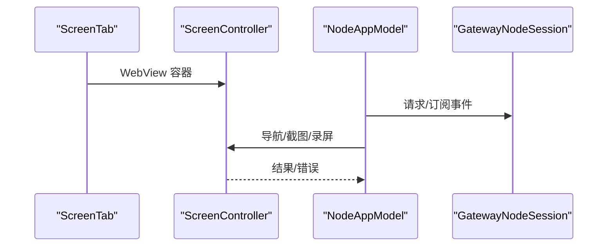
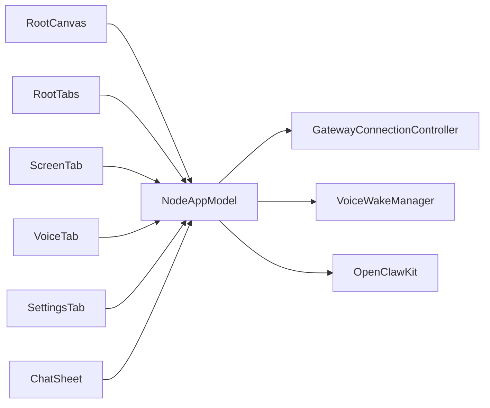

# 应用架构设计

## 目录
1. [简介](#简介)
2. [项目结构](#项目结构)
3. [核心组件](#核心组件)
4. [架构总览](#架构总览)
5. [详细组件分析](#详细组件分析)
6. [依赖关系分析](#依赖关系分析)
7. [性能考虑](#性能考虑)
8. [故障排查指南](#故障排查指南)
9. [结论](#结论)
10. [附录](#附录)

## 简介
本文件面向 OpenClaw iOS 应用，系统性梳理其 SwiftUI 架构设计与实现细节，重点覆盖以下方面：
- 应用启动流程与根视图组织（RootCanvas 与 RootTabs）
- 状态管理与组件间通信机制（环境值注入、@Observable 模式）
- 模块化设计与共享包 OpenClawKit 的集成方式
- 生命周期管理、内存优化与性能监控实践
- 具体代码示例路径，展示视图控制器组织、数据绑定与异步操作处理

## 项目结构
iOS 应用位于 `apps/ios`，采用按功能域分层的目录组织：
- Sources：应用源码，包含入口、根视图、模型、各功能模块（屏幕、语音、设置、聊天等）
- Tests：单元测试与渲染冒烟测试
- fastlane：CI/CD 配置
- 资源与配置：Assets、Info.plist、README、project.yml 等

## 核心组件
- 应用入口 `OpenClawApp`：负责初始化全局状态与网关控制器，并在 WindowGroup 中注入环境值，处理深链入与场景生命周期事件。
- 根视图 `RootCanvas`/`RootTabs`：提供两种主界面布局，统一通过环境值访问 `NodeAppModel` 与 `VoiceWakeManager`，协调状态栏、悬浮按钮、对话与设置面板。
- `NodeAppModel`：@Observable 全局状态容器，封装网关连接、语音唤醒同步、屏幕/相机/位置能力、A2UI 行为与深链处理。
- `GatewayConnectionController`：网关发现、自动连接、TLS 参数解析与连接选项构建。
- `VoiceWakeManager`：语音唤醒识别、音频流采集与命令提取，支持暂停/恢复以配合外部音频录制。
- 功能视图：`ScreenTab`、`VoiceTab`、`SettingsTab`、`ChatSheet` 分别承载屏幕画布、语音设置、系统设置与聊天会话。

## 架构总览
应用采用“单向数据流 + 环境注入”的 SwiftUI 架构：
- 状态集中于 `NodeAppModel`，通过 @Environment 注入到各视图，避免跨层级传递。
- 异步任务与后台连接由 `GatewayConnectionController` 统一调度，`NodeAppModel` 负责业务编排。
- 语音唤醒独立于 UI，通过 `VoiceWakeManager` 在后台线程处理音频流并回调主线程更新状态。
- 视图层仅负责渲染与用户交互，逻辑通过环境值或方法调用触发。

## 详细组件分析

### 应用入口与启动流程
- 初始化顺序：引导持久化、创建 `NodeAppModel` 与 `GatewayConnectionController`，注入到 WindowGroup 的根视图。
- 场景生命周期：监听 scenePhase 变化，同步通知 `NodeAppModel` 与 `GatewayConnectionController`。
- 深链入：通过 onOpenURL 将 URL 交由 `NodeAppModel` 处理，支持代理请求转发。

### 根视图组织：RootCanvas 与 RootTabs
- `RootCanvas`：采用 ZStack 布局，内含屏幕画布与覆盖层按钮（聊天、设置、Talk 模式），顶部状态指示器与语音唤醒提示。
- `RootTabs`：使用 TabView 切换屏幕、语音、设置三个标签页，顶部状态指示器复用统一逻辑。
- 两者均通过环境值访问 `NodeAppModel` 与 `VoiceWakeManager`，确保状态一致性。

### 状态管理与组件通信
- 状态集中：`NodeAppModel` 使用 @Observable，集中管理网关状态、屏幕/相机/位置能力、Talk 模式、语音唤醒偏好等。
- 环境注入：通过 .environment 注入到视图树，实现跨层级访问，避免手动传参。
- 事件驱动：`VoiceWakeManager` 通过回调将命令回传给 `NodeAppModel`；`NodeAppModel` 再通过网关发送事件或执行本地命令。
- 设置联动：`SettingsTab` 通过 AppStorage 与 UserDefaults 同步配置，变更后即时生效。

### 网关连接与自动发现
- 自动发现：`GatewayConnectionController` 基于 mDNS/Bonjour 发现网关，维护发现日志与状态文本。
- 自动连接：根据首选/上次发现 ID 或手动配置，解析 TLS 参数并发起连接。
- 连接选项：动态生成 capabilities 与 commands，结合用户权限决定启用能力。
- 生命周期：场景进入后台时停止发现，前台时恢复。

### 语音唤醒与命令处理
- 音频采集：安装输入节点 Tap，将音频缓冲队列化，后台线程处理，主线程仅做 UI 更新。
- 识别与匹配：SFSpeechRecognizer 实时识别，`VoiceWakeManager` 提取触发词后的命令片段。
- 权限与暂停：请求麦克风与语音识别权限；外部音频录制时暂停识别，结束后恢复。
- 回调处理：将命令文本回传给 `NodeAppModel`，触发网关事件或本地动作。

### 屏幕画布与 A2UI 集成
- `ScreenTab`：通过 `ScreenWebView` 承载 `ScreenController`，实现与网关的 Canvas/A2UI 交互。
- A2UI 行为：`NodeAppModel` 解析并派发 A2UI 动作，必要时导航至 A2UI 主机地址并等待就绪。
- 截图与录屏：提供快照与录屏能力，返回编码后的媒体数据供网关使用。

### 聊天与设置面板
- `ChatSheet`：基于 OpenClawChatUI，通过 IOSGatewayChatTransport 与网关会话交互，支持会话切换与用户强调色。
- `SettingsTab`：集中管理节点信息、网关连接、语音唤醒、相机/位置权限、屏幕防休眠等设置项。

### 共享包 OpenClawKit 的集成
- 平台与产品：iOS 18+、macOS 15+，提供 OpenClawProtocol、OpenClawKit、OpenClawChatUI 三类库。
- 依赖：ElevenLabsKit、Textual（macOS/iOS）。
- 资源：Swift 包资源处理，启用严格并发特性。

## 依赖关系分析
- 组件耦合：`RootCanvas`/`RootTabs` 低耦合，仅依赖环境值；`NodeAppModel` 作为中枢，向上承接视图，向下协调网关与系统能力。
- 外部依赖：OpenClawKit 提供协议与 UI 组件；`VoiceWakeManager` 依赖 AVFAudio/Speech；`ScreenTab` 依赖 WebKit。
- 循环依赖：未见直接循环；异步回调通过闭包与环境值避免强耦合。

## 性能考虑
- 音频处理：`VoiceWakeManager` 在非隔离队列中进行音频缓冲复制与队列化处理，避免阻塞主线程；识别回调在主线程更新 UI。
- 异步重连：`NodeAppModel` 的网关连接采用指数退避与取消令牌，降低频繁重试对系统的影响。
- 屏幕与相机：相机 HUD 与录屏状态通过状态指示器叠加，减少额外视图层级；录屏结果以 Base64 返回，避免磁盘 IO。
- 内存优化：环境值注入减少对象传递；视图层尽量无状态，状态集中在 `NodeAppModel`。

## 故障排查指南
- 语音唤醒不可用：检查麦克风与语音识别权限；查看 `VoiceWakeManager` 的状态文本；确认设备是否为模拟器（不支持）。
- 网关连接失败：查看 `GatewayConnectionController` 的发现日志与状态文本；确认 TLS 参数与主机端口；尝试手动连接。
- 深链入无效：确认 URL 是否被正确解析；检查 `NodeAppModel` 的 `handleDeepLink` 流程与网关连接状态。
- 渲染问题：使用 `SwiftUIRenderSmokeTests` 中的渲染冒烟测试，验证视图层次构建。

## 结论
该 iOS 应用以 SwiftUI 为基础，采用集中式状态管理与环境注入模式，实现了清晰的职责分离与良好的可测试性。通过 OpenClawKit 的模块化设计，应用在多平台间共享协议与 UI 组件，降低了重复开发成本。建议持续关注音频线程安全、网络异常处理与 UI 响应性，以进一步提升稳定性与用户体验。

## 附录
- 代码示例路径（用于定位实现细节）
  - 应用入口与场景生命周期：[OpenClawApp.swift](file://apps/ios/Sources/OpenClawApp.swift#L1-L32)
  - 根视图布局与覆盖层按钮：[RootCanvas.swift](file://apps/ios/Sources/RootCanvas.swift#L28-L92)
  - 标签页布局与状态指示器：[RootTabs.swift](file://apps/ios/Sources/RootTabs.swift#L11-L65)
  - 全局状态容器与命令分发：[NodeAppModel.swift](file://apps/ios/Sources/Model/NodeAppModel.swift#L431-L561)
  - 网关自动发现与连接：[GatewayConnectionController.swift](file://apps/ios/Sources/Gateway/GatewayConnectionController.swift#L116-L223)
  - 语音唤醒识别与暂停恢复：[VoiceWakeManager.swift](file://apps/ios/Sources/Voice/VoiceWakeManager.swift#L214-L243)
  - 屏幕画布与 A2UI 行为：[ScreenTab.swift](file://apps/ios/Sources/Screen/ScreenTab.swift#L1-L26), [NodeAppModel.swift](file://apps/ios/Sources/Model/NodeAppModel.swift#L79-L151)
  - 聊天面板与传输层：[ChatSheet.swift](file://apps/ios/Sources/Chat/ChatSheet.swift#L1-L40)
  - 设置面板与权限联动：[SettingsTab.swift](file://apps/ios/Sources/Settings/SettingsTab.swift#L1-L467)
  - 渲染冒烟测试：[SwiftUIRenderSmokeTests.swift](file://apps/ios/Tests/SwiftUIRenderSmokeTests.swift#L36-L81)