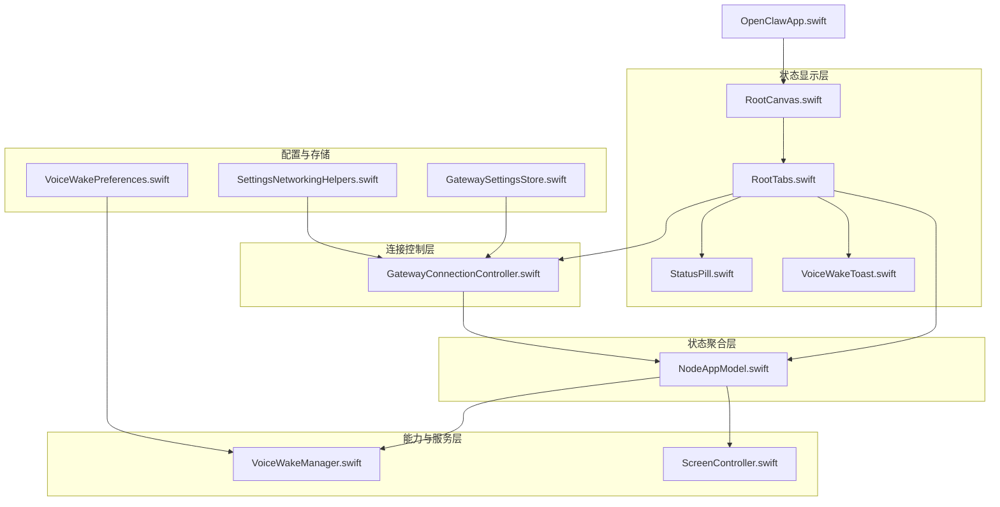
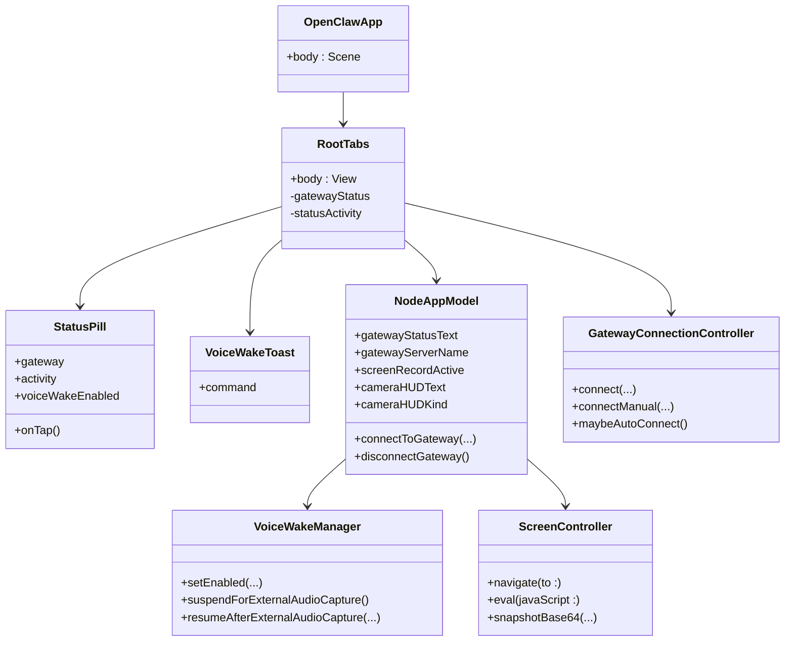
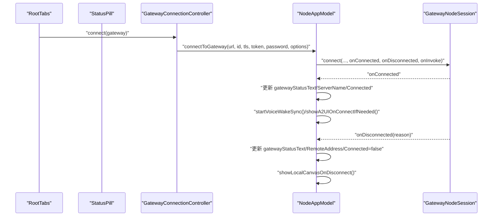
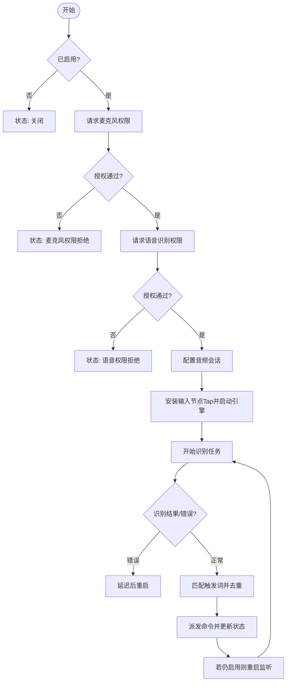
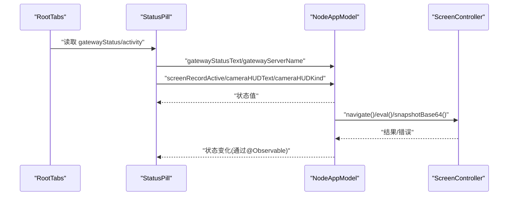
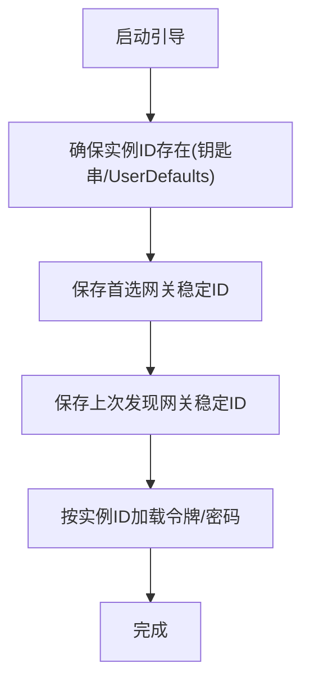
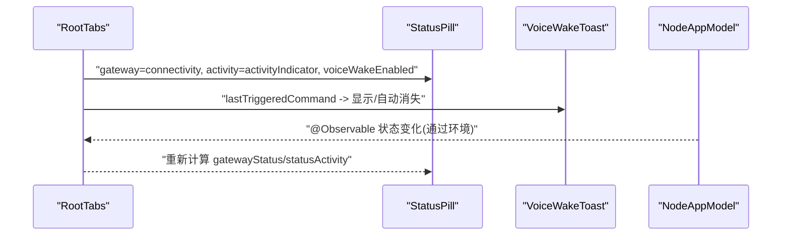
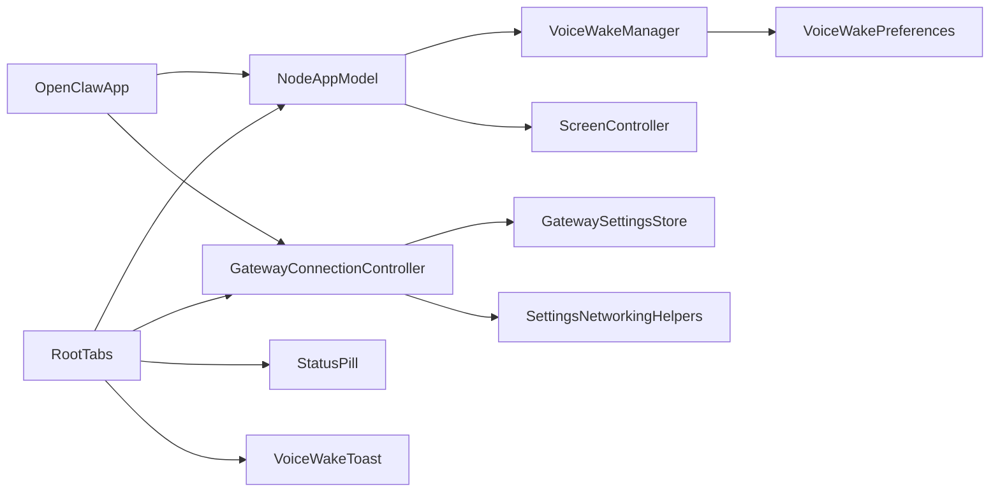

# 状态监控系统

## 目录
1. [简介](#简介)
2. [项目结构](#项目结构)
3. [核心组件](#核心组件)
4. [架构总览](#架构总览)
5. [详细组件分析](#详细组件分析)
6. [依赖关系分析](#依赖关系分析)
7. [性能考虑](#性能考虑)
8. [故障排查指南](#故障排查指南)
9. [结论](#结论)

## 简介
本文件面向 OpenClaw iOS 状态监控系统，围绕 StatusMonitor 的实现进行深入技术说明。内容涵盖系统状态收集（网络连接、语音唤醒、屏幕录制、相机 HUD）、状态数据的存储与管理（偏好与钥匙串持久化、观察者驱动的实时更新）、以及状态在用户界面中的呈现（状态胶囊、活动指示器、语音唤醒提示）。同时提供关键流程的时序图与类图，帮助开发者快速理解并扩展状态监控能力。

## 项目结构
iOS 状态监控相关代码主要位于 `apps/ios/Sources` 下，按功能域划分如下：
- Status：状态胶囊与语音唤醒提示视图
- Model：应用模型与状态聚合（NodeAppModel）
- Gateway：网关发现与连接控制
- Voice：语音唤醒管理
- Screen：画布与屏幕录制控制
- Settings：网络参数解析与辅助
- Gateway 子模块：网关设置存储（钥匙串/偏好）

## 核心组件
- 状态胶囊 StatusPill：以视觉化方式展示网关连接状态、活动指示与语音唤醒开关，支持脉冲动画与无障碍信息输出。
- 活动指示器 Activity：用于显示瞬态任务或状态（如“修复中”、“等待审批”、“屏幕录制中”、“相机操作中”等）。
- 语音唤醒提示 VoiceWakeToast：短时显示触发的语音命令，提升交互反馈。
- 应用模型 NodeAppModel：集中管理网关连接、语音唤醒同步、画布与屏幕录制、相机 HUD、位置权限等状态，并通过 @Observable 提供响应式更新。
- 连接控制器 GatewayConnectionController：负责网关发现、自动连接、TLS 参数解析与连接选项构建。
- 语音唤醒管理 VoiceWakeManager：麦克风与语音识别权限申请、音频引擎配置、识别结果处理与命令提取。
- 画布控制器 ScreenController：Web 内容加载、A2UI 动作消息处理、截图与快照、调试状态注入。
- 配置与存储：SettingsNetworkingHelpers 解析主机端口；GatewaySettingsStore 负责实例 ID、首选/上次发现网关稳定 ID、令牌与密码的钥匙串持久化；VoiceWakePreferences 管理触发词的本地存储与清洗。

## 架构总览
状态监控系统采用“视图-模型-服务”的分层设计：
- 视图层：StatusPill、VoiceWakeToast、RootTabs、RootCanvas 展示状态与交互。
- 模型层：NodeAppModel 聚合所有状态并驱动连接与能力调用。
- 控制层：GatewayConnectionController 协调连接生命周期与自动重连。
- 服务层：VoiceWakeManager、ScreenController 提供具体能力。
- 存储层：UserDefaults 与 Keychain 保存实例 ID、网关偏好、触发词等。

## 详细组件分析

### 网络连接监控与状态聚合
- 连接状态文本与颜色映射：根据 NodeAppModel.gatewayStatusText 判断“已连接/连接中/错误/离线”，并转换为 StatusPill.GatewayState。
- 自动重连与退避：NodeAppModel.connectToGateway 循环尝试连接，失败时指数回退并更新状态文本；成功后刷新品牌色与会话主键。
- 网关事件订阅：连接建立后订阅服务器事件流，同步语音唤醒触发词，保持本地与远端一致。
- 断开与清理：断开时清空远程地址、会话主键、品牌色，并回退到本地默认画布。

### 语音唤醒状态与通知机制
- 权限与状态：VoiceWakeManager 在启用时请求麦克风与语音识别权限，配置音频会话，启动识别任务；状态文本随权限与识别过程动态更新。
- 命令提取：从识别片段中匹配触发词，去重并派发命令；派发后自动重启监听。
- 外部音频抢占：当外部功能（如相机）需要录音时，暂停语音唤醒并延后恢复。
- 本地同步：NodeAppModel 启动后拉取远端触发词并写入本地偏好，持续订阅变更。

### 画布与屏幕录制状态
- 画布导航与调试：ScreenController 支持本地/远程 URL 导航、调试状态注入、A2UI 动作消息拦截与安全校验。
- 屏幕录制：NodeAppModel 在录制开始时标记 screenRecordActive，结束后返回 MP4 Base64 数据；状态胶囊镜像录制状态，避免叠加覆盖。
- 相机 HUD：NodeAppModel 统一管理相机 HUD 文本与类型（拍照/录制/成功/错误），并在超时后自动消失。

### 状态数据的存储与管理
- 实例 ID 与网关偏好：GatewaySettingsStore 在首次运行时生成稳定实例 ID 并写入钥匙串与 UserDefaults；保存/加载首选与上次发现的网关稳定 ID。
- 网关凭据：按实例 ID 生成账户名，分别保存令牌与密码至钥匙串。
- 语音唤醒触发词：VoiceWakePreferences 提供默认值、最大数量与长度限制、清洗与本地存储。
- 主机端口解析：SettingsNetworkingHelpers 支持 IPv6 方括号格式与普通 host:port 解析，生成 HTTP URL 字符串。

### 用户界面展示与反馈
- 状态胶囊：根据网关状态与活动指示器渲染颜色与图标；支持点击跳转设置页；无障碍标签与值动态组合。
- 语音唤醒提示：短时弹出显示触发命令，自动淡出；与语音唤醒状态联动。
- 活动指示器优先级：优先显示“后台要求”“修复中”“待审批”“屏幕录制中”“相机操作中”等，避免与主连接状态重复。

## 依赖关系分析
- 观察者与响应式：NodeAppModel 使用 @Observable，RootTabs 通过环境读取状态并驱动视图更新；@MainActor 确保主线程一致性。
- 环境注入：OpenClawApp 初始化 NodeAppModel 与 GatewayConnectionController，并注入到根视图。
- 安全边界：ScreenController 对 A2UI 动作消息进行来源校验（本地资源或本地网络域名/IP），防止跨站注入。

## 性能考虑
- 连接重试退避：指数回退上限不超过 8 秒，降低频繁重连对网络与 CPU 的压力。
- 识别任务与音频队列：使用非隔离回调将音频缓冲复制到队列，避免主线程阻塞；识别结果处理在主线程执行。
- 视图动画：脉冲与过渡动画时长较短，减少不必要的重绘与合成开销。
- 截图与快照：限制默认最大宽度以控制负载，避免超过网关客户端最大载荷。

## 故障排查指南
- 网络连接问题
  - 现象：状态文本包含“错误”或“离线”，断开后无法自动重连。
  - 排查：检查 NodeAppModel.connectToGateway 的异常分支与退避逻辑；确认 GatewayConnectionController 是否正确解析 TLS 参数与 URL。
  - 参考路径
    - `apps/ios/Sources/Model/NodeAppModel.swift`
    - `apps/ios/Sources/Gateway/GatewayConnectionController.swift`
- 语音唤醒无响应
  - 现象：状态停留在“请求权限/未支持模拟器/识别器不可用/开始失败”。
  - 排查：确认麦克风与语音识别权限；检查音频会话配置；验证识别任务是否被取消或错误。
  - 参考路径
    - `apps/ios/Sources/Voice/VoiceWakeManager.swift`
    - `apps/ios/Sources/Voice/VoiceWakeManager.swift`
- 画布动作无效
  - 现象：A2UI 动作未生效或报错“主机未配置/主机不可达”。
  - 排查：确认网关已通告画布主机 URL；ScreenController.waitForA2UIReady 是否超时；仅允许来自本地网络页面的消息。
  - 参考路径
    - `apps/ios/Sources/Model/NodeAppModel.swift`
    - `apps/ios/Sources/Screen/ScreenController.swift`
    - `apps/ios/Sources/Screen/ScreenController.swift`

## 结论
OpenClaw iOS 状态监控系统通过清晰的分层与响应式模型，实现了网络连接、语音唤醒、画布与屏幕录制等多维度状态的统一采集与展示。结合钥匙串与偏好存储、严格的来源校验与合理的退避策略，系统在可用性与安全性之间取得平衡。建议后续可进一步引入更细粒度的性能指标采集与可视化面板，以支撑更全面的运维与诊断需求。