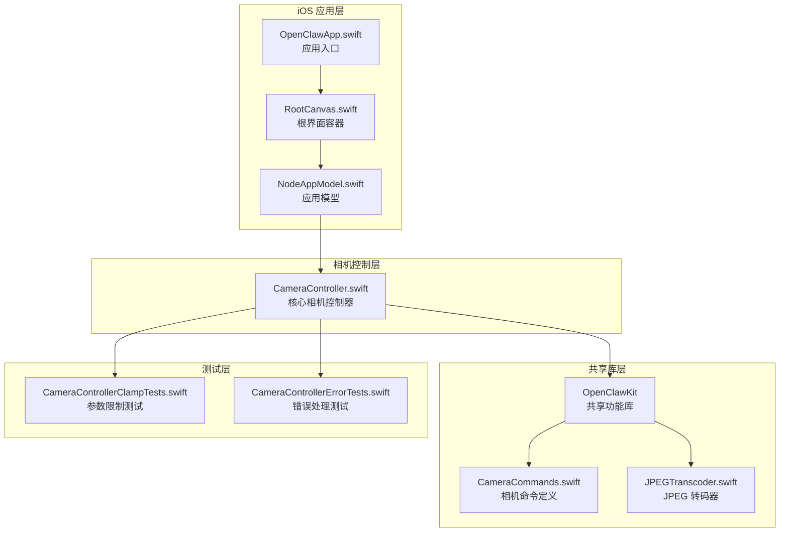
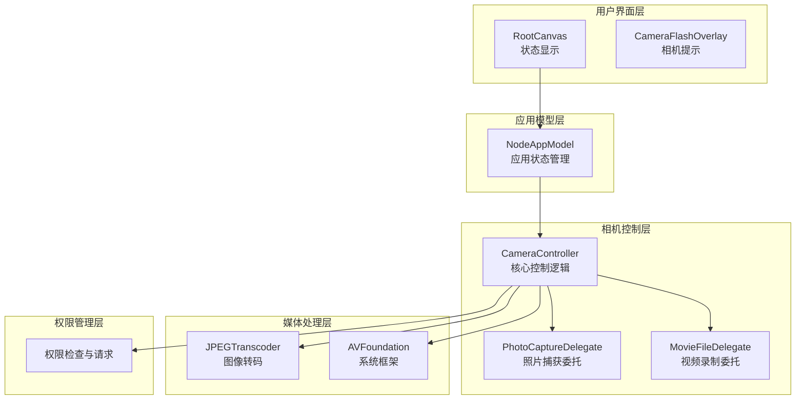
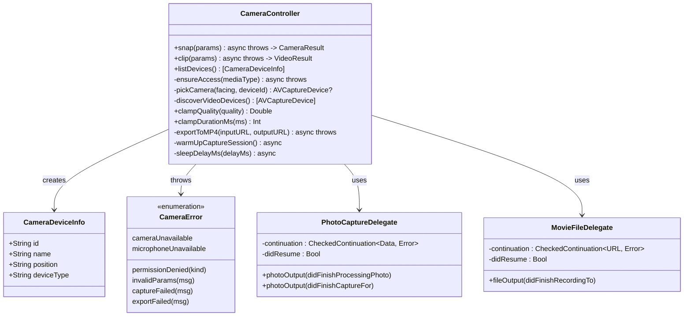
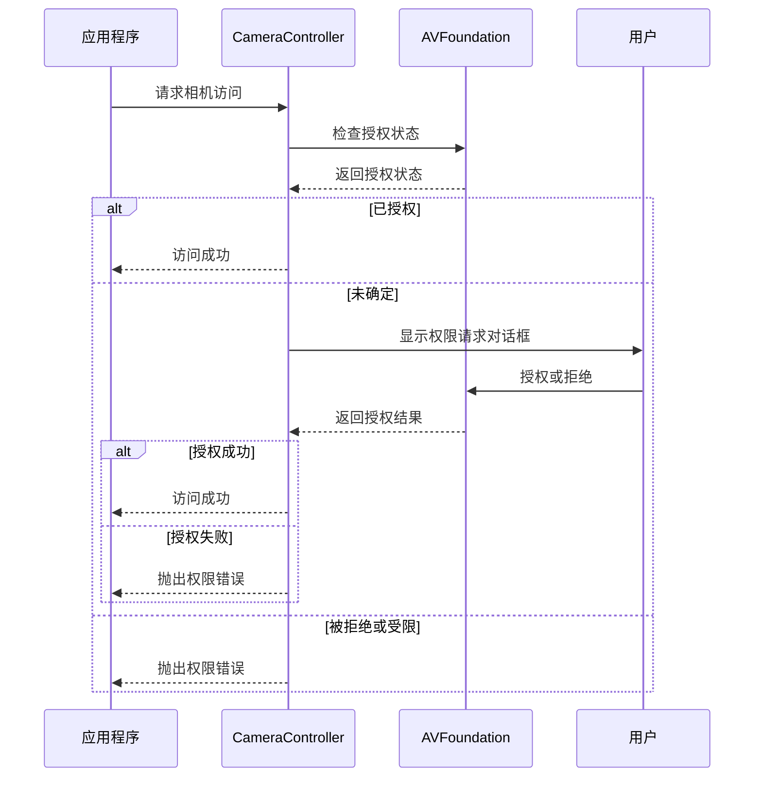
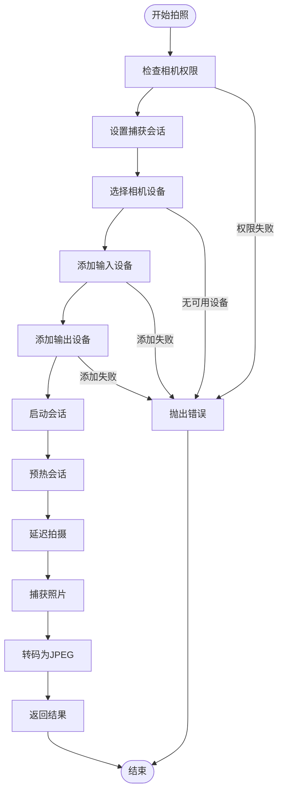
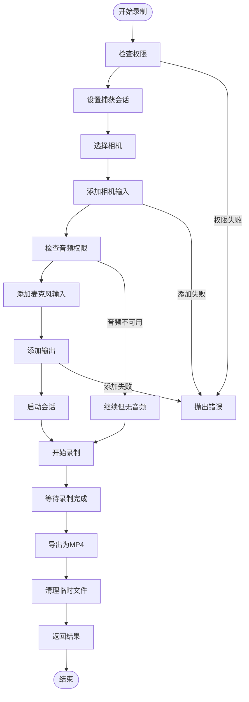
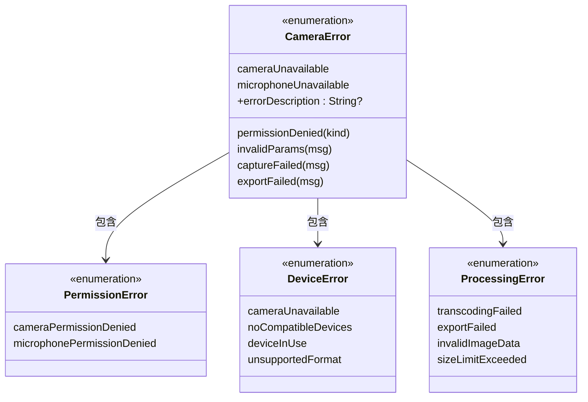
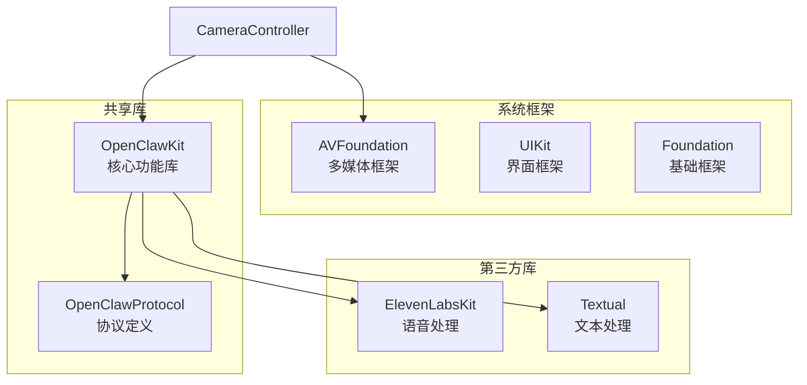
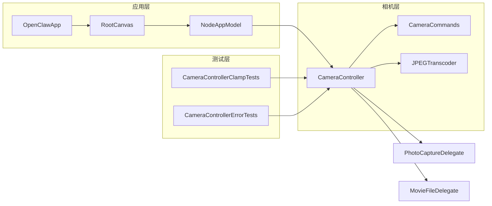
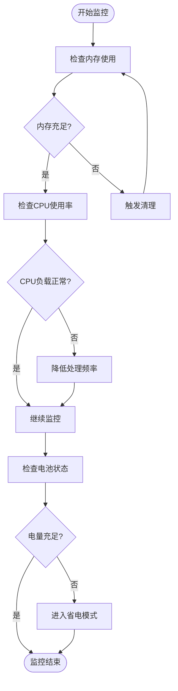

# 相机控制系统

## 目录
1. [简介](#简介)
2. [项目结构](#项目结构)
3. [核心组件](#核心组件)
4. [架构概览](#架构概览)
5. [详细组件分析](#详细组件分析)
6. [依赖关系分析](#依赖关系分析)
7. [性能考虑](#性能考虑)
8. [故障排除指南](#故障排除指南)
9. [结论](#结论)

## 简介

OpenClaw iOS 相机控制系统是一个基于 Swift 和 AVFoundation 构建的现代化相机管理解决方案。该系统提供了完整的相机访问权限管理、设备发现与选择、实时预览处理以及高质量图像和视频捕获功能。

本系统采用 Actor 模式确保线程安全，通过严格的类型系统和错误处理机制保证了系统的可靠性。相机控制器支持多种相机设备（前置、后置、广角、超广角、长焦等），并提供了灵活的参数配置选项。

## 项目结构

OpenClaw 相机控制系统主要分布在以下目录结构中：

## 核心组件

### CameraController - 核心控制器

CameraController 是整个相机系统的核心，采用 Actor 模式设计，确保线程安全。它提供了以下主要功能：

- **相机访问权限管理**：自动处理相机和麦克风权限请求
- **设备发现与选择**：支持多种相机设备类型的自动发现
- **图像捕获**：高质量照片拍摄功能
- **视频录制**：支持带音频的视频录制
- **实时预览**：通过 AVFoundation 实现实时预览流

### 参数化配置系统

系统提供了丰富的参数配置选项：

- **`OpenClawCameraSnapParams`**：照片拍摄参数
  - 摄像头方向（前置/后置）
  - 最大宽度限制
  - 图像质量设置
  - 文件格式选择
  - 设备 ID 指定
  - 延迟拍摄功能

- **`OpenClawCameraClipParams`**：视频录制参数
  - 录制时长限制
  - 音频包含选项
  - 视频格式设置
  - 设备选择功能

## 架构概览

相机控制系统采用分层架构设计，确保了模块间的清晰分离和高内聚低耦合：

## 详细组件分析

### 相机控制器类结构

### 权限管理系统

相机权限管理是系统的重要组成部分，采用了自动化的权限检查和请求机制：

### 图像捕获流程

系统提供了两种主要的图像捕获模式：照片拍摄和视频录制。

#### 照片拍摄流程

#### 视频录制流程

### 错误处理机制

系统实现了全面的错误处理机制，涵盖了从权限问题到设备冲突的各种异常情况：

## 依赖关系分析

### 外部依赖

系统主要依赖于以下关键框架和库：

### 内部模块依赖

## 性能考虑

### 内存管理优化

系统采用了多项内存管理优化策略：

- **及时释放资源**：所有临时文件和媒体对象都在使用后立即释放
- **内存映射文件**：使用临时目录存储录制文件，避免内存溢出
- **异步处理**：所有耗时操作都采用异步方式执行，不阻塞主线程

### 性能监控策略

### 渲染优化技术

系统实现了多种渲染优化技术：

- **预热机制**：在实际拍摄前进行会话预热，减少首帧空白问题
- **延迟拍摄**：支持可配置的拍摄延迟，改善用户体验
- **质量优先级**：根据网络条件动态调整图像质量

## 故障排除指南

### 常见问题诊断

#### 权限相关问题

| 问题症状 | 可能原因 | 解决方案 |
|---------|---------|---------|
| 相机无法访问 | 未授予相机权限 | 引导用户在设置中启用相机权限 |
| 麦克风权限失败 | 用户拒绝麦克风访问 | 提示用户重新授权 |
| 权限状态异常 | 系统权限缓存问题 | 重启应用或设备 |

#### 设备兼容性问题

| 问题症状 | 可能原因 | 解决方案 |
|---------|---------|---------|
| 无可用相机设备 | 设备不支持或损坏 | 检查设备硬件状态 |
| 相机切换失败 | 相机设备冲突 | 关闭其他相机应用后重试 |
| 分辨率不支持 | 设备不支持所选分辨率 | 选择设备支持的分辨率 |

#### 性能问题

| 问题症状 | 可能原因 | 解决方案 |
|---------|---------|---------|
| 录制卡顿 | 设备过热 | 让设备冷却后重试 |
| 内存不足 | 同时运行多个大型应用 | 关闭其他应用释放内存 |
| 响应缓慢 | 系统资源紧张 | 重启设备或清理缓存 |

### 调试工具和方法

系统提供了完善的调试支持：

- **日志记录**：详细的错误日志和状态跟踪
- **性能监控**：实时监控内存、CPU和电池使用情况
- **状态可视化**：通过 UI 状态指示器显示系统状态

## 结论

OpenClaw iOS 相机控制系统是一个设计精良、功能完备的现代化相机管理解决方案。系统采用了 Actor 模式确保线程安全，通过严格的类型系统和错误处理机制保证了可靠性。

### 主要优势

1. **架构设计优秀**：分层架构清晰，模块职责明确
2. **功能完整**：支持从基础权限管理到高级图像处理的完整功能链
3. **性能优化**：采用多种优化技术确保流畅的用户体验
4. **错误处理完善**：全面的错误处理和故障恢复机制
5. **测试覆盖**：完善的单元测试确保代码质量

### 技术亮点

- **异步编程模型**：充分利用 Swift 的并发特性
- **类型安全**：严格的类型系统防止运行时错误
- **资源管理**：自动化的资源生命周期管理
- **跨平台兼容**：支持 iOS 18+ 和 macOS 15+

该系统为 OpenClaw 生态系统提供了强大的相机能力，为用户提供了稳定可靠的图像和视频处理体验。通过持续的优化和改进，该系统将继续为用户提供卓越的相机控制体验。