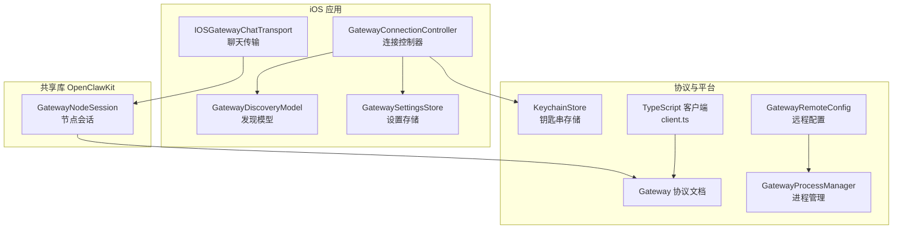
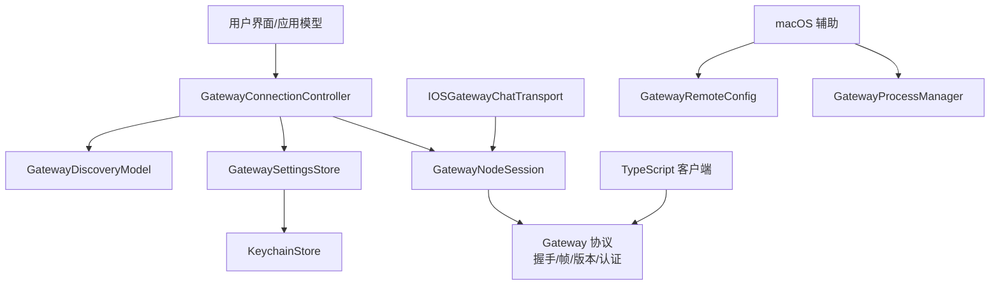
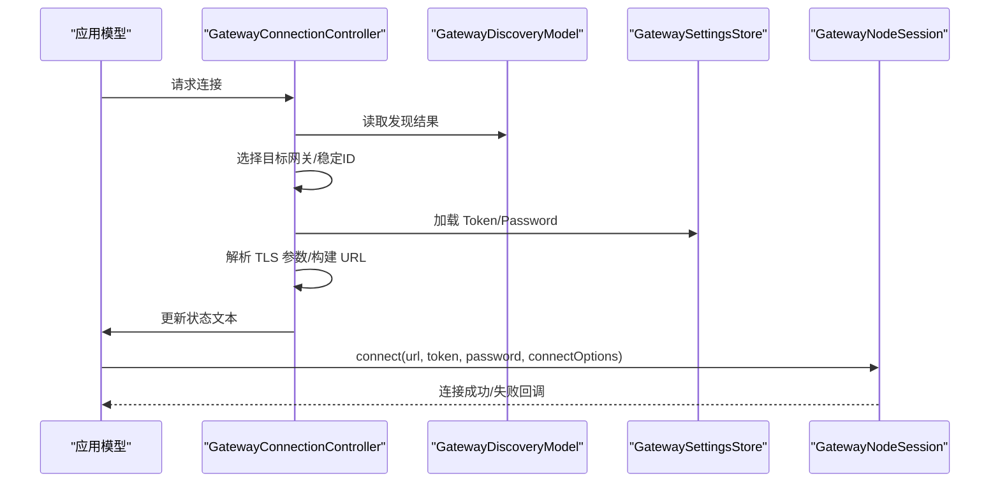
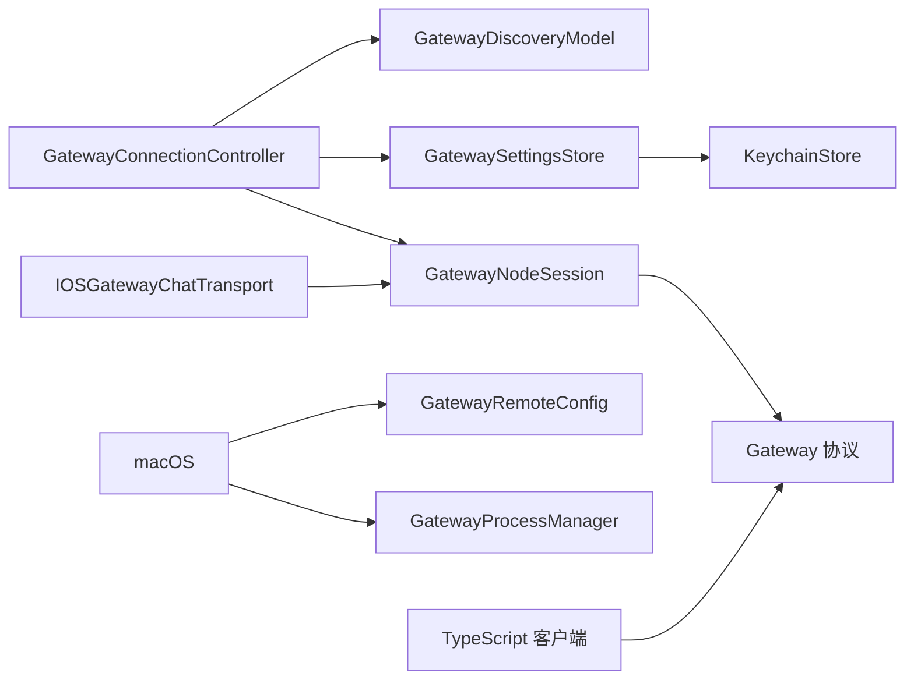
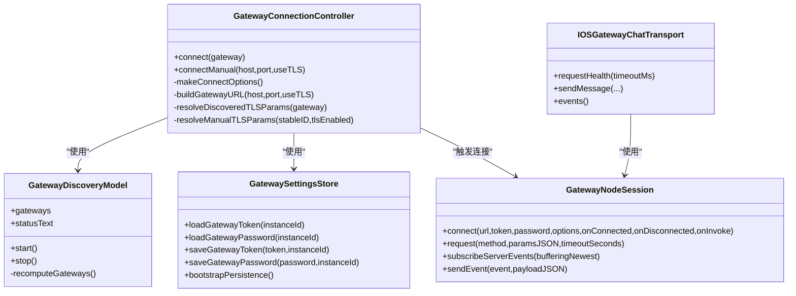
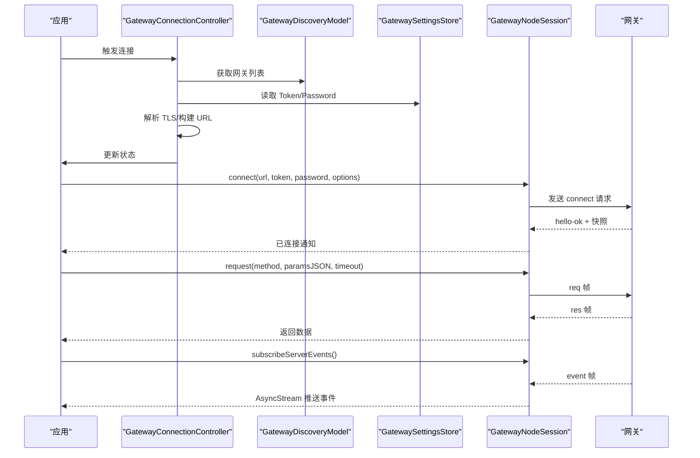

# 网关通信协议

## 目录
1. [引言](#引言)
2. [项目结构](#项目结构)
3. [核心组件](#核心组件)
4. [架构总览](#架构总览)
5. [组件详解](#组件详解)
6. [依赖关系分析](#依赖关系分析)
7. [性能考量](#性能考量)
8. [故障排查指南](#故障排查指南)
9. [结论](#结论)
10. [附录](#附录)

## 引言
本技术文档聚焦于 OpenClaw iOS 网关通信协议与实现，围绕 GatewayConnectionController 的架构与职责展开，系统性说明 WebSocket 连接管理、消息序列化、连接状态监控、协议设计（消息格式、认证机制、重连策略）、网关设置管理（端点配置、连接参数、网络优化）以及异常处理机制。文档同时提供关键流程的时序图与类图，帮助读者快速理解并进行二次开发或问题定位。

## 项目结构
iOS 网关通信相关代码主要分布在以下模块：
- 应用层（iOS）：GatewayConnectionController 负责发现、选择与自动连接网关；GatewayDiscoveryModel 提供 Bonjour 发现能力；GatewaySettingsStore 管理持久化配置；IOSGatewayChatTransport 封装聊天等业务请求。
- 共享库（OpenClawKit）：GatewayNodeSession 统一抽象节点侧的网关会话，封装连接、事件订阅、请求/响应与超时控制。
- 文档与协议：docs/gateway/protocol.md 定义了 WebSocket 协议、握手、帧格式、角色与作用域、认证与设备身份等。
- 平台辅助：KeychainStore 提供安全存储；GatewayRemoteConfig 与 GatewayProcessManager 在 macOS 上用于远程配置与进程管理。

## 核心组件
- GatewayConnectionController：负责网关发现、自动连接、TLS 参数解析、URL 构建、连接选项生成与触发实际连接。
- GatewayDiscoveryModel：基于 Bonjour/NWBrowser 实现网关发现，聚合多域结果并维护状态文本与调试日志。
- GatewaySettingsStore：通过 KeychainStore 持久化实例 ID、首选网关稳定 ID、最近发现网关 ID、网关 Token/Password。
- GatewayNodeSession：统一的网关会话抽象，负责连接、请求/响应、事件订阅、超时控制、断线重连与连接状态通知。
- IOSGatewayChatTransport：面向聊天场景的传输层封装，提供健康检查、会话列表、历史、发送消息与事件流订阅。
- KeychainStore：跨平台安全存储接口，支持读取、保存与删除字符串值。
- GatewayRemoteConfig 与 GatewayProcessManager：在 macOS 上提供远程配置规范化与进程启动超时处理。

## 架构总览
下图展示了 iOS 端从发现到连接再到业务调用的整体架构，以及与共享库和协议文档的交互关系。

## 组件详解

### GatewayConnectionController：连接控制器
职责与特性
- 自动发现与选择：监听 Discovery 结果，根据“首选稳定 ID”与“最近发现 ID”自动选择目标网关。
- 手动连接：支持手动输入主机、端口与 TLS 开关，生成稳定 ID 并发起连接。
- TLS 参数解析：优先使用发现信息中的指纹与开关，否则回退到本地存储的指纹；若无指纹则允许 TOFU（首次信任）。
- URL 构建：根据是否启用 TLS 决定 ws/wss，并填充主机与端口。
- 连接选项生成：包含角色、作用域、能力、命令、权限、客户端标识与显示名等。
- 触发连接：在主线程更新状态文本后，委托应用模型执行实际连接。

关键流程（自动连接）

### GatewayDiscoveryModel：网关发现
- 基于 Network 框架的 NWBrowser，扫描 Bonjour 服务类型与域名集合。
- 解析 TXT 记录，提取网关名称、LAN 主机、Tailnet DNS、端口、TLS 开关与指纹等。
- 维护状态文本与调试日志，支持按域跟踪状态变化。
- 合并多域结果并排序，记录新增/移除的稳定 ID。

### GatewaySettingsStore：网关设置管理
- 使用 KeychainStore 存储实例 ID、首选/最近发现网关稳定 ID、网关 Token/Password。
- 支持引导初始化，确保 UserDefaults 与 Keychain 之间的一致性。
- Token/Password 以“实例 ID”为账户前缀，避免跨实例冲突。

### GatewayNodeSession：会话与消息编排
- 连接生命周期：connect()/disconnect()，内部管理 GatewayChannelActor。
- 请求/响应：request() 方法封装超时与参数编码，返回 Data。
- 事件订阅：subscribeServerEvents() 返回 AsyncStream，支持缓冲最新事件。
- 快照等待：waitForSnapshot() 等待网关快照到达后再通知已连接。
- 节点调用：处理 `node.invoke.request`，执行回调并发送 `node.invoke.result`。
- 超时控制：invokeWithTimeout() 使用显式闩锁确保超时优先。

### IOSGatewayChatTransport：聊天传输层
- 封装聊天相关方法：abort、sessions.list、chat.history、chat.send、health。
- 事件流：订阅心跳、序列号缺失、健康状态、聊天与代理事件，转换为统一的传输事件枚举。
- 超时与解码：对健康检查与各接口设置合理超时，并进行 JSON 解码。

### 协议设计与认证机制
- 传输与帧格式：WebSocket 文本帧，JSON 负载；首个帧必须是 connect 请求。
- 握手：connect 请求包含最小/最大协议版本、客户端信息、角色/作用域、能力/命令/权限声明、可选认证与设备签名。
- 响应与事件：res 响应与 event 事件帧；节点调用采用两阶段响应（先 accepted，再最终 ok/error）。
- 认证：支持 Token 与密码两种方式；设备身份要求在 connect 中携带签名挑战；本地直连可自动批准。
- 版本与兼容：客户端声明 min/maxProtocol，服务器拒绝不匹配；协议版本由 schema 定义并通过工具链生成 Swift/TypeScript 模型。

### 重连策略与异常处理
- iOS TypeScript 客户端（参考实现）：指数回退（上限 30 秒），心跳超时主动关闭，flushPendingErrors 统一拒绝挂起请求。
- iOS 端 GatewayNodeSession：在连接失败时触发断开回调，等待上层重新调度；支持等待快照超时与连接状态复位。
- macOS 端：进程启动超时标记失败并记录原因，必要时刷新控制通道。

### 网络优化与端点配置
- URL 规范化：macOS 端对 ws/wss、主机与默认端口进行规范化处理，便于跨平台一致性。
- TLS 指纹：iOS 端优先使用发现/存储的指纹，支持 TOFU；macOS 端提供默认端口推断。
- 连接参数：连接选项中包含 capabilities、commands、permissions、client 信息与 display name，减少后续授权与能力协商成本。

## 依赖关系分析
- 控制器依赖发现模型与设置存储，输出连接参数给会话层。
- 会话层依赖协议定义与通道实现，向上提供统一 API。
- 传输层依赖会话层提供的请求/事件能力。
- 平台辅助（macOS）与钥匙串存储为配置与安全提供支撑。

## 性能考量
- 连接并发控制：共享连接时采用单飞（single-flight）策略，避免重复握手与资源浪费。
- 快照等待与超时：会话层在连接后等待快照，超时即放弃，降低阻塞时间。
- 事件流缓冲：订阅事件时使用“缓冲最新 N 个”，兼顾实时性与内存占用。
- 心跳与断线检测：客户端内置心跳超时检测，及时触发断开以释放资源。
- 端口与 URL 规范化：减少无效重试与错误解析成本。

## 故障排查指南
常见问题与定位建议
- 连接失败/超时
  - 检查发现状态文本与调试日志，确认 Bonjour 是否正常。
  - 核对 Token/Password 与设备身份签名是否正确。
  - 查看会话层断开回调与错误信息，确认是否因协议不匹配或认证失败。
- TLS 指纹不一致
  - iOS 端优先使用发现/存储指纹；如需更新，清理旧指纹并允许 TOFU 或重新配对。
- 心跳超时
  - 客户端会主动关闭，检查网络质量与中间代理；适当增大心跳间隔策略（如适用）。
- 事件丢失/乱序
  - 关注 seqGap 事件与缓冲策略；必要时增加缓冲大小或调整订阅时机。
- macOS 启动超时
  - 查看进程管理器的超时日志与失败原因，确认启动参数与环境变量。

## 结论
本文从架构与实现两个层面梳理了 OpenClaw iOS 网关通信协议的关键要素：连接控制器负责发现与自动连接，会话层统一封装请求/事件与超时控制，传输层聚焦业务语义，协议文档明确了握手、帧格式与认证机制。通过 TLS 指纹、连接选项与网络优化策略，系统在安全性与可用性之间取得平衡。建议在生产环境中结合调试日志与事件流进行持续观测，并遵循协议版本与认证规范以确保稳定性。

## 附录

### 类图：核心类关系

### 时序图：连接建立与消息发送
