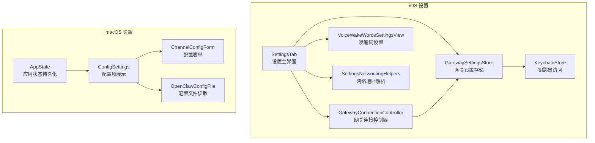
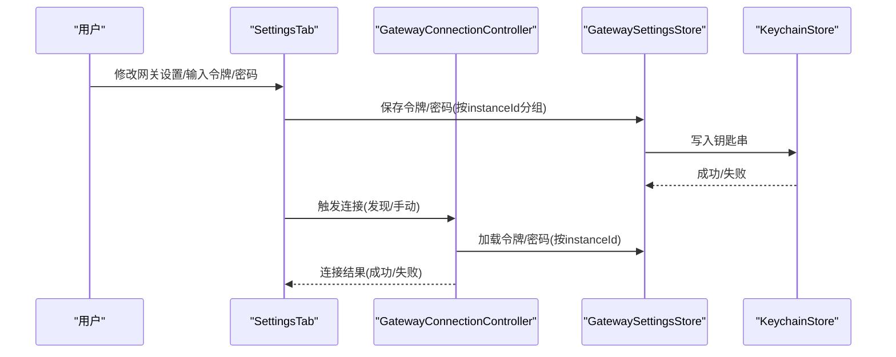
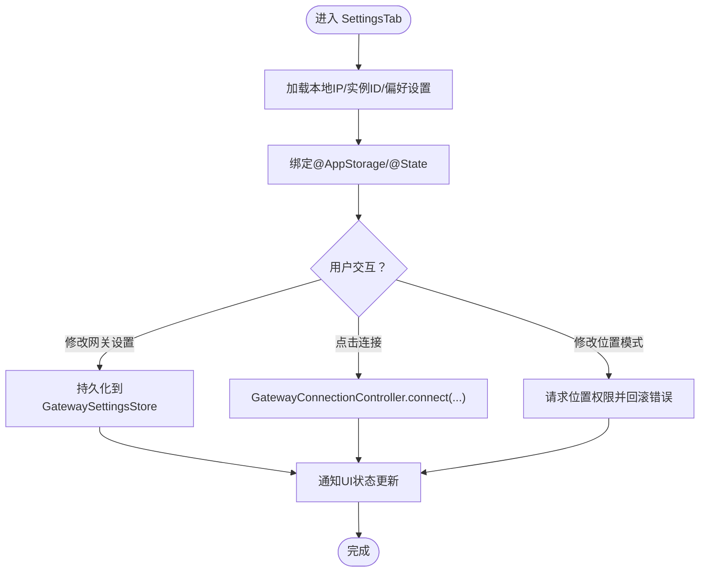
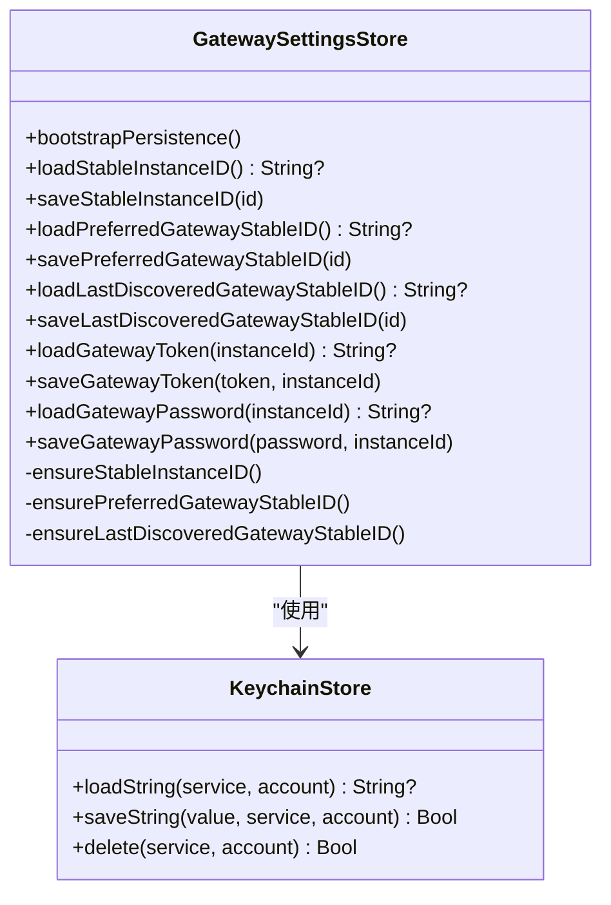
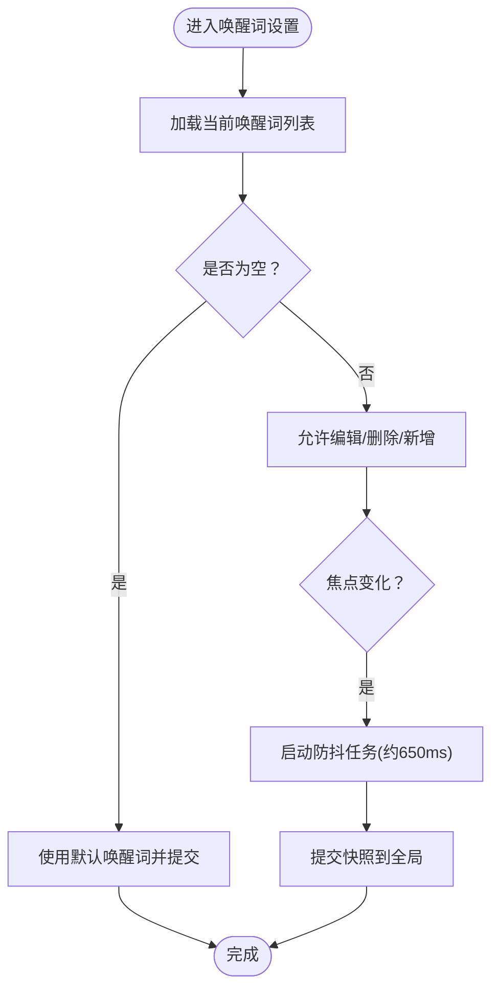
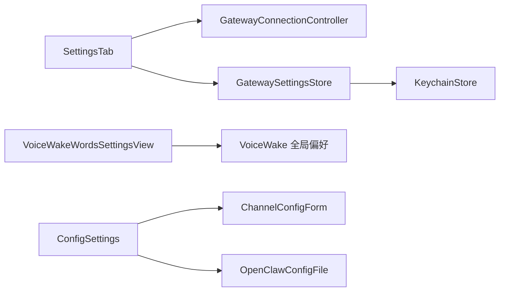

# 设置管理系统

**本文档引用的文件**
- [`GatewaySettingsStore.swift`](file://apps/ios/Sources/Gateway/GatewaySettingsStore.swift)
- [`KeychainStore.swift`](file://apps/ios/Sources/Gateway/KeychainStore.swift)
- [`SettingsTab.swift`](file://apps/ios/Sources/Settings/SettingsTab.swift)
- [`SettingsNetworkingHelpers.swift`](file://apps/ios/Sources/Settings/SettingsNetworkingHelpers.swift)
- [`VoiceWakeWordsSettingsView.swift`](file://apps/ios/Sources/Settings/VoiceWakeWordsSettingsView.swift)
- [`GatewayConnectionController.swift`](file://apps/ios/Sources/Gateway/GatewayConnectionController.swift)
- [`AppState.swift`](file://apps/macos/Sources/OpenClaw/AppState.swift)
- [`ConfigSettings.swift`](file://apps/macos/Sources/OpenClaw/ConfigSettings.swift)
- [`ChannelConfigForm.swift`](file://apps/macos/Sources/OpenClaw/ChannelConfigForm.swift)
- [`OpenClawConfigFile.swift`](file://apps/macos/Sources/OpenClaw/OpenClawConfigFile.swift)
- [`GatewaySettingsStoreTests.swift`](file://apps/ios/Tests/GatewaySettingsStoreTests.swift)
- [`KeychainStoreTests.swift`](file://apps/ios/Tests/KeychainStoreTests.swift)

## 目录
1. [简介](#简介)
2. [项目结构](#项目结构)
3. [核心组件](#核心组件)
4. [架构总览](#架构总览)
5. [详细组件分析](#详细组件分析)
6. [依赖关系分析](#依赖关系分析)
7. [性能考虑](#性能考虑)
8. [故障排除指南](#故障排除指南)
9. [结论](#结论)

## 简介
本文件面向 OpenClaw iOS 设置管理系统，系统性梳理 `SettingsStore` 的实现架构、设置界面的 SwiftUI 实现、设置与网关配置的同步机制，并提供可直接定位到源码的路径指引，帮助开发者快速理解与扩展设置功能。

## 项目结构
iOS 设置管理主要分布在以下模块：
- 网关设置存储：`GatewaySettingsStore`（基于 Keychain 存储敏感信息）
- 设置界面：`SettingsTab`（主设置页）、`VoiceWakeWordsSettingsView`（唤醒词设置）、`SettingsNetworkingHelpers`（网络地址解析）
- 网关连接控制器：`GatewayConnectionController`（负责连接逻辑与凭据加载）
- macOS 对应设置：`AppState`（应用状态持久化）、`ConfigSettings`（配置项展示）、`ChannelConfigForm`（配置表单）

## 核心组件
- `SettingsTab`：集中式设置入口，包含节点、网关、语音、相机、位置、屏幕等设置项，使用 `@AppStorage` 绑定 `UserDefaults`，同时通过 `GatewaySettingsStore` 持久化网关令牌与密码。
- `GatewaySettingsStore`：统一管理实例 ID、首选网关稳定 ID、最近发现网关稳定 ID，以及按 `instanceId` 分组的网关令牌与密码，采用 Keychain 存储敏感数据。
- `KeychainStore`：封装钥匙串读写删除操作，支持更新、插入与删除，确保敏感信息安全。
- `VoiceWakeWordsSettingsView`：动态维护唤醒词列表，支持增删改、重置默认值、去空格与防抖同步至全局。
- `SettingsNetworkingHelpers`：解析主机与端口、生成 HTTP URL 字符串，辅助设置界面显示与复制。
- `GatewayConnectionController`：根据 Discovery 结果与本地凭据建立连接，自动注入令牌与密码。
- macOS 对应组件：`AppState` 负责迁移与初始化 `UserDefaults`；`ConfigSettings`/`ChannelConfigForm` 展示与编辑配置；`OpenClawConfigFile` 提供配置文件读取能力。

## 架构总览
设置系统在 iOS 与 macOS 两端分别实现，但共享“设置项持久化 + 配置同步”的核心目标。iOS 使用 `UserDefaults` + `Keychain`，macOS 使用 `UserDefaults` + 配置文件读取。网关连接通过 `GatewayConnectionController` 统一接入，实现“发现 → 连接 → 同步”的闭环。

## 详细组件分析

### SettingsTab 组件分析
- 数据绑定：使用 `@AppStorage` 绑定节点名称、实例 ID、语音唤醒、Talk 模式、相机权限、位置模式、防止休眠等；网关部分使用 `@State` 管理连接状态与手动配置。
- 用户交互：Section 化组织设置项，支持复制地址、连接/断开网关、切换发现日志、调试 Canvas 状态、输入令牌与密码等。
- 变更监听：对网关首选稳定 ID、令牌、密码、位置模式进行 `onChange` 监听并持久化或请求权限。
- 网络解析：通过 `SettingsNetworkingHelpers` 解析地址与生成 HTTP URL，便于复制与展示。

### GatewaySettingsStore 组件分析
- 职责：管理实例 ID、首选网关稳定 ID、最近发现网关稳定 ID，以及按 `instanceId` 分组的网关令牌与密码。
- 持久化策略：优先从 Keychain 读取/写入，若缺失则回退到 `UserDefaults`，确保跨版本兼容与迁移。
- 安全性：令牌与密码使用 Keychain 存储，避免明文落盘。

### VoiceWakeWordsSettingsView 组件分析
- 动态生成：根据数组索引生成多个 `TextField`，支持删除与添加。
- 默认值处理：首次打开时若为空，填充默认唤醒词并提交。
- 防抖同步：通过定时器合并多次输入，在一定延迟后将当前快照同步到全局，避免频繁触发。

### SettingsNetworkingHelpers 组件分析
- 功能：解析形如 `"host:port"` 或 `"[host]:port"` 的地址字符串，生成 HTTP URL 字符串。
- 场景：用于设置界面中显示与复制网关地址，提升用户体验。

### macOS 设置与配置同步
- `AppState`：负责 `UserDefaults` 的迁移与初始化，确保旧版本数据平滑过渡。
- `ConfigSettings`/`ChannelConfigForm`：以树形结构展示配置项，支持动态增删键值对，提供默认值处理与类型绑定。
- `OpenClawConfigFile`：提供配置文件读取能力，支持解析远程网关端口、密码等字段。

## 依赖关系分析
- iOS 设置依赖关系：`SettingsTab` 依赖 `GatewayConnectionController` 与 `GatewaySettingsStore`；`GatewaySettingsStore` 依赖 `KeychainStore`；`VoiceWakeWordsSettingsView` 依赖 `VoiceWake` 全局偏好。
- macOS 设置依赖关系：`ConfigSettings` 依赖配置模型与表单组件；`ChannelConfigForm` 依赖配置值读写；`OpenClawConfigFile` 提供底层配置读取。

## 性能考虑
- 防抖同步：`VoiceWakeWordsSettingsView` 通过定时器合并高频变更，降低全局同步频率。
- 延迟连接：`SettingsTab` 在连接前进行参数校验（主机、端口范围），减少无效连接尝试。
- 键盘串行：`SettingsTab` 对位置权限请求采用异步任务并在失败时回滚，避免阻塞主线程。
- 配置读取：macOS `ConfigSettings` 使用懒加载与条件渲染，仅在需要时解析与展示配置项。

## 故障排除指南
- 钥匙串读写失败：检查 `KeychainStore` 的返回状态，确认服务名与账户名一致；必要时清理旧条目后重试。
- 网关连接失败：确认 `SettingsTab` 中主机与端口合法；查看连接状态文本与错误提示；启用发现调试日志获取更多信息。
- 唤醒词无效：检查 `VoiceWakeWordsSettingsView` 是否存在空字符串；确认已提交并等待防抖同步完成。
- macOS 配置不可用：检查 `ConfigSettings` 的 schema 加载状态；确认 `OpenClawConfigFile` 能正确解析配置字典。

## 结论
OpenClaw iOS 设置管理系统通过清晰的职责划分与安全的存储策略，实现了设置项的持久化、用户交互与网关连接的无缝衔接。iOS 端以 `UserDefaults` + `Keychain` 为核心，macOS 端以配置文件与 UI 组件协同，两者共同保障了设置体验的一致性与可靠性。建议在后续迭代中进一步完善配置导入导出与冲突解决策略，以增强多设备场景下的可用性。