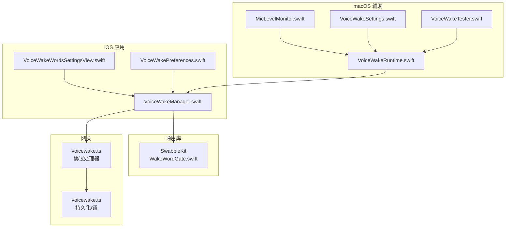
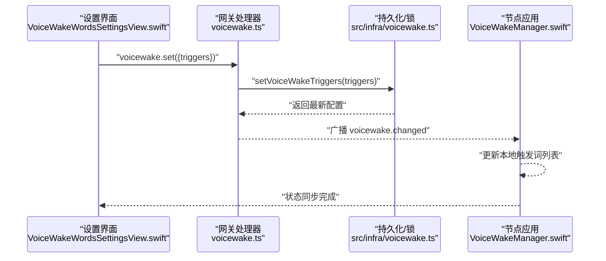
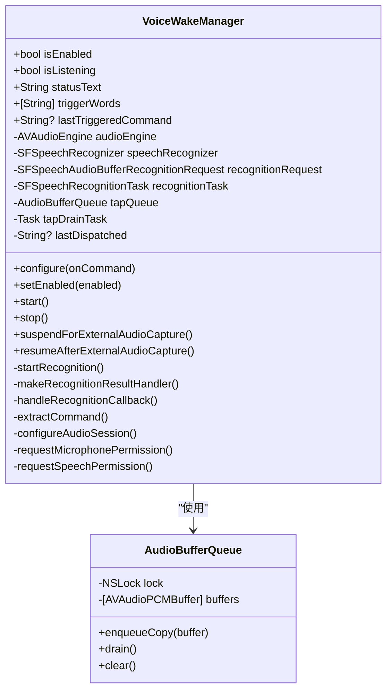
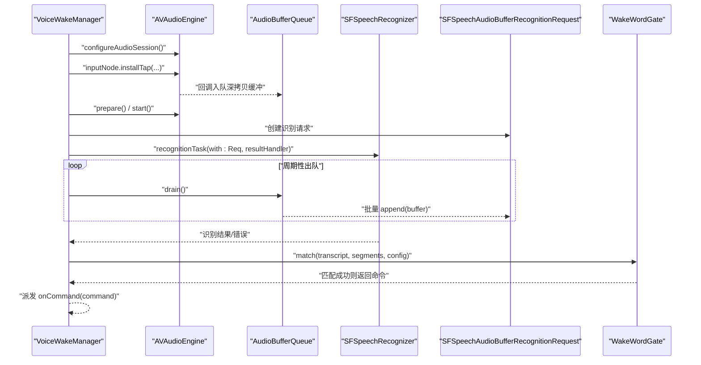
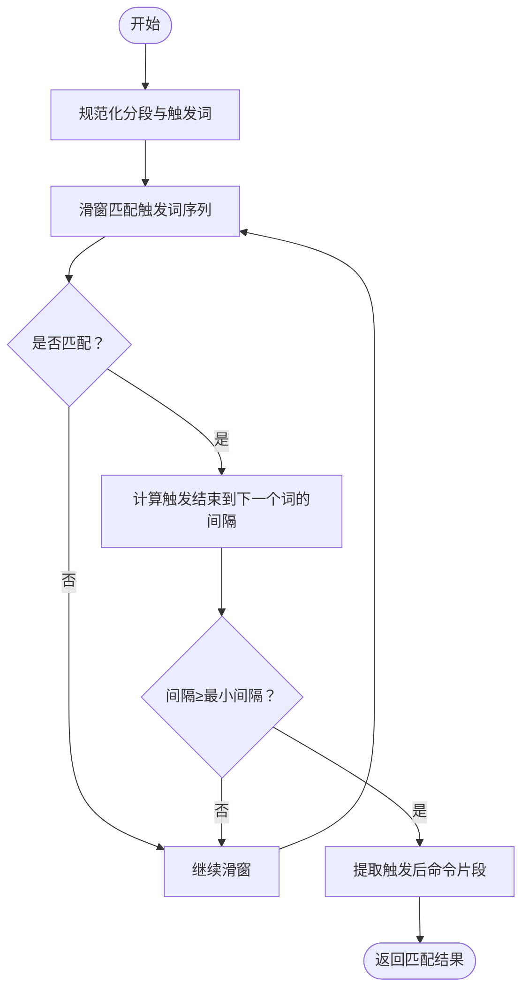
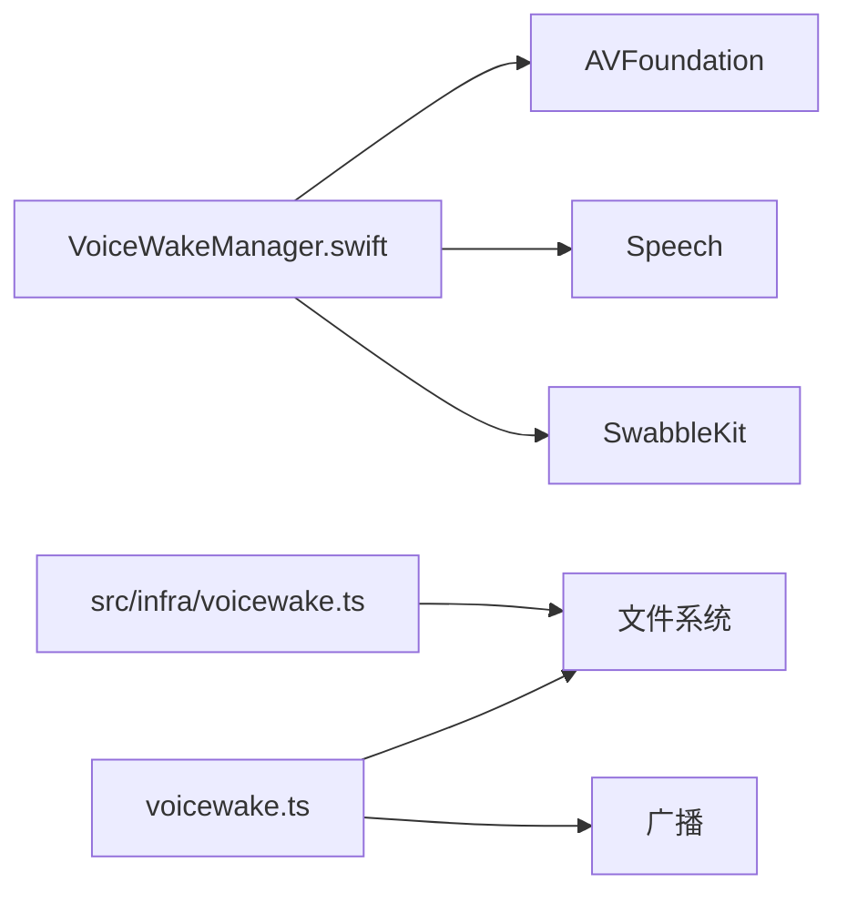

# 语音触发系统

## 目录
1. [简介](#简介)
2. [项目结构](#项目结构)
3. [核心组件](#核心组件)
4. [架构总览](#架构总览)
5. [详细组件分析](#详细组件分析)
6. [依赖关系分析](#依赖关系分析)
7. [性能考量](#性能考量)
8. [故障排查指南](#故障排查指南)
9. [结论](#结论)
10. [附录](#附录)

## 简介
本文件面向 OpenClaw iOS 语音触发系统，聚焦 VoiceWakeManager 的实现架构与运行机制，涵盖以下主题：
- 语音检测算法与唤醒词识别：基于 Apple Speech 框架的实时转写与基于分段的时间间隙门控（Wake Word Gate）。
- 音频处理流程：从麦克风采集、格式适配、缓冲队列到识别请求的完整链路。
- 硬件适配：麦克风权限管理、音频会话配置、输入路由与噪声抑制策略。
- 与网关同步机制：全局唤醒词列表的存储、广播与节点一致性。
- 实战示例：音频采样配置、特征提取思路、阈值与参数调优建议。

## 项目结构
围绕 iOS 语音触发的关键目录与文件如下：
- iOS 应用层：VoiceWakeManager.swift 负责权限申请、引擎启动、音频 tap、识别任务与唤醒词匹配。
- 通用库：SwabbleKit 提供 WakeWordGate 与 WakeWordSegment，支撑跨平台的唤醒词门控逻辑。
- 网关侧：voicewake.ts（协议处理器）、src/infra/voicewake.ts（持久化与锁）。
- macOS 辅助：VoiceWakeRuntime.swift、MicLevelMonitor.swift、VoiceWakeSettings.swift、VoiceWakeTester.swift 等用于调试与状态监控。
- 设置界面：VoiceWakeWordsSettingsView.swift（iOS）、VoiceWakeSettings.swift（macOS）负责唤醒词编辑与同步。

## 核心组件
- VoiceWakeManager（iOS）
  - 职责：权限申请、AVAudioEngine 启动、音频 tap、SFSpeechAudioBufferRecognitionRequest 识别、唤醒词匹配与命令派发。
  - 关键点：非隔离回调（避免阻塞实时线程）、缓冲队列与异步派发、最小后置间隔门控、错误自恢复。
- SwabbleKit WakeWordGate
  - 职责：基于分段时间戳的唤醒词匹配与“触发后最小间隔”门控，提取触发后的命令文本。
- 网关 voicewake 协议
  - 职责：`voicewake.get` / `voicewake.set` 与广播，集中管理全局唤醒词列表。
- macOS 辅助组件
  - VoiceWakeRuntime：与 iOS 类似的运行时，但包含额外的音频级联与可视化。
  - MicLevelMonitor：持续监测麦克风 RMS 值，辅助噪声抑制与用户反馈。
  - VoiceWakeSettings：设备发现、选择与状态展示。
  - VoiceWakeTester：调试与断言工具，验证门控行为。

## 架构总览
下图展示了从 iOS 设备到网关再到其他节点的同步路径，以及本地唤醒词匹配与音频处理主干流程。

## 详细组件分析

### VoiceWakeManager（iOS）类图
VoiceWakeManager 是 iOS 语音触发的核心，负责权限、引擎、tap、识别与唤醒词匹配。

### 音频处理与唤醒词匹配序列图
该序列图展示从安装 tap 到识别回调再到唤醒词匹配与命令派发的完整流程。

### Wake Word Gate 匹配流程（算法）
门控逻辑以“唤醒词出现 + 最小后置间隔”为核心，提取触发后的命令片段。

### 硬件适配与权限管理
- 麦克风权限：通过 AVAudioApplication.requestRecordPermission 异步申请。
- 语音识别权限：通过 SFSpeechRecognizer.requestAuthorization 异步申请。
- 音频会话：设置为 measurement 模式，启用蓝牙免提支持与混音等选项。
- 设备选择与可用性：macOS 下通过摄像头设备发现会话过滤音频设备，并结合 Alive UIDs 过滤不可用设备。

### 与网关的同步机制
- 全局唤醒词列表由网关持有并持久化，节点可查询与设置。
- 设置后通过广播通知所有连接客户端，确保多端一致。
- iOS 设置界面在提交时调用网关方法，macOS 亦遵循相同协议。

### 音频采样配置与特征提取要点
- 采样与通道：通过 inputNode.outputFormat 获取采样率与通道数；tap 缓冲区大小影响延迟与吞吐。
- 特征提取：当前实现依赖 Speech 框架进行端上转写；若需自定义特征，可在 tap 回调中对 PCM 数据进行 FFT/能量/梅尔频带等变换（建议在非实时线程执行）。
- RMS 电平：macOS 下提供 MicLevelMonitor，可用于噪声抑制与用户反馈。

### 阈值与参数调优建议
- 最小后置间隔（minPostTriggerGap）：默认约 0.45 秒，可依据口音与环境噪声适当增大，减少误触。
- 触发词数量与长度：保持简短，避免歧义；可通过设置界面批量编辑并同步至网关。
- 识别部分结果：开启 shouldReportPartialResults 可提升交互体验，但需注意门控仅在稳定片段生效。

## 依赖关系分析
- iOS VoiceWakeManager 依赖：
  - AVFoundation（AVAudioEngine、AVAudioPCMBuffer 深拷贝）
  - Speech（SFSpeechRecognizer、SFSpeechAudioBufferRecognitionRequest）
  - SwabbleKit（WakeWordGate、WakeWordSpeechSegments）
- 网关侧依赖：
  - 文件系统原子写（避免竞态）
  - 广播机制（向所有客户端推送变更）

## 性能考量
- 实时性：tap 回调必须轻量，避免阻塞；使用深拷贝缓冲与独立出队线程降低延迟。
- 吞吐与延迟权衡：tap 缓冲区大小与出队周期决定端到端延迟；过小易丢帧，过大增加延迟。
- 会话模式：measurement 模式适合低噪声环境下的高保真测量；如需更强抗干扰能力，可考虑动态增益或外部降噪模块（需评估延迟）。
- 错误自恢复：识别器报错后短暂休眠再重启，避免长时间停机。

## 故障排查指南
- 权限问题
  - 症状：状态显示“麦克风/语音识别权限被拒绝”。
  - 处理：检查系统隐私设置；重新授权；确认应用未被限制后台录音。
- 模拟器不支持
  - 症状：模拟器提示不支持语音唤醒。
  - 处理：在真机上测试；避免在模拟器长期占用音频资源。
- 无音频输入
  - 症状：初始化失败或无法启动引擎。
  - 处理：检查设备选择与连接状态；确认输入格式有效；尝试切换麦克风。
- 误触发与漏检
  - 症状：频繁误触发或听不到触发词。
  - 处理：增大最小后置间隔；缩短触发词；改善环境噪声；使用 RMS 电平监控辅助判断。
- 节点不同步
  - 症状：修改唤醒词后其他节点未更新。
  - 处理：确认已调用 `voicewake.set` 并等待广播；检查网关日志与客户端连接状态。

## 结论
VoiceWakeManager 在 iOS 上通过 Apple 生态的 Speech 与 AVFoundation 实现了低延迟、可扩展的语音触发能力。配合 SwabbleKit 的门控算法与网关的全局唤醒词同步机制，系统在多端具有一致的行为与良好的用户体验。实际部署中应重点关注权限、设备选择、噪声抑制与参数调优，以获得更稳定的触发表现。

## 附录
- 术语
  - 分段（Segment）：一次转写的时间窗口，包含起止时间与文本范围。
  - 门控（Gate）：基于时间间隔的触发后命令提取策略。
  - RMS：音频信号的能量度量，常用于噪声抑制与电平反馈。
- 相关文档
  - [README.md（Swabble）](file://Swabble/README.md#L1-L47)
  - [voicewake.md](file://docs/nodes/voicewake.md#L1-L66)