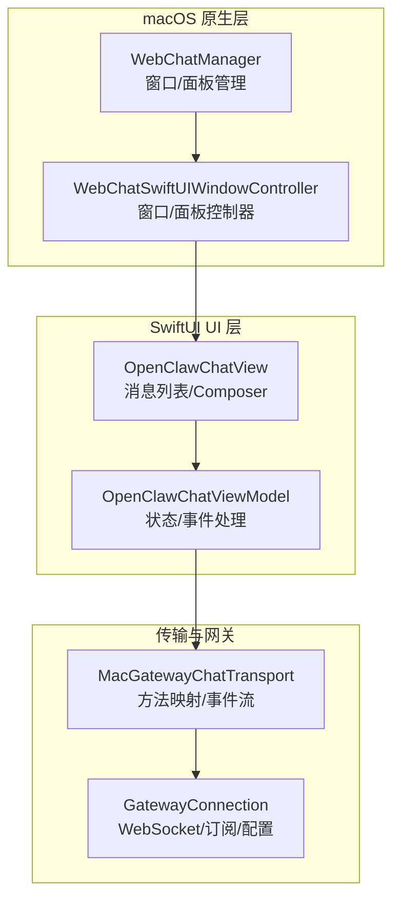
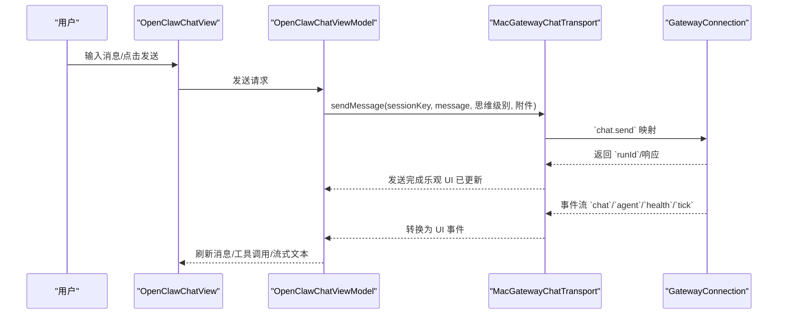
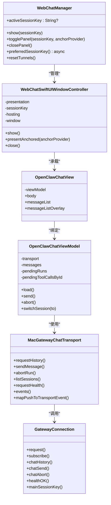
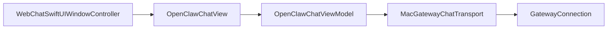

# WebChat 聊天界面

## 目录
1. [简介](#简介)
2. [项目结构](#项目结构)
3. [核心组件](#核心组件)
4. [架构总览](#架构总览)
5. [详细组件分析](#详细组件分析)
6. [依赖关系分析](#依赖关系分析)
7. [性能考量](#性能考量)
8. [故障排查指南](#故障排查指南)
9. [结论](#结论)
10. [附录](#附录)

## 简介
本文件面向 OpenClaw macOS WebChat 聊天界面，系统性阐述其核心能力与实现：基于原生 SwiftUI 的聊天 UI、通过 Gateway WebSocket 的消息传输与会话管理、Swift 与 Gateway 的桥接通信、消息路由与状态同步、以及安全沙箱与性能优化策略。文档同时提供关键流程的时序与类图，帮助开发者快速理解并扩展 WebChat。

## 项目结构
WebChat 在 macOS 上由三部分协作构成：
- macOS 原生窗口与面板控制器：负责窗口生命周期、锚定定位、动画与可见性回调
- SwiftUI 聊天视图与 ViewModel：负责消息列表渲染、输入 Composer、工具调用与流式输出、错误与空态提示
- 传输层与 Gateway 连接：负责 WebSocket 请求、事件订阅、健康检查与方法映射

## 核心组件
- `WebChatManager`：统一管理窗口与面板的显示/隐藏、会话键缓存与隧道重置
- `WebChatSwiftUIWindowController`：封装 NSWindow/NSPanel 生命周期、布局、动画与事件监听
- `OpenClawChatView`：消息列表渲染、Composer 输入、空态与错误提示、滚动行为与 Markdown 渲染
- `OpenClawChatViewModel`：消息历史加载、发送/中止、会话切换、事件订阅与去重、超时与健康检查
- `MacGatewayChatTransport`：将 `GatewayConnection` 的方法映射为 `OpenClawChatTransport` 接口，并把 Gateway 推送事件转为 UI 事件
- `GatewayConnection`：单例 WebSocket 连接，封装请求、订阅、健康检查、会话键规范化与自动恢复

## 架构总览
WebChat 采用“原生窗口 + SwiftUI 视图 + 传输层 + Gateway WebSocket”的分层设计。UI 通过 ViewModel 发起请求与订阅事件，传输层负责方法映射与事件转换，`GatewayConnection` 统一管理 WebSocket 连接与自动恢复。

## 详细组件分析

### WebChatManager：窗口/面板与会话管理
- 功能要点
  - 窗口模式与面板模式切换
  - 面板锚定菜单栏区域，支持全局点击外部关闭
  - 会话键缓存与首选会话获取
  - 隧道重置与资源清理
- 关键路径
  - 显示窗口：`show`
  - 锚定面板：`togglePanel`
  - 首选会话键：`preferredSessionKey`

### WebChatSwiftUIWindowController：窗口/面板生命周期与布局
- 功能要点
  - 窗口尺寸与最小尺寸约束
  - 面板锚定与入场动画
  - 全局点击外部关闭监控
  - 效果视图与圆角背景
- 关键路径
  - 创建窗口/面板：`makeWindow`
  - 锚定定位与动画：`presentAnchored`
  - 全局点击关闭：`installDismissMonitor`

### OpenClawChatView：消息渲染与交互
- 功能要点
  - 消息列表懒渲染与滚动目标布局
  - 乐观追加用户消息与底部自动滚动
  - 工具调用气泡与流式助手文本
  - 空态与错误提示卡片/横幅
  - Markdown 渲染与主题适配
- 关键路径
  - 滚动行为与自动贴底：`messageList`
  - 工具结果合并：`mergeToolResults`
  - 错误提示与空态：`messageListOverlay`

### OpenClawChatViewModel：消息传输与会话状态
- 功能要点
  - 历史加载、发送、中止、会话切换
  - 事件订阅与去重、超时与健康轮询
  - 附件上传与预览、错误文案与刷新
- 关键路径
  - 初始化与事件订阅：`init`
  - 发送流程（乐观 UI + 网络请求）：`performSend`
  - 事件处理与去重：`handle_transport_event`
  - 健康检查与超时：`pollHealthIfNeeded`

### MacGatewayChatTransport：Swift 与 Gateway 的桥接
- 功能要点
  - 将 `GatewayConnection` 的 `chat.history`/`chat.send`/`chat.abort`/`sessions.list`/`chat.inject` 映射为 `OpenClawChatTransport` 接口
  - 订阅 Gateway 推送并转换为 UI 事件（`health`/`tick`/`chat`/`agent`/`seqGap`）
- 关键路径
  - 方法映射：`requestHistory`/`sendMessage`/`abortRun`/`listSessions`/`requestHealth`/`events`
  - 事件映射：`mapPushToTransportEvent`

### GatewayConnection：WebSocket 通信与自动恢复
- 功能要点
  - 单例 WebSocket 连接，统一请求与订阅
  - 自动恢复：本地模式启动/附加网关；远程模式重建 SSH/Tailscale 隧道
  - 会话键规范化与主会话键缓存
- 关键路径
  - 请求与解码：`request`/`requestDecoded`
  - 订阅与广播：`subscribe`/`broadcast`
  - 自动恢复逻辑：`request` 中的本地/远程分支
  - 主会话键与健康检查：`mainSessionKey`/`healthOK`

### 类关系图（代码级）

## 依赖关系分析
- 组件耦合
  - `WebChatSwiftUIWindowController` 依赖 `OpenClawChatViewModel` 与 `OpenClawChatView`，形成清晰的 MVC 分层
  - `OpenClawChatViewModel` 通过 `OpenClawChatTransport` 抽象与 `GatewayConnection` 解耦
  - `MacGatewayChatTransport` 作为适配层，集中处理方法名映射与事件转换
- 外部依赖
  - `GatewayConnection` 提供 WebSocket 请求、订阅与自动恢复
  - SwiftUI 生态用于渲染与交互
- 潜在循环
  - 无直接循环依赖；事件通过 AsyncStream 单向流动

## 性能考量
- 滚动与渲染
  - 使用 LazyVStack 与 `scrollTargetLayout` 减少重排开销
  - 乐观 UI 追加用户消息，避免等待网络响应导致的卡顿
- 事件流
  - AsyncStream 缓冲最新事件，降低丢帧风险
  - 健康轮询节流（10 秒内不重复）
- 附件
  - 限制大小与类型，生成平台图像预览，避免大图渲染
- 连接恢复
  - 本地模式自动重启/附加网关，远程模式重建隧道，提升可用性

## 故障排查指南
- 常见问题
  - 断线/只读：当 Gateway 不可达时，WebChat 退化为只读；检查日志子系统 `bot.molt`、类别 `WebChatSwiftUI`
  - 事件中断：出现“事件流中断”提示时，建议刷新页面；UI 会清理待处理运行并提示
  - 超时：超过 120 秒未收到回复，UI 会提示超时并清理待处理运行
- 调试入口
  - 启动参数：`--webchat` 自动打开 WebChat
  - 日志：`./scripts/clawlog.sh`（子系统 `bot.molt`，类别 `WebChatSwiftUI`）
- 相关配置
  - WebSocket 主机/端口、认证方式与令牌、远程网关目标等

## 结论
OpenClaw macOS WebChat 通过原生窗口与 SwiftUI 视图构建了高性能、低耦合的聊天界面，借助传输层与 `GatewayConnection` 的统一封装，实现了稳定的 WebSocket 通信与事件驱动的状态同步。其设计兼顾易用性与可维护性，适合进一步扩展多通道会话与富媒体能力。

## 附录

### WebSocket 通信协议与安全
- 数据平面方法
  - `chat.history`、`chat.send`、`chat.abort`、`sessions.list`、`chat.inject` 等
  - 事件：`chat`、`agent`、`presence`、`tick`、`health`
- 会话与路由
  - 默认主会话（`main` 或 `global`），UI 支持会话切换
- 安全面
  - 远程模式仅转发 WebSocket 控制端口，不暴露额外服务