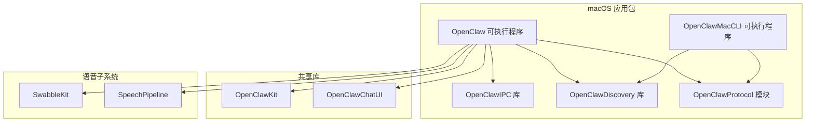
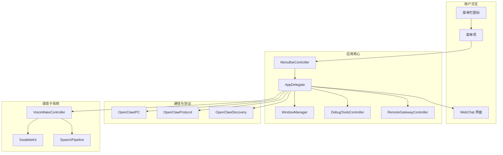
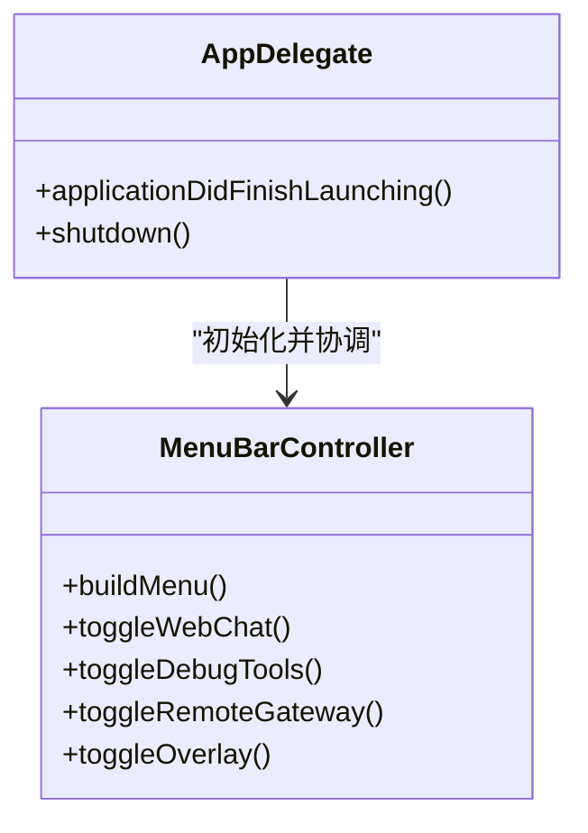
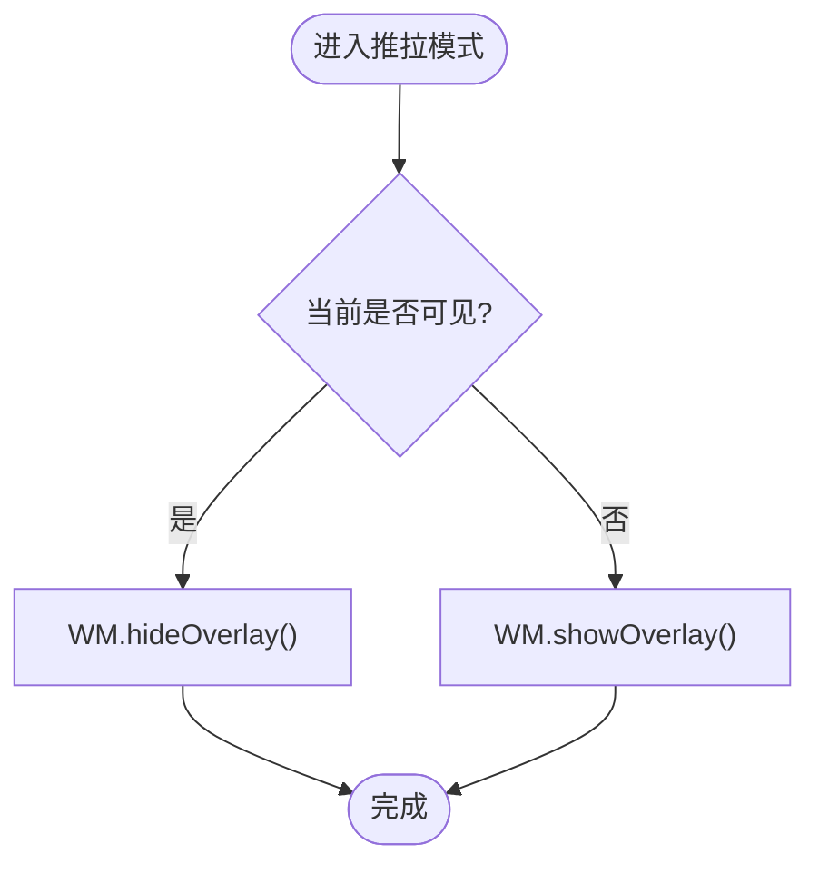
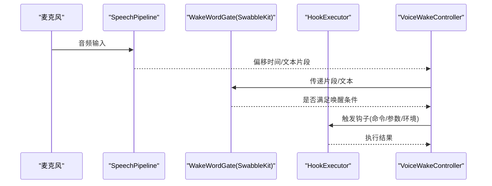
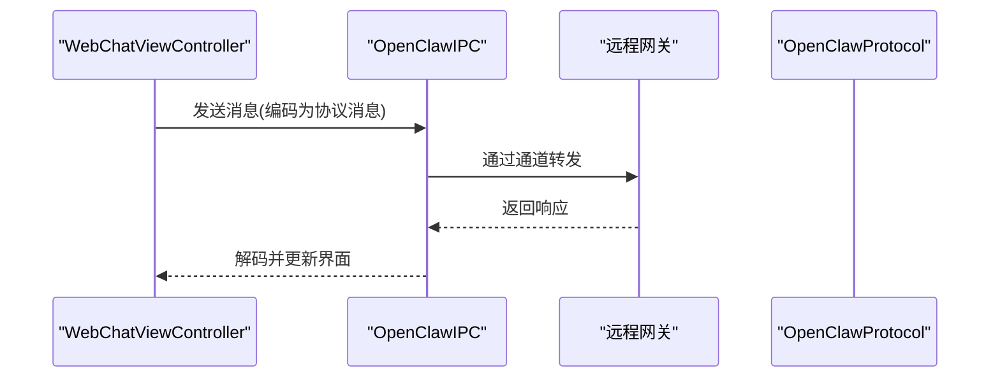
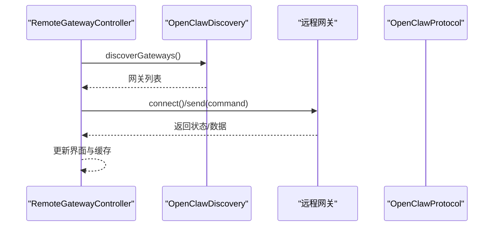
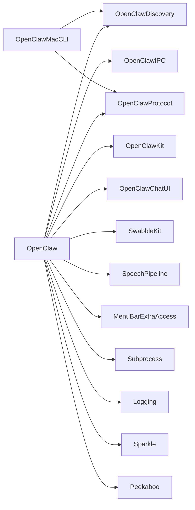
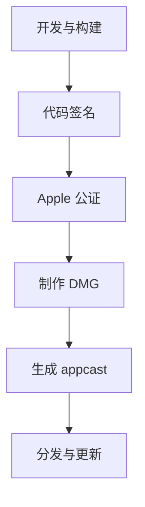

# macOS 应用

## 目录
1. [简介](#简介)
2. [项目结构](#项目结构)
3. [核心组件](#核心组件)
4. [架构总览](#架构总览)
5. [详细组件分析](#详细组件分析)
6. [依赖关系分析](#依赖关系分析)
7. [性能与并发特性](#性能与并发特性)
8. [权限与安全](#权限与安全)
9. [开发与发布流程](#开发与发布流程)
10. [故障排查指南](#故障排查指南)
11. [结论](#结论)
12. [附录](#附录)

## 简介
本文件面向 OpenClaw 的 macOS 菜单栏应用，系统性梳理其架构设计、菜单栏集成、语音唤醒、推拉模式叠加层、WebChat 聊天界面、调试工具集与远程网关控制等核心能力，并补充权限管理与安全签名流程、开发环境配置、打包发布步骤及常见问题解决方案。文档同时提供代码级关系图与调用序列图，帮助开发者快速定位实现位置与扩展点。

## 项目结构
OpenClaw macOS 应用位于 `apps/macos` 目录，采用 Swift Package Manager 组织多目标产物：菜单栏可执行程序、IPC 库、发现库、协议库与 CLI 工具；同时复用共享库 OpenClawKit 提供跨平台能力；语音唤醒能力由独立子模块 Swabble 提供。

## 核心组件
- 菜单栏集成与主控制器
  - AppDelegate：应用生命周期与菜单栏图标初始化
  - MenuBarController：菜单项、弹出菜单与快捷操作
- 窗口与界面
  - WindowManager：窗口管理、层级与可见性控制
  - WebChatViewController：内嵌 WebChat 界面与消息交互
- 语音唤醒
  - VoiceWakeController：基于 Swabble 的唤醒词检测与钩子执行
  - SpeechPipeline：音频采集、分析与转写流
- 推拉模式叠加层
  - 通过 WindowManager 与菜单控制实现“推”（显示）/“拉”（隐藏）行为
- 调试工具集
  - DebugToolsController：日志、状态与诊断工具入口
- 远程网关控制
  - RemoteGatewayController：远程节点发现、连接与控制
- IPC 与协议
  - OpenClawIPC：进程间通信抽象
  - OpenClawProtocol：消息协议定义
  - OpenClawDiscovery：本地/远程网关发现

## 架构总览
OpenClaw macOS 应用以菜单栏为中心，围绕 IPC 与协议模块实现与后端网关的通信；语音子系统 Swabble 提供本地唤醒与转写；UI 层通过 WebChatViewController 实现聊天界面；WindowManager 负责窗口与叠加层管理；DebugToolsController 提供运行时诊断；RemoteGatewayController 负责远程网关发现与控制。

## 详细组件分析

### 菜单栏与主控制器
- AppDelegate：负责应用启动、委托设置与菜单栏图标注册
- MenuBarController：构建菜单树、响应点击事件、触发各功能模块

### 窗口管理与推拉模式叠加层
- WindowManager：统一管理窗口层级、透明度、置顶与可见性
- 推拉模式：通过菜单项或快捷键切换 Overlay 显示/隐藏，结合 Peekaboo 自动化能力实现无侵入叠加

### 语音唤醒系统
- VoiceWakeController：封装 Swabble 的唤醒词检测与钩子执行
- Swabble 架构要点：
  - SpeechPipeline：AVAudioEngine 输入 → 分析器 → 转写器 → 异步流输出
  - SwabbleKit：多平台唤醒门控工具（支持基于片段间隙的门控）
  - HookExecutor：按配置执行外部命令，注入环境变量与前缀

### WebChat 聊天界面
- WebChatViewController：承载 WebChat 页面，与后端网关通过 IPC 协议通信
- 支持消息发送、历史记录、状态同步与错误提示

### 调试工具集
- DebugToolsController：提供日志查看、状态面板、诊断开关与一键重置功能
- 与 IPC/协议配合，支持远程诊断与本地排障

### 远程网关控制
- RemoteGatewayController：发现本地/远程网关、建立连接、下发指令与状态上报
- Discovery：基于 OpenClawDiscovery 提供的发现接口进行网关枚举与健康检查

## 依赖关系分析
- 包依赖
  - OpenClaw 主应用依赖 OpenClawIPC、OpenClawDiscovery、OpenClawKit、Swabble、MenuBarExtraAccess、Subprocess、Logging、Sparkle、Peekaboo 等
  - OpenClawMacCLI 依赖 Discovery 与协议库
- 目标产物
  - OpenClaw（菜单栏应用）、OpenClawIPC（库）、OpenClawDiscovery（库）、OpenClawMacCLI（命令行工具）

## 性能与并发特性
- 并发模型
  - Swift 6.2 StrictConcurrency 启用，确保线程安全与类型安全
  - 语音管道使用异步流输出转写结果，避免阻塞主线程
- 资源占用
  - 语音处理在本地进行，避免网络往返开销
  - Overlay 与 WebChat 使用轻量窗口管理策略，减少 GPU/CPU 占用
- 可扩展性
  - IPC 与协议解耦，便于新增网关或通道
  - SwabbleKit 提供可复用的唤醒门控逻辑，便于移植到其他应用

## 权限与安全
- TCC 权限
  - 辅助功能权限：用于窗口管理与自动化（如 Peekaboo）
  - 屏幕录制权限：用于 Overlay 与截图/录屏相关功能
  - 麦克风权限：用于语音唤醒与转写
- 安全签名与公证
  - 代码签名脚本：对应用二进制进行签名
  - 雪绒花公证：提交二进制进行 Apple 公证，提升分发可信度
- 最佳实践
  - 仅请求必要权限并在首次使用时引导用户授权
  - 将敏感日志与数据存储在受保护目录中
  - 使用 Sparkle 进行安全更新

## 开发与发布流程
- 开发环境
  - macOS 15+，Xcode 或 Swift 命令行工具
  - Swift 6.2，启用 StrictConcurrency
- 构建与运行
  - 使用 SwiftPM 构建 OpenClaw 主应用与 CLI
  - 在菜单栏运行 OpenClaw，打开 WebChat 与调试工具
- 打包与分发
  - 打包脚本生成 .app 包
  - 制作 DMG 安装镜像
  - 生成 appcast 用于 Sparkle 自动更新

## 故障排查指南
- 语音无法唤醒
  - 检查麦克风权限与设备选择
  - 使用 Swabble CLI `doctor`/`health`/`status` 检查授权与状态
- Overlay 不显示
  - 确认辅助功能权限已授予
  - 检查窗口层级与置顶设置
- WebChat 无法连接
  - 查看 IPC 日志与协议版本
  - 确认网关可达与认证信息正确
- 更新失败
  - 检查公证状态与 appcast 配置
  - 重新执行签名与公证流程

## 结论
OpenClaw macOS 应用以菜单栏为核心，结合 IPC/协议、Swabble 语音子系统与 WebChat 界面，提供了完整的本地化控制与远程网关交互能力。通过严格的并发模型、清晰的模块边界与完善的权限/签名流程，应用在易用性与安全性之间取得平衡。建议后续完善 launchd 控制、增强日志脱敏与扩展更多网关通道。

## 附录
- 关键实现位置参考
  - 应用入口与主循环：`apps/macos/Sources/OpenClaw/main.swift`
  - CLI 入口：`apps/macos/Sources/OpenClawMacCLI/main.swift`
  - 语音子系统入口：`Swabble/Sources/swabble/main.swift`
  - 语音管道与门控：`Swabble/Sources/SwabbleCore/Speech/SpeechPipeline.swift`、`Swabble/Sources/SwabbleKit/WakeWordGate.swift`
  - IPC 与协议：`apps/macos/Sources/OpenClawIPC/IPC.swift`、`apps/macos/Sources/OpenClawProtocol/Protocol.swift`
  - 发现模块：`apps/macos/Sources/OpenClawDiscovery/Discovery.swift`