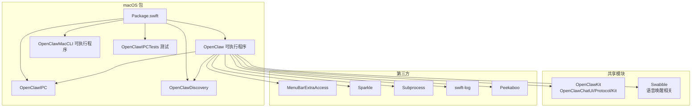
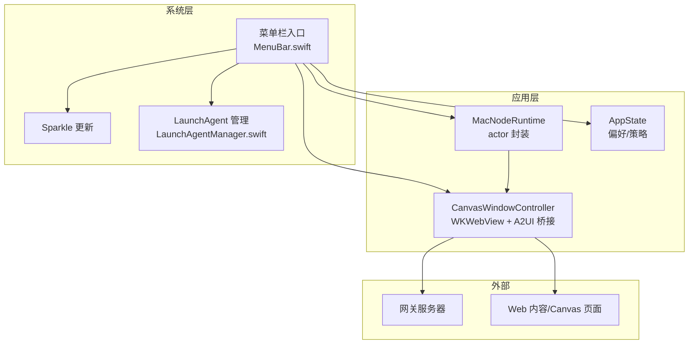
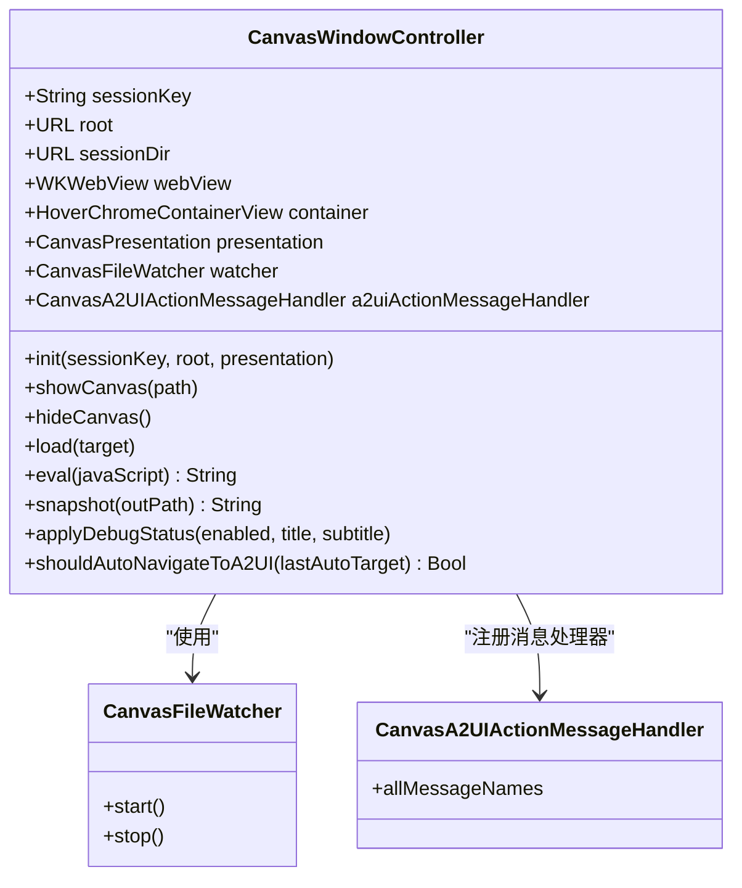
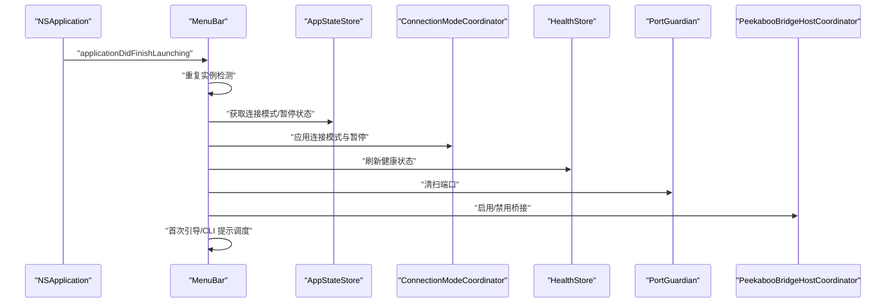
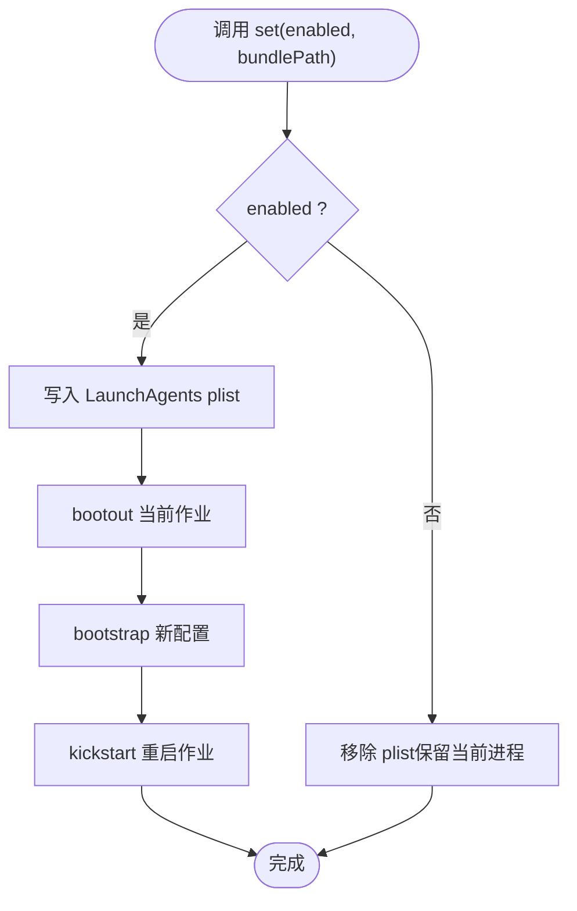
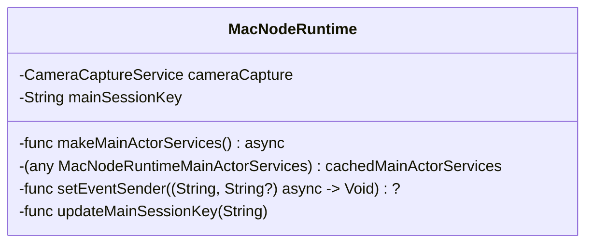
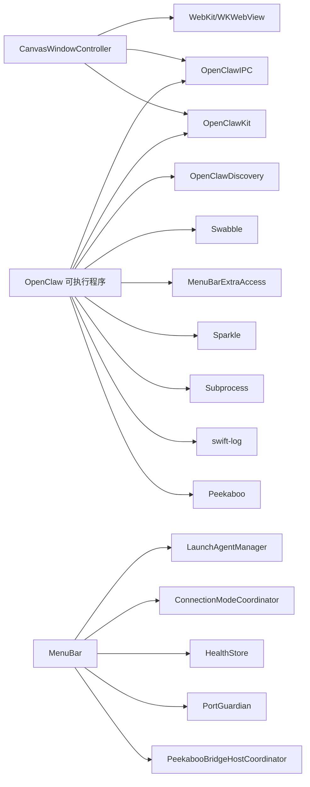

# 应用架构设计

## 目录
1. [引言](#引言)
2. [项目结构](#项目结构)
3. [核心组件](#核心组件)
4. [架构总览](#架构总览)
5. [详细组件分析](#详细组件分析)
6. [依赖关系分析](#依赖关系分析)
7. [性能考虑](#性能考虑)
8. [故障排除指南](#故障排除指南)
9. [结论](#结论)

## 引言
本文件面向 OpenClaw macOS 应用，系统性阐述其整体架构设计与实现要点，重点覆盖以下方面：
- SwiftUI 应用生命周期管理与根视图容器设计（RootCanvas 与 RootTabs 的对比）
- 应用状态管理与组件间通信机制
- 模块化组织方式、依赖注入模式与架构分层原则
- 具体的启动流程、视图导航与状态同步实现路径
- 与网关服务器的连接管理、会话状态维护与错误处理策略

本说明以仓库现有代码为依据，提供可追溯的“章节来源”与“图表来源”，帮助读者从宏观到微观逐步理解系统。

## 项目结构
OpenClaw macOS 应用位于 `apps/macos` 目录，采用 Swift Package 管理多目标产物：库（OpenClawIPC、OpenClawDiscovery）、可执行程序（OpenClaw、openclaw-mac）以及测试目标。该包通过产品依赖整合 OpenClawKit（含聊天 UI、协议与工具）、Swabble（语音唤醒相关）、MenuBarExtraAccess、Subprocess、Logging、Sparkle、Peekaboo 等外部依赖。

## 核心组件
- Canvas 窗口控制器：负责基于 WKWebView 的 Canvas 容器、A2UI 行为桥接、文件监听自动刷新、调试状态注入与窗口呈现/隐藏逻辑。
- 菜单栏入口与生命周期：MenuBar.swift 实现应用启动、去重实例、自动登录、连接模式协调、健康检查、端口清理、Peekaboo 桥接启用等。
- 应用状态与启动项：LaunchAgentManager 管理开机自启；AppState 提供偏好读写与策略应用；AppActivationPolicy 控制 Dock 图标可见性。
- 节点运行时：MacNodeRuntime actor 封装摄像头、主任务服务缓存、事件发送回调与会话键更新。
- SwiftUI 根视图（iOS 对比参考）：RootCanvas/RootTabs 展示了跨平台的根容器设计思路与环境注入模式。

## 架构总览
OpenClaw macOS 采用“菜单栏常驻 + Canvas 窗口 + 运行时节点”的组合架构：
- 菜单栏入口统一管理应用生命周期与系统集成（自动登录、Sparkle 更新、健康检查、端口清扫、Peekaboo 桥接）。
- CanvasWindowController 作为根视图容器，承载 WKWebView 并注入 A2UI 行为桥接脚本，支持本地文件监听与自动刷新。
- MacNodeRuntime actor 负责节点侧能力（摄像头、主任务服务）与事件发送回调，配合会话键进行状态同步。
- SwiftUI 根视图（iOS 对比）展示了环境注入与场景生命周期联动，macOS 可借鉴此模式在 Canvas 中注入环境对象。

## 详细组件分析

### Canvas 窗口控制器（CanvasWindowController）
CanvasWindowController 是 macOS Canvas 的核心容器，职责包括：
- 初始化 WKWebView 配置、URL Scheme 处理器与开发者选项。
- 注入 A2UI 行为桥接脚本，将 DOM 事件转换为应用内动作或深链触发。
- 基于 CanvasFileWatcher 的本地文件变更自动刷新。
- 窗口呈现/隐藏、锚定面板、调试状态注入与快照导出。
- 会话键安全化与会话目录隔离，确保多会话隔离与持久化。

### 应用生命周期与菜单栏入口（MenuBar.swift）
MenuBar.swift 在应用启动阶段完成：
- 重复实例检测与终止，避免并发运行。
- 应用激活策略应用（Dock 图标可见性）。
- 连接模式协调、健康检查、端口清扫、Peekaboo 桥接启用。
- 首次运行引导提示调度与 CLI 安装提示。

### 启动项与自动登录（LaunchAgentManager）
LaunchAgentManager 提供开机自启的查询与设置能力：
- 查询当前 LaunchAgent 状态。
- 写入 plist 并通过 launchctl bootout/bootstrap/kickstart 生效。
- 支持禁用后保留当前进程运行，避免启动方式导致的崩溃。

### 应用状态与策略（AppState）
AppState 提供偏好读写与策略应用接口，例如：
- 更新“随系统启动”策略。
- 读取 Canvas 开关偏好等。

这些偏好通常由菜单栏设置界面或引导流程写入，并在启动时由菜单栏入口应用。

### 节点运行时（MacNodeRuntime）
MacNodeRuntime actor 封装节点侧能力：
- 摄像头捕获服务。
- 主任务服务的延迟构建与缓存。
- 事件发送回调设置与主会话键更新。
- 通过 actor 保证并发安全与状态一致性。

### SwiftUI 根视图容器（iOS 对比参考）
虽然 macOS 使用 CanvasWindowController 作为根容器，但 iOS 的 RootCanvas/RootTabs 展示了跨平台一致的根视图设计与环境注入模式：
- RootCanvas 通过环境对象注入应用模型、语音唤醒管理器与场景相位，控制 Canvas 内容与样式。
- RootTabs 展示了标签页导航与状态管理。
- iOS OpenClawApp 展示了 @main 入口、环境注入与深链处理。

这些模式可作为 macOS Canvas 视图层的参考，用于在 Canvas 中注入环境对象、处理深链与场景生命周期。

### 跨平台主题适配（OpenClawChatUI/ChatTheme.swift）
OpenClawChatUI/ChatTheme.swift 展示了针对不同平台的颜色与背景适配，macOS 使用 NSColor，其他平台使用 UIColor，体现了模块化 UI 组件对平台差异的抽象。

## 依赖关系分析
- 包级依赖：OpenClaw 可执行程序依赖 OpenClawIPC、OpenClawDiscovery、OpenClawKit、Swabble、MenuBarExtraAccess、Subprocess、Logging、Sparkle、Peekaboo 等。
- 运行时依赖：CanvasWindowController 依赖 OpenClawIPC、OpenClawKit、WebKit、Foundation；MenuBar.swift 依赖 LaunchAgentManager、ConnectionModeCoordinator、HealthStore、PortGuardian、PeekabooBridgeHostCoordinator 等。
- 分层体现：UI 层（CanvasWindowController）与业务层（MacNodeRuntime、ConnectionModeCoordinator）通过环境注入与回调解耦。

## 性能考虑
- Canvas 自动刷新：CanvasFileWatcher 基于文件系统事件触发 WKWebView reload，建议仅在本地 Canvas 内容显示时启用，避免不必要的重载。
- JS 注入与脚本执行：A2UI 桥接脚本在文档开始注入，注意脚本复杂度与异常捕获，防止影响页面加载。
- actor 并发：MacNodeRuntime 使用 actor 封装共享资源，降低锁竞争与竞态风险。
- 窗口与渲染：CanvasWindowController 设置 drawsBackground 以减少透明底叠加带来的渲染开销。

[本节为通用指导，不直接分析具体文件]

## 故障排除指南
- Canvas 无法加载本地文件：确认 `load(target:)` 的路径解析逻辑与文件存在性判断，确保允许访问的目录范围正确。
- A2UI 动作未触发：检查 WKScriptMessageHandler 注册与 DOM 事件监听是否生效，确认深链参数与 key 正确。
- Canvas 无自动刷新：确认 CanvasFileWatcher 是否处于监听状态且仅在本地 Canvas 场景下触发 reload。
- 启动项无效：通过 LaunchAgentManager 检查 plist 写入与 launchctl 命令返回值，必要时手动清理旧配置。
- 调试状态不显示：确认 applyDebugStatusIfNeeded 的 JS 注入是否成功执行。

## 结论
OpenClaw macOS 应用通过菜单栏入口统一管理生命周期与系统集成，以 CanvasWindowController 为核心容器承载 Web 内容与 A2UI 行为桥接，结合 MacNodeRuntime actor 实现节点侧能力与状态同步。iOS 的 SwiftUI 根视图容器为跨平台设计提供了参考模式。整体架构遵循模块化与分层原则，依赖注入与环境注入贯穿 UI 与业务层，便于扩展与维护。