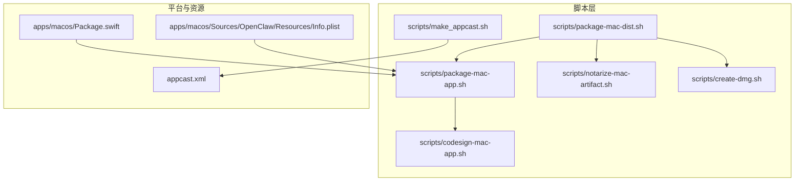
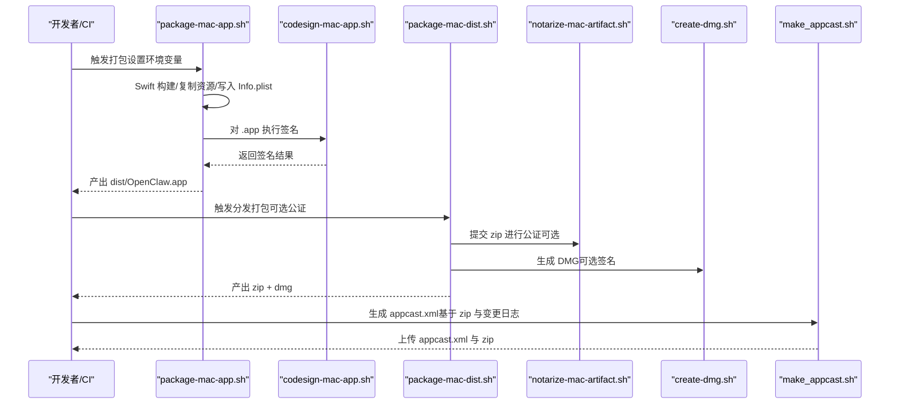
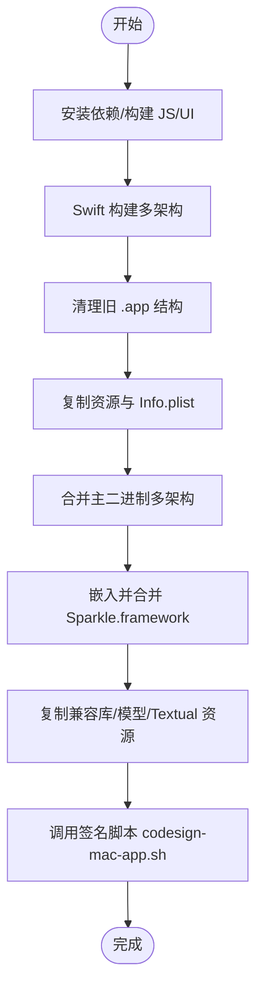
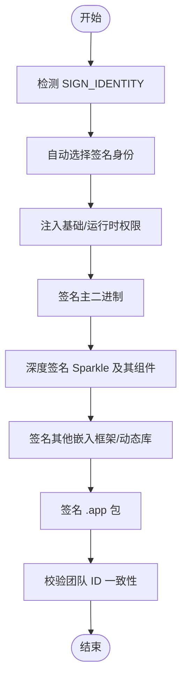
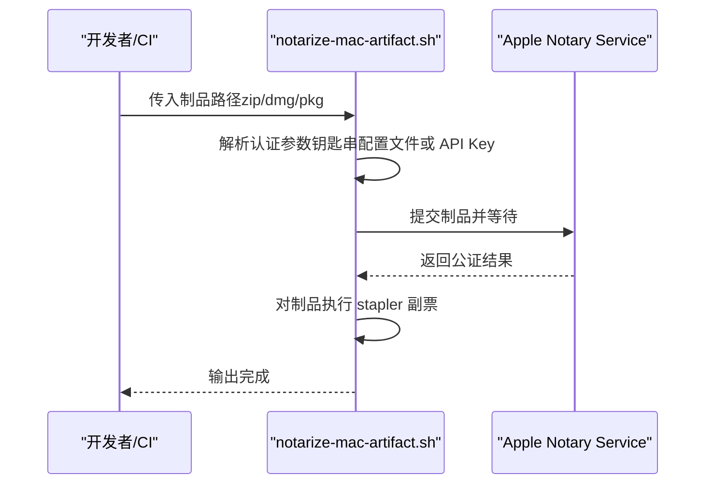
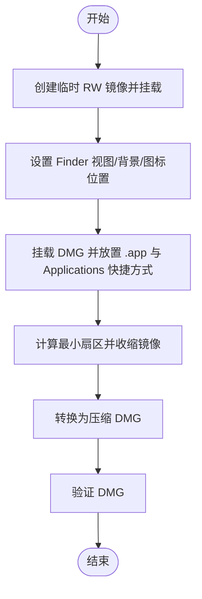
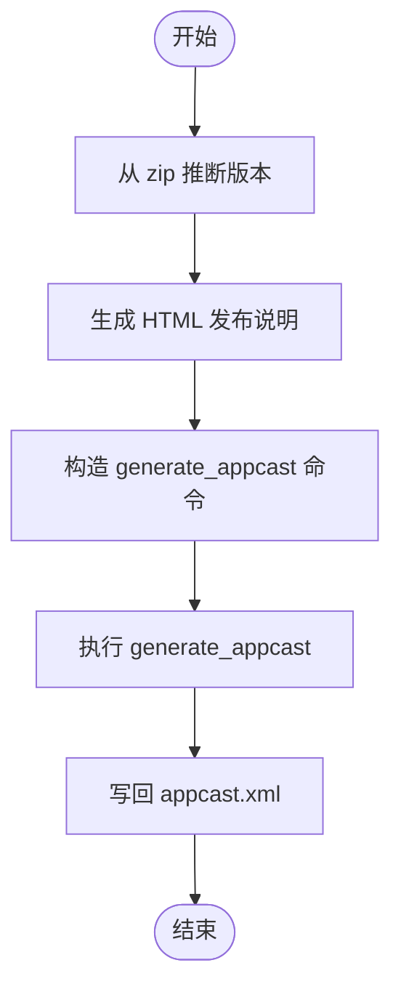
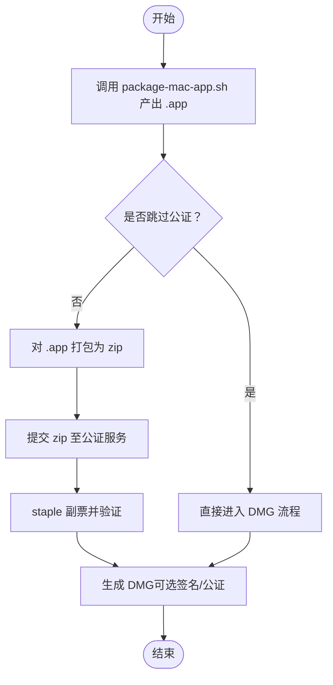
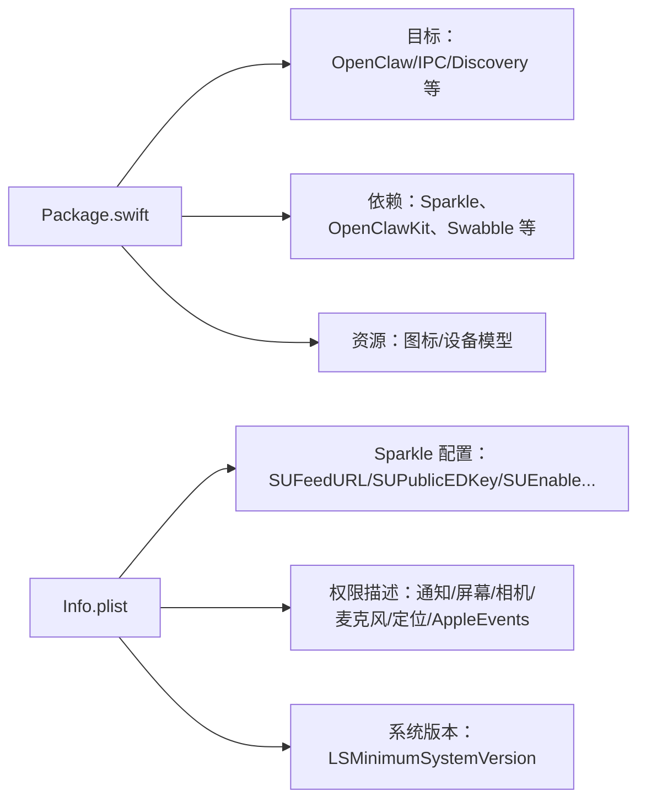
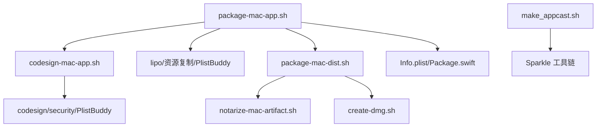

# 打包与签名流程

## 目录
1. [简介](#简介)
2. [项目结构](#项目结构)
3. [核心组件](#核心组件)
4. [架构总览](#架构总览)
5. [详细组件分析](#详细组件分析)
6. [依赖关系分析](#依赖关系分析)
7. [性能考量](#性能考量)
8. [故障排查指南](#故障排查指南)
9. [结论](#结论)
10. [附录](#附录)

## 简介
本文面向 OpenClaw macOS 应用的打包、签名与分发流程，系统性阐述以下主题：
- 构建与打包：从 Swift 源码到可分发 .app、zip、DMG 的完整流水线
- 代码签名策略：开发签名与发布签名差异、证书选择、权限与团队 ID 校验
- 公证与钉审：notarytool 提交、staple 副票、验证
- 自动更新机制：Sparkle 集成、appcast 生成与发布
- 分发渠道管理：zip（Sparkle）、DMG（用户友好）、GitHub Releases
- 环境变量与脚本使用：参数、认证凭据、可选开关
- 常见问题与排错：签名失败、团队 ID 不一致、公证失败等

## 项目结构
围绕 macOS 打包与签名的关键目录与文件如下：
- 脚本层：scripts 下提供打包、签名、公证、DMG 制作、appcast 生成等自动化脚本
- 平台定义：apps/macos/Package.swift 声明目标产物与依赖（含 Sparkle）
- 应用清单：apps/macos/Sources/OpenClaw/Resources/Info.plist 定义 Bundle 信息与 Sparkle 参数
- 发布清单：appcast.xml 作为 Sparkle 更新源

## 核心组件
- 打包脚本：负责 Swift 构建、复制资源、写入 Info.plist、合并多架构二进制、嵌入 Sparkle、执行签名
- 签名脚本：自动选择证书、注入权限、深度签名 Sparkle、校验团队 ID、支持 ad-hoc 降级
- 公证脚本：提交 zip/pkg 或 DMG 至 Apple Notary Service，staple 副票并验证
- DMG 制作：生成带背景、图标布局、Applications 快捷方式的最终分发镜像
- appcast 生成：基于 zip 和变更日志生成 Sparkle 更新源，签名发布条目
- 平台与清单：Package.swift 声明 Sparkle 依赖；Info.plist 注入 SUFeedURL、SUPublicEDKey、自动检查开关等

## 架构总览
下图展示从构建到分发的端到端流程，包括签名与公证的关键节点。

## 详细组件分析

### 组件一：打包与资源装配（package-mac-app.sh）
职责与要点：
- 通过 SwiftPM 构建指定架构产物，支持多架构合并
- 复制资源（图标、设备模型、Textual 资源、OpenClawKit 资源）
- 写入 Info.plist：Bundle ID、版本号、构建号、时间戳、Git 提交、Sparkle 参数
- 嵌入 Sparkle.framework，并在多架构时合并各架构的 Mach-O
- 清理旧签名后安装主二进制，随后调用签名脚本完成签名

关键行为与复杂度：
- 多架构合并涉及 lipo 操作，时间复杂度与文件数量和架构数相关
- 资源复制与 Info.plist 修改为 O(n) 操作（n 为资源项）

### 组件二：代码签名策略（codesign-mac-app.sh）
职责与要点：
- 自动选择签名身份：优先 Developer ID Application，其次 Apple Distribution，再次 Apple Development，最后允许降级为 ad-hoc（需显式允许）
- 注入权限：基础权限与运行时权限（runtime），支持禁用库验证以适配开发场景
- 深度签名：对 Sparkle 框架及其 Helper、XPC、Updater.app 等进行逐项签名
- 团队 ID 校验：遍历二进制，确保与主应用一致，否则报错并给出建议
- 时间戳策略：根据证书类型与配置决定是否启用时间戳

### 组件三：公证与副票（notarize-mac-artifact.sh）
职责与要点：
- 支持两种认证方式：钥匙串配置文件或 App Store Connect API Key（Key、Key ID、Issuer）
- 提交 zip/pkg 或 DMG 至 Apple Notary Service，等待完成
- 对 DMG 与 .app（可选）执行 stapler 副票并验证

### 组件四：DMG 制作（create-dmg.sh）
职责与要点：
- 生成只读临时镜像，挂载后设置 Finder 视图、背景、图标位置
- 将 .app 与 /Applications 快捷方式放入镜像，再转换为压缩 DMG
- 可配置窗口大小、图标尺寸、背景图、额外扇区等参数

### 组件五：Sparkle 自动更新与 appcast（make_appcast.sh）
职责与要点：
- 从 zip 文件推断版本，生成 HTML 变更日志
- 使用 Sparkle 工具生成 appcast.xml，嵌入发布说明与下载链接
- 通过 ed25519 私钥对更新条目进行签名，便于 Sparkle 验证

### 组件六：分发打包与公证（package-mac-dist.sh）
职责与要点：
- 默认构建通用二进制（Apple Silicon + Intel），产出 .app
- 可选公证：对 .app 打包为 zip 后提交公证，staple 副票
- 生成 DMG：可选对 DMG 进行签名与公证
- 通过环境变量控制是否跳过公证、签名身份等

### 组件七：平台与清单（Package.swift 与 Info.plist）
- Package.swift：声明产品（可执行、库）、依赖（含 Sparkle）、资源拷贝与 Swift 特性开关
- Info.plist：定义 Bundle 信息、系统要求、权限描述、Sparkle 参数（SUFeedURL、SUPublicEDKey、自动检查开关）

## 依赖关系分析
- 打包脚本依赖 SwiftPM 构建、lipo 合并、PlistBuddy 写入、资源复制
- 签名脚本依赖系统 codesign、安全框架（security）、PlistBuddy、Sparkle 深度签名
- 公证脚本依赖 xcrun notarytool 与 stapler
- DMG 制作依赖 hdiutil、AppleScript、SetFile
- appcast 生成依赖 Sparkle 工具链与变更日志脚本

## 性能考量
- 多架构合并：lipo 合并操作的时间与文件数量和架构数成正比，建议在 CI 中缓存中间产物
- 资源复制：批量复制资源与 Info.plist 修改为线性开销，注意避免重复复制
- 公证耗时：公证与 stapler 为外部 I/O 密集型任务，建议在 CI 中并行化其他步骤
- DMG 体积：合理设置额外扇区与背景图，避免过度膨胀镜像体积

[本节为通用指导，不直接分析具体文件]

## 故障排查指南
- 开发签名与发布签名区别
  - 开发签名：Apple Development 或 ad-hoc；权限持久性受限（ad-hoc 不保留 TCC 权限）
  - 发布签名：Developer ID Application；支持时间戳与严格团队 ID 校验
- 团队 ID 不一致
  - 现象：签名后校验发现嵌入框架/二进制的 TeamIdentifier 与主应用不一致
  - 处理：重新签名嵌入框架，或在开发阶段启用禁用库验证的开关
- 公证失败
  - 现象：notarytool 提交失败或缺少认证参数
  - 处理：配置钥匙串配置文件或 App Store Connect API Key；确认制品未被篡改
- DMG 无法打开或提示未公证
  - 现象：macOS 提示“无法验证开发者”
  - 处理：对 DMG 与 .app 执行 stapler 副票并验证
- Sparkle 更新不生效
  - 现象：应用不显示更新或签名验证失败
  - 处理：确保 appcast.xml 与 zip 同步，ed25519 私钥正确，SUFeedURL 与 SUPublicEDKey 配置正确

## 结论
OpenClaw 的 macOS 打包与签名流程通过一组脚本实现了从构建、签名、公证到分发的全链路自动化。开发与发布签名策略清晰区分，团队 ID 校验与 Sparkle 集成保障了安全性与可用性。遵循本文档的环境变量配置与排错建议，可在本地与 CI 中稳定地产出可分发的 .app、zip 与 DMG，并通过 appcast 实现可靠的自动更新。

[本节为总结，不直接分析具体文件]

## 附录

### 环境变量与脚本使用示例（摘要）
- 签名相关
  - `SIGN_IDENTITY`：指定签名证书（如 Apple Development/Developer ID Application）
  - `ALLOW_ADHOC_SIGNING=1`：允许降级为 ad-hoc（开发调试）
  - `CODESIGN_TIMESTAMP`：auto|on|off（默认 auto）
  - `DISABLE_LIBRARY_VALIDATION=1`：禁用库验证（开发场景）
  - `SKIP_TEAM_ID_CHECK=1`：跳过团队 ID 校验（开发场景）
- 公证相关
  - `NOTARYTOOL_PROFILE`：钥匙串配置文件
  - `NOTARYTOOL_KEY`/`NOTARYTOOL_KEY_ID`/`NOTARYTOOL_ISSUER`：API Key 认证
  - `STAPLE_APP_PATH`：公证完成后对 .app 执行 stapler
- 打包与分发
  - `BUILD_ARCHS`：默认 all（通用二进制），可设为 arm64/x86_64 单架构
  - `SKIP_NOTARIZE=1`：跳过公证流程
  - `BUNDLE_ID`：Bundle Identifier（调试默认为 .debug）
  - `SPARKLE_PUBLIC_ED_KEY`/`SPARKLE_FEED_URL`：Sparkle 公钥与更新源
  - `SPARKLE_PRIVATE_KEY_FILE`：ed25519 私钥（用于 appcast 签名）
  - `SPARKLE_RELEASE_VERSION`：发布版本（未设置时从 zip 名称推断）
  - `SPARKLE_DOWNLOAD_URL_PREFIX`：下载前缀
- DMG 相关
  - `DMG_VOLUME_NAME`/`DMG_BACKGROUND_PATH`/`DMG_ICON_SIZE` 等：Finder 视图与背景
  - `SKIP_DMG_STYLE=1`：跳过 Finder 样式设置

使用示例（命令行片段路径，不含具体代码内容）：
- 设置签名身份并执行打包与签名：`scripts/package-mac-app.sh`
- 提交 zip 公证并 staple：`scripts/package-mac-dist.sh`
- 生成 appcast：`scripts/make_appcast.sh`
- 生成 DMG：`scripts/create-dmg.sh`