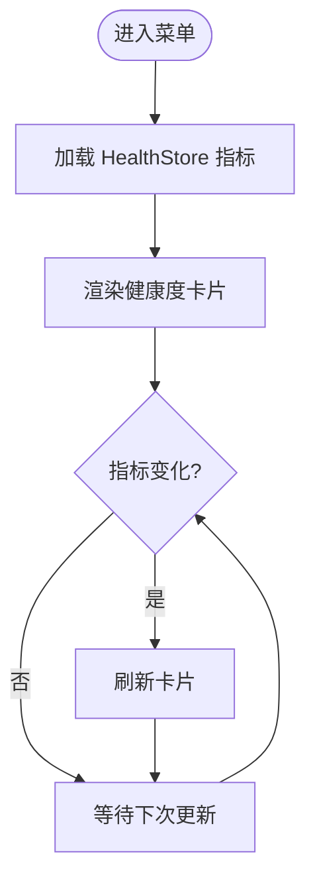

# 控制面板界面

## 目录
1. [简介](#简介)
2. [项目结构](#项目结构)
3. [核心组件](#核心组件)
4. [架构总览](#架构总览)
5. [详细组件分析](#详细组件分析)
6. [依赖关系分析](#依赖关系分析)
7. [性能考虑](#性能考虑)
8. [故障排除指南](#故障排除指南)
9. [结论](#结论)

## 简介
本文件面向 OpenClaw macOS 控制面板界面的技术文档，聚焦于菜单栏控制面板与 SwiftUI 视图层的实现，涵盖以下关键主题：
- 菜单栏状态监控与实时更新
- 系统健康检查与状态可视化
- 配置管理界面（通道、技能、实例、权限等）
- 实时状态显示与用户交互处理
- 与后端网关的通信协议、数据同步机制与错误恢复策略

该控制面板基于 Swift/SwiftUI 构建，通过菜单栏入口提供对网关状态、健康度、配置项与调试能力的统一访问，并在 macOS 上提供 Canvas、语音唤醒、Talk 模式等增强体验。

## 项目结构
OpenClaw macOS 应用位于 `apps/macos` 目录，采用模块化组织方式，核心模块包括：
- OpenClaw：主应用逻辑与 SwiftUI 视图
- OpenClawIPC：进程间通信库
- OpenClawDiscovery：网关发现与连接协调
- OpenClawMacCLI：macOS 命令行工具

## 核心组件
控制面板围绕以下核心组件构建：

- 菜单栏入口与状态卡片
  - MenuBar：菜单栏图标与上下文菜单
  - MenuContentView：菜单内容视图，承载状态卡片与快捷操作
  - MenuSessionsInjector：会话注入器，负责观察控制通道状态并触发 UI 更新

- 状态存储与观察
  - ControlChannel：控制通道状态（连接、认证、心跳等）
  - HealthStore：健康度指标（CPU、内存、磁盘、网络、服务可用性）
  - ConfigStore：配置读写与变更通知

- 配置管理界面
  - SettingsRootView：设置根视图
  - ChannelsSettings：通道配置（WhatsApp、Telegram、Slack 等）
  - CronSettings：定时任务配置
  - SkillsSettings：技能注册与启用
  - InstancesSettings：多实例配置
  - PermissionsSettings：系统权限与节点权限
  - DebugSettings：调试与诊断

- 实时功能
  - CanvasWindowController：Canvas 窗口控制器
  - VoiceWakeOverlayView：语音唤醒覆盖层
  - TalkOverlay：Talk 模式覆盖层
  - WebChatSwiftUI：WebChat SwiftUI 集成

## 架构总览
控制面板采用“状态驱动 + 即时观察”的设计模式：
- 状态源：ControlChannel（网关状态）、HealthStore（系统健康）、ConfigStore（配置）
- 观察者：MenuSessionsInjector 通过 `withObservationTracking` 订阅状态变化
- UI 层：SwiftUI 组件根据状态自动刷新，支持主队列更新与异步任务调度

## 详细组件分析

### 菜单栏状态监控与实时更新
- 状态订阅机制
  - 使用 `withObservationTracking` 跟踪 `ControlChannel.shared.state` 的依赖
  - `onChange` 回调中通过 `@MainActor` 切换到主线程执行 UI 更新
  - 递归重新订阅以确保持续观察

- 关键流程
  - 打开菜单时启动观察
  - 关闭菜单时取消所有挂起任务，避免内存泄漏
  - 状态变化时触发 `handleControlChannelStateChange` 并重新订阅

### 系统健康检查与可视化
- 健康度指标来源
  - CPU、内存、磁盘、网络、服务可用性等指标由 HealthStore 提供
  - 指标更新通过 Store 的内部机制触发，UI 自动响应

- 可视化组件
  - VisualEffectView：用于在窗口或视图上应用视觉效果材料与混合模式
  - HealthStore 与菜单内容视图结合，形成健康度状态卡片

### 配置管理界面
- 设置根视图
  - SettingsRootView 作为设置页面的容器，聚合各子设置模块

- 子设置模块
  - ChannelsSettings：通道配置（允许从、Webhook、分组策略等）
  - CronSettings：定时任务编辑与执行
  - SkillsSettings：技能启用与管理
  - InstancesSettings：多实例配置与切换
  - PermissionsSettings：系统权限与节点权限
  - DebugSettings：调试开关与诊断输出

- 数据流
  - ConfigStore 提供配置读写与变更通知
  - SwiftUI Binding 将配置项与 UI 组件双向绑定
  - 修改通过 IPC 发送到网关后端持久化

### 实时状态显示与用户交互
- Canvas 窗口
  - CanvasWindowController 管理 Canvas 窗口生命周期与导航
  - 支持 A2UI 动态内容推送与重置

- 语音与覆盖层
  - VoiceWakeOverlayView：语音唤醒覆盖层，提供热词检测与提示
  - TalkOverlay：Talk 模式覆盖层，支持连续对话与音频播放

- WebChat 集成
  - WebChatSwiftUI：将 WebChat 以 SwiftUI 形式集成到应用中

### 与后端网关的通信协议与数据同步
- 控制通道
  - ControlChannel 提供网关连接状态、认证状态、心跳等核心状态
  - MenuSessionsInjector 通过观察状态变化驱动 UI 更新

- IPC 与网关后端
  - OpenClawIPC 负责与网关后端进行消息传递
  - 配置修改通过 IPC 发送至网关，由网关持久化并广播状态变更

- 错误恢复策略
  - 断线重连：在连接异常时自动尝试重连
  - 心跳保活：定期发送心跳包维持连接
  - 降级显示：在网络不可用时显示离线状态并禁用相关功能

## 依赖关系分析
- 模块依赖
  - OpenClaw 依赖 OpenClawIPC、OpenClawDiscovery、OpenClawKit、Swabble、MenuBarExtraAccess、Sparkle、Peekaboo 等
  - OpenClawMacCLI 依赖 OpenClawDiscovery 与 OpenClawKit

- 外部依赖
  - SwiftUI：用于声明式 UI 构建
  - SwiftLog：日志记录
  - Sparkle：应用更新
  - Peekaboo：自动化与桥接能力

## 性能考虑
- 状态观察与内存管理
  - 在菜单关闭时取消所有挂起任务，避免内存泄漏与后台资源占用
  - 使用 `withObservationTracking` 精准跟踪依赖，减少不必要的重绘

- 主线程更新
  - 所有 UI 更新通过 `@MainActor` 切换到主线程，保证线程安全与流畅性

- 资源复用
  - Canvas 窗口与覆盖层组件按需初始化，避免常驻内存
  - 日志与诊断功能默认关闭，仅在需要时启用

## 故障排除指南
- 菜单无响应或状态不更新
  - 检查 ControlChannel 是否处于连接状态
  - 确认 MenuSessionsInjector 已启动观察且未被取消

- 健康度卡片不显示
  - 检查 HealthStore 是否成功加载指标
  - 确认 VisualEffectView 材质与混合模式配置正确

- 配置无法保存
  - 检查 ConfigStore 的写入权限与网关连接状态
  - 通过 DebugSettings 开启详细日志定位问题

- Canvas 或语音功能异常
  - 确认 CanvasWindowController 与 VoiceWakeOverlayView 初始化完成
  - 检查系统权限（屏幕录制、麦克风）是否已授予

## 结论
OpenClaw macOS 控制面板通过严格的状态驱动与即时观察机制，实现了对网关状态、系统健康与配置管理的统一可视化与交互。其模块化设计与清晰的依赖关系，使得扩展新功能与维护现有功能变得高效而稳健。配合 IPC 与网关后端的协同，控制面板不仅提供了直观的用户体验，也为开发者提供了完善的调试与诊断能力。