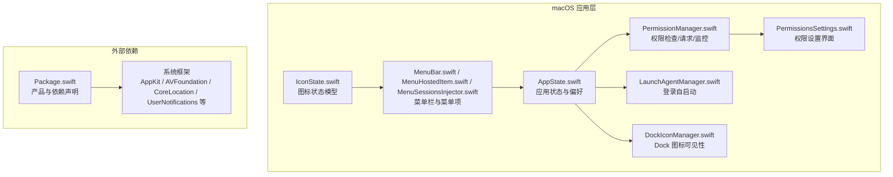
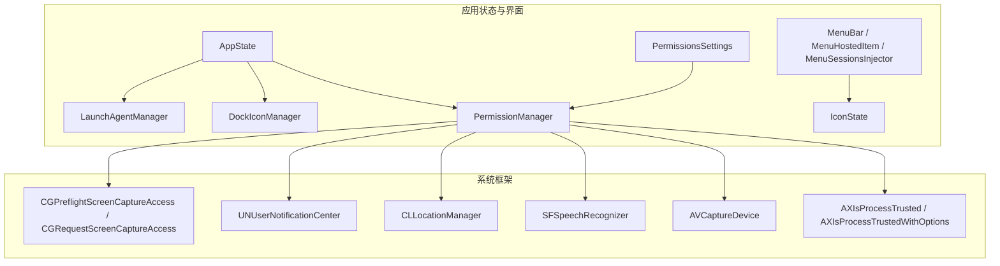
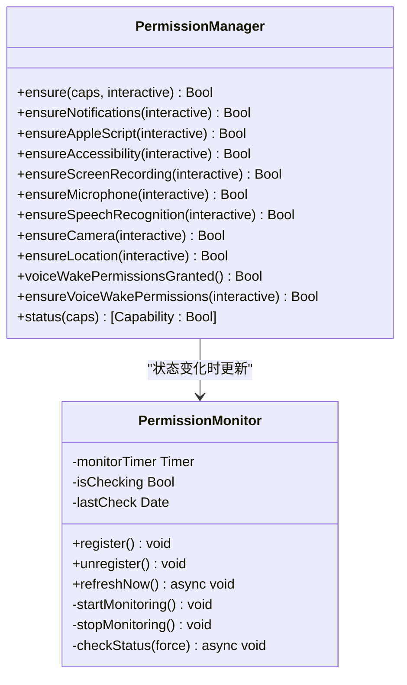
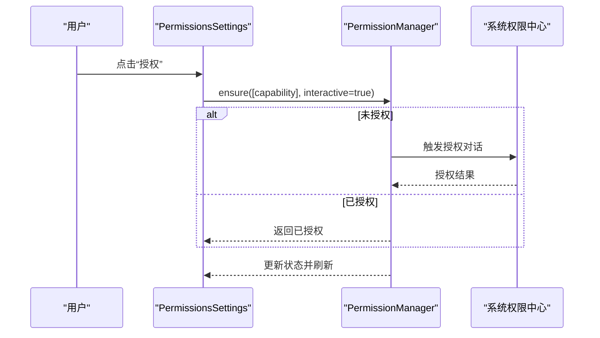
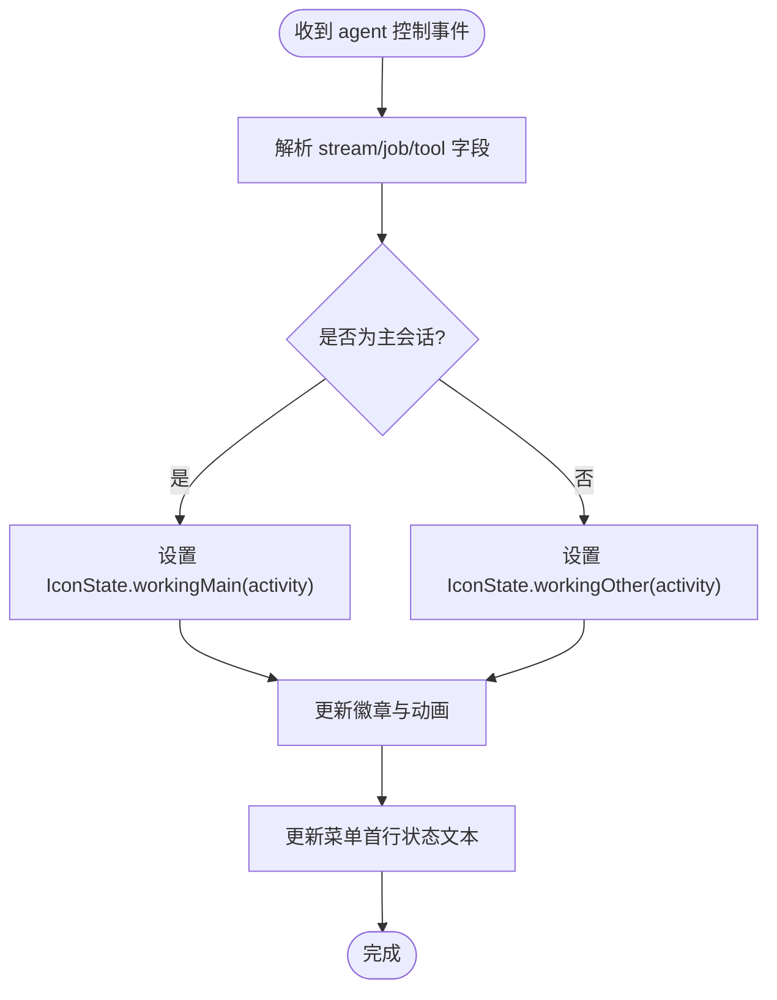
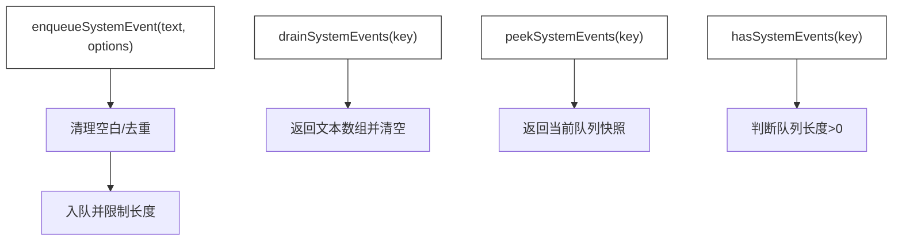
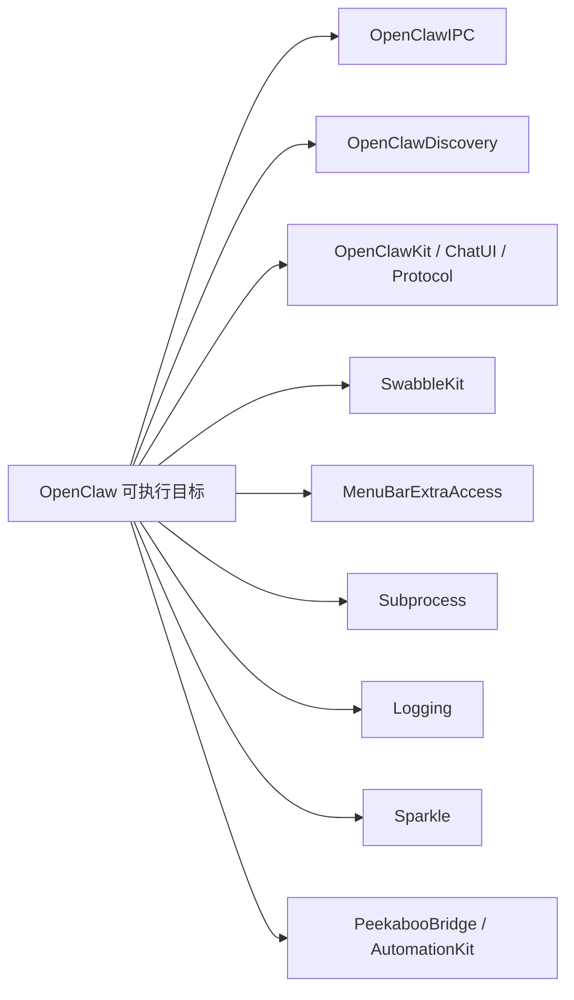

# 系统集成与权限

## 目录
1. [简介](#简介)
2. [项目结构](#项目结构)
3. [核心组件](#核心组件)
4. [架构总览](#架构总览)
5. [详细组件分析](#详细组件分析)
6. [依赖关系分析](#依赖关系分析)
7. [性能考量](#性能考量)
8. [故障排查指南](#故障排查指南)
9. [结论](#结论)
10. [附录](#附录)

## 简介
本文件面向 OpenClaw 在 macOS 平台的系统集成与权限管理，聚焦以下目标：
- 菜单栏集成：图标状态、徽章与交互逻辑
- 系统权限管理：通知、自动化（AppleScript）、辅助功能、屏幕录制、麦克风、语音识别、相机、位置等
- 后台服务运行：登录自启动与进程生命周期
- 系统事件响应：基于会话的状态聚合与事件队列
- 兼容性与稳定性：权限持久化、签名与路径一致性对权限提示的影响

## 项目结构
OpenClaw 的 macOS 组件主要位于 `apps/macos/Sources/OpenClaw`，围绕菜单栏应用、权限管理、后台运行与系统事件响应展开，并通过 `Package.swift` 声明依赖与产物。

## 核心组件
- 权限管理：统一的权限检查、交互式授权与状态监控，覆盖通知、AppleScript、辅助功能、屏幕录制、麦克风、语音识别、相机、位置等
- 应用状态：集中管理偏好、连接模式、远程传输、画布开关、心跳、菜单栏图标覆盖等
- 登录自启动：通过 launchd 的 LaunchAgent 管理开机自启
- Dock 图标可见性：根据窗口状态与用户偏好动态调整激活策略
- 菜单栏集成：图标状态与徽章、鼠标事件拦截、菜单项嵌入 SwiftUI 内容
- 系统事件：会话级事件队列与去重、出队与窥视接口

## 架构总览
下图展示了 macOS 端关键模块之间的交互关系，以及与系统框架的对接点。

## 详细组件分析

### 权限管理与状态监控
- 统一入口：`PermissionManager` 提供权限检查、交互式授权与批量状态查询
- 支持能力：通知、AppleScript、辅助功能、屏幕录制、麦克风、语音识别、相机、位置
- 交互策略：当权限未授权且交互模式开启时，触发系统授权对话；若被拒绝，则打开系统设置对应页面
- 状态监控：`PermissionMonitor` 周期性轮询权限状态，避免频繁刷新导致抖动

### 应用状态与后台运行
- 应用状态：`AppState` 负责加载/保存偏好、连接模式、远程参数、心跳、画布开关、图标覆盖等
- 登录自启动：`LaunchAgentManager` 通过写入 `LaunchAgents` plist 并调用 `launchctl bootstrap/bootout/kickstart` 实现开机自启
- Dock 可见性：`DockIconManager` 根据窗口可见性与用户偏好动态设置激活策略，保证后台运行时仍可显示 Dock 图标

### 菜单栏集成与图标状态
- 图标状态模型：`IconState` 描述 `idle`、`workingMain`、`workingOther`、`overridden` 四种状态及徽章强调级别
- 菜单栏渲染：`MenuBar.swift` 中通过透明覆盖视图拦截点击事件；`MenuHostedItem` 将 SwiftUI 内容嵌入 `NSMenuItem.view`
- 会话优先级：`MenuSessionsInjector` 根据主会话优先策略决定显示状态行与图标

### 系统事件响应与会话队列
- 事件入队：按会话键聚合文本，去重相邻重复事件，限制最大长度
- 出队与窥视：提供 `drain`/`peek`/`has` 接口，支持测试重置
- 与菜单栏联动：菜单状态行文本来源于最近一次事件队列内容

## 依赖关系分析
- 产品与目标：`Package.swift` 声明了 OpenClaw 可执行目标、库目标与外部依赖（如 `MenuBarExtraAccess`、`Subprocess`、`Logging`、`Sparkle`、`Peekaboo` 等）
- 模块耦合：`PermissionManager` 与系统框架强耦合；`AppState` 作为中枢协调权限、登录自启、Dock 可见性与菜单栏状态
- 外部集成：`LaunchAgentManager` 与 `launchctl` 交互；`DockIconManager` 与 `NSApp`/窗口观察者交互

## 性能考量
- 权限轮询节流：`PermissionMonitor` 最小检查间隔为 0.5 秒，避免频繁调用系统 API
- 事件队列去重：相邻重复事件直接跳过，减少无效渲染与日志噪声
- 菜单宽度缓存：`MenuSessionsInjector` 缓存菜单宽度，降低布局抖动
- 后台运行优化：`DockIconManager` 在无窗口时采用 `accessory` 策略，降低资源占用

## 故障排查指南
- 权限提示消失或不弹窗
  - 确保应用从固定路径运行（例如 `dist/OpenClaw.app`）
  - 使用真实签名证书，避免 ad-hoc 签名导致权限丢失
  - 如需重置，可通过 `tccutil` 清理特定权限条目
- 位置权限
  - 当要求“始终”授权时，系统可能需要额外确认；必要时打开系统设置对应页面
- 登录自启动
  - 若自启动失效，检查 `LaunchAgents` plist 是否存在，或通过 `launchctl` 重新 `bootstrap`
- 菜单栏图标异常
  - 检查 Dock 可见性策略与窗口可见性；必要时临时显示 Dock 以强制切换激活策略

## 结论
OpenClaw 在 macOS 上实现了完善的系统集成与权限管理：通过统一的权限管理器与状态监控，结合菜单栏图标与徽章、登录自启动与 Dock 可见性策略，以及会话级事件队列，提供了稳定、可调试且对用户友好的系统级体验。遵循权限持久化与签名要求，可显著提升权限提示的可靠性与用户体验。

## 附录
- 代码片段路径示例（请在相应文件中查看具体实现）
  - 权限检查与授权：`[apps/macos/Sources/OpenClaw/PermissionManager.swift](file://apps/macos/Sources/OpenClaw/PermissionManager.swift#L33-L52)`
  - 通知权限交互：`[apps/macos/Sources/OpenClaw/PermissionManager.swift](file://apps/macos/Sources/OpenClaw/PermissionManager.swift#L54-L75)`
  - 辅助功能权限交互：`[apps/macos/Sources/OpenClaw/PermissionManager.swift](file://apps/macos/Sources/OpenClaw/PermissionManager.swift#L85-L94)`
  - 屏幕录制权限交互：`[apps/macos/Sources/OpenClaw/PermissionManager.swift](file://apps/macos/Sources/OpenClaw/PermissionManager.swift#L96-L102)`
  - 麦克风权限交互：`[apps/macos/Sources/OpenClaw/PermissionManager.swift](file://apps/macos/Sources/OpenClaw/PermissionManager.swift#L104-L120)`
  - 语音识别权限交互：`[apps/macos/Sources/OpenClaw/PermissionManager.swift](file://apps/macos/Sources/OpenClaw/PermissionManager.swift#L122-L132)`
  - 相机权限交互：`[apps/macos/Sources/OpenClaw/PermissionManager.swift](file://apps/macos/Sources/OpenClaw/PermissionManager.swift#L134-L150)`
  - 位置权限交互：`[apps/macos/Sources/OpenClaw/PermissionManager.swift](file://apps/macos/Sources/OpenClaw/PermissionManager.swift#L152-L175)`
  - 位置授权请求器：`[apps/macos/Sources/OpenClaw/PermissionManager.swift](file://apps/macos/Sources/OpenClaw/PermissionManager.swift#L291-L373)`
  - AppleScript 权限探测与引导：`[apps/macos/Sources/OpenClaw/PermissionManager.swift](file://apps/macos/Sources/OpenClaw/PermissionManager.swift#L375-L419)`
  - 权限状态监控：`[apps/macos/Sources/OpenClaw/PermissionManager.swift](file://apps/macos/Sources/OpenClaw/PermissionManager.swift#L422-L490)`
  - 登录自启动管理：`[apps/macos/Sources/OpenClaw/LaunchAgentManager.swift](file://apps/macos/Sources/OpenClaw/LaunchAgentManager.swift#L9-L26)`
  - Dock 图标可见性：`[apps/macos/Sources/OpenClaw/DockIconManager.swift](file://apps/macos/Sources/OpenClaw/DockIconManager.swift#L24-L48)`
  - 菜单栏点击拦截：`[apps/macos/Sources/OpenClaw/MenuBar.swift](file://apps/macos/Sources/OpenClaw/MenuBar.swift#L208-L250)`
  - 菜单项 SwiftUI 嵌入：`[apps/macos/Sources/OpenClaw/MenuHostedItem.swift](file://apps/macos/Sources/OpenClaw/MenuHostedItem.swift#L1-L29)`
  - 菜单宽度计算：`[apps/macos/Sources/OpenClaw/MenuSessionsInjector.swift](file://apps/macos/Sources/OpenClaw/MenuSessionsInjector.swift#L1123-L1154)`
  - 图标状态模型：`[apps/macos/Sources/OpenClaw/IconState.swift](file://apps/macos/Sources/OpenClaw/IconState.swift#L18-L67)`
  - 系统事件队列：`[src/infra/system-events.ts](file://src/infra/system-events.ts#L51-L109)`