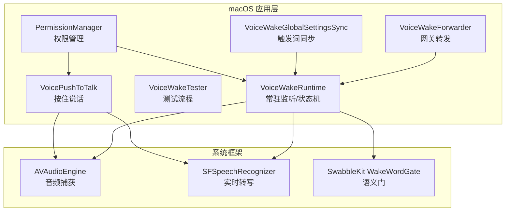
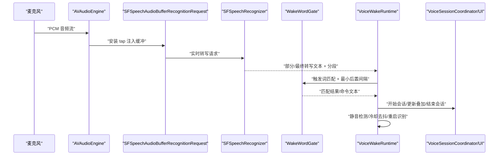
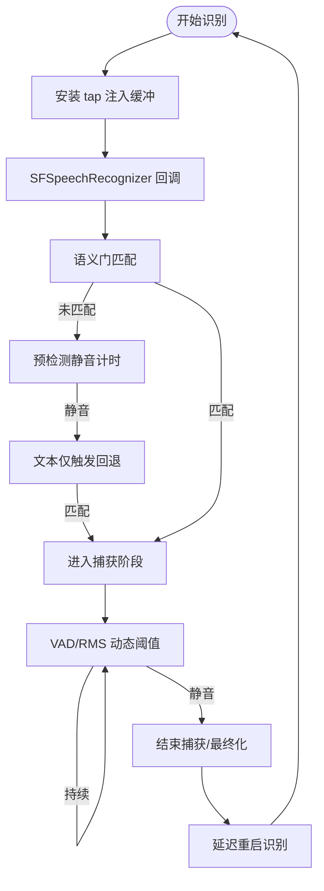
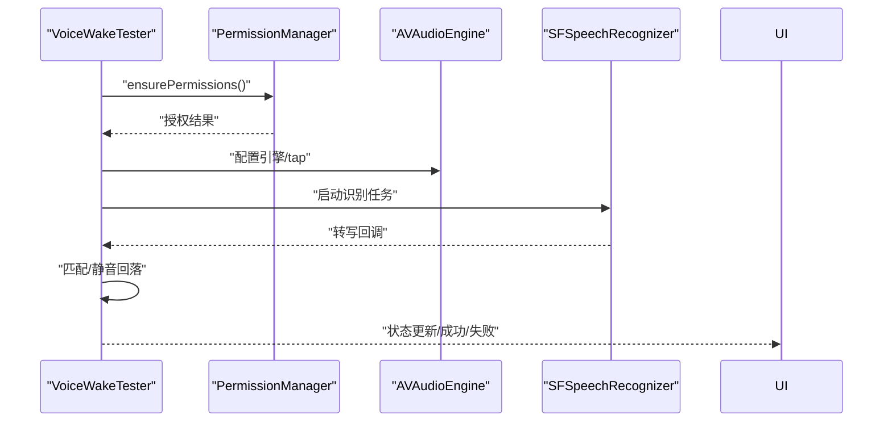
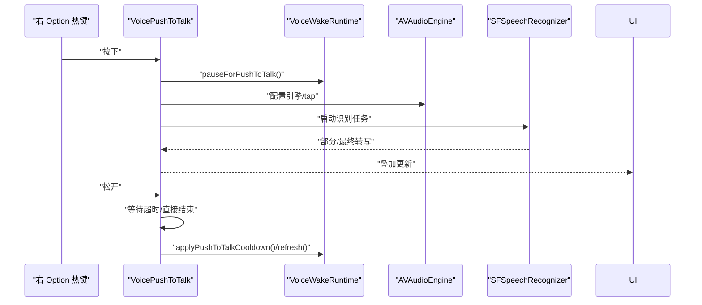
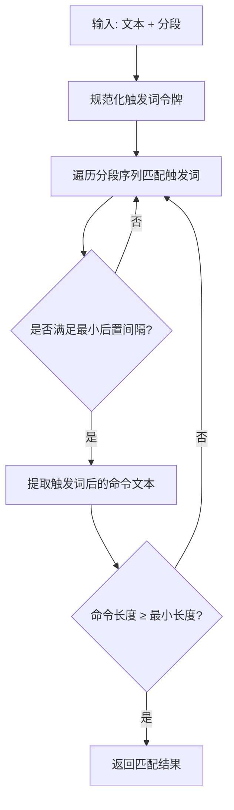
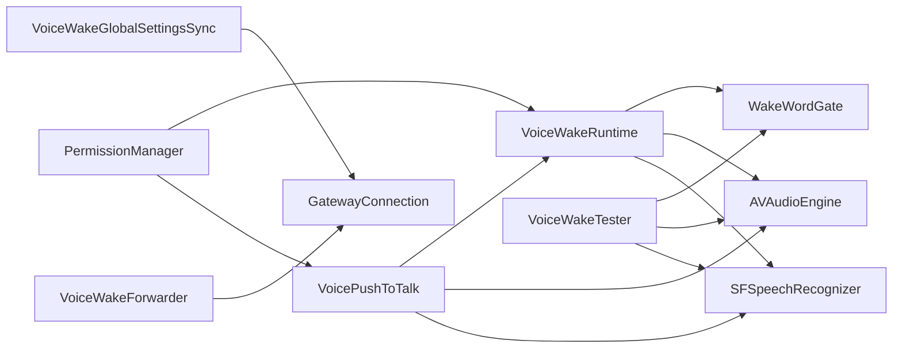

# 语音唤醒系统

## 目录
1. [简介](#简介)
2. [项目结构](#项目结构)
3. [核心组件](#核心组件)
4. [架构总览](#架构总览)
5. [详细组件分析](#详细组件分析)
6. [依赖关系分析](#依赖关系分析)
7. [性能考量](#性能考量)
8. [故障排查指南](#故障排查指南)
9. [结论](#结论)
10. [附录](#附录)

## 简介
本技术文档面向 OpenClaw 在 macOS 平台的语音唤醒系统，聚焦以下关键能力：
- 热词检测：基于分段时序的触发词匹配与后置静音窗口判定
- 语音激活：基于自适应 RMS 阈值的 VAD（语音活动检测）
- 推/拉模式切换：热词唤醒与“按住说话”（Push-to-Talk）双通道并行与互斥
- 音频处理管道：AVAudioEngine 捕获、SFSpeechRecognizer 实时转写、语义门控与命令提取
- 网关集成：全局触发词列表同步、语音结果转发到网关通道
- 权限管理：麦克风与语音识别授权、TCC 设置入口
- 性能优化：延迟启动引擎、资源释放、静音检测与冷却去抖

## 项目结构
OpenClaw 的语音唤醒在 macOS 上由多个模块协同完成：
- 运行时与状态机：VoiceWakeRuntime 负责常驻监听、热词检测、VAD、会话协调
- 测试器：VoiceWakeTester 提供独立测试流程，便于调试与验证
- 推模式：VoicePushToTalk 处理按住说话，暂停常驻监听，避免资源冲突
- 前向器：VoiceWakeForwarder 将最终文本转发至网关通道
- 全局同步：VoiceWakeGlobalSettingsSync 从网关订阅触发词变更
- 权限管理：PermissionManager 统一处理麦克风与语音识别授权
- 语义门：SwabbleKit 的 WakeWordGate 提供分段时序的热词匹配与命令提取

## 核心组件
- 语音唤醒运行时（VoiceWakeRuntime）
  - 职责：常驻监听、热词检测、VAD、会话生命周期管理、冷却去抖、UI 叠加更新
  - 关键点：延迟创建 AVAudioEngine；RMS 自适应阈值；静音窗口与硬停止；分段时序语义门
- 语音唤醒测试器（VoiceWakeTester）
  - 职责：独立测试流程，模拟真实唤醒路径，支持静音回落与最终化
  - 关键点：权限校验、录音请求、回调处理、静音检查任务
- 推模式（VoicePushToTalk）
  - 职责：按住说话，暂停常驻监听，避免资源竞争；结束后恢复常驻监听
  - 关键点：会话 ID 隔离、超时等待最终结果、前缀拼接与 UI 更新
- 语义门（SwabbleKit WakeWordGate）
  - 职责：基于分段时间戳的触发词匹配、最小后置间隔、命令提取
  - 关键点：规范化令牌、最小命令长度、触发词多词匹配
- 网关同步（VoiceWakeGlobalSettingsSync）
  - 职责：从网关订阅全局触发词，广播到本地应用状态
  - 关键点：事件订阅、解码与应用
- 权限管理（PermissionManager）
  - 职责：统一麦克风与语音识别授权，提供交互式引导
  - 关键点：TCC 状态查询与弹窗、设置页跳转
- 语音前向器（VoiceWakeForwarder）
  - 职责：将最终文本封装并发送到网关通道
  - 关键点：RPC 调用、错误记录、可选交付控制

## 架构总览
OpenClaw 的语音唤醒采用“常驻监听 + 语义门 + 会话协调”的分层架构：
- 输入层：AVAudioEngine 通过 inputNode 安装 2048 缓冲 tap，将 PCM 数据注入 SFSpeechAudioBufferRecognitionRequest
- 识别层：SFSpeechRecognizer 以字典任务提示进行实时转写，返回带时间戳的分段
- 语义层：WakeWordGate 基于分段时序判断触发词命中与最小后置间隔，提取命令文本
- 控制层：VoiceWakeRuntime 管理状态机、VAD、静音检测、冷却去抖与 UI 叠加
- 输出层：VoiceWakeForwarder 将最终文本转发至网关通道；VoicePushToTalk 在推模式下接管并结束常驻监听

## 详细组件分析

### 语音唤醒运行时（VoiceWakeRuntime）
- 状态机与生命周期
  - 状态：空闲、热词唤醒、按住说话
  - 生命周期：refresh 启动/停止；haltRecognitionPipeline 清理资源；scheduleRestartRecognizer 延迟重启
- 热词检测与静音回落
  - 触发词匹配：WakeWordGate.match + 文本仅触发回退（isFinal）
  - 预检测静音：preDetectSilenceCheck；触发词仅暂停：triggerOnlyPauseCheck
  - 冷却去抖：debounceAfterSend，防止连续触发
- VAD 与音频级数
  - RMS 自适应噪声底噪估计，结合 boost 因子形成动态阈值
  - UI 叠加音量归一化显示
- 会话与 UI
  - 开始/更新/最终化会话；触发/发送提示音；状态图标动画

### 语音唤醒测试器（VoiceWakeTester）
- 测试流程
  - 权限校验：语音识别与麦克风授权
  - 启动：配置引擎与 tap，启动识别任务
  - 回调：匹配热词或文本仅触发回退；静音回落检测
  - 结束：停止识别、移除 tap、释放资源
- 用户反馈
  - 状态枚举：空闲、请求权限、监听中、正在收听、最终化、已检测、失败
  - 成功后触发“耳朵”动画，随后停止并上报

### 推模式（VoicePushToTalk）
- 模式切换
  - 开始：生成会话 ID，暂停常驻监听，播放触发音，启动推模式识别
  - 结束：若无内容则立即结束；否则等待短暂超时以接收最终结果
- 资源管理
  - 移除 tap、停止引擎、重置状态；结束后恢复常驻监听并应用冷却
- UI 协同
  - 前缀拼接（adoptedPrefix）、增量更新、最终化与发送

### 语义门（SwabbleKit WakeWordGate）
- 匹配算法
  - 触发词令牌化与规范化；遍历分段序列寻找连续匹配
  - 计算触发词末尾时间与下一个词起始时间差，要求大于最小后置间隔
  - 提取触发词之后的命令文本，满足最小长度
- 分段时序
  - WakeWordSpeechSegments.from 将 SFSpeech 分段映射为带时间戳的结构

### 全局触发词同步（VoiceWakeGlobalSettingsSync）
- 协议与存储
  - 网关提供方法：`voicewake.get`、`voicewake.set`；事件：`voicewake.changed`
  - 存储位置：`~/.openclaw/settings/voicewake.json`
- 同步机制
  - 启动后刷新一次，随后订阅事件流，解码并应用到本地状态

### 权限管理（PermissionManager）
- 统一接口
  - voiceWakePermissionsGranted：麦克风 + 语音识别授权
  - ensureVoiceWakePermissions：交互式授权与设置页跳转
- 辅助工具
  - MicrophonePermissionHelper、NotificationPermissionHelper 等用于打开系统设置

### 网关集成与转发（VoiceWakeForwarder）
- 转发选项
  - sessionKey、thinking、deliver、to、channel 等参数
- RPC 调用
  - 通过 GatewayConnection 发送 Agent 调用，记录成功/失败日志

## 依赖关系分析
- 组件耦合
  - VoiceWakeRuntime 依赖 SwabbleKit WakeWordGate、AVFoundation、Speech、AppKit（UI）
  - VoicePushToTalk 与 VoiceWakeRuntime 协作，暂停/恢复常驻监听
  - VoiceWakeGlobalSettingsSync 依赖 GatewayConnection
  - VoiceWakeTester 独立于运行时，复用 WakeWordGate 与权限管理
- 外部依赖
  - macOS 系统权限（TCC）、SFSpeechRecognizer、AVAudioEngine
  - 网关协议（WebSocket 事件与 RPC）

## 性能考量
- 延迟启动与资源释放
  - 常驻监听延迟创建 AVAudioEngine，避免应用启动即占用音频资源
  - 停止/最终化时移除 tap、停止引擎、释放对象，降低内存与 CPU 占用
- VAD 与静音检测
  - RMS 自适应噪声底噪估计，结合 boost 因子形成动态阈值，减少误触发
  - 静音窗口与硬停止上限，避免长时间占用识别资源
- 会话隔离与冷却
  - 识别生成号 generation 与会话 ID 隔离，丢弃过期回调
  - 发送后冷却去抖，防止连续触发
- UI 与叠加
  - 叠加音量归一化，避免 UI 卡顿；最终化后及时停止动画

## 故障排查指南
- 权限问题
  - 症状：无法启动或提示权限被拒
  - 排查：使用 PermissionManager.voiceWakePermissionsGranted 检查；必要时通过 MicrophonePermissionHelper 打开系统设置
- 识别不可用
  - 症状：SFSpeechRecognizer 不可用或回调为空
  - 排查：确认设备语言与识别模型可用；检查网络与系统设置
- 资源冲突
  - 症状：推模式与常驻监听同时尝试访问麦克风
  - 排查：确保 VoicePushToTalk 正确暂停常驻监听，并在结束后恢复
- 触发词不生效
  - 症状：热词被识别但未触发命令
  - 排查：检查最小后置间隔与最小命令长度；确认全局触发词同步是否正确

## 结论
OpenClaw 的 macOS 语音唤醒系统通过“常驻监听 + 语义门 + 会话协调”的设计，在保证低开销与高响应的同时，提供了热词唤醒与推模式的灵活切换。配合全局触发词同步与权限管理，系统在多平台间保持一致的行为与体验。

## 附录

### 代码示例（路径引用）
- 语音检测回调与状态切换
  - `VoiceWakeRuntime.handleRecognition`
  - `VoiceWakeRuntime.beginCapture`
  - `VoiceWakeRuntime.finalizeCapture`
- 用户界面反馈
  - `VoiceWakeRuntime.noteAudioLevel`
  - `VoiceWakeRuntime.maybeLogRecognition`
- 推模式切换逻辑
  - `VoicePushToTalk.begin/end/finalize`
- 语义门匹配与命令提取
  - `WakeWordGate.match/commandText`
- 全局触发词同步
  - `VoiceWakeGlobalSettingsSync.start/handle`
- 音频权限管理
  - `PermissionManager.voiceWakePermissionsGranted`
  - `PermissionManager.ensureVoiceWakePermissions`
- 网关转发
  - `VoiceWakeForwarder.forward/checkConnection`