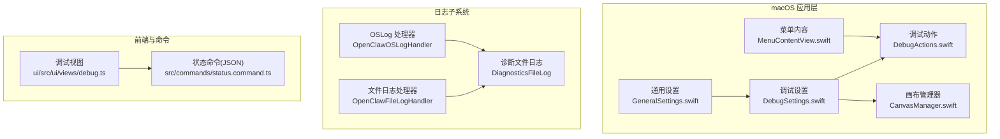
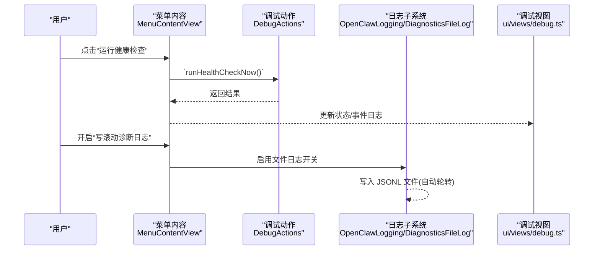
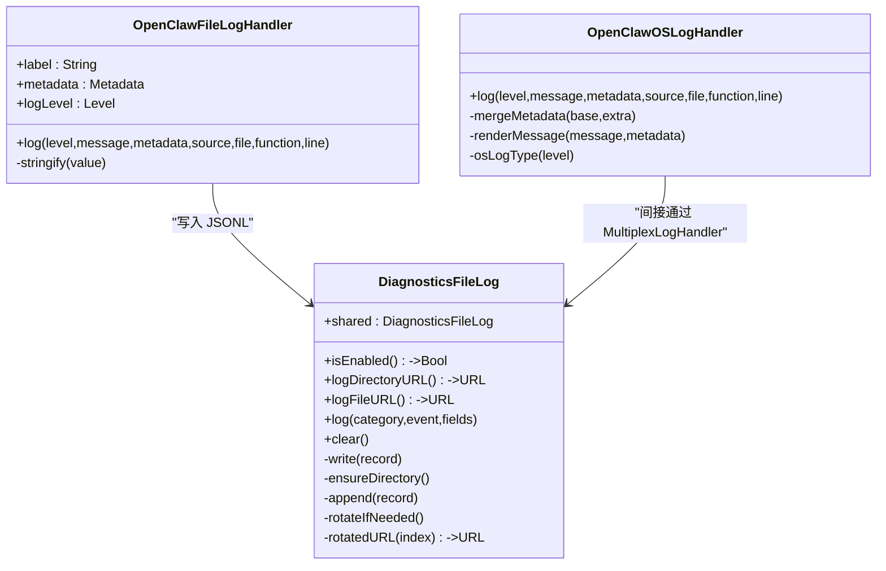
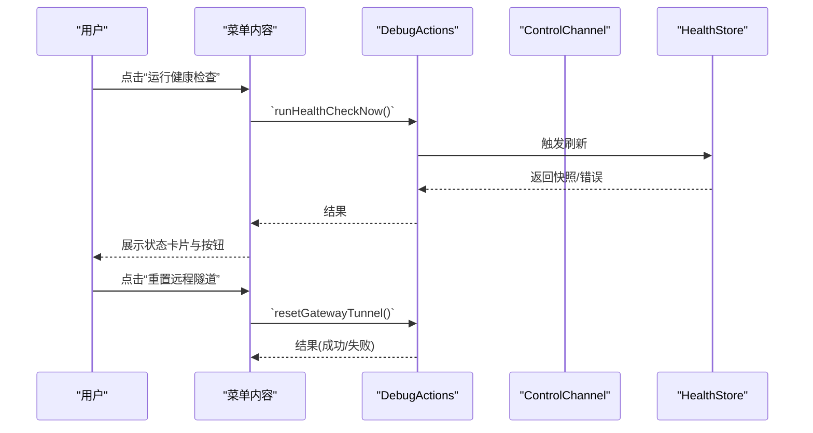
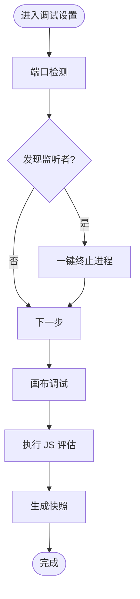
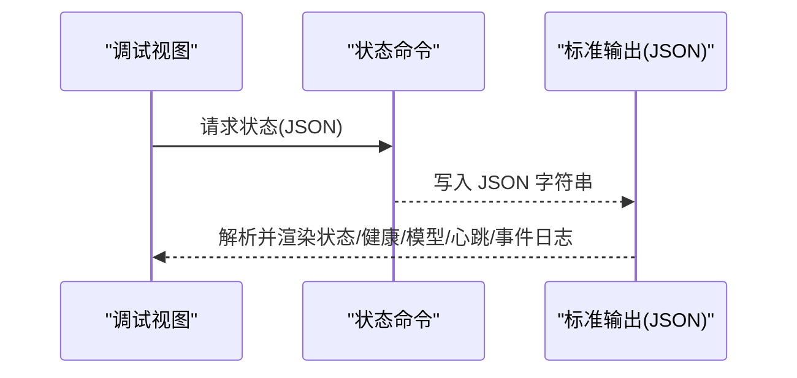
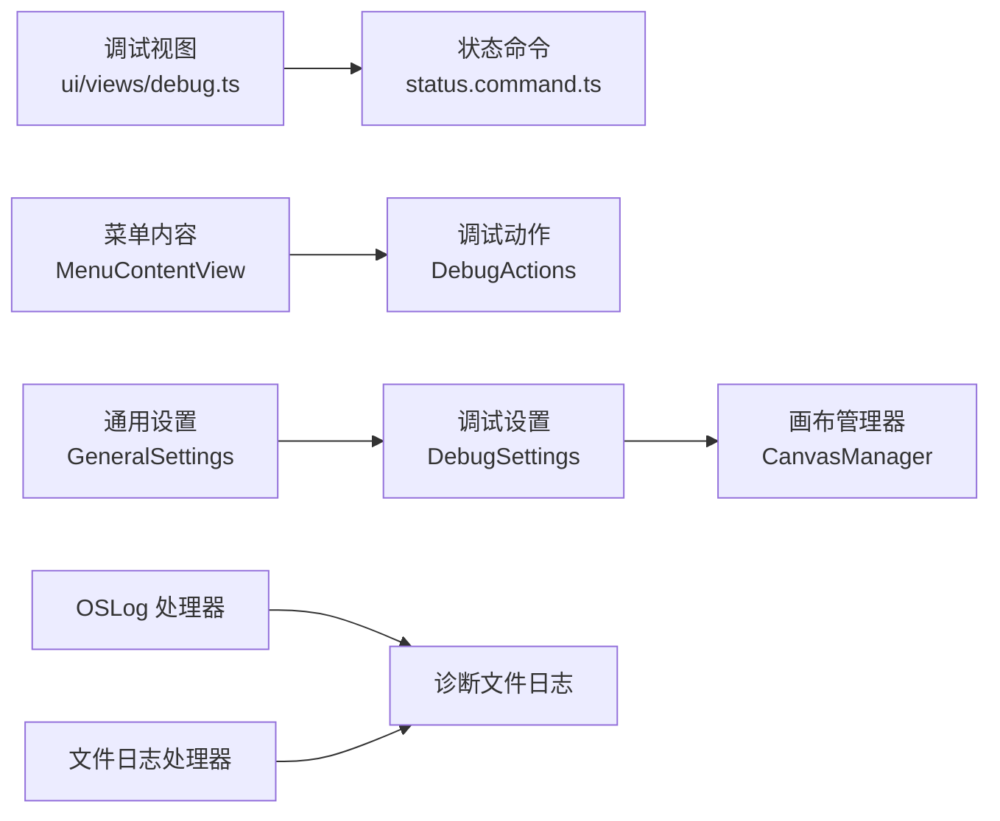

# 调试工具集

## 目录
1. [简介](#简介)
2. [项目结构](#项目结构)
3. [核心组件](#核心组件)
4. [架构总览](#架构总览)
5. [详细组件分析](#详细组件分析)
6. [依赖关系分析](#依赖关系分析)
7. [性能考量](#性能考量)
8. [故障排查指南](#故障排查指南)
9. [结论](#结论)
10. [附录](#附录)

## 简介
本文件面向 OpenClaw 的 macOS 调试工具集，系统性阐述调试界面四大核心能力：日志查看器、网络监控、系统状态检查与性能分析工具。文档将从数据采集机制、实时监控实现、可视化展示方式入手，结合具体代码路径示例，解释调试工具与应用其他组件的集成方式、数据持久化策略以及用户体验优化。

## 项目结构
OpenClaw 的 macOS 调试工具主要由以下模块构成：
- 日志子系统：统一日志与滚动诊断文件日志
- 菜单栏调试入口：提供健康检查、心跳测试、隧道重置等快捷操作
- 设置页调试面板：集中展示应用信息、网关状态、端口检测、会话存储、画布调试等
- 前端调试视图：用于展示运行时状态、事件日志与调用结果
- 后端命令与状态输出：提供 JSON 状态快照，便于自动化与脚本分析

## 核心组件
- 日志查看器（macOS）
  - 统一日志：通过 Swift Log 框架桥接 OSLog，支持按级别渲染与隐私标记
  - 滚动诊断文件日志：启用后以 JSONL 形式写入本地文件，自动轮转与清理
- 网络监控
  - 控制通道与心跳：菜单栏与设置页提供“运行健康检查”“发送测试心跳”“重置远程隧道”等操作
  - 远程连接状态：显示控制通道连接状态、延迟、认证来源与最近心跳时间
- 系统状态检查
  - 网关环境：本地模式下检测 Node/Gateway 版本、兼容性与启动状态；远程模式下进行 SSH/WS 测试
  - 会话存储：展示会话数量、最近活动与存储路径
- 性能分析工具
  - 端口检测：列出预期监听端口、占用进程并支持一键终止
  - 画布调试：打开/关闭画布面板、执行 JS 评估、生成快照
  - 前端调试视图：展示状态、健康、模型列表、心跳、事件日志与调用结果

## 架构总览
OpenClaw 的调试工具采用“前端视图 + 后端命令 + 日志子系统”的分层设计。前端通过菜单与设置页触发调试动作，后端执行相应逻辑并返回状态或写入日志，最终在 UI 中呈现。

## 详细组件分析

### 日志查看器（macOS）
- 数据采集机制
  - 统一日志：通过 OSLog 处理器将日志映射到 OSLog 类型，并支持元数据渲染与隐私标记
  - 文件日志：文件处理器将日志字段编码为键值对，交由诊断文件日志组件写入 JSONL
- 实时监控实现
  - 日志级别与开关：通过用户偏好控制日志级别与是否启用文件日志
  - 最佳努力写入：文件写入失败不阻塞主线程，避免影响应用稳定性
- 可视化展示方式
  - 前端调试视图可展示事件日志与调用结果；macOS 系统日志可通过控制台查看
- 数据持久化策略
  - 本地滚动文件：按大小轮转，保留多份备份；目录位于 Library/Logs/OpenClaw
- 具体实现参考
  - 日志处理器与标签解析：`OpenClawLogging.swift`
  - OSLog 处理器与消息渲染：`OpenClawLogging.swift`
  - 文件日志处理器与字段拼装：`OpenClawLogging.swift`
  - 诊断文件日志写入与轮转：`DiagnosticsFileLog.swift`
  - macOS 日志文档：`logging.md`

### 网络监控与系统状态检查
- 菜单栏调试入口
  - 提供“运行健康检查”“发送测试心跳”“重置远程隧道”“打开配置文件夹”等快捷操作
- 远程连接状态
  - 控制通道连接状态、延迟、认证来源与最近心跳时间，避免重复提示
- 本地网关环境
  - 检测 Node/Gateway 版本、兼容性与启动状态；显示最后检查时间与错误信息
- 远程连接测试
  - SSH 可达性检查与控制通道健康检查，支持直接 WS/ WSS URL 验证
- 具体实现参考
  - 菜单调试项与动作触发：`MenuContentView.swift`
  - 控制通道与心跳状态展示：`GeneralSettings.swift`
  - 远程连接测试流程：`GeneralSettings.swift`

### 性能分析工具与画布调试
- 端口检测
  - 列出预期端口、监听者与占用进程，支持一键终止可疑进程
- 画布调试
  - 打开/关闭画布面板、执行 JS 评估、生成快照；记录调试状态
- 调试设置面板
  - 集中展示应用信息、网关状态、日志、端口、路径、快捷操作与实验性功能
- 具体实现参考
  - 端口检测与处理逻辑：`DebugSettings.swift`
  - 画布管理与调试刷新：`CanvasManager.swift`

### 前端调试视图与状态输出
- 前端调试视图
  - 展示状态、健康、模型列表、心跳、事件日志与调用结果
- 状态命令输出
  - JSON 格式输出包含系统摘要、更新信息、内存、网关、节点服务、代理、安全审计与健康/用量等
- 具体实现参考
  - 调试视图渲染与事件格式化：`debug.ts`
  - 状态命令 JSON 输出：`status.command.ts`

## 依赖关系分析
- 组件耦合
  - 日志子系统通过 MultiplexLogHandler 同时输出到 OSLog 与文件，降低耦合度
  - 调试动作通过统一入口触发，避免各功能分散在 UI 层
- 外部依赖
  - macOS 日志系统(OSLog)、文件系统(JSONL)、Shell 命令(SSH/WS 测试)
- 潜在循环依赖
  - 未见直接循环依赖；日志写入为单向依赖于诊断文件日志

## 性能考量
- 日志写入非阻塞：文件写入失败不抛出异常，避免影响主线程与 UI 响应
- 最小化 UI 刷新：前端调试视图按需渲染，减少不必要的重绘
- 健康检查与远程测试：使用超时与异步任务，避免阻塞 UI
- 端口检测与终止：仅在必要时发起系统调用，避免频繁扫描

## 故障排查指南
- 无法看到日志文件
  - 确认已启用“写滚动诊断日志”，并在 UI 中触发一次健康检查或产生日志事件
  - 参考：`logging.md`
- 远程连接失败
  - 使用“测试远程”验证 SSH 或 WS URL；根据提示修复主机密钥或 URL 格式
  - 参考：`GeneralSettings.swift`
- 心跳异常
  - 通过“发送测试心跳”验证控制通道连通性；查看最近心跳状态与延迟
  - 参考：`GeneralSettings.swift`
- 端口冲突
  - 使用“端口检测”查看占用进程，必要时终止冲突进程
  - 参考：`DebugSettings.swift`
- 画布调试问题
  - 通过“打开画布”与“JS 评估”定位页面交互问题；生成快照辅助分析
  - 参考：`CanvasManager.swift`

## 结论
OpenClaw 的 macOS 调试工具集通过统一的日志子系统、直观的菜单与设置面板、完善的网络与系统状态监控，以及实用的性能分析工具，为开发者提供了高效的问题定位与诊断能力。其设计强调非阻塞、最小化耦合与用户体验优先，适合在复杂场景下快速定位问题并验证修复效果。

## 附录
- 关键实现路径示例（不展示具体代码内容）：
  - 日志过滤与级别控制：`OpenClawLogging.swift`
  - 文件日志写入与轮转：`DiagnosticsFileLog.swift`
  - 网络流量分析（远程测试）：`GeneralSettings.swift`
  - 系统资源监控（端口检测）：`DebugSettings.swift`
  - 调试工具与应用组件集成：`MenuContentView.swift`
  - 数据持久化策略（JSONL）：`DiagnosticsFileLog.swift`
  - 用户体验优化（异步与超时）：`GeneralSettings.swift`