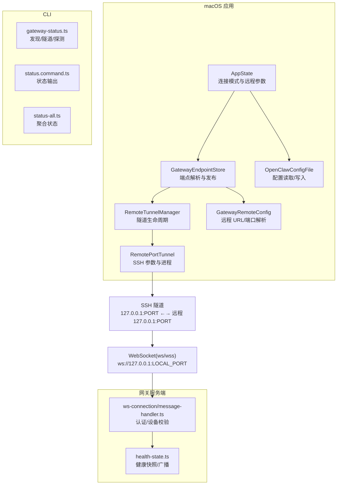
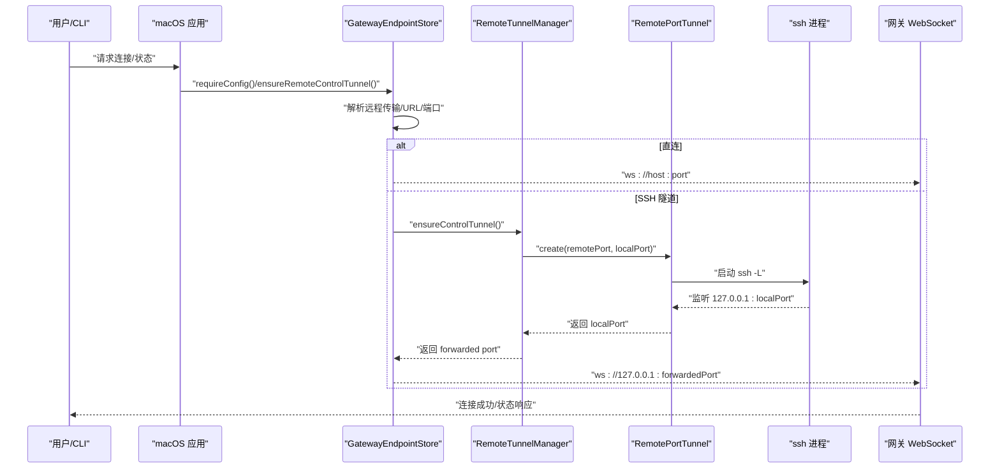
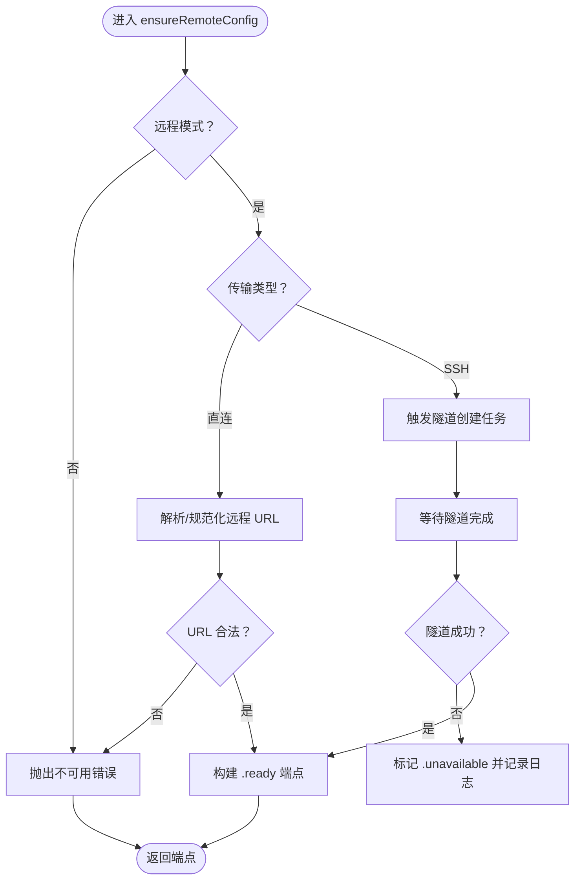
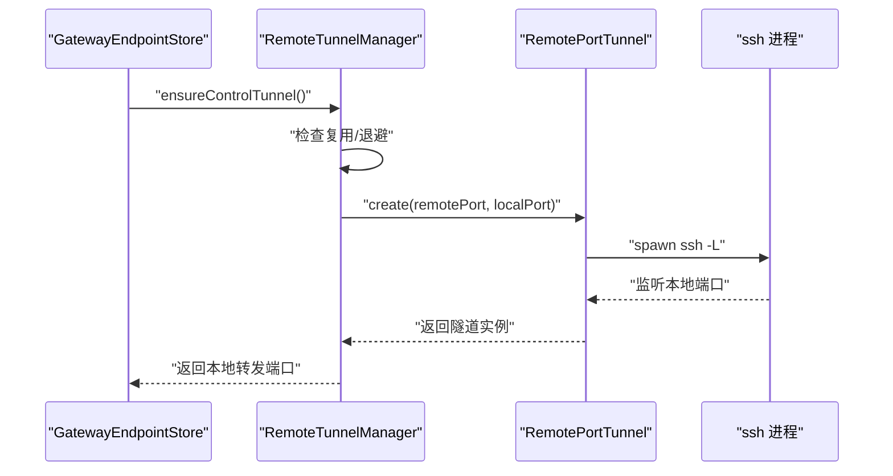
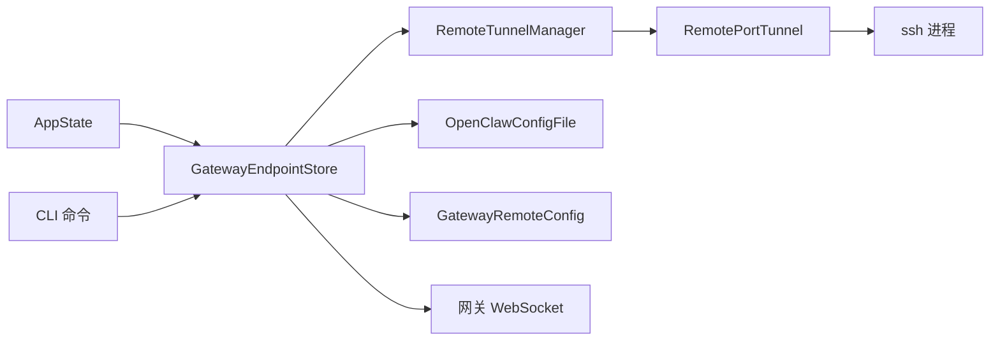

# 远程网关控制

## 目录
1. [简介](#简介)
2. [项目结构](#项目结构)
3. [核心组件](#核心组件)
4. [架构总览](#架构总览)
5. [详细组件分析](#详细组件分析)
6. [依赖关系分析](#依赖关系分析)
7. [性能考量](#性能考量)
8. [故障排查指南](#故障排查指南)
9. [结论](#结论)
10. [附录](#附录)

## 简介
本技术文档聚焦 OpenClaw 在 macOS 上的“远程网关控制”能力，系统性阐述远程网关的连接管理、配置同步、状态监控与远程操作流程。内容覆盖网络连接建立（SSH 隧道与直连）、身份认证机制（令牌与密码）、数据传输安全（WS/ WSS 与证书指纹校验）、断线重连策略，并提供可直接定位到源码的示例路径，帮助开发者快速实现远程连接建立、配置文件同步与状态查询。

## 项目结构
围绕远程网关控制的关键模块分布于以下位置：
- macOS 应用层：负责远程模式解析、隧道生命周期管理、端点解析与订阅、配置持久化与同步。
- CLI 层：提供健康检查、状态查询、自动推断 SSH 目标等命令行工具。
- 网关服务端：负责 WebSocket 连接、消息处理、认证与健康状态广播。
- 文档：提供远程访问、SSH 隧道、安全规则等背景知识。

## 核心组件
- 连接模式与远程参数：AppState 维护连接模式（本地/远程/未配置）与远程传输方式（SSH/直连），并驱动配置同步。
- 端点解析与发布：GatewayEndpointStore 负责根据配置与环境变量解析最终的控制端点（含令牌/密码），并支持显式确保远程隧道。
- 隧道生命周期：RemoteTunnelManager 管理 SSH 控制隧道的创建、复用、重启与退避策略；RemotePortTunnel 封装 ssh 进程与参数。
- 远程配置解析：GatewayRemoteConfig 提供远程 URL 规范化、默认端口推断与传输类型判定。
- 配置文件读写：OpenClawConfigFile 提供 gateway/auth/remote 字段的读取与更新。
- CLI 健康与状态：gateway-status.ts 自动推断 SSH 目标并启动隧道，status.*.ts 输出状态与认证信息。
- 服务端认证与健康：ws-connection/message-handler.ts 处理连接认证与设备校验；health-state.ts 刷新并广播健康快照。

## 架构总览
远程网关控制以“macOS 应用 + CLI + 网关服务端”三层协同：
- macOS 应用负责解析配置、管理隧道、暴露端点并订阅状态变化。
- CLI 用于健康检查、状态查询与自动推断 SSH 目标。
- 网关服务端负责 WebSocket 连接、认证与健康状态广播。

## 详细组件分析

### 组件一：端点解析与远程隧道确保（GatewayEndpointStore）
- 职责
  - 解析当前连接模式（本地/远程/未配置）。
  - 根据远程传输类型（SSH/直连）决定是否需要隧道。
  - 从配置与环境变量中解析令牌与密码优先级。
  - 暴露 AsyncStream 订阅端点状态变化。
  - 提供显式 `ensureRemoteControlTunnel()` 以在需要时启动隧道。
- 关键行为
  - 直连：校验并规范化远程 URL，推导默认端口，直接返回端点。
  - SSH：调用 RemoteTunnelManager 创建隧道，返回本地转发端口。
  - 状态变更：通过订阅者广播 ready/connecting/unavailable。
- 示例路径
  - 显式确保隧道：`ensureRemoteControlTunnel`
  - 确保远程配置并返回端点：`ensureRemoteConfig`
  - 订阅端点状态：`subscribe`

### 组件二：SSH 隧道管理（RemoteTunnelManager 与 RemotePortTunnel）
- RemoteTunnelManager
  - 复用已存在的隧道或监听描述符，避免重复创建。
  - 启动/停止隧道，执行重启退避（backoff）策略。
- RemotePortTunnel
  - 生成 ssh 命令参数（含 -L 端口转发、心跳、严格主机密钥检查等）。
  - 监听 stderr 并记录错误，立即失败时抛出异常。
  - 支持本地端口冲突检测与随机端口分配。
- 示例路径
  - 确保控制隧道：`ensureControlTunnel`
  - 创建隧道并启动 ssh：`create`
  - 端口可用性检测：`findPort/portIsFree`

### 组件三：远程配置解析与端口推断（GatewayRemoteConfig 与 OpenClawConfigFile）
- GatewayRemoteConfig
  - 解析远程传输类型（ssh/direct）。
  - 规范化远程 URL（补全默认端口、校验 scheme）。
  - 推断默认端口（ws:18789, wss:443）。
- OpenClawConfigFile
  - 读取/设置 gateway.auth/token/password 与 gateway.remote/url/token/password。
  - 读取 gateway.port 与远程端口。
- 示例路径
  - 解析传输与 URL：`resolveTransport/resolveGatewayUrl`
  - 规范化 URL 与默认端口：`normalizeGatewayUrl/defaultPort`
  - 读取远程密码/端口：`gatewayPassword/remoteGatewayPort`
  - 设置远程 URL（含 scheme 保留）：`setRemoteGatewayUrl`

### 组件四：配置同步与状态订阅（AppState）
- 配置同步
  - 根据连接模式更新 gateway.mode。
  - 当为远程时，同步 gateway.remote.sshTarget/sshIdentity/url/transport 等字段。
- 状态订阅
  - 通过 GatewayEndpointStore.subscribe 获取端点状态流。
- 示例路径
  - 同步配置（远程模式下的字段）：`syncGatewayConfigIfNeeded`
  - 订阅端点状态：`GatewayEndpointStore.subscribe`

### 组件五：CLI 健康与状态（gateway-status.ts 与 status.*.ts）
- 自动推断 SSH 目标与隧道
  - 发现网关信标，尝试解析/推断 ssh 目标，必要时启动 SSH 端口转发。
  - 返回隧道目标（ws://127.0.0.1:localPort）。
- 状态输出
  - status.command.ts/status-all.ts 输出网关模式、目标可达性、认证使用情况与自报告信息。
- 示例路径
  - 启动隧道并返回目标：`gateway-status.ts`
  - 状态输出格式化：`status.command.ts`, `status-all.ts`

### 组件六：服务端认证与健康（ws-connection/message-handler.ts 与 health-state.ts）
- 认证与设备校验
  - 支持令牌/密码认证，区分 CLI、Control UI、WebChat 客户端。
  - 支持禁用设备认证或允许不安全认证的配置项。
- 健康状态
  - 刷新健康快照并广播更新，避免并发刷新。
- 示例路径
  - 认证与设备校验逻辑：`message-handler.ts`
  - 健康快照刷新：`health-state.ts`

### 组件七：安全与证书校验（macOS/Android 与 audit）
- macOS 环境变量覆盖提示
  - 当环境变量与配置同时存在时发出覆盖警告，避免无意覆盖。
- Android TLS 参数
  - 支持基于证书指纹的校验，或允许 TOFU 存储指纹。
- 安全审计
  - 对控制 UI 设备认证禁用、令牌长度等进行安全检查。
- 示例路径
  - 环境变量覆盖警告：`GatewayEndpointStore.resolveGatewayToken/Password`
  - 安全审计（测试用例）：`audit.test.ts`
  - TLS 参数构建（Android）：`GatewayTls.kt`

## 依赖关系分析
- 组件耦合
  - GatewayEndpointStore 依赖 AppState 的连接模式与远程参数，依赖 RemoteTunnelManager 确保隧道。
  - RemoteTunnelManager 依赖 RemotePortTunnel 与 PortGuardian 描述符进行隧道复用与清理。
  - CLI 与服务端通过 WebSocket 协议交互，CLI 侧负责隧道与探测，服务端侧负责认证与健康。
- 外部依赖
  - ssh 可执行程序用于隧道建立。
  - 网络栈用于端口占用检测与监听。
- 循环依赖
  - 无直接循环依赖；各方向依赖清晰（应用层 → 隧道 → ssh；CLI → 应用层；服务端独立）。

## 性能考量
- 隧道复用：RemoteTunnelManager 优先复用现有隧道与监听描述符，减少 ssh 进程频繁创建带来的开销。
- 端口检测：RemotePortTunnel 使用多地址族绑定检测，避免 IPv4/IPv6 冲突导致的失败重试。
- 健康快照缓存：health-state.ts 对健康快照进行并发保护与版本递增，避免重复计算。
- CLI 并行：gateway-status.ts 并行执行发现与隧道启动，缩短整体探测时间。

## 故障排查指南
- 隧道无法启动
  - 检查 ssh 目标与身份文件是否正确；查看 stderr 日志定位失败原因。
  - 确认本地端口未被占用；必要时允许随机端口或更换端口。
  - 参考：`RemotePortTunnel.create/stderr 处理`
- 端点不可用
  - 若端点处于 unavailable，GatewayEndpointStore 会在 on-demand 场景自动尝试重建隧道。
  - 参考：`ensureRemoteConfig 异常分支`
- 认证失败
  - CLI/Control UI/WebChat 的认证提示不同，需按提示设置 gateway.remote.token 或 password。
  - 参考：`message-handler.ts 认证提示`
- 环境变量覆盖
  - 当环境变量与配置同时存在时，应用会发出覆盖警告，确认是否为预期行为。
  - 参考：`GatewayEndpointStore 环境变量覆盖警告`
- 安全审计
  - 检查控制 UI 设备认证禁用、令牌长度等安全问题。
  - 参考：`audit.ts 安全检查`

## 结论
OpenClaw 的远程网关控制通过“配置解析 + 隧道管理 + 端点发布 + 认证与健康”的分层设计，实现了稳定、可恢复且安全的远程访问体验。macOS 应用层负责本地配置与隧道生命周期，CLI 提供自动化探测与状态输出，服务端保障连接安全与健康可观测。遵循本文提供的示例路径与最佳实践，可高效实现远程连接建立、配置同步与状态监控。

## 附录

### A. 远程连接建立示例（代码路径）
- 显式确保远程控制隧道：`GatewayEndpointStore.ensureRemoteControlTunnel`
- 创建 SSH 隧道：`RemotePortTunnel.create`
- CLI 自动推断并启动隧道：`gateway-status.ts`

### B. 配置文件同步示例（代码路径）
- 同步远程配置字段（sshTarget/sshIdentity/url/transport）：`AppState.syncGatewayConfigIfNeeded`
- 读取/设置远程密码与端口：`OpenClawConfigFile.gatewayPassword/remoteGatewayPort/setRemoteGatewayUrl`

### C. 状态查询与健康监控示例（代码路径）
- CLI 状态输出：`status.command.ts`, `status-all.ts`
- 服务端健康快照刷新：`health-state.ts`

### D. 安全与证书校验示例（代码路径）
- 环境变量覆盖警告：`GatewayEndpointStore.resolveGatewayToken/Password`
- 安全审计测试用例：`audit.test.ts`
- Android TLS 参数构建：`GatewayTls.kt`