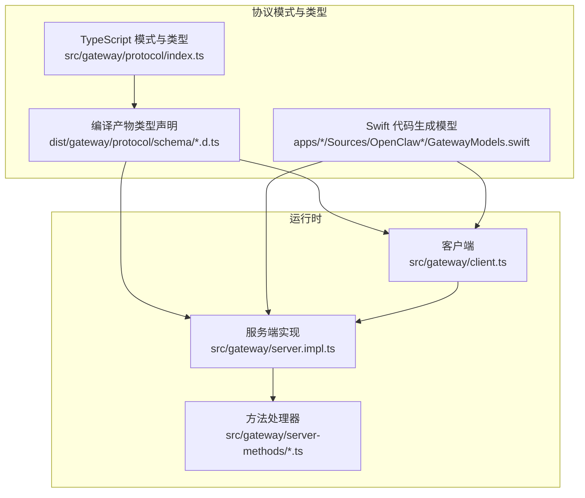
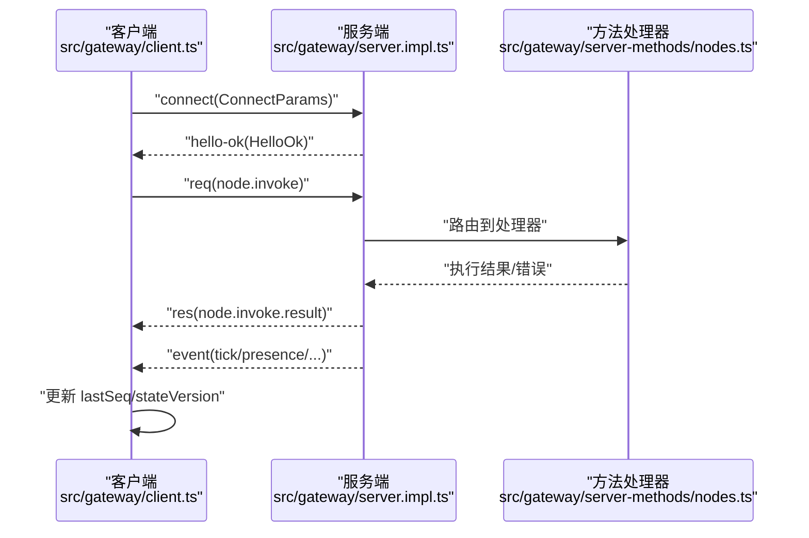
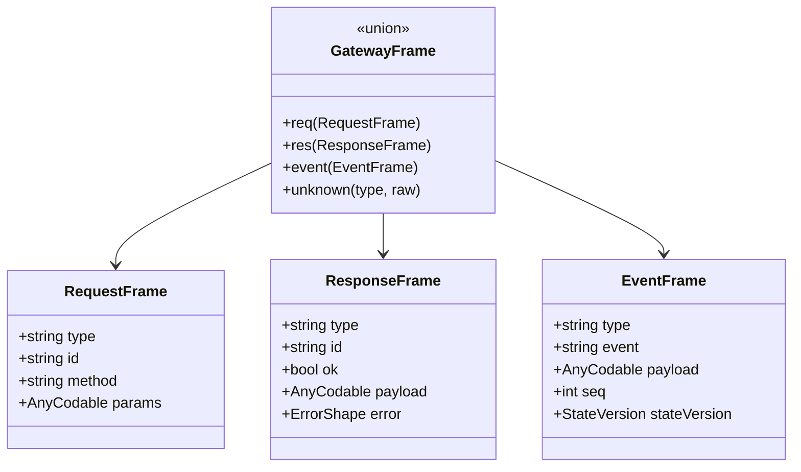
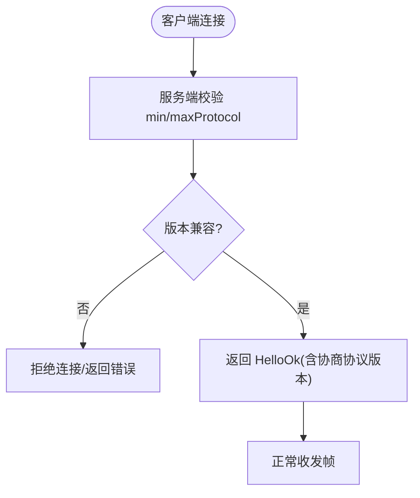
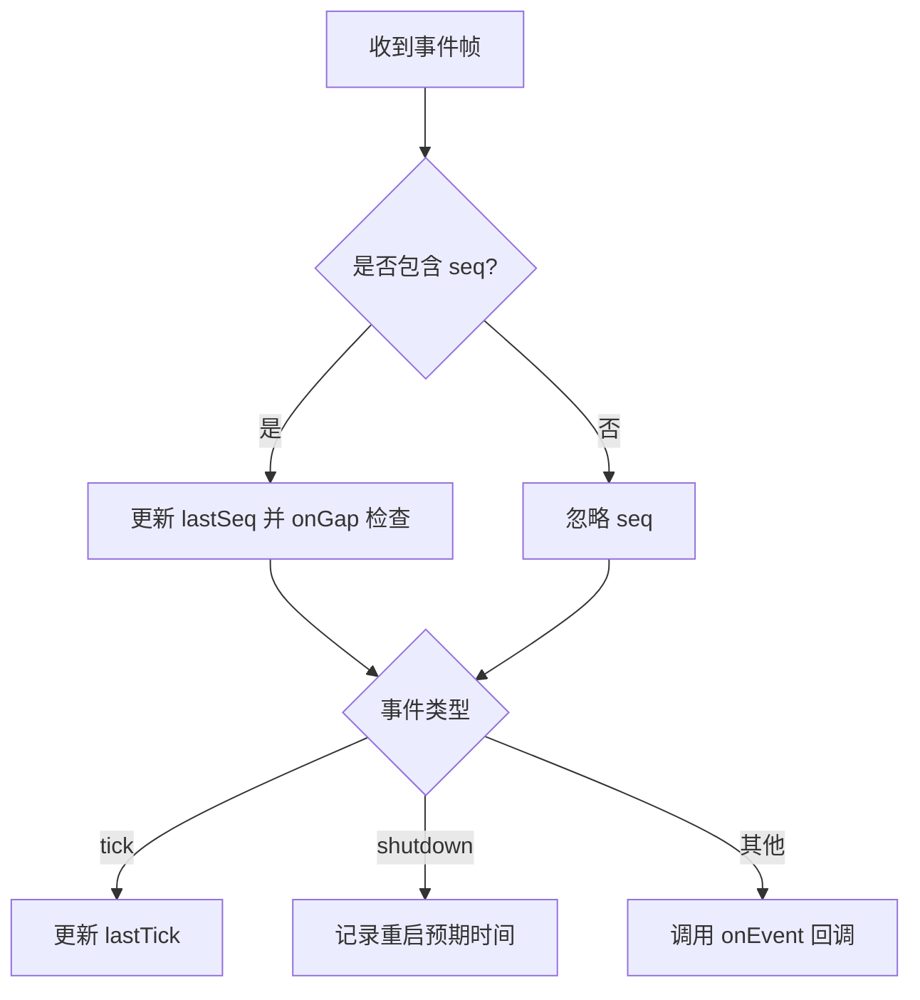
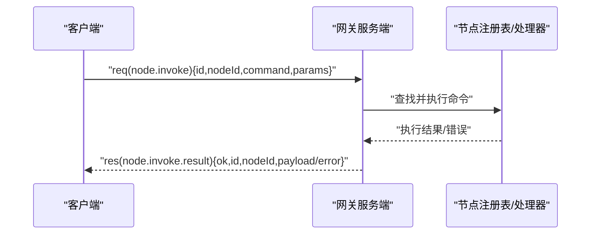
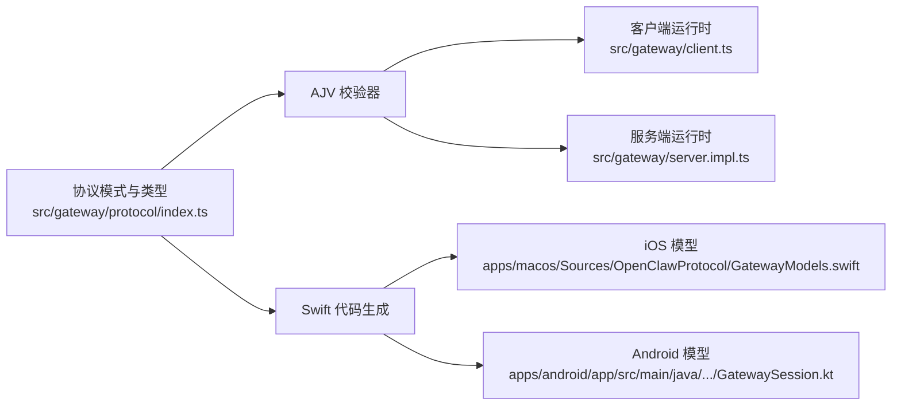

# OpenClaw 协议层

## 目录
1. [引言](#引言)
2. [项目结构](#项目结构)
3. [核心组件](#核心组件)
4. [架构总览](#架构总览)
5. [详细组件分析](#详细组件分析)
6. [依赖关系分析](#依赖关系分析)
7. [性能考量](#性能考量)
8. [故障排查指南](#故障排查指南)
9. [结论](#结论)
10. [附录](#附录)

## 引言
本文件系统性梳理 OpenClaw 协议层（Gateway 协议）的设计与实现，覆盖消息格式、会话管理、工具调用协议、代理通信机制、序列化与版本兼容策略、消息生命周期、错误处理与状态同步等主题。文档同时给出客户端与服务端的实现要点与集成路径，并提供面向多平台（TypeScript、Swift、Kotlin）的参考示例路径。

## 项目结构
协议层位于后端网关模块中，采用“模式定义 + 运行时校验 + 类型生成”的分层设计：
- 模式与类型：通过 TypeBox 定义强类型模式，导出 TypeScript 类型与 AJV 校验器；Swift 侧由脚本生成模型。
- 运行时：AJV 校验器在运行时对请求帧、事件帧、响应帧进行严格校验；客户端负责连接、心跳、断线重连与序列号跟踪。
- 方法注册：服务端按方法名注册处理器，统一路由到对应业务逻辑。

## 核心组件
- 帧模型与校验
  - 请求帧、响应帧、事件帧三类帧，均以 discriminator 字段 `type` 区分。
  - 使用 AJV 编译生成的校验器对入站帧进行严格校验，确保字段与类型一致。
- 连接参数与握手
  - 客户端发送 `ConnectParams`，包含最小/最大协议版本、客户端信息、权限、设备签名等。
  - 服务端返回 `HelloOk`，携带实际协商的协议版本、特性列表、快照与策略。
- 工具调用协议
  - 通过节点（Node）抽象工具与外部系统，使用 `node.invoke` 与 `node.invoke.result` 实现双向调用。
- 会话与状态
  - 事件帧支持 `seq` 序列号与 `stateVersion`，用于顺序保证与状态同步。
  - 服务端维护健康与存在性快照，客户端可据此做状态恢复与一致性检查。

## 架构总览
下图展示了从客户端发起连接到服务端处理工具调用的完整流程，以及事件帧的状态同步机制。

## 详细组件分析

### 帧模型与序列化
- 模式与类型
  - `RequestFrame`、`ResponseFrame`、`EventFrame`、`GatewayFrame` 等模式由 TypeBox 定义，导出静态类型与 AJV 校验器。
  - Swift 侧通过脚本生成对应的结构体与枚举，保留未知帧类型以保证向前兼容。
- 序列化与反序列化
  - 客户端与服务端均使用 JSON 编解码；事件帧支持 `AnyCodable` 作为 payload 的通用容器，便于跨语言传输复杂结构。
- 错误形状
  - 统一的 `ErrorShapeSchema` 提供 `code`、`message`、`details`、`retryable`、`retryAfterMs` 等字段，便于客户端进行重试与降级。

### 版本兼容与校验
- 协议版本
  - 客户端在 `ConnectParams` 中声明 `minProtocol` 与 `maxProtocol`，服务端拒绝不兼容版本并拒绝连接。
  - Swift 模型中包含 `GATEWAY_PROTOCOL_VERSION` 常量，用于运行时判断。
- 校验策略
  - 所有入站帧均通过 AJV 校验器验证，严格禁止额外属性，提升健壮性。
  - 文档说明了新增方法的校验与注册流程，确保前后端一致。

### 会话管理与状态同步
- 心跳与断线重连
  - 客户端周期性接收 `tick` 事件，记录 `lastTick` 并检测静默停滞；支持 `onGap` 回调报告乱序或丢包。
  - 服务端维护健康与存在性快照，客户端可据此恢复状态。
- 序列号与状态版本
  - 事件帧包含 `seq` 与 `stateVersion`，客户端在收到事件时更新 `lastSeq` 并触发 `onEvent` 回调。
- 关闭与重启
  - 服务端可通过 `shutdown` 事件通知客户端预期重启时间，客户端据此调整行为。

### 工具调用协议（节点）
- 调用流程
  - 客户端发送 `node.invoke`，包含 `nodeId`、`command`、`params`、`idempotencyKey` 等。
  - 服务端路由到对应处理器，执行完成后通过 `node.invoke.result` 返回结果或错误。
- 参数与结果
  - `NodeInvokeParams` 与 `NodeInvokeResultParams` 支持 `payload` 与 `payloadJSON` 双通道，便于大对象传输。
- Android/iOS/macOS 集成
  - Android 侧 `GatewaySession` 封装 `InvokeRequest`/`InvokeResult`，服务端通过 `onInvoke` 回调处理。
  - Swift 侧 `AnyCodable` 辅助函数提供基础值访问与 Foundation 值转换。

### 会话管理 API
- 列表、预览、解析、补丁、重置、删除、压缩等操作均有明确的参数模式与返回类型。
- 支持按标签、代理、`spawnedBy` 等维度筛选与派生标题/预览，便于前端展示。

### 客户端与服务端实现要点
- 客户端
  - 连接建立、TLS 指纹校验、重连退避、事件序列号与心跳检测、未决请求管理。
- 服务端
  - 配置加载与迁移、插件与子系统初始化、WebSocket 控制台、方法注册与路由、节点注册表与订阅管理。

## 依赖关系分析
- 模式与类型依赖
  - TypeScript 侧通过 AJV 生成校验器；Swift 侧通过脚本生成模型，二者共享同一模式定义。
- 运行时耦合
  - 客户端与服务端均依赖统一的帧模型与校验器；方法处理器依赖节点注册表与上下文。
- 外部集成
  - iOS/macOS 通过 `AnyCodable` 适配 Foundation 类型；Android 通过 Kotlin 数据类封装调用结果。

## 性能考量
- 大负载响应
  - 客户端允许较大 WebSocket 负载（如屏幕快照），适合传输大对象。
- 心跳与保活
  - 客户端定期发送心跳并检测静默停滞，避免长时间无响应导致的连接假死。
- 事件批处理
  - 事件帧支持 `seq` 与 `stateVersion`，便于批量处理与状态一致性维护。

## 故障排查指南
- 连接失败
  - TLS 指纹不匹配或缺失会导致连接被拒绝；检查 `wss` 地址与指纹配置。
- 协议不兼容
  - `min`/`maxProtocol` 不匹配将被拒绝；升级客户端或服务端至兼容版本。
- 校验错误
  - AJV 报错包含具体字段路径与关键字，优先检查多余属性与类型不匹配。
- 事件乱序
  - `onGap` 回调提示期望与实际 `seq` 差异，需在上层实现重排或丢弃策略。
- iOS/macOS AnyCodable
  - 使用辅助扩展将 `AnyCodable` 转换为 Foundation 值，避免类型不匹配。

## 结论
OpenClaw 协议层通过强类型模式、严格的运行时校验与跨语言代码生成，实现了高一致性与可演进的通信协议。其消息生命周期清晰、错误处理完备、状态同步可靠，并提供了完善的工具调用与会话管理能力。结合多平台客户端实现，能够稳定支撑跨端的代理与工具交互场景。

## 附录
- 代码示例路径（不含具体代码内容）
  - 客户端连接与事件处理：[src/gateway/client.ts](file://src/gateway/client.ts#L101-L176)
  - 服务端启动与方法注册：[src/gateway/server.impl.ts](file://src/gateway/server.impl.ts#L147-L200)
  - 工具调用结果处理：[src/gateway/server-methods/nodes.ts](file://src/gateway/server-methods/nodes.ts#L432-L478)
  - Swift 事件帧解码测试：[apps/macos/Tests/OpenClawIPCTests/GatewayFrameDecodeTests.swift](file://apps/macos/Tests/OpenClawIPCTests/GatewayFrameDecodeTests.swift#L1-L54)
  - Android 调用请求封装：[apps/android/app/src/main/java/ai/openclaw/android/gateway/GatewaySession.kt](file://apps/android/app/src/main/java/ai/openclaw/android/gateway/GatewaySession.kt#L65-L79)
  - AnyCodable 辅助函数：[apps/macos/Sources/OpenClaw/AnyCodable+Helpers.swift](file://apps/macos/Sources/OpenClaw/AnyCodable+Helpers.swift#L9-L47)
  - 版本比较工具：[src/config/version.ts](file://src/config/version.ts#L1-L49)
  - iMessage RPC 客户端（参考实现）：[src/imessage/client.ts](file://src/imessage/client.ts#L195-L243)