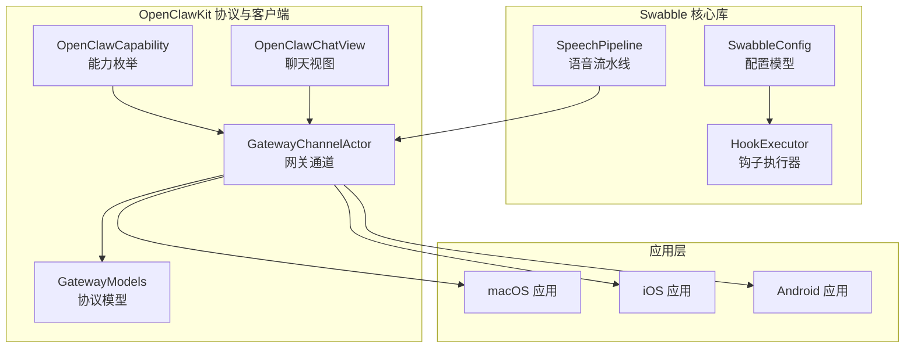
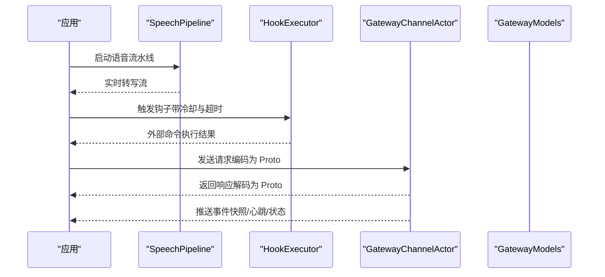
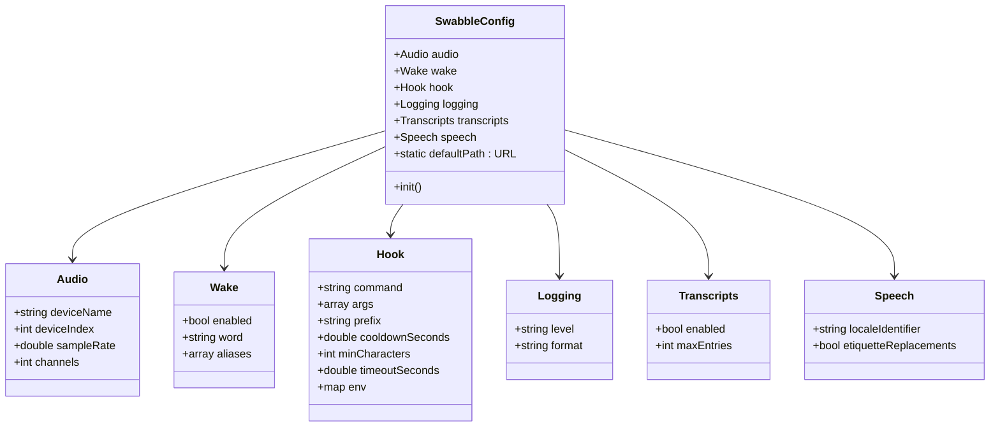
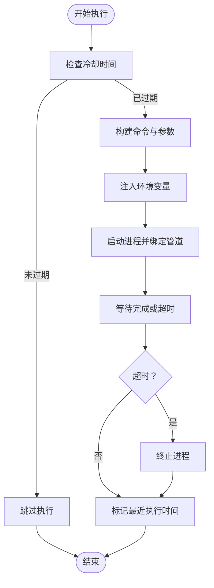
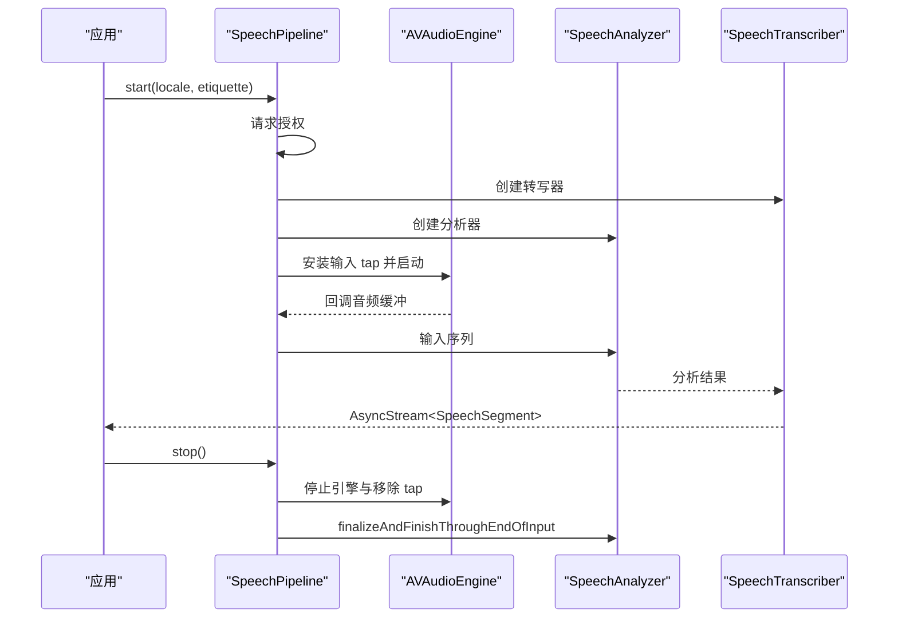
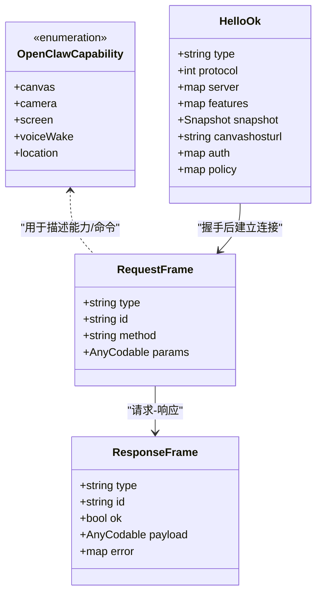
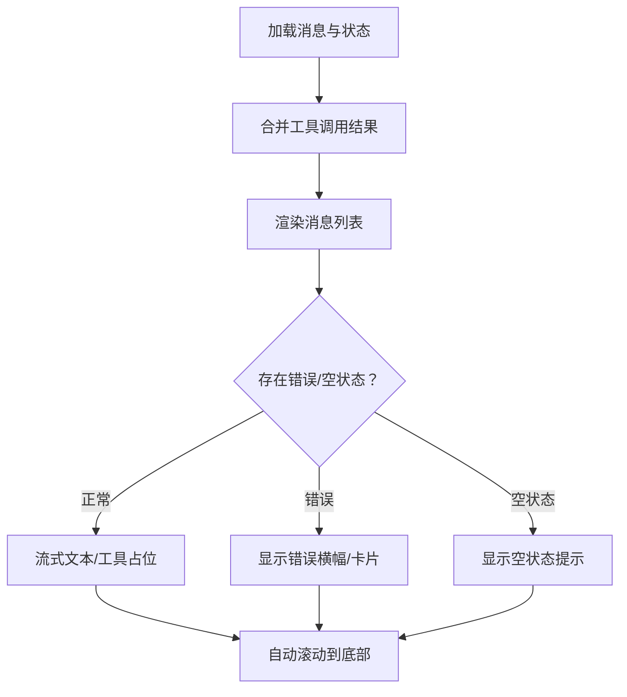
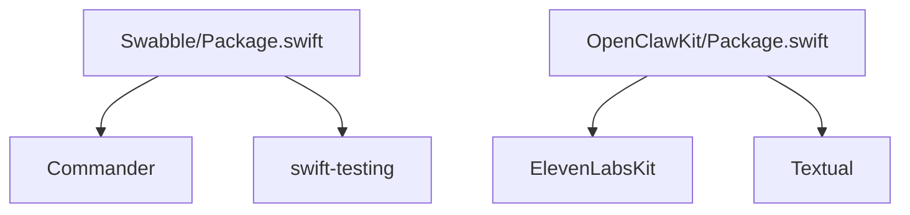

# OpenClaw 核心库

## 目录
1. [简介](#简介)
2. [项目结构](#项目结构)
3. [核心组件](#核心组件)
4. [架构总览](#架构总览)
5. [详细组件分析](#详细组件分析)
6. [依赖关系分析](#依赖关系分析)
7. [性能考虑](#性能考虑)
8. [故障排除指南](#故障排除指南)
9. [结论](#结论)
10. [附录](#附录)

## 简介
OpenClaw 是一个可在本地设备上运行的个人 AI 助手系统，支持多平台（macOS、iOS、Android），通过网关控制平面统一管理会话、通道、工具与事件，并提供语音唤醒、实时画布、节点能力等特性。本文档聚焦于 OpenClaw 的核心库，涵盖通用服务接口、工具函数库与常量定义，深入解析其设计架构、模块划分与依赖关系，并提供在不同平台上的适配策略与最佳实践。

## 项目结构
OpenClaw 采用多包混合架构：
- Swabble：语音唤醒与转写核心库，包含配置、钩子执行器与语音流水线。
- OpenClawKit：跨平台协议与客户端库，提供网关通道、能力枚举、聊天 UI 等。
- 应用层：macOS/iOS/Android 应用通过 OpenClawKit 与网关交互。



## 核心组件
- 配置系统（SwabbleConfig）：集中管理音频、唤醒词、钩子、日志、转写与语音参数，支持默认路径与加载/保存。
- 钩子执行器（HookExecutor）：基于冷却时间与超时控制外部命令调用，支持环境变量注入与输出管道。
- 语音流水线（SpeechPipeline）：封装麦克风输入、音频格式转换、分析器与转写器，提供实时转写流。
- 网关通道（GatewayChannelActor）：WebSocket 客户端，负责连接、鉴权、心跳保活、请求/响应与推送处理。
- 能力枚举（OpenClawCapability）：标准化设备能力标识（画布、相机、屏幕、语音唤醒、位置）。
- 协议模型（GatewayModels）：生成的协议数据结构，定义帧类型、错误码、快照与方法参数。
- 聊天 UI（OpenClawChatView）：跨平台聊天界面，支持消息列表、输入框、工具调用与流式文本渲染。

## 架构总览
OpenClaw 核心库围绕“配置—执行—通信—界面”四层展开：
- 配置层：SwabbleConfig 提供统一配置入口，支持 JSON 持久化与默认路径。
- 执行层：HookExecutor 将转写结果或事件触发外部命令；SpeechPipeline 提供实时语音到文本的能力。
- 通信层：GatewayChannelActor 实现与网关的 WebSocket 连接、鉴权、心跳与请求/响应编解码。
- 界面层：OpenClawChatView 基于 SwiftUI 构建，整合消息、工具调用与流式文本显示。



## 详细组件分析

### 配置系统（SwabbleConfig）
- 结构组成：音频、唤醒词、钩子、日志、转写与语音等子配置。
- 默认路径：用户主目录下的 `~/.config/swabble/config.json`。
- 加载/保存：通过 JSON 编解码实现，不存在时抛出缺失配置错误。



### 钩子执行器（HookExecutor）
- 冷却控制：根据上次执行时间与冷却秒数决定是否允许执行。
- 命令执行：拼接前缀与负载，设置环境变量，捕获标准输出/错误。
- 超时保护：使用任务组确保超时后终止进程。
- 状态记录：更新最近执行时间以支持冷却逻辑。



### 语音流水线（SpeechPipeline）
- 权限请求：首次使用时异步请求语音识别授权。
- 引擎配置：安装输入节点 tap，转换缓冲区格式，连接分析器与转写器。
- 流式输出：通过 AsyncStream 提供最终/中间结果片段。
- 生命周期：提供启动与停止，清理引擎与分析器资源。



### 网关通道（GatewayChannelActor）
- 连接流程：构造连接参数，发送 `connect` 请求，处理挑战与响应，存储设备令牌。
- 心跳保活：定期检查 `tick`，超时则断开并重连。
- 请求/响应：编码请求帧，维护待决队列，超时或发送失败触发重连。
- 推送处理：接收事件帧，更新序列号与状态版本，回调上层处理器。

```mermaid
sequenceDiagram
participant Client as "客户端"
participant Actor as "GatewayChannelActor"
participant WS as "WebSocket 任务"
participant GW as "网关"
Client->>Actor : connect()
Actor->>WS : 创建并启动任务
Actor->>GW : 发送 connect 请求
GW-->>Actor : challenge 事件
Actor->>GW : 发送签名后的连接参数
GW-->>Actor : hello 响应含策略/认证
Actor->>Actor : 启动 watchdog 与 tick 任务
Client->>Actor : request(method, params)
Actor->>WS : 发送请求帧
WS-->>Actor : 返回响应帧
Actor-->>Client : 解码并返回数据
Actor-->>Client : 推送事件快照/心跳/状态
```

### 能力枚举与协议模型
- 能力枚举：统一设备能力标识，便于权限与功能开关管理。
- 协议模型：生成的帧类型、错误码、快照与方法参数，保证跨语言一致性与类型安全。



### 聊天 UI（OpenClawChatView）
- 布局适配：针对 macOS 与 iOS 的外边距、间距与滚动行为进行差异化处理。
- 消息合并：将工具调用结果与对应工具调用合并为一条消息，提升可读性。
- 错误提示：根据错误内容动态选择横幅或卡片样式，支持刷新与关闭。
- 流式渲染：支持助手流式文本与工具调用占位，自动滚动到底部。



## 依赖关系分析
- Swabble 依赖 Commander 与 Swift Testing，目标启用严格并发与即将到来的特性。
- OpenClawKit 依赖 ElevenLabsKit 与 Textual，目标启用严格并发与实验特性。
- OpenClawChatUI 依赖 OpenClawKit 与 Textual（仅 macOS/iOS）。
- 核心库之间通过协议模型（GatewayModels）保持接口稳定，避免直接耦合。



## 性能考虑
- 语音流水线
  - 使用输入节点 tap 获取音频缓冲，避免阻塞主线程。
  - 在 `handleBuffer` 中进行格式转换并丢弃失败项，减少异常传播。
  - AsyncStream 提供非阻塞结果流，适合 UI 实时渲染。
- 钩子执行器
  - 冷却时间避免频繁触发外部命令，降低系统负载。
  - 超时机制防止长时间阻塞，确保 UI 响应性。
- 网关通道
  - 心跳与 watchdog 保障长连接稳定性，超时自动重连。
  - 待决请求队列与超时回调避免请求堆积与内存泄漏。
- 聊天 UI
  - 使用 `scrollPosition` 与 `scrollTargetLayout` 减少布局抖动。
  - 合并工具调用结果避免重复渲染，提升滚动性能。

## 故障排除指南
- 语音识别授权被拒
  - 现象：SpeechPipeline 抛出授权拒绝错误。
  - 处理：引导用户在系统设置中授予语音识别权限。
- 钩子命令执行失败
  - 现象：HookExecutor 报告命令未设置或执行超时。
  - 处理：检查配置中的命令路径、参数与环境变量，调整超时与冷却时间。
- 网关连接失败
  - 现象：`connect` 超时或收到错误响应。
  - 处理：检查网络连通性、令牌有效性与握手参数，查看日志中的上下文信息。
- 心跳丢失导致断线
  - 现象：watchdog 检测到心跳超时并触发重连。
  - 处理：排查网络波动或服务器压力，适当增大心跳间隔容忍度。
- 聊天 UI 渲染卡顿
  - 现象：消息列表滚动不流畅。
  - 处理：避免一次性渲染过多消息，使用懒加载与合并工具结果策略。

## 结论
OpenClaw 核心库通过清晰的分层设计与强类型协议模型，实现了从语音到网关通信再到界面渲染的完整链路。Swabble 提供了可靠的语音与钩子能力，OpenClawKit 则提供了跨平台的协议与客户端实现。结合平台适配与性能优化策略，开发者可以快速集成并扩展 OpenClaw 的核心能力。

## 附录

### 平台适配策略
- iOS 与 macOS
  - 使用 AVFoundation 与 Speech 框架实现语音流水线，遵循系统权限模型。
  - 通过 Capability 枚举声明设备能力，配合 TCC 权限管理。
- Android
  - 通过节点命令与网关协议实现相机、屏幕录制与位置等能力。
  - 使用网关通道进行统一通信，保持与 iOS/macOS 的行为一致。

### 最佳实践
- 配置优先：将敏感配置放入 SwabbleConfig，默认路径便于部署与迁移。
- 钩子隔离：钩子命令应具备幂等性与超时保护，避免对系统造成负担。
- 语音授权：在首次使用前主动请求授权，减少运行时中断。
- 网关健壮性：利用心跳与 watchdog 自动恢复连接，合理设置超时与重试策略。
- UI 流畅性：聊天 UI 使用懒加载与消息合并策略，避免大规模重绘。