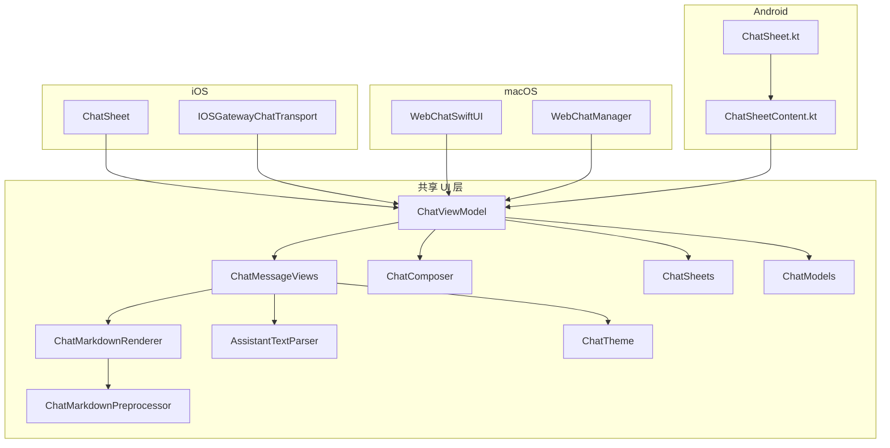
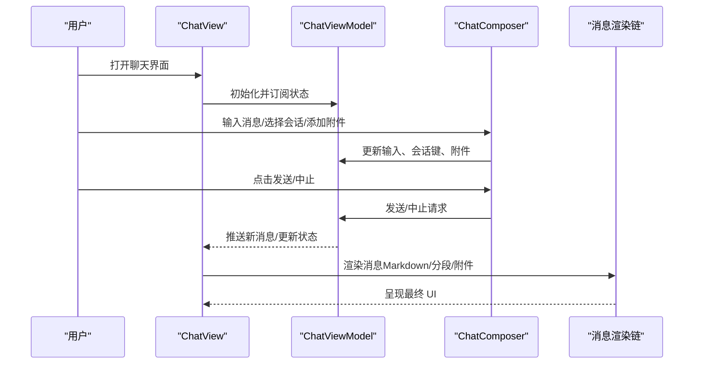
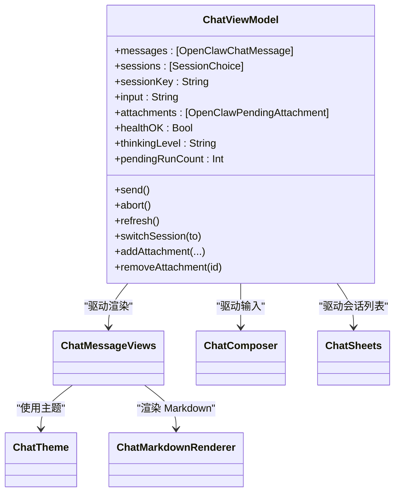
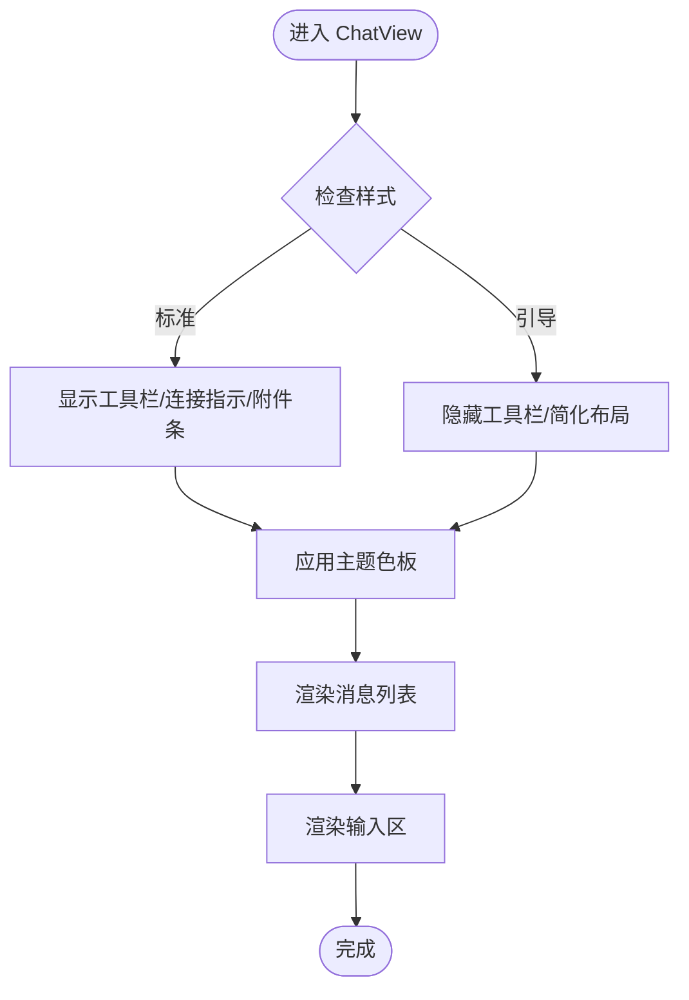
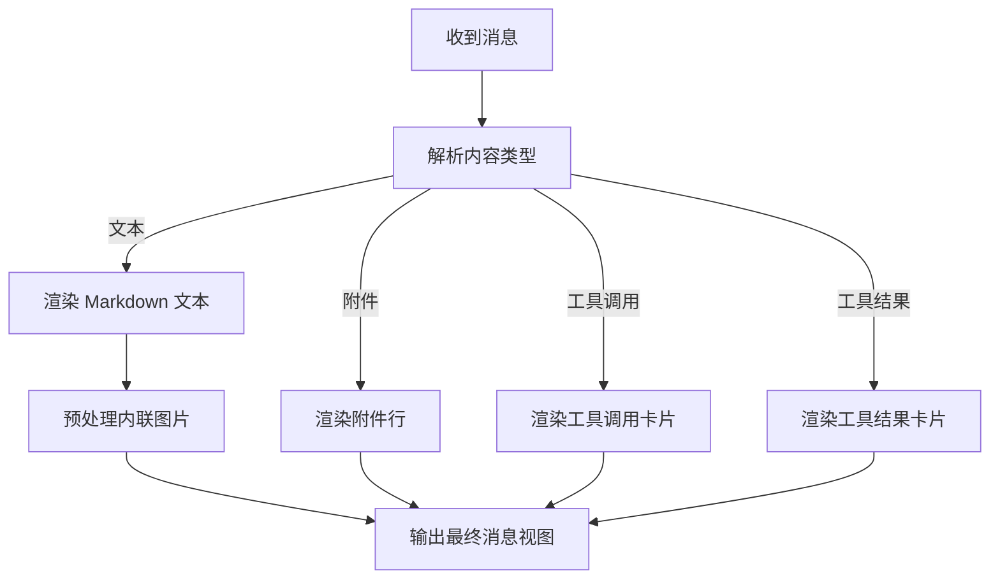
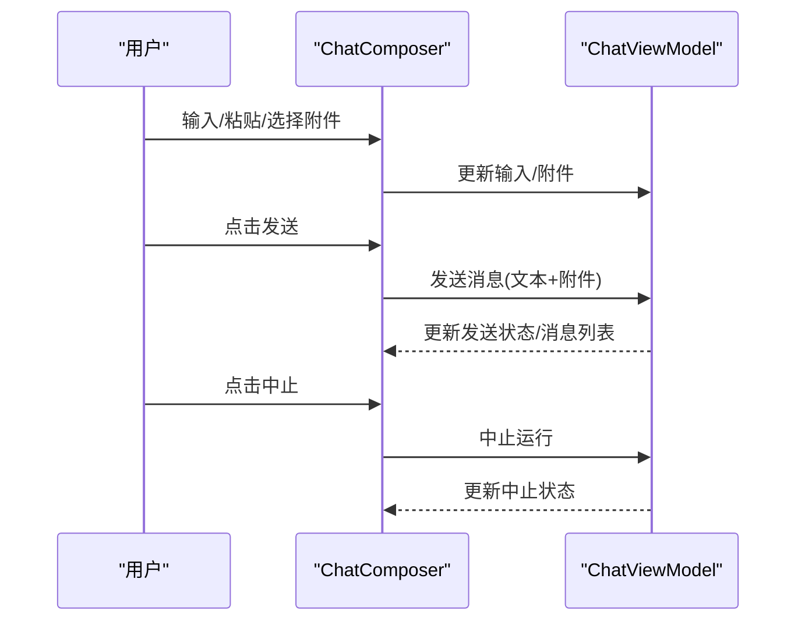
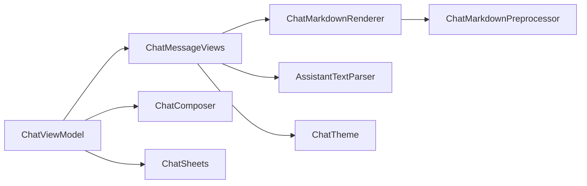

# OpenClaw 聊天界面组件

## 目录
1. [简介](#简介)
2. [项目结构](#项目结构)
3. [核心组件](#核心组件)
4. [架构总览](#架构总览)
5. [组件详解](#组件详解)
6. [依赖关系分析](#依赖关系分析)
7. [性能考量](#性能考量)
8. [故障排查指南](#故障排查指南)
9. [结论](#结论)
10. [附录](#附录)

## 简介
本文件面向 OpenClaw 聊天界面组件，提供从架构到实现细节的完整文档。重点覆盖：
- 视图模型与组件层次结构
- ChatViewModel 的状态管理、数据绑定与交互处理
- ChatView 的布局设计、响应式适配与主题系统
- 主题样式、消息渲染与交互行为的定制方法
- 可配置性、扩展性与多平台适配策略
- 集成指南与性能优化建议

## 项目结构
OpenClaw 的聊天 UI 采用跨平台 SwiftUI 实现，并在 iOS、macOS、Android 平台分别提供入口与适配层：
- 共享 UI 层：OpenClawChatUI（SwiftUI 组件、主题、消息渲染）
- 平台入口：
  - iOS：SwiftUI 视图与传输层
  - macOS：WebChatSwiftUI/WebChatManager
  - Android：Jetpack Compose 聊天入口

## 核心组件
- ChatModels：定义消息、会话、附件、用量等数据模型，兼容不同平台图片类型与编码差异。
- ChatTheme：统一主题色板与动态颜色解析，支持 macOS 深色/浅色外观切换。
- ChatMessageViews：消息气泡、工具调用/结果卡片、输入框、打字指示器等 UI 组合。
- ChatComposer：消息编辑器、会话选择器、思考级别、附件选择与拖拽上传、发送/中止控制。
- ChatSheets：会话列表弹窗，支持刷新与切换。
- ChatMarkdownRenderer/Preprocessor/AssistantTextParser：Markdown 预处理、渲染与助手文本分段。
- ChatViewModel：状态驱动的视图模型，负责消息流、会话管理、附件、健康状态与交互回调。
- ChatView：顶层容器，组合消息列表与输入区，承载主题与样式。

## 架构总览
OpenClaw 聊天 UI 采用“视图模型驱动”的 SwiftUI 架构：
- ChatViewModel 维护状态（消息、会话、附件、健康、发送/中止状态等），通过 `@Bindable` 与视图双向绑定。
- ChatMessageViews/ChatComposer 等视图组件根据状态渲染 UI，并触发 ViewModel 的动作。
- ChatTheme 提供跨平台一致的主题色与动态解析；ChatMarkdownRenderer/Preprocessor/AssistantTextParser 负责消息内容的预处理与渲染。
- 平台入口（iOS/macOS/Android）将各自的状态源与事件桥接到共享的 ChatViewModel。

## 组件详解

### ChatViewModel：状态管理与交互
- 关键职责
  - 管理消息列表、会话列表与当前会话键
  - 处理发送/中止、刷新、会话切换、附件增删
  - 维护健康状态、思考级别、待执行工具调用
  - 将外部事件（如网关事件）映射为内部状态
- 数据绑定
  - 使用 `@Bindable` 与 SwiftUI 视图进行单向/双向绑定
  - 通过状态属性驱动 UI 重绘
- 交互处理
  - 发送消息时合并文本与附件，触发后端调用
  - 中止运行时更新中止状态，避免重复提交
  - 切换会话时加载历史并刷新预览
- 平台适配
  - iOS/macOS/Android 分别注入平台态（如附件选择、拖拽、键盘焦点）

### ChatView：布局与主题
- 布局设计
  - 顶部消息列表（滚动）、底部输入区（标准/引导模式）
  - 标准模式显示工具栏、连接指示、附件条；引导模式简化布局
- 响应式适配
  - 不同风格下内边距、最大宽度、行高自适应
  - macOS 支持拖拽上传与自动聚焦
- 主题系统
  - 使用 OpenClawChatTheme 提供背景、气泡、文字、分割线等色值
  - macOS 动态解析深色/浅色外观下的气泡颜色

### ChatMessageViews：消息渲染与交互
- 消息气泡
  - 用户/助手不同配色与圆角尾部（引导模式）
  - 最大宽度限制与阴影/描边
- 工具调用/结果卡片
  - 解析 `toolCall`/`toolResult` 内容，按工具注册表生成显示摘要
- Markdown 渲染
  - 预处理内联图片（dataURL 转平台图像），渲染结构化文本
- 助手文本分段
  - 解析 `thinking`/`final` 标签，区分思考与正式回复段落

### ChatComposer：输入与交互
- 编辑器
  - macOS 使用自定义 NSTextView，支持回车发送/Shift+回车换行
  - 其他平台使用 TextEditor，设置最小/理想/最大高度
- 工具栏
  - 会话选择器（可选）、思考级别选择、刷新按钮、附件选择
- 附件
  - macOS 支持拖拽与文件选择；移动端使用 PhotosPicker
  - 预览缩略图与移除按钮
- 发送/中止
  - 发送时合并文本与附件；中止时显示进度与禁用按钮

### ChatSheets：会话管理
- 会话列表弹窗
  - 显示会话名称与更新时间，支持刷新与切换
  - macOS/iOS 工具栏位置差异

### 平台适配与集成
- iOS
  - ChatSheet 作为 SwiftUI 入口，绑定主视图模型
  - IOSGatewayChatTransport 负责与网关通信
- macOS
  - WebChatSwiftUI/WebChatManager 提供 Web 容器与聊天管理
- Android
  - ChatSheet.kt 与 ChatSheetContent.kt 将 Jetpack Compose 与主视图模型对接，支持图片选择、发送与中止

## 依赖关系分析
- 组件耦合
  - ChatViewModel 是核心枢纽，被 ChatMessageViews、ChatComposer、ChatSheets 依赖
  - ChatMessageViews 依赖 ChatMarkdownRenderer/Preprocessor/AssistantTextParser 与 ChatTheme
- 外部依赖
  - SwiftUI、Textual（Markdown 渲染）
  - 平台层：AppKit/UIKit（macOS/iOS）、PhotosPicker（iOS）、Compose（Android）

## 性能考量
- 渲染优化
  - 消息气泡最大宽度限制，减少过度布局
  - Markdown 渲染前预处理内联图片，避免重复解码
- 状态更新
  - 使用 `@MainActor` 保证主线程渲染一致性
  - 合理拆分视图，避免不必要的整树重绘
- 附件处理
  - 仅在需要时加载预览图，及时释放内存
- 平台差异
  - macOS 自定义 TextView 减少 SwiftUI TextEditor 的重排成本
  - iOS PhotosPicker 异步加载，避免阻塞主线程

## 故障排查指南
- 发送按钮不可用
  - 检查 `canSend`/`isSending`/`pendingRunCount` 状态
  - 确认输入非空且无错误文本
- 附件无法添加
  - macOS：确认拖拽类型与文件 URL 加载成功
  - iOS：检查 PhotosPicker 回调与 MIME/扩展名推断
- 主题颜色异常
  - macOS：确认外观切换时动态颜色解析是否生效
- 工具调用/结果未显示
  - 检查 `content.type` 是否为 `toolCall`/`toolResult` 或具备 `name`/`arguments`
- 会话切换无效
  - 确认 `sessionKey` 与 `sessionChoices` 匹配，刷新后重新加载

## 结论
OpenClaw 聊天界面组件以 ChatViewModel 为核心，结合 SwiftUI 的声明式 UI 与跨平台主题系统，实现了统一的消息渲染、输入与会话管理体验。通过模块化的渲染链与平台适配层，组件具备良好的可配置性、扩展性与可维护性。建议在集成时遵循状态驱动与平台差异适配原则，并利用现有主题与渲染链快速定制样式与行为。

## 附录
- 集成步骤
  - iOS：在 ChatSheet 中注入 ChatViewModel，绑定消息列表与输入区
  - macOS：在 WebChatSwiftUI 中初始化 ChatViewModel，接入 WebChatManager
  - Android：在 ChatSheetContent 中收集状态并调用 ViewModel 的发送/中止/附件操作
- 主题定制
  - 修改 OpenClawChatTheme 中的颜色与渐变，或在 ChatMessageViews/ChatComposer 中覆写局部样式
- 渲染定制
  - 调整 ChatMarkdownVariant（standard/compact）影响结构化样式与代码字体比例
  - 自定义 AssistantTextParser 的标签识别以支持新的助手文本格式
- 交互行为
  - 在 ChatComposer 中扩展按钮与工具栏项，或在 ChatViewModel 中新增状态字段与动作