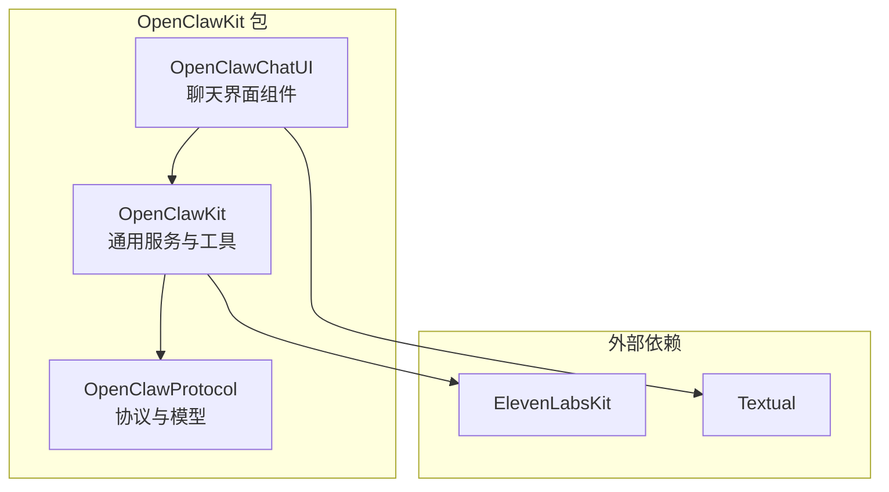
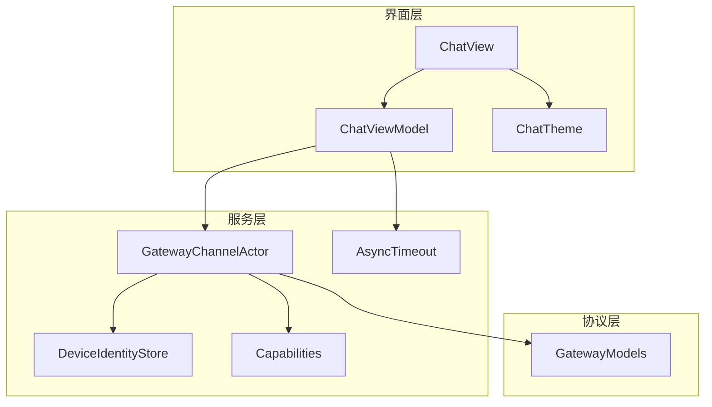
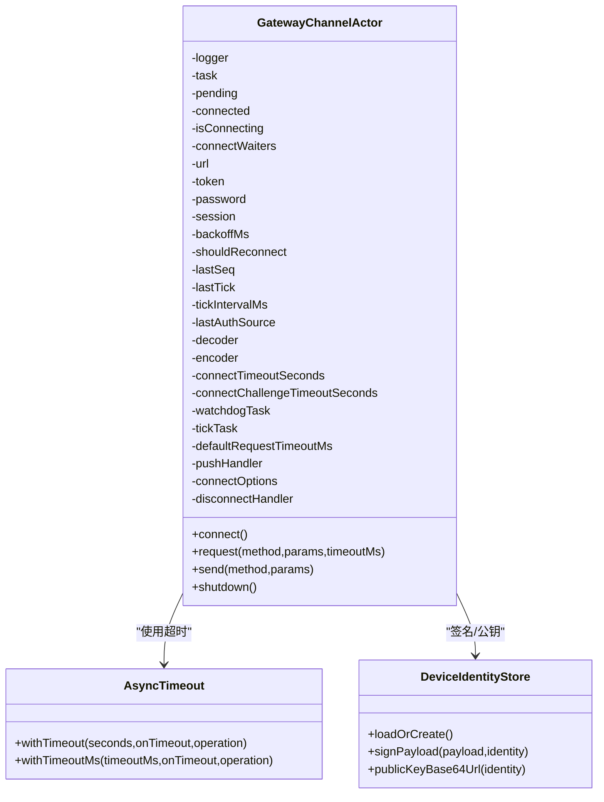
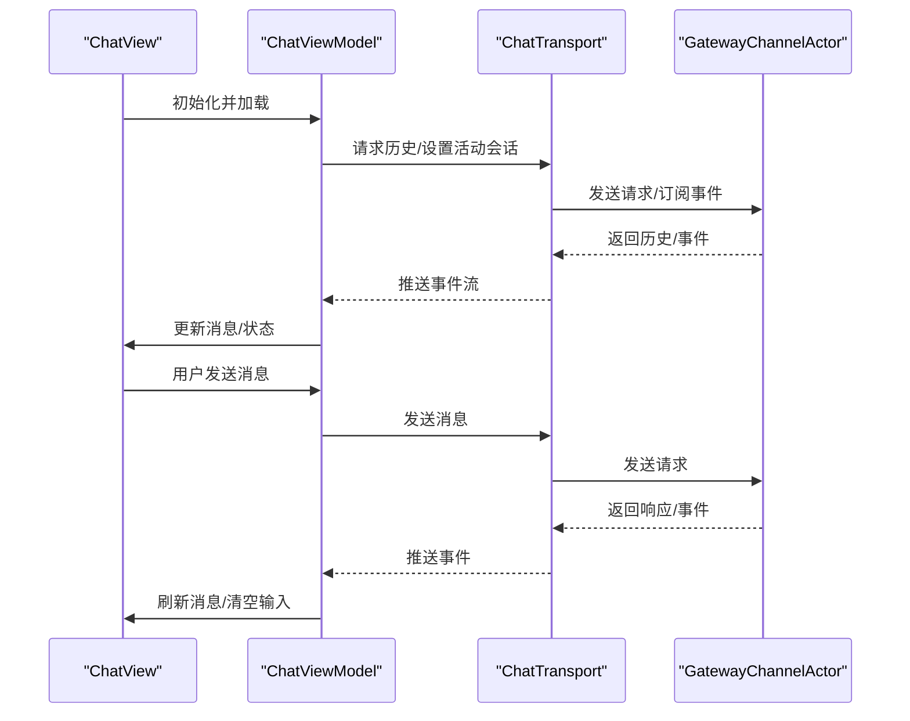
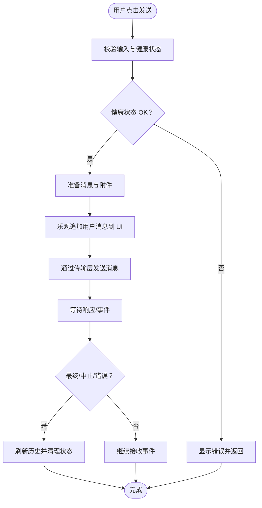
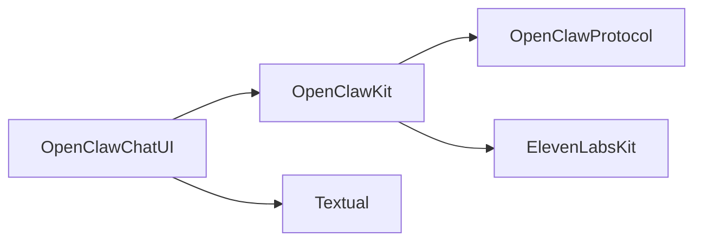

# 共享组件库

## 目录
1. [引言](#引言)
2. [项目结构](#项目结构)
3. [核心组件](#核心组件)
4. [架构总览](#架构总览)
5. [详细组件分析](#详细组件分析)
6. [依赖关系分析](#依赖关系分析)
7. [性能考量](#性能考量)
8. [故障排查指南](#故障排查指南)
9. [结论](#结论)
10. [附录](#附录)

## 引言
本文件面向 OpenClaw 共享组件库（OpenClawKit）的技术文档，系统阐述其架构设计与核心能力，覆盖跨平台组件复用、聊天界面组件、工具函数库与通用服务模块。文档同时解析 Swift Package Manager 的组织结构、模块划分与依赖管理，总结共享组件的设计原则、接口抽象与平台适配策略，并提供使用指南、配置选项与最佳实践，以及版本兼容性与升级策略建议。

## 项目结构
OpenClawKit 位于 `apps/shared/OpenClawKit`，采用 Swift Package Manager 组织，包含三个主要模块：
- OpenClawProtocol：网关协议与数据模型定义
- OpenClawKit：通用服务与工具（网关通道、设备身份、命令与资源等）
- OpenClawChatUI：跨平台聊天界面组件（SwiftUI 实现）

此外，仓库内还存在另一个 Swift 包 Swabble，用于语音唤醒与语音处理场景，可作为参考理解 Swift 包的组织方式与依赖管理。

## 核心组件
- 协议与模型层（OpenClawProtocol）
  - 定义网关连接参数、帧模型、事件与错误结构，统一消息编解码与版本控制。
- 通用服务层（OpenClawKit）
  - 提供网关通道（GatewayChannelActor）、异步超时工具、设备身份与签名、能力枚举、资源加载等。
- 聊天界面层（OpenClawChatUI）
  - 基于 SwiftUI 的聊天视图、视图模型与主题系统，支持消息列表、输入框、会话切换、工具调用与流式输出等。

## 架构总览
OpenClawKit 的整体架构围绕“协议-通道-界面”三层展开：
- 协议层：通过 OpenClawProtocol 统一网关通信的数据契约，确保跨平台一致性。
- 通道层：通过 GatewayChannelActor 封装 WebSocket 连接、重连、心跳、请求/响应与事件推送。
- 界面层：通过 OpenClawChatUI 提供跨平台聊天体验，结合 ViewModel 管理状态与交互。

## 详细组件分析

### 协议与模型（OpenClawProtocol）
- 设计要点
  - 使用生成器脚本维护协议模型，避免手写错误；统一字段命名与编码键映射。
  - 明确协议版本号与错误码，便于演进与兼容。
- 关键结构
  - 连接参数、握手响应、请求/响应帧、事件帧、快照与状态版本、错误形状、代理事件、各类方法参数等。
- 复杂度与性能
  - 模型以 Codable + Sendable 为主，编解码路径稳定；注意大负载（历史/快照）的消息尺寸限制。

### 通用服务（OpenClawKit）
- 网关通道（GatewayChannelActor）
  - 责任边界清晰：连接、认证、心跳、请求/响应、事件分发、断线重连与超时处理。
  - 并发安全：使用 actor 隔离状态，配合 CheckedContinuation 与 TaskGroup 实现请求生命周期管理。
  - 可观测性：日志记录连接状态、错误上下文与超时原因。
  - 可扩展性：通过 WebSocketSessioning 抽象网络层，便于替换实现或注入测试替身。
- 异步超时工具（AsyncTimeout）
  - 提供 `withTimeout` 与 `withTimeoutMs`，基于 TaskGroup 同时运行操作与定时器，统一超时语义。
- 设备身份与签名（DeviceIdentityStore）
  - 生成/加载设备身份，基于 Curve25519 签名，支持 Base64Url 编码公钥与签名。
  - 身份文件存储位置支持环境变量覆盖，默认位于应用支持目录下的 OpenClaw 子目录。
- 能力枚举（Capabilities）
  - 统一声明设备能力（画布、相机、屏幕、语音唤醒、定位），便于权限与功能开关控制。

### 聊天界面组件（OpenClawChatUI）
- 视图（OpenClawChatView）
  - 支持标准与引导样式，按平台调整布局与间距；内置滚动锚定、空态提示、错误横幅与刷新机制。
  - 合并工具结果消息，优化显示体验。
- 视图模型（OpenClawChatViewModel）
  - 状态驱动：消息列表、输入内容、思考级别、加载/发送/中止状态、错误文本、附件、会话信息、待执行运行数与工具调用队列。
  - 事件驱动：通过传输层事件流更新 UI；健康检查与会话轮询；超时清理与错误恢复。
  - 附件处理：图片类型校验、大小限制、预览生成与编码。
- 主题（OpenClawChatTheme）
  - 跨平台颜色与材质：根据 macOS/ iOS 与外观动态解析气泡色、背景、卡片与边框等。
  - 平台差异：macOS 使用薄材料与径向渐变背景，iOS 使用系统背景与次级背景。

## 依赖关系分析
- 模块依赖
  - OpenClawChatUI 依赖 OpenClawKit；OpenClawKit 依赖 OpenClawProtocol。
- 外部依赖
  - ElevenLabsKit：音频相关能力封装。
  - Textual：Markdown 渲染（条件编译仅在 macOS/iOS 生效）。
- 平台与语言特性
  - Swift 6 严格并发启用；目标平台为 iOS 18+、macOS 15+。

## 性能考量
- 网络与并发
  - 使用 actor 隔离连接状态，避免竞态；请求超时与任务组并行控制，降低阻塞风险。
  - 心跳与看门狗机制保障长连接稳定性，指数退避减少抖动。
- UI 响应
  - 乐观 UI 更新提升感知速度；滚动锚定与动画优化滚动体验。
  - 附件上传前进行类型与大小校验，避免无效 IO。
- 序列化与内存
  - 优先使用生成模型与自定义 AnyCodable，减少桥接异常与类型丢失。
  - 大消息（历史/快照）设置最大消息尺寸，防止接收错误。

## 故障排查指南
- 连接失败
  - 检查连接超时与挑战超时阈值；确认认证来源（设备令牌/共享令牌/密码）与签名流程。
  - 查看日志上下文错误，关注“connect failed”“receive failed”等关键信息。
- 心跳中断
  - 若心跳间隔超过容忍值，触发断线与重连；检查网络波动与服务器策略。
- 请求超时
  - 使用 AsyncTimeout 工具统一超时处理；必要时增大默认请求超时。
- 事件序列错位
  - 当事件序号出现间隙时，提示刷新并清理待处理请求。
- 附件问题
  - 图片类型不符或超出大小限制会直接报错；检查 MIME 类型与文件扩展名。

## 结论
OpenClawKit 通过清晰的模块划分与严格的并发设计，实现了跨平台的聊天界面与通用服务复用。协议层确保通信一致性，通道层提供稳健的连接与事件处理，界面层以 SwiftUI 构建流畅的用户体验。借助工具函数与平台适配策略，组件可在 iOS 与 macOS 上稳定运行，并为后续扩展（如语音、画布等）预留空间。

## 附录

### 使用指南与最佳实践
- 在应用中集成 OpenClawChatUI
  - 准备一个实现 OpenClawChatTransport 的传输层实例，用于与网关通信。
  - 创建 OpenClawChatViewModel 并传入会话键，随后在 SwiftUI 中渲染 OpenClawChatView。
  - 自定义主题颜色与样式以匹配应用品牌。
- 配置网关连接
  - 设置 `GatewayConnectOptions`，包含角色、作用域、能力、命令与权限。
  - 如需设备令牌或共享令牌，提前准备并传入 GatewayChannelActor。
- 工具函数调用
  - 使用 AsyncTimeout 执行可能阻塞的操作，避免 UI 卡顿。
  - 对于设备身份与签名，优先使用 DeviceIdentityStore 的静态方法。
- 最佳实践
  - 保持会话键唯一且稳定，避免重复发送导致的幂等性问题。
  - 对附件进行预校验与压缩，提升上传成功率。
  - 合理设置心跳与超时参数，兼顾稳定性与响应速度。

### 版本兼容性与升级策略
- Swift 与平台要求
  - Swift 6 严格并发已启用；目标平台为 iOS 18+、macOS 15+。
- 协议版本
  - 协议版本号由常量维护，升级时需评估字段变更与兼容策略。
- 依赖升级
  - 外部依赖（ElevenLabsKit、Textual）建议采用精确版本锁定，避免破坏性变更。
- 向后兼容性
  - 通过可选字段与默认值维持旧客户端兼容；对新增能力使用能力枚举与条件编译。
- 升级建议
  - 逐步迁移至 Swift 6 并启用严格并发；对关键路径增加可观测性与超时保护；在发布前进行端到端回归测试。