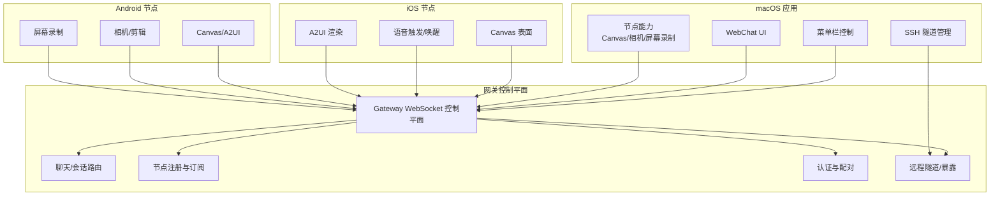
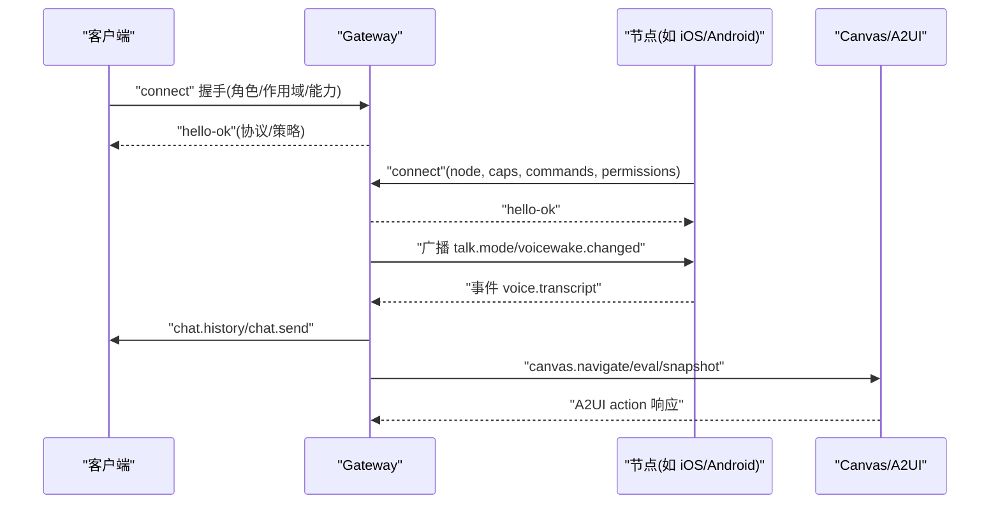
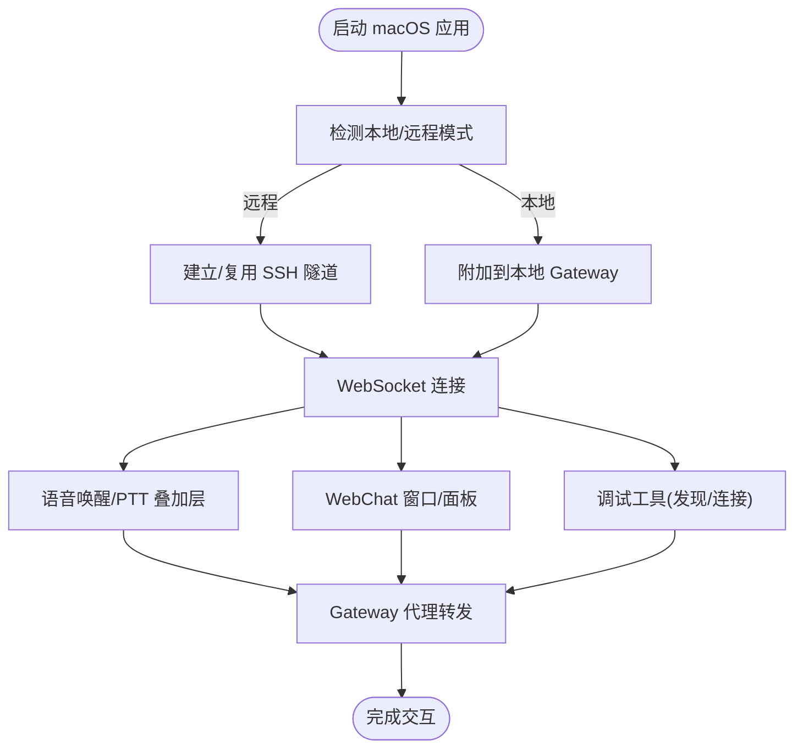
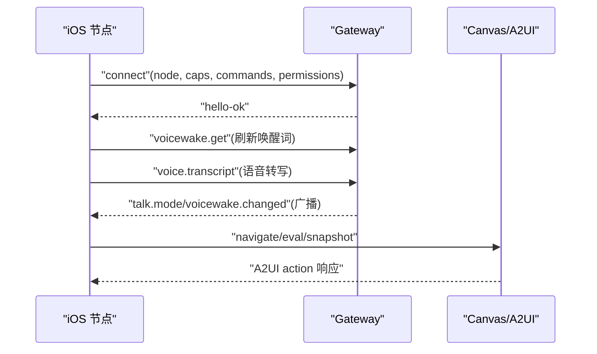
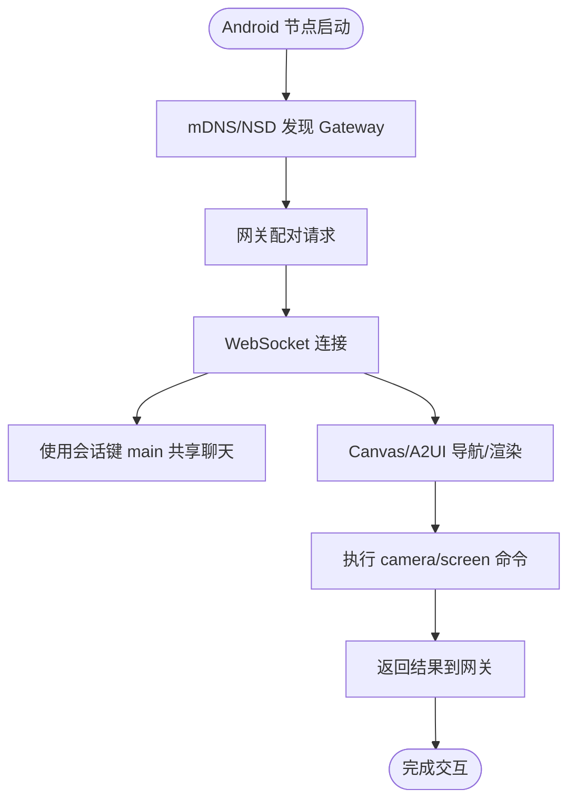
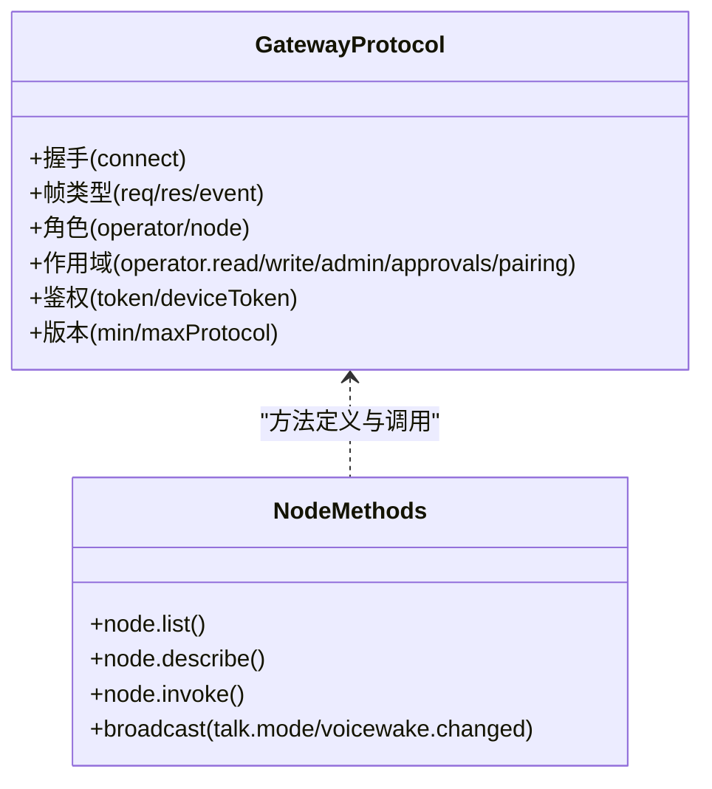
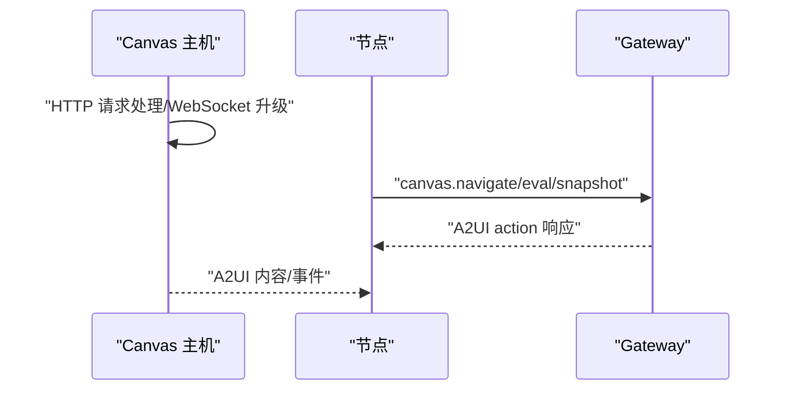
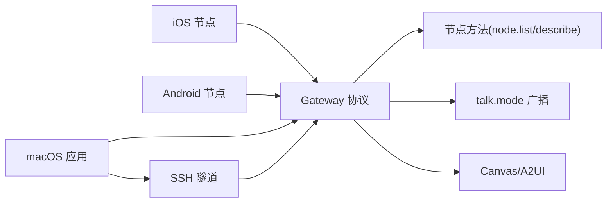

# 平台应用生态

## 目录
1. [简介](#简介)
2. [项目结构](#项目结构)
3. [核心组件](#核心组件)
4. [架构总览](#架构总览)
5. [详细组件分析](#详细组件分析)
6. [依赖关系分析](#依赖关系分析)
7. [性能考量](#性能考量)
8. [故障排查指南](#故障排查指南)
9. [结论](#结论)
10. [附录](#附录)

## 简介
本文件系统性梳理 OpenClaw 的平台应用生态，覆盖 macOS 菜单栏应用、iOS 节点应用与 Android 节点应用三类客户端，阐述其功能特性、技术实现与用户交互模式，并说明应用间通过网关协议实现的协作机制与远程网关控制能力。文档同时提供平台特定的配置指南、权限管理与最佳实践建议，帮助开发者与用户高效搭建与维护个人 AI 助手生态。

## 项目结构
OpenClaw 采用“网关控制平面 + 多端节点”的架构设计。网关负责会话、通道、工具与事件的统一调度；多端应用通过 WebSocket 协议接入网关，形成本地/远程协同的工作流。平台应用生态主要由以下部分组成：
- macOS 菜单栏应用：菜单栏控制、健康状态、WebChat、调试工具、远程网关控制、Canvas/相机/屏幕录制等能力暴露为节点。
- iOS 节点应用：Canvas 表面、语音触发、Canvas/A2UI、受控 via openclaw nodes。
- Android 节点应用：Canvas、推拉模式、相机、屏幕录制、可选短信。
- 网关协议与远程访问：统一的 WebSocket 协议、发现与配对、SSH/Tailscale 远程隧道、安全策略与 TLS 指纹校验。

## 核心组件
- 网关协议（WebSocket）：统一的握手、帧格式、角色与作用域、版本协商、鉴权与设备身份、TLS 指纹校验。
- 节点管理：节点列表、描述、命令白名单、权限映射、订阅与广播。
- 语音唤醒与连续对话：macOS 推/按压触发、iOS/Android 语音转发、网关 talk 模式广播。
- Canvas/A2UI：Canvas 主机服务、A2UI 推送/重置、节点侧渲染与交互。
- 远程网关控制：SSH 隧道自动建立、端口转发、远程直连与尾网暴露。

## 架构总览
OpenClaw 的应用生态以“网关控制平面 + 多端节点”为核心，所有客户端（CLI、WebChat、macOS/iOS/Android 节点）均通过 WebSocket 与网关通信。节点在连接时声明能力（caps）、命令白名单（commands）与权限映射（permissions），网关据此进行授权与路由。

## 详细组件分析

### macOS 菜单栏应用（控制面板、语音唤醒、推拉模式叠加层、WebChat、调试工具、远程网关控制）
- 菜单栏控制与健康状态：显示网关状态、通知与权限提示，支持本地/远程模式切换。
- 语音唤醒与推拉模式叠加层：菜单项开关、麦克风选择、实时音量指示、发送确认与错误处理。
- WebChat：窗口/面板两种呈现方式，支持会话键复用与尺寸约束。
- 调试工具：连接/发现调试 CLI、日志过滤、窗口布局与颜色解析。
- 远程网关控制：SSH 隧道自动建立与复用、目标端口解析、失败回退与重试。

### iOS 节点应用（Canvas、语音触发、Canvas 表面、受控 via openclaw nodes）
- 连接与配对：Bonjour/LAN 发现、跨网络尾网 DNS-SD、手动主机端口。
- Canvas/A2UI：WKWebView 渲染、自动导航至 A2UI、eval/snapshot 命令。
- 语音触发：后台音频受限场景下的最佳努力行为、唤醒词从网关同步。
- 节点命令：`canvas.navigate/eval/snapshot`、`camera.snap/clip`、`screen.record`、`location.get` 等。

### Android 节点应用（Canvas、推拉模式、相机、屏幕录制、可选短信）
- 连接与配对：mDNS/NSD 发现、跨网络尾网 DNS-SD、手动主机端口。
- 会话共享：Chat 使用主会话键 main，历史与回复在 WebChat/Android 等客户端共享。
- Canvas/A2UI：节点指向网关 Canvas/A2UI 主机，支持 `eval/snapshot/navigate`。
- 设备能力：`camera.snap/clip`、`screen.record`、`location.get` 等命令。

### 网关协议与节点管理
- 协议握手：`connect` 请求、挑战/响应、协议版本、角色与作用域、设备身份与签名。
- 节点方法：`node.list/node.describe` 返回节点能力与命令白名单；`talk.mode` 广播控制连续对话。
- 安全与鉴权：设备令牌、轮换/撤销、TLS 指纹校验、尾网身份头。

### Canvas/A2UI 与远程网关控制
- Canvas 主机：HTTP 服务器提供静态资源与 WebSocket 升级，注入 live-reload 客户端。
- A2UI：push/reset 动作，节点侧 eval 执行与快照生成。
- 远程控制：SSH 隧道转发网关端口，macOS 应用自动管理隧道生命周期。

## 依赖关系分析
- 平台应用与网关协议耦合度高：所有节点均依赖统一的 WebSocket 协议与节点方法。
- 节点能力声明与网关授权：节点在 connect 时声明 caps/commands/permissions，网关进行服务端允许列表校验。
- 远程访问依赖：macOS 应用通过 SSH 隧道或尾网暴露，确保网关端口可达。
- CLI 与节点描述：CLI 提供节点状态与描述查询，辅助运维与自动化。

## 性能考量
- 事件广播与丢包策略：`talk.mode` 广播启用 `dropIfSlow`，避免慢消费者拖累整体。
- 节点订阅与分发：`nodeSubscriptions` 管理会话级订阅，减少无效消息传递。
- Canvas/A2UI：`eval/snapshot` 在节点侧执行，降低网关负载；Canvas 主机注入 live-reload，提升开发效率。
- 远程隧道：macOS 应用复用隧道端口，避免频繁重启带来的延迟。

## 故障排查指南
- 连接与发现
  - macOS 应用提供调试 CLI，可模拟握手与发现逻辑，便于定位连接问题。
  - iOS/Android 节点需确认 Bonjour/LAN 发现、尾网 DNS-SD 或手动主机端口配置。
- 语音唤醒与连续对话
  - iOS 后台音频限制导致语音功能为最佳努力；检查唤醒词同步与 `talk.mode` 广播。
  - macOS 推/按压触发需确保 Overlay 正常显示与释放时 `endCapture` 调用。
- Canvas/A2UI
  - 确认网关 Canvas/A2UI 主机已启动并可访问；节点 navigate 到正确路径。
- 远程网关
  - SSH 隧道端口转发是否生效；macOS 应用远程模式下自动管理隧道；必要时检查尾网暴露与 TLS 指纹校验。

## 结论
OpenClaw 的平台应用生态以网关协议为核心，实现了 macOS 菜单栏应用、iOS/Android 节点之间的无缝协作。通过统一的节点能力声明、命令白名单与权限映射，结合 WebSocket 控制平面与 Canvas/A2UI 渲染，用户可在本地或远程环境下获得一致的交互体验。配合 SSH/Tailscale 远程隧道与严格的鉴权与安全策略，OpenClaw 既满足个人用户的本地优先需求，也支持跨网络的生产化部署。

## 附录
- 平台特定配置与权限
  - macOS：菜单栏控制、通知/屏幕录制/麦克风/自动化等 TCC 权限；本地/远程模式切换；SSH 隧道管理。
  - iOS：Canvas/A2UI、语音唤醒、节点命令；Bonjour/LAN 与尾网 DNS-SD 发现。
  - Android：Canvas/A2UI、相机/剪辑/屏幕录制、会话共享；mDNS/NSD 与尾网 DNS-SD。
- 网关协议与远程访问
  - WebSocket 握手、帧格式、角色与作用域、版本协商、鉴权与设备身份、TLS 指纹校验。
  - SSH 隧道转发、尾网暴露、远程直连与安全策略。