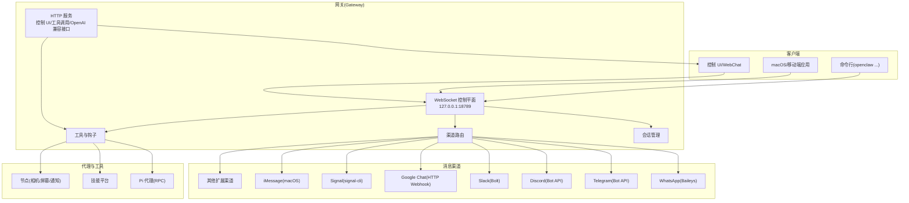

# 快速开始指南

## 目录
1. [简介](#简介)
2. [系统要求与推荐安装方式](#系统要求与推荐安装方式)
3. [安装步骤](#安装步骤)
4. [运行引导向导](#运行引导向导)
5. [配置网关守护进程](#配置网关守护进程)
6. [连接消息渠道](#连接消息渠道)
7. [基础使用示例](#基础使用示例)
8. [配置文件模板](#配置文件模板)
9. [常见问题与故障排除](#常见问题与故障排除)
10. [架构概览](#架构概览)
11. [结语](#结语)

## 简介
OpenClaw 是一款可在您自己的设备上运行的个人 AI 助手，支持在您已使用的聊天渠道（如 WhatsApp、Telegram、Slack、Discord、Google Chat、Signal、iMessage、Microsoft Teams、WebChat）中进行对话，并可扩展到 BlueBubbles、Matrix、Zalo 等扩展渠道。它通过“网关（Gateway）”作为控制平面，统一管理会话、渠道、工具与事件。

本快速开始指南将带您从零完成安装、运行引导向导、配置网关守护进程、连接消息渠道，并提供基本使用示例，帮助您快速搭建可用的个人 AI 助手环境。

## 系统要求与推荐安装方式
- 运行时：Node.js ≥22
- 推荐平台：macOS、Linux 或 Windows（WSL2；强烈推荐）
- 推荐安装方式：npm、pnpm、bun（三者均可用于全局安装）

安装脚本与说明详见：
- [安装总览](file://docs/install/index.md#L1-L187)
- [README 中的安装与运行说明](file://README.md#L44-L56)

## 安装步骤
以下提供多种安装路径，任选其一即可：

### 1) 使用官方安装脚本（推荐）
- Linux/macOS 终端执行安装脚本，自动完成全局安装并运行引导向导：
  - `curl -fsSL https://openclaw.ai/install.sh | bash`
- Windows（PowerShell）：
  - `iwr -useb https://openclaw.ai/install.ps1 | iex`

### 2) 手动全局安装（npm/pnpm）
- npm 全局安装：
  - `npm install -g openclaw@latest`
- pnpm 全局安装：
  - `pnpm add -g openclaw@latest`
  - 首次安装可能需要批准构建脚本：先执行 `pnpm approve-builds -g`，再重新安装

### 3) 从源码构建（开发者）
- 克隆仓库并安装依赖：
  - `git clone https://github.com/openclaw/openclaw.git && cd openclaw`
  - `pnpm install`
  - `pnpm ui:build`（首次构建 UI 依赖）
  - `pnpm build`
- 运行引导向导并安装后台服务：
  - `openclaw onboard --install-daemon`

## 运行引导向导
引导向导是推荐的首次设置方式，它会为您配置本地或远程网关、工作区、渠道、配对策略以及技能等。

- 基本命令：
  - `openclaw onboard --install-daemon`
- 向导模式：
  - `openclaw onboard --flow quickstart`（最小化提示，自动生成网关令牌）
  - `openclaw onboard --flow manual`（完整提示，手动配置端口/绑定/认证等）
- 远程模式：
  - `openclaw onboard --mode remote --remote-url ws://gateway-host:18789`

向导会：
- 选择模型与认证（OAuth 推荐，或 API Key）
- 配置网关（端口、绑定、认证、Tailscale）
- 添加渠道（WhatsApp/Telegram/Discord/Mattermost/Signal 等）
- 安装后台服务（LaunchAgent/systemd 用户服务）
- 进行健康检查
- 可选安装技能

参考：
- [`onboard` CLI 文档](file://docs/cli/onboard.md#L1-L30)
- [向导操作指南](file://docs/start/wizard.md#L1-L334)

## 配置网关守护进程
网关守护进程负责通道连接、会话管理与控制平面。您可以直接运行或通过服务管理器保持常驻。

- 直接运行（前台）：
  - `openclaw gateway --port 18789 --verbose`
- 查看状态与健康：
  - `openclaw gateway status`
  - `openclaw health`
- 服务管理（安装/启动/停止/重启）：
  - `openclaw gateway install`
  - `openclaw gateway start`
  - `openclaw gateway stop`
  - `openclaw gateway restart`

网关特性与选项：
- 默认绑定到回环地址（127.0.0.1:18789），可通过 `--port`、环境变量或配置覆盖
- 支持 Token 或密码认证，默认启用认证
- 单端口多路复用：同时提供 WebSocket 控制平面与 HTTP（控制 UI、工具调用、OpenAI 兼容接口）
- 支持热重载与进程内重启（SIGUSR1）
- 远程访问：建议通过 Tailscale 或 SSH 隧道

参考：
- [`gateway` CLI 文档](file://docs/cli/gateway.md#L1-L200)
- [Gateway 运行手册](file://docs/gateway/index.md#L1-L329)

## 连接消息渠道
OpenClaw 支持多种消息渠道，可在同一网关中同时运行多个渠道。最快上手的方式通常为 Telegram（只需 Bot Token）。

- 渠道列表与能力：
  - [渠道总览](file://docs/channels/index.md#L1-L46)
- 常用渠道配置要点：
  - Telegram：设置 `channels.telegram.botToken` 或环境变量 `TELEGRAM_BOT_TOKEN`
  - WhatsApp：通过 `openclaw channels login` 进行二维码登录
  - Discord：设置 `channels.discord.token` 或环境变量 `DISCORD_BOT_TOKEN`
  - Google Chat：配置服务账号 JSON 与 webhook audience
  - Signal：可由向导安装 signal-cli 并配置账户
  - iMessage：macOS 专属，需登录 Messages
  - Slack：设置 `SLACK_BOT_TOKEN` + `SLACK_APP_TOKEN`
  - Mattermost：作为插件单独安装后配置
- 渠道管理命令：
  - 列出/查看状态/能力探测/解析名称/日志查看等
  - 参考：[`channels` CLI 文档](file://docs/cli/channels.md#L1-L80)

渠道安全与配对：
- 默认策略：未知发送者的私聊 DM 会收到一次性配对码，需经批准后方可回复
- 可通过 `openclaw pairing approve <channel> <code>` 完成批准
- 可调整 DM 策略（配对/允许名单/开放/禁用）与群组策略（允许名单/开放/禁用）

参考：
- [渠道安全与配对](file://docs/channels/index.md#L36-L46)
- [Getting Started 中的配对与连接](file://docs/start/getting-started.md#L134-L167)

## 基础使用示例
以下示例展示从安装到首次消息的完整流程。请根据实际环境替换参数（如端口、令牌、目标号码等）。

- 运行引导向导并安装后台服务：
  - `openclaw onboard --install-daemon`
- 启动网关（前台调试）：
  - `openclaw gateway --port 18789 --verbose`
- 在新终端发送测试消息：
  - `openclaw message send --target +1234567890 --message "Hello from OpenClaw"`
- 与助手对话（可选返回到任意已连接渠道）：
  - `openclaw agent --message "Ship checklist" --thinking high`
- 打开控制面板（无需配置渠道即可聊天）：
  - `openclaw dashboard`

注意：
- 若使用 Bun，请注意在 WhatsApp/Telegram 上可能存在兼容性问题，建议使用 Node 运行网关
- 如出现“未配置认证”的健康检查提示，请回到向导设置 OAuth 或 API Key

参考：
- [README 快速开始示例](file://README.md#L57-L76)
- [Getting Started 快速验证](file://docs/start/getting-started.md#L126-L133)

## 配置文件模板
OpenClaw 的配置位于 `~/.openclaw/openclaw.json`（支持 JSON5，允许注释与尾随逗号）。若文件缺失，系统将采用安全默认值。

- 最小配置示例（推荐起点）：
  - 包含代理工作区与 WhatsApp DM 允许名单
  - 参考：[最小配置示例](file://docs/gateway/configuration.md#L107-L115)
- 常用配置项（节选）：
  - `agents.defaults.workspace`：代理工作区根目录
  - `channels..allowFrom` / `channels..groupPolicy`：DM/群组允许策略
  - `gateway.port` / `gateway.auth.token` / `gateway.bind`：网关端口、认证与绑定
  - `messages.groupChat.historyLimit` / `channels..dmHistoryLimit`：历史上下文限制
  - `agents.defaults.sandbox.mode`：沙箱模式（非主会话隔离）
  - 参考：[配置参考（节选）](file://docs/gateway/configuration.md#L265-L731)

配置写入与更新：
- 完整应用：`config.apply`（替换整份配置）
- 局部更新：`config.patch`（合并部分键值）
- CLI 辅助：`openclaw config set`（非交互式修改）
  - 参考：[配置应用与更新](file://docs/gateway/configuration.md#L48-L106)

## 常见问题与故障排除
- `openclaw` 命令找不到（PATH 问题）
  - 检查全局安装路径是否在 PATH 中
  - 参考：[安装故障排除](file://docs/install/index.md#L158-L181)
- 网关无法启动或健康检查失败
  - 检查认证配置（Token/密码）与绑定模式
  - 参考：[Gateway 运行手册](file://docs/gateway/index.md#L18-L47)
- 渠道未连接或无响应
  - 使用 `openclaw channels status` 与 `openclaw status --deep` 排查
  - 参考：[`channels` CLI 故障排查](file://docs/cli/channels.md#L45-L49)
- DM 无回复
  - 首次 DM 会发送配对码，需批准后方可回复
  - 参考：[Getting Started 配对说明](file://docs/start/getting-started.md#L156-L167)
- Windows 平台
  - 强烈建议使用 WSL2；原生 Windows 未充分测试
  - 参考：[Getting Started Windows 提示](file://docs/start/getting-started.md#L53-L54)
- 安全与权限
  - 默认 DM 策略为“配对”，群组/频道消息默认需要提及或允许名单
  - 参考：[渠道安全与配对](file://docs/channels/index.md#L36-L46)

## 架构概览
下图展示了 OpenClaw 的核心组件与数据流关系，帮助理解从渠道到网关再到代理的交互过程。

## 结语
至此，您已完成 OpenClaw 的安装、引导向导、网关配置与渠道连接，并掌握了基本使用方法。建议后续：
- 配置 Brave Search API Key 以启用网页搜索技能
- 根据需要启用 Tailscale 或 SSH 隧道实现远程访问
- 逐步添加更多渠道与技能，按需调整沙箱与安全策略

祝您使用愉快！