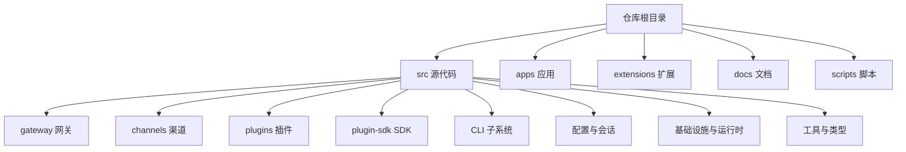
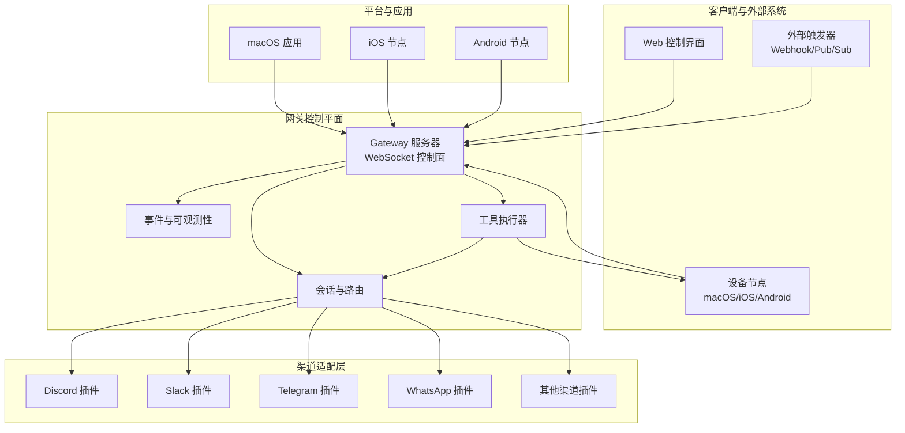
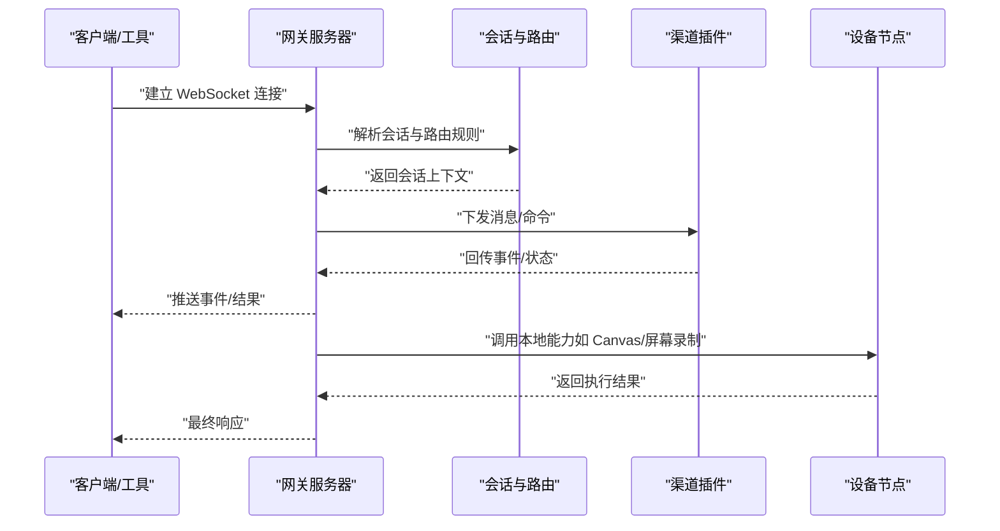
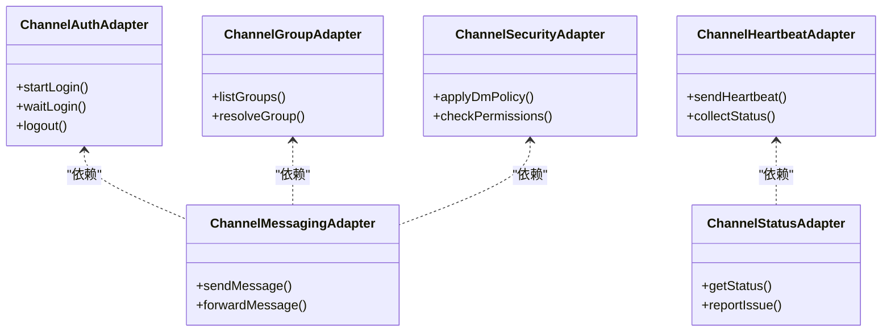
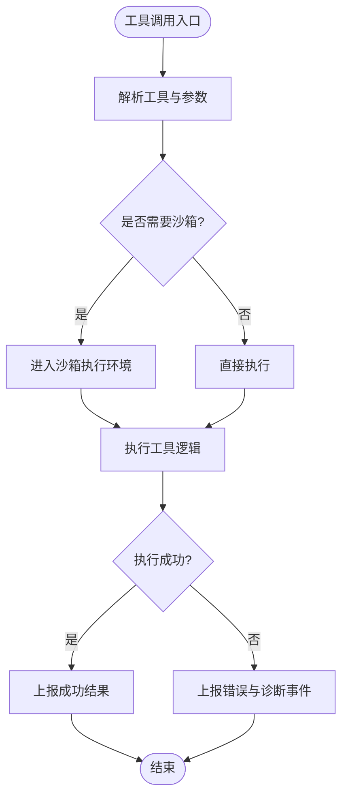
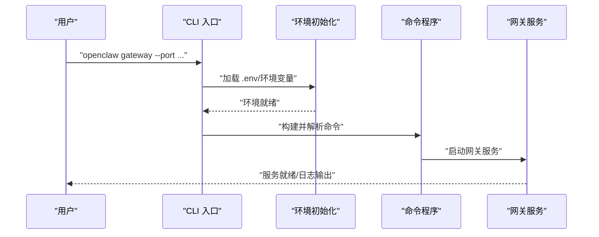
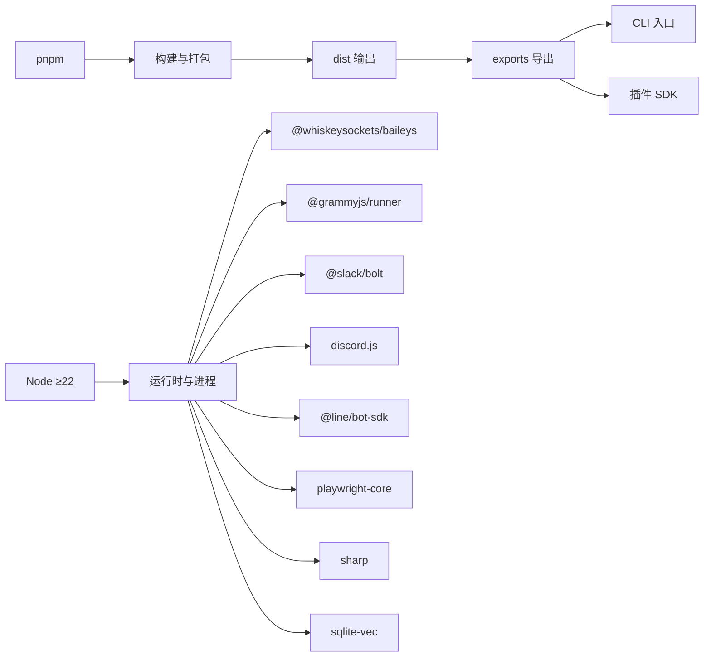

# 技术架构概览

## 目录
1. [引言](#引言)
2. [项目结构](#项目结构)
3. [核心组件](#核心组件)
4. [架构总览](#架构总览)
5. [详细组件分析](#详细组件分析)
6. [依赖关系分析](#依赖关系分析)
7. [性能考量](#性能考量)
8. [故障排除指南](#故障排除指南)
9. [结论](#结论)
10. [附录](#附录)

## 引言
本文件面向 OpenClaw 的技术架构，聚焦于其作为个人 AI 助手的整体设计与实现要点，重点阐述以下方面：
- WebSocket 控制平面：以网关为中心的统一控制通道
- 事件驱动架构：消息路由、会话管理与可观测性
- 插件化设计模式：渠道插件（多平台适配）、工具执行器（功能扩展）
- 代理模式与观察者模式：在消息适配与状态传播中的应用
- 系统边界与组件交互：客户端、网关、渠道、工具、节点之间的职责划分
- 基础设施要求、可扩展性与部署拓扑

OpenClaw 的“产品是助手，网关是控制平面”的定位决定了其架构以网关为核心，围绕会话、渠道、工具与事件构建统一的控制与数据流。

## 项目结构
从仓库组织看，OpenClaw 采用按领域分层与功能模块化的混合结构：
- 核心入口与 CLI：`src/index.ts` 提供 CLI 入口与全局初始化流程
- 网关服务：`src/gateway` 下包含 WebSocket 控制平面与相关方法
- 渠道插件：`src/channels/plugins` 定义渠道适配器与类型契约
- 插件 SDK：`src/plugin-sdk` 暴露对外可复用的类型与工具
- 平台与应用：`apps` 下包含移动端与桌面端应用源码
- 扩展生态：`extensions` 目录下为第三方渠道与能力扩展
- 文档与脚本：`docs` 与 `scripts` 提供运行、测试与打包支持

## 核心组件
- 网关服务器（WebSocket 控制平面）：统一承载会话、通道、工具与事件的控制通道
- 渠道插件体系：抽象出渠道适配器接口，屏蔽不同 IM 平台差异
- 工具执行器：通过插件 SDK 暴露的类型与工具，实现功能扩展与安全沙箱
- CLI 与守护进程：提供安装、启动、诊断与远程访问能力
- 会话与路由：基于会话键与路由规则，实现多账号、多群组隔离与策略控制
- 观测与诊断：通过诊断事件与日志传输，支撑健康检查与问题定位

## 架构总览
OpenClaw 的架构以“网关控制平面 + 多渠道适配 + 可插拔工具”为核心，形成事件驱动的统一控制与数据流：

## 详细组件分析

### 网关服务器（WebSocket 控制平面）
- 职责：作为统一控制面，承载会话、通道、工具与事件；提供远程暴露与安全控制
- 关键点：
  - 通过导出的启动函数与类型定义，统一对外暴露网关能力
  - 支持远程访问（Tailscale Serve/Funnel 或 SSH 隧道），并提供认证与权限控制
  - 与 CLI、Web 控制界面、设备节点通过 WebSocket 协议交互
- 设计考量：
  - 将“控制”与“执行”分离：网关负责编排与安全，具体执行由工具与节点完成
  - 通过会话隔离与路由策略，确保多账号、多群组的安全与一致性

### 渠道插件（多平台兼容）
- 设计模式：插件化 + 代理模式
  - 通过适配器接口抽象渠道差异（认证、消息发送、心跳、状态等）
  - 代理不同平台的 SDK/协议，向上提供统一契约
- 关键类型与职责：
  - 认证与登录：`ChannelAuthAdapter`、`ChannelPairingAdapter`
  - 消息与线程：`ChannelMessagingAdapter`、`ChannelThreadingAdapter`
  - 群组与目录：`ChannelGroupAdapter`、`ChannelDirectoryAdapter`
  - 安全与 DM 策略：`ChannelSecurityAdapter`、`ChannelSecurityDmPolicy`
  - 心跳与状态：`ChannelHeartbeatAdapter`、`ChannelStatusAdapter`
- 观察者模式：通过状态与事件上报，实现对渠道健康度与异常的观测

### 工具执行器（功能扩展）
- 设计模式：插件化 + 代理模式
  - 通过 `OpenClawPluginService` 与 `ChannelAgentTool` 抽象工具行为
  - 在安全沙箱内执行，结合工具策略与会话上下文进行权限控制
- 关键点：
  - 工具注册与路由：通过插件 SDK 暴露的注册与路径工具，实现工具发现与调用
  - 与网关协作：工具执行结果通过网关回传至客户端或渠道
- 观察者模式：通过诊断事件与日志传输，实现工具执行过程的可观测性

### CLI 与守护进程
- 入口与初始化：`src/index.ts` 负责加载环境、校验运行时、捕获未处理异常，并构建 CLI 程序
- 守护进程与远程访问：README 提供了通过守护进程与远程访问（Tailscale/SSH）的说明
- 诊断与运维：CLI 提供 `doctor`、`gateway`、`channels` 等子命令，支撑日常运维

### 会话与路由
- 会话键与路由：通过会话键与路由规则，实现多账号、多群组的隔离与策略控制
- 组消息与激活模式：支持提及门控、回复标签、队列模式与激活模式
- 会话工具：提供跨会话的消息与历史查询能力，便于多代理协作

## 依赖关系分析
- 运行时与包管理：Node ≥22，使用 pnpm 管理工作区与依赖
- 关键依赖：Baileys（WhatsApp）、Grammy（Telegram）、Slack Bolt、discord.js、LINE SDK、Playwright、Sharp、SQLite-vec 等
- 导出与分发：通过 `package.json` 的 `exports` 字段，将 CLI 入口与插件 SDK 暴露给外部使用

## 性能考量
- 事件驱动与异步处理：通过 WebSocket 与适配器接口，减少阻塞，提升并发处理能力
- 沙箱与资源限制：非主会话默认在沙箱中执行，降低资源占用与风险
- 缓存与连接复用：模型目录缓存与通道连接池可减少重复开销
- 媒体处理与内存：图像压缩、视频转码与临时文件生命周期管理，避免内存泄漏
- 可观测性：诊断事件与日志传输，辅助性能瓶颈定位与容量规划

## 故障排除指南
- 健康检查与诊断：通过 `doctor` 命令与健康检查接口，快速定位配置与运行问题
- 日志与诊断事件：启用结构化日志与诊断事件，记录消息入队、处理、失败等关键环节
- 渠道状态与问题：各渠道插件提供状态收集与问题上报，便于定位网络、认证与权限问题
- 远程访问与安全：Tailscale Serve/Funnel 与 SSH 隧道的配置与权限控制，确保远程访问安全

## 结论
OpenClaw 的架构以“网关控制平面”为核心，通过插件化渠道适配与工具执行器，实现了多平台兼容与功能扩展；事件驱动与可观测性保障了系统的稳定性与可维护性。该设计在安全性、可扩展性与部署灵活性之间取得平衡，适合在本地或远程环境中运行，并支持多种客户端与设备节点协同工作。

## 附录
- 基础设施要求：Node ≥22，推荐使用 pnpm；部分平台需额外依赖（如图形、媒体处理库）
- 可扩展性：通过插件 SDK 与渠道适配器接口，新增渠道与工具的成本较低
- 部署拓扑：可在本地运行网关，配合守护进程与远程访问（Tailscale/SSH）实现远程控制；设备节点（macOS/iOS/Android）通过桥接与网关通信，执行本地能力