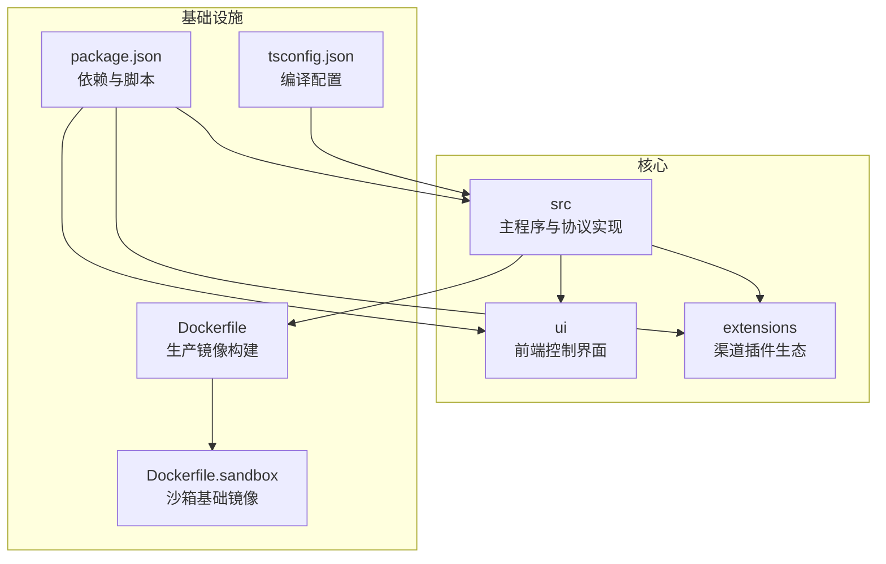
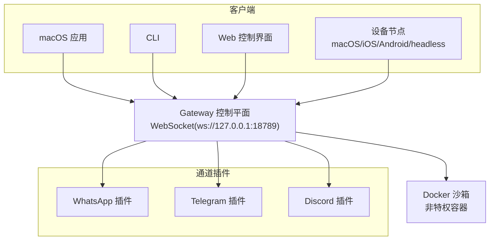
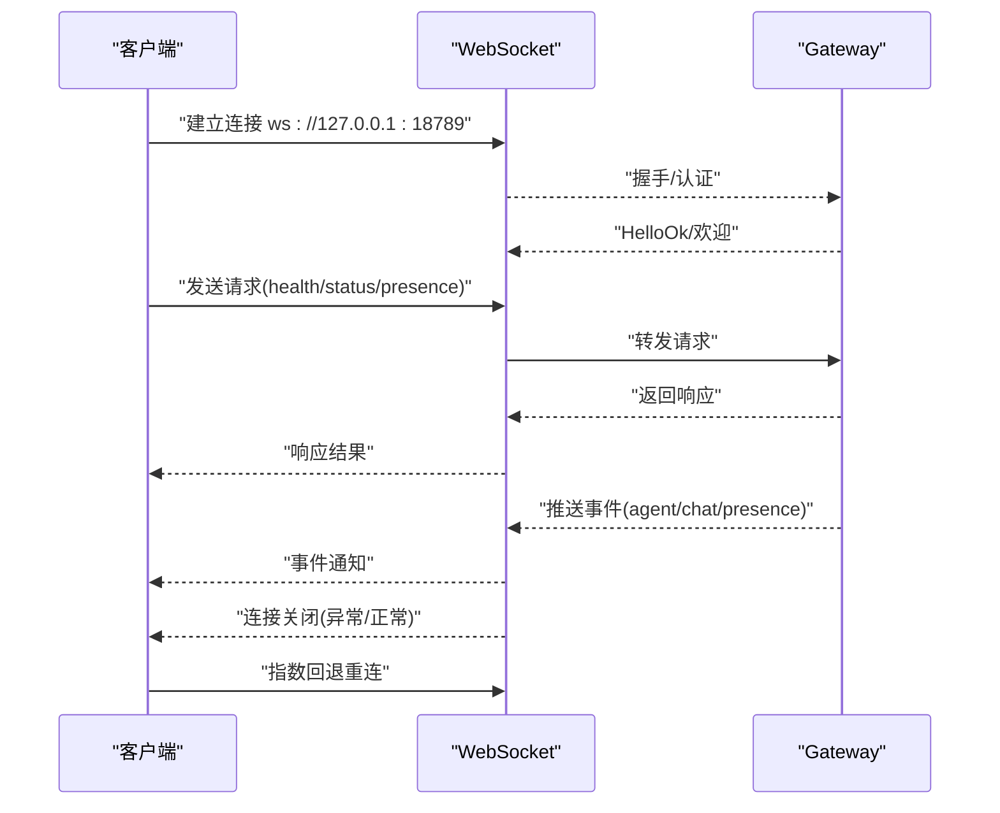
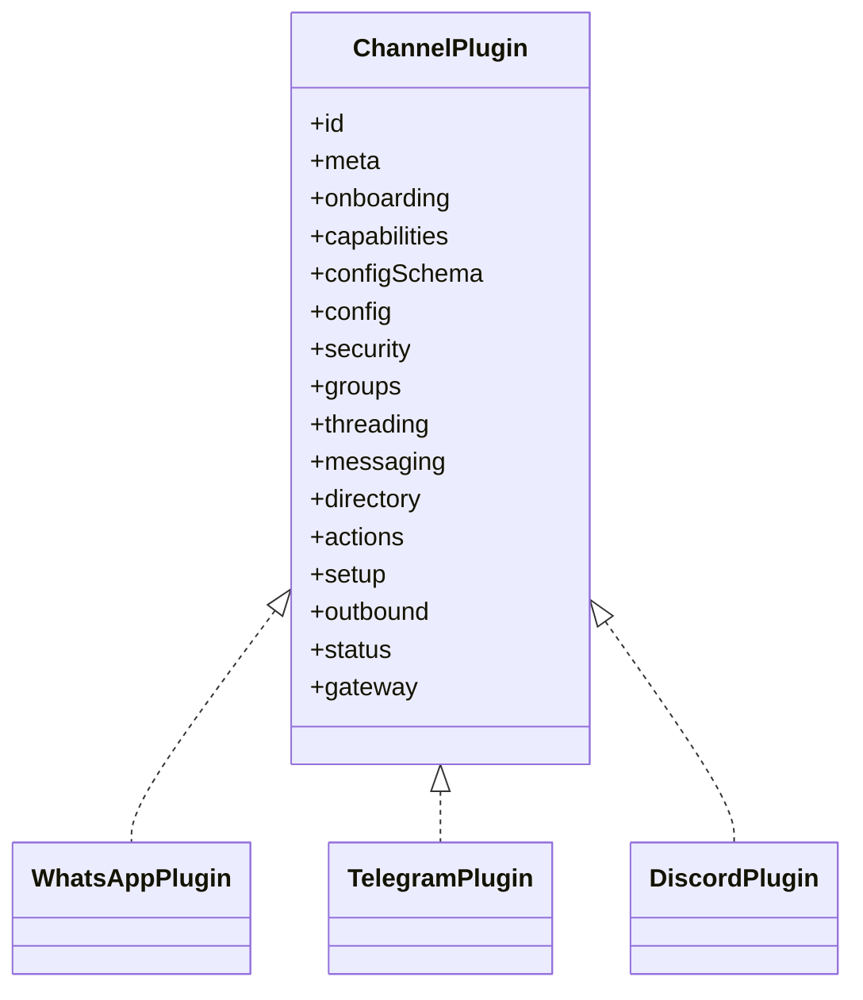
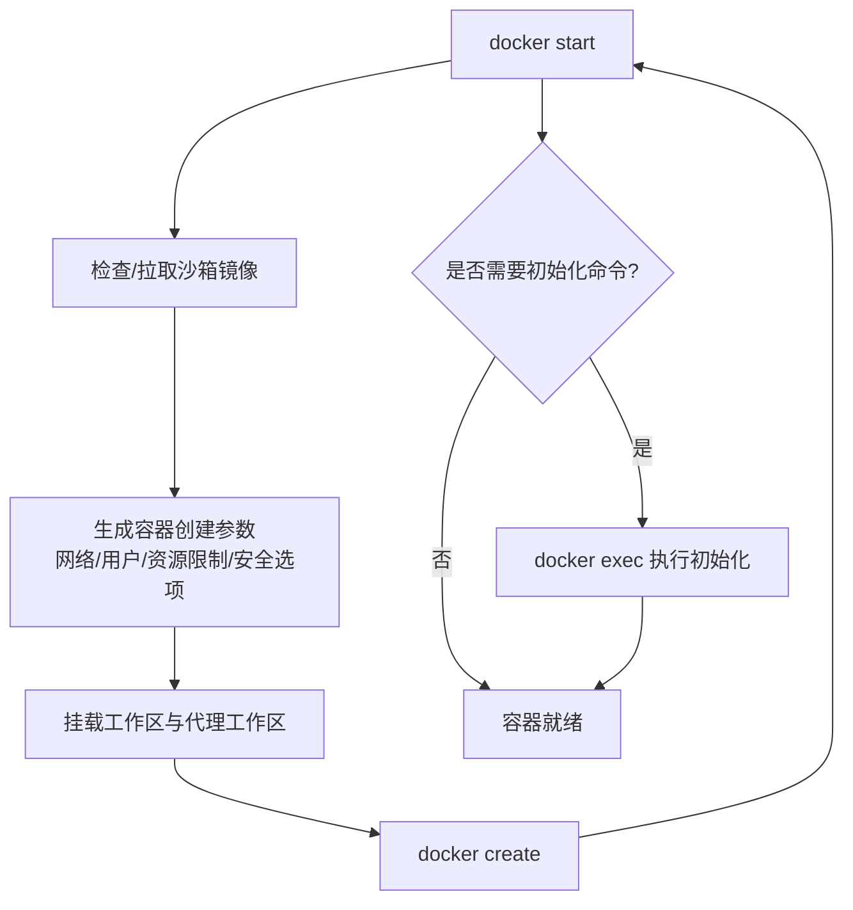
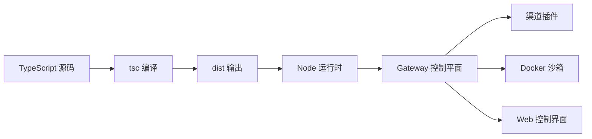

# 技术栈选型与决策

## 目录
1. [引言](#引言)
2. [项目结构](#项目结构)
3. [核心组件](#核心组件)
4. [架构总览](#架构总览)
5. [详细组件分析](#详细组件分析)
6. [依赖关系分析](#依赖关系分析)
7. [性能考量](#性能考量)
8. [故障排查指南](#故障排查指南)
9. [结论](#结论)
10. [附录](#附录)

## 引言
本文件系统化梳理 OpenClaw 的技术栈选型与决策，围绕以下主题展开：
- 为什么选择 TypeScript/JavaScript 作为主要开发语言，并说明其在大型项目中的优势；
- WebSocket 在实时通信中的应用价值及与其它通信协议的对比；
- Docker 容器化在安全沙箱与环境隔离方面的决策考量；
- 关键第三方依赖（Baileys、Grammy、Pi Agent Core 等）的技术评估；
- 技术栈演进历史、版本兼容性与未来路线图；
- 提供技术选型对比表与决策矩阵，帮助开发者权衡取舍。

## 项目结构
OpenClaw 是一个以 Node.js 为基础的多平台个人 AI 助手系统，采用 TypeScript/JavaScript 构建，通过 WebSocket 提供统一的控制平面，支持多通道消息接入与设备节点协同。项目采用 monorepo 结构，核心代码位于 src，UI 位于 ui，扩展插件位于 extensions，容器化部署由 Dockerfile 及 docker-compose 支持。

## 核心组件
- 控制平面（Gateway）：基于 WebSocket 的单点控制平面，负责会话、通道、工具与事件的统一调度。
- 渠道插件（Channels）：通过扩展机制接入 WhatsApp、Telegram、Discord 等多渠道，每个渠道以独立插件实现。
- 安全沙箱（Sandbox）：基于 Docker 的非特权容器，限制资源与权限，隔离非主会话执行。
- 前端 UI：基于 WebSocket 的 Web 控制界面，提供健康状态、存在性、会话等交互。
- 构建与运行：Node ≥22、TypeScript 编译、pnpm 工作区管理、Docker 生产镜像。

## 架构总览
OpenClaw 的核心是“单一长连接的 WebSocket 控制平面”，所有客户端（macOS 应用、CLI、Web UI、自动化）与节点（macOS/iOS/Android/headless）均通过该平面进行控制与事件订阅。通道插件负责对接外部消息平台，沙箱用于隔离非主会话的工具执行。

## 详细组件分析

### WebSocket 实时通信与协议设计
- 连接模型：客户端与 Gateway 通过 WebSocket 建立长连接，支持请求/响应与服务端事件推送。
- 错误处理：连接关闭时记录原因码并自动指数回退重连；客户端维护待处理队列并在断开时统一拒绝。
- 健康检查：测试用例验证健康、状态、存在性与通道状态查询的可用性。
- 协议细节：JSON Schema 校验入站帧，事件类型覆盖 agent、chat、presence、health、heartbeat、cron 等。

### 渠道插件生态（WhatsApp/Telegram/Discord）
- 插件注册：各渠道插件通过 `openclaw/plugin-sdk` 注册，设置运行时与通道元数据，暴露 onboarding、配额、安全策略、消息发送、心跳检查、状态快照等能力。
- 能力差异：
  - WhatsApp：基于 Baileys Web，支持群组、投票、媒体、反应等；提供 QR 登录与心跳收件人解析。
  - Telegram：基于 grammY，支持线程、媒体、原生命令、阻塞流；支持 webhook 或轮询。
  - Discord：支持线程、投票、媒体、原生命令；对消息内容意图进行提示与审计。
- 统一接口：所有渠道遵循相同的 `ChannelPlugin` 接口，便于扩展与替换。

### Docker 容器化与安全沙箱
- 生产镜像：基于 node:22-bookworm，安装 Bun 与 Corepack，构建后以非 root 用户运行，绑定 loopback 地址，默认生产环境变量控制访问令牌或密码。
- 沙箱镜像：基于 debian:bookworm-slim，最小化依赖，仅安装必要工具，用于隔离非主会话的工具执行。
- 沙箱配置：通过 Docker API 创建容器，严格限制 Capabilities、网络、DNS、用户、CPU/内存、ulimits、seccomp/apparmor 等，支持只读根文件系统与 tmpfs。
- 生命周期：按会话/代理维度命名容器，定期清理与重启，避免资源泄漏；配置变更检测与热容器窗口提示。

### 第三方依赖评估与选择标准
- 语言与运行时：Node.js ≥22，TypeScript 严格模式，确保类型安全与现代语法支持。
- WebSocket 与 HTTP：ws、hono、express 提供低延迟双向通信与轻量 HTTP 能力。
- 渠道 SDK：
  - @whiskeysockets/baileys：WhatsApp Web 官方生态，功能完备，社区活跃。
  - grammy、@grammyjs/runner：Telegram 生态，支持 throttler 限速与 runner 并发。
  - @slack/bolt、@slack/web-api：Discord/Slack 生态，提供 Bolt 与 Web API。
- 工具与媒体：sharp、pdfjs-dist、node-edge-tts、@mozilla/readability 等，满足图片、PDF、TTS、可读性等场景。
- 类型与校验：@sinclair/typebox、zod、ajv 提供高性能 JSON Schema 校验与类型推导。
- 开发体验：chalk、cli-highlight、chokidar、croner、dotenv、yaml 等提升开发效率与运维能力。
- 安全与沙箱：@agentclientprotocol/sdk、@mariozechner/pi-agent-core 等用于代理运行与协议适配。

### 技术栈演进与版本兼容性
- Node 版本：要求 ≥22，确保稳定性能与新特性支持；包管理器使用 pnpm，锁定 onlyBuiltDependencies 以减少二进制构建失败。
- TypeScript：严格模式、目标 ES2023、NodeNext 模块解析，保证跨平台一致性。
- Docker：生产镜像与沙箱镜像分离，非 root 运行，降低攻击面。
- 渠道生态：各插件独立升级，通过 `openclaw/plugin-sdk` 对齐接口，避免耦合。

## 依赖关系分析
- 语言与工具链：TypeScript → Node ≥22 → pnpm → 构建产物 dist → 运行时。
- 渠道插件：各插件依赖对应 SDK（Baileys、grammy、Slack SDK），并通过 `openclaw/plugin-sdk` 注册到 Gateway。
- 安全沙箱：Gateway 侧通过 Docker API 管理容器生命周期，按会话/代理维度隔离执行。
- 前端 UI：通过 WebSocket 与 Gateway 通信，订阅事件并展示健康状态。

## 性能考量
- WebSocket：长连接降低握手开销，事件驱动推送减少轮询成本；客户端指数回退重连避免风暴。
- 并发与限速：grammy 提供 throttler 限速，croner 提供高精度定时任务；sharp 与 pdfjs-dist 优化媒体处理。
- 资源限制：沙箱通过 CPU/内存/ulimit 等限制防止资源滥用；只读根文件系统与 tmpfs 减少持久化风险。
- 构建与缓存：pnpm 工作区与 onlyBuiltDependencies 降低重复安装与构建失败概率。

## 故障排查指南
- WebSocket 连接问题：检查 Gateway 绑定地址（默认 loopback）、令牌/密码配置、客户端回退逻辑与错误码提示。
- 渠道登录与心跳：WhatsApp 使用 QR 登录与心跳收件人解析；Telegram/Discord 需要 token/webhook 配置与权限审计。
- 沙箱问题：确认 Docker 可用、镜像存在、标签与配置哈希一致；必要时重建容器或清理过期容器。
- 健康检查：通过 health/status/system-presence 等方法快速定位问题。

## 结论
OpenClaw 的技术栈以 Node.js/TypeScript 为核心，结合 WebSocket 控制平面与 Docker 沙箱，实现了跨平台、可扩展且安全可控的个人 AI 助手系统。通过模块化插件生态与严格的版本/构建策略，项目在大型工程中保持了良好的可维护性与可演进性。

## 附录

### 技术选型对比表（示例）
- 语言与运行时
  - TypeScript/Node.js：类型安全、生态成熟、社区活跃；适合大型项目迭代与团队协作。
  - 其他：Swift（iOS/macOS 原生）、Go（微服务）在本项目中未作为主栈使用。
- 通信协议
  - WebSocket：低延迟、双向、事件驱动，适合控制平面与 UI 实时交互。
  - HTTP/REST：适合一次性请求/响应，不适合持续事件推送。
  - gRPC/Agent Protocol：用于内部协议适配与跨组件通信，增强类型安全与契约约束。
- 容器化
  - Docker：隔离性强、可移植、生态完善；结合非 root 运行与安全选项降低风险。
  - 其他：Podman/LXC 在本项目未采用。

### 决策矩阵（示例）
- 目标：大型项目可维护性、安全性、可扩展性、开发效率
- 权重（示例）：可维护性 30%、安全性 30%、可扩展性 25%、开发效率 15%
- 评估（示例）：
  - TypeScript/Node.js：可维护性高、安全性中等、可扩展性高、开发效率高
  - WebSocket：实时性高、事件驱动、协议简单
  - Docker：隔离强、可移植、运维复杂度中等