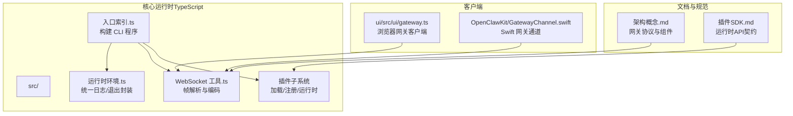
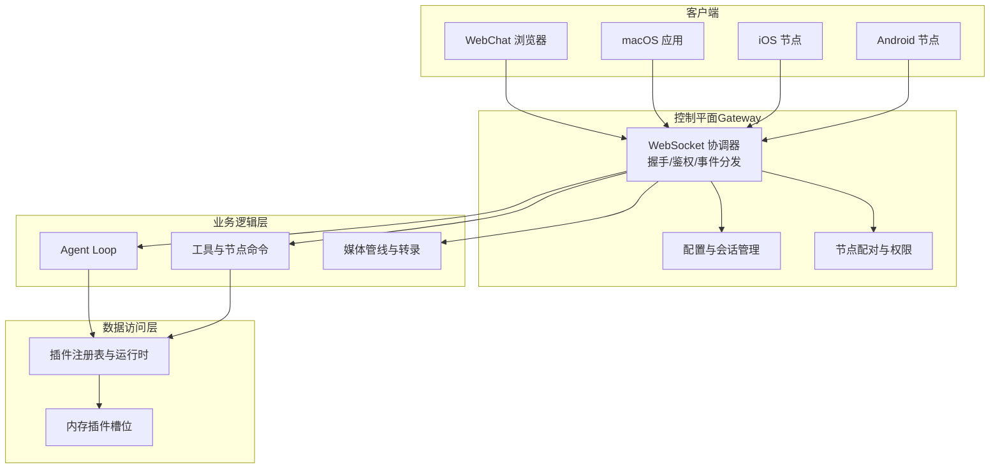
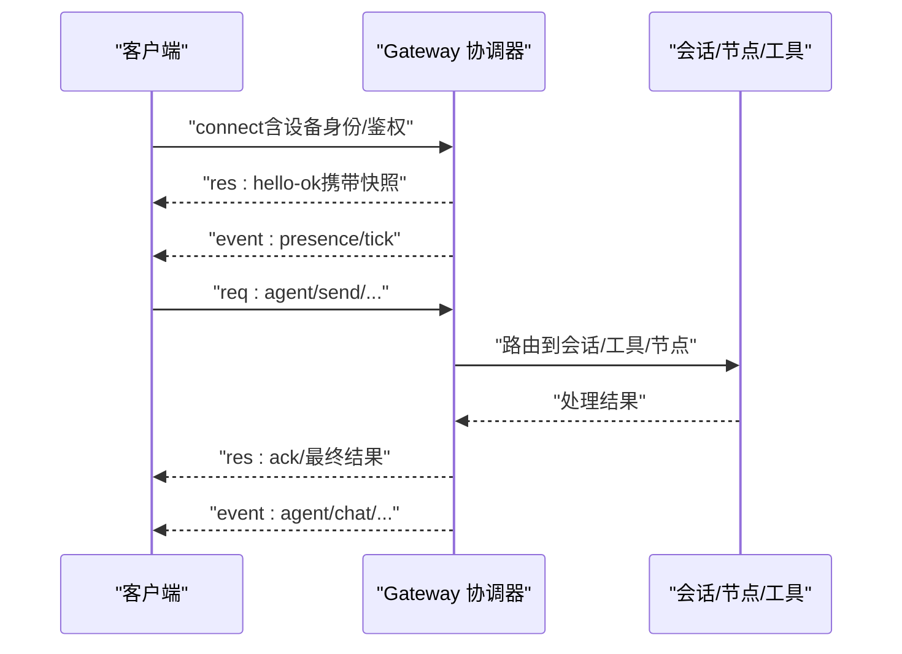
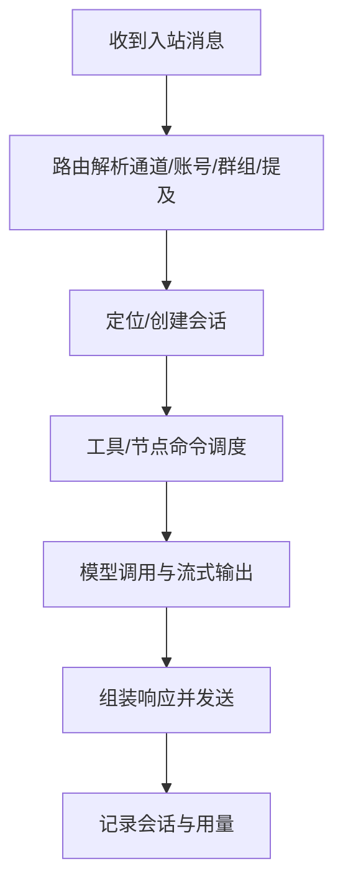
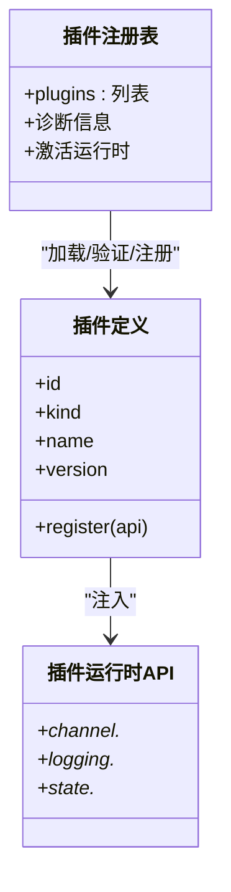
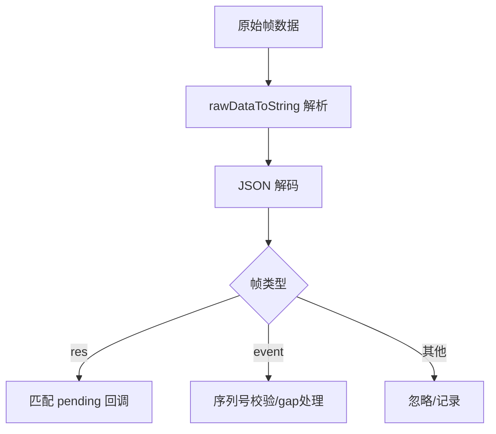
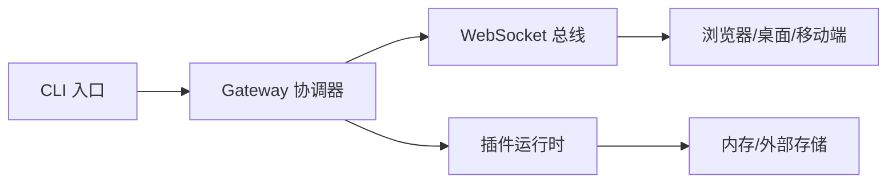

# 整体架构设计

## 目录
1. [简介](#简介)
2. [项目结构](#项目结构)
3. [核心组件](#核心组件)
4. [架构总览](#架构总览)
5. [详细组件分析](#详细组件分析)
6. [依赖关系分析](#依赖关系分析)
7. [性能考虑](#性能考虑)
8. [故障排查指南](#故障排查指南)
9. [结论](#结论)
10. [附录](#附录)

## 简介
本文件面向 OpenClaw 的整体架构设计，系统化阐述其分层架构（控制平面层、业务逻辑层、数据访问层）、事件驱动架构与 WebSocket 服务器作为“核心协调器”的通信模型、微服务化与模块化设计思路，以及插件化架构如何实现功能的动态扩展。文档同时给出架构决策的技术考量、性能优化策略与可扩展性设计，并提供系统架构图与组件关系图，帮助开发者快速理解各层职责与交互模式。

## 项目结构
OpenClaw 采用多语言混合工程组织，核心运行时与协议在 TypeScript 中实现，配套 Swift 客户端与浏览器前端，形成“核心网关 + 多终端客户端 + 插件生态”的整体布局。下图展示关键目录与其职责映射：

## 核心组件
- 控制平面层（Gateway）
  - 职责：维护消息通道连接、暴露类型化 WebSocket API、发布事件（agent/chat/presence/health/heartbeat/cron）、执行握手与鉴权、管理会话与节点配对。
  - 特性：单实例、长连接、强一致握手、事件不重放、幂等键去重。
- 业务逻辑层（Agent Loop 与工具链）
  - 职责：基于会话状态与路由规则进行消息编排、调用模型提供方、执行工具与节点命令、处理媒体与提及解析、分组策略与防抖。
- 数据访问层（插件与存储）
  - 职责：通过插件系统抽象存储、缓存、索引等能力；支持内存插件槽位选择与替换；提供统一状态目录与日志接口。
- 事件驱动与 WebSocket 协调器
  - 职责：作为所有组件间通信的“总线”，统一请求/响应与事件推送，保障序列号一致性与断线重连策略。
- 插件化与微服务化
  - 职责：以“插件”为边界，按功能域拆分（如 memory、channel、provider），通过运行时 API 注入，实现动态扩展与热插拔。

## 架构总览
下图展示了 OpenClaw 的总体架构：控制平面（Gateway）位于中心，作为 WebSocket 协调器承载所有客户端与节点的连接；业务逻辑层由 Agent Loop 与工具链组成；数据访问层通过插件系统抽象；客户端（浏览器、macOS/IOS/Android）通过同一协议接入。

## 详细组件分析

### 控制平面层（Gateway 与 WebSocket 协调器）
- 协议与握手
  - 首帧必须为 `connect`；握手成功后进入请求/响应与事件推送模式；支持鉴权令牌与设备挑战签名。
  - 事件不重放，客户端需在序列号断层时刷新快照。
- 事件与方法
  - 事件类型覆盖 agent、chat、presence、health、heartbeat、cron；请求方法包括 `health`/`status`/`send`/`agent`/`system-presence` 等。
- 运行时与错误处理
  - 全局未捕获异常与未处理拒绝处理器，避免静默崩溃；统一日志输出与结构化记录。

### 业务逻辑层（Agent Loop 与工具链）
- 会话与路由
  - 基于通道/账号/群组/提及规则进行路由，支持激活模式与回复回传策略。
- 媒体与输入处理
  - 图像/音频/视频管线、转录钩子、大小限制与临时文件生命周期管理。
- 分组与安全
  - 分组允许列表、@提及要求、重试策略与流式块推送。

### 数据访问层（插件化存储与状态）
- 插件注册与发现
  - 支持从工作区与额外路径发现插件，读取清单与配置模式校验，按启用状态与优先级排序。
- 插件运行时
  - 通过 `openclaw/plugin-sdk` 注入运行时 API，插件仅能通过 API 访问核心能力，避免直接依赖 `src/**`。
- 槽位与选择
  - 内存插件槽位（`memory`）支持默认值与显式选择，相同 ID 的高优先级插件覆盖低优先级。

### 事件驱动与 WebSocket 服务器
- 事件模型
  - 请求/响应（`req`/`res`）与事件（`event`）两类帧；事件包含事件名与负载，部分事件带有序列号与状态版本。
- 客户端实现
  - 浏览器端与 Swift 端均实现握手、订阅、事件序列号跟踪与断线重连退避策略。
- 帧解析
  - 统一 RawData 到字符串的转换，兼容多种输入格式。

## 依赖关系分析
- 组件耦合
  - 控制平面与业务逻辑通过 WebSocket 方法解耦；数据访问通过插件运行时 API 抽象，降低耦合度。
- 外部依赖
  - WebSocket 传输、JSON Schema 校验、CLI 参数解析、运行时守护与端口占用检测。
- 可能的循环依赖
  - 插件注册表与运行时通过 API 注入避免直接循环；插件自身不得导入 `src/**`，通过 SDK 限定边界。

## 性能考虑
- 事件不重放与快照刷新
  - 减少重复事件传输与客户端重放负担，提高网络效率与一致性。
- 幂等键去重
  - 对有副作用的方法（如 `send`/`agent`）使用幂等键，降低重试带来的重复处理。
- 序列号与断线恢复
  - 客户端跟踪事件序列号，出现 gap 时触发快照刷新，避免长时间追赶。
- 插件缓存与懒加载
  - 插件注册表支持缓存键，减少重复加载成本；仅在需要时初始化全局 Hook Runner。
- 媒体管线与临时文件
  - 限制媒体大小、清理临时文件，避免磁盘与内存压力。

## 故障排查指南
- 启动与守护
  - 使用 supervisor（launchd/systemd）自动重启；检查端口占用与绑定地址。
- WebSocket 连接问题
  - 校验首帧是否为 `connect`；确认鉴权令牌与设备挑战签名；关注连接失败关闭码与退避重连。
- 事件序列号断层
  - 客户端应检测 `seqGap` 并刷新快照；服务端事件不重放，需客户端自恢复。
- 插件加载失败
  - 检查插件导出是否包含 `register`/`activate`；核对配置模式与 schema 校验；查看诊断信息与错误原因。

## 结论
OpenClaw 以“控制平面层 + 业务逻辑层 + 数据访问层”的分层架构为核心，通过 WebSocket 服务器作为统一协调器，实现跨客户端与节点的事件驱动通信。插件化与运行时 API 将核心能力抽象出来，使功能可按需扩展与替换。该设计在安全性、可观测性与可扩展性方面具备良好基础，适合在本地与远程场景中稳定运行。

## 附录
- 关键术语
  - 控制平面：负责连接、鉴权、事件分发与会话管理的中心节点。
  - 业务逻辑层：围绕 Agent Loop 与工具链的消息编排与执行。
  - 数据访问层：通过插件系统抽象存储与状态。
  - 插件运行时：通过 `openclaw/plugin-sdk` 提供的 API 注入核心能力。
- 参考文档
  - [架构概念.md](file://docs/concepts/architecture.md#L1-L130)
  - [插件SDK（英文）.md](file://docs/refactor/plugin-sdk.md#L45-L145)
  - [插件SDK（中文）.md](file://docs/zh-CN/refactor/plugin-sdk.md#L42-L50)