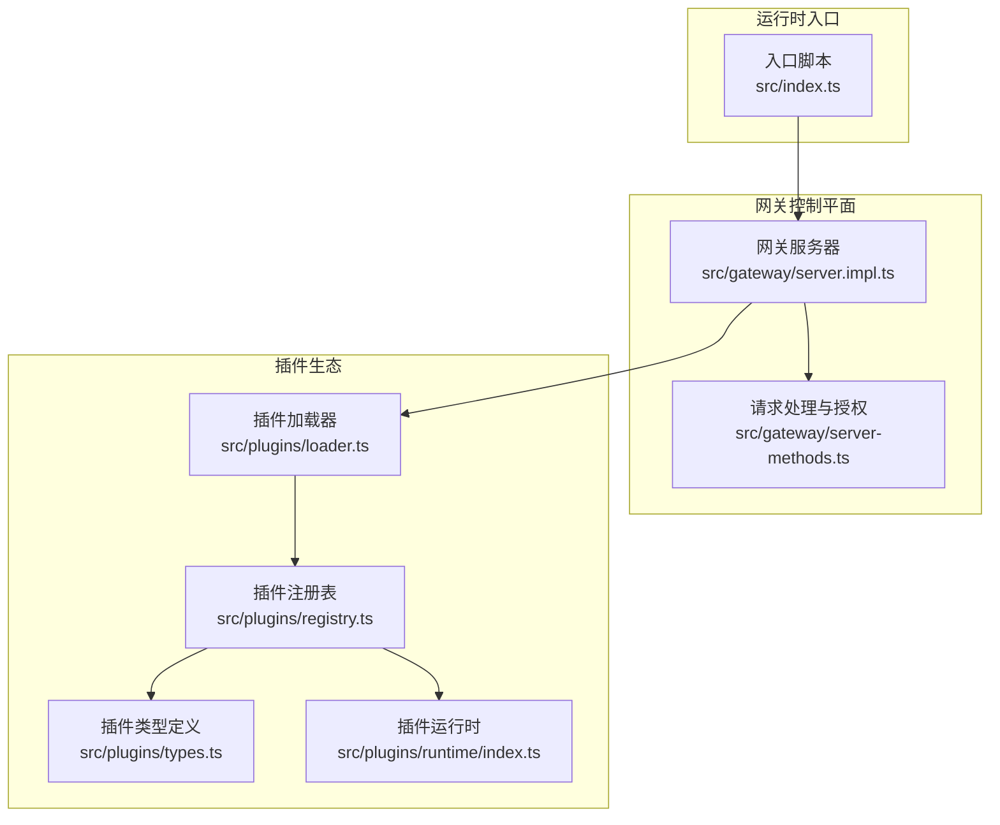
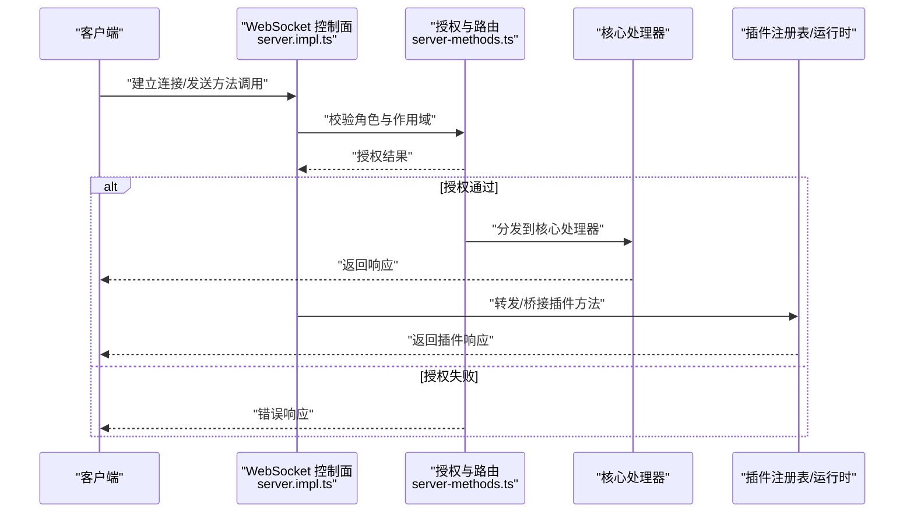
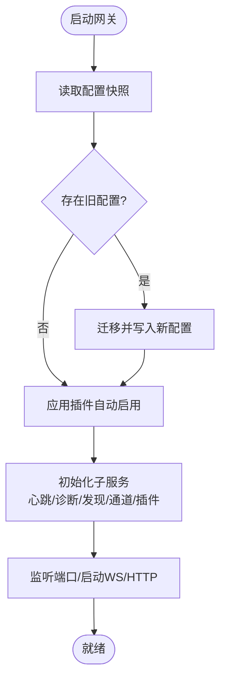
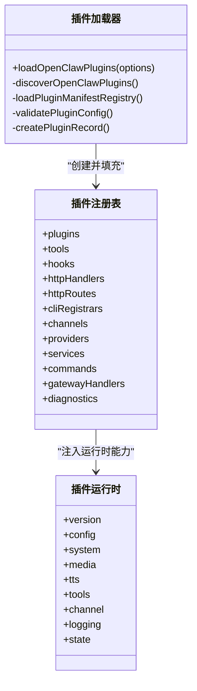
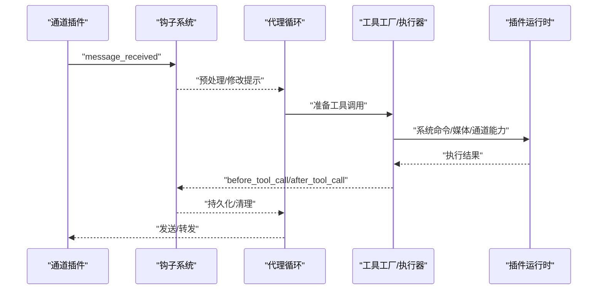
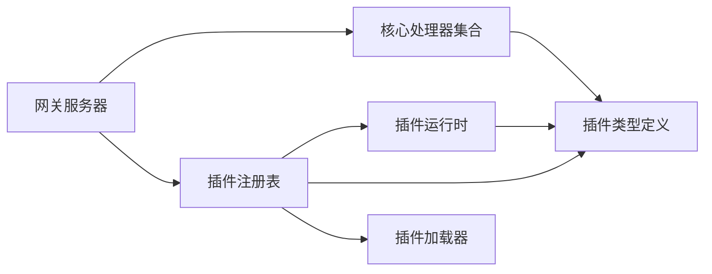

# 核心组件交互关系

## 目录
1. [引言](#引言)
2. [项目结构](#项目结构)
3. [核心组件](#核心组件)
4. [架构总览](#架构总览)
5. [详细组件分析](#详细组件分析)
6. [依赖关系分析](#依赖关系分析)
7. [性能考虑](#性能考虑)
8. [故障排查指南](#故障排查指南)
9. [结论](#结论)

## 引言
本文件聚焦 OpenClaw 的核心组件交互关系，围绕网关服务器、渠道插件、代理系统与工具执行器展开，系统阐释事件驱动模式下的消息传递、观察者模式的松耦合通信、组件生命周期管理、状态同步与错误传播策略，并提供组件交互图与时序图以展示典型业务场景。

## 项目结构
OpenClaw 采用“单网关控制平面 + 插件生态”的架构：
- 网关作为统一的 WebSocket 控制面，承载会话、通道、工具、事件与运维能力（健康检查、远程暴露、Tailscale、Web 控制界面等）。
- 插件体系通过“发现—加载—注册”三阶段完成动态扩展，涵盖工具、钩子、HTTP 路由、CLI 命令、通道适配器、模型提供方等。

## 核心组件
- 网关服务器（Gateway Server）：负责启动、监听、路由请求、广播事件、维护健康状态、暴露 HTTP/WS 接口、管理节点与通道连接、协调插件方法注册与调用。
- 插件系统（Plugin System）：包含发现、加载、注册、运行时 API、钩子系统、HTTP 路由、CLI 注册、工具注册、通道适配器、提供方等。
- 代理系统（Agent System）：在网关内以 RPC 模式运行，配合工具流与块流，支撑多代理路由与会话管理。
- 工具执行器（Tool Executor）：通过插件运行时提供的工具集与系统命令执行能力，完成浏览器、Canvas、节点、定时任务、会话操作等动作。

## 架构总览
OpenClaw 的核心交互遵循“事件驱动 + 观察者模式 + 动态插件”的设计：
- 客户端通过 WebSocket 连接网关，发送方法调用；网关进行权限校验后分发到核心处理器或插件处理器。
- 插件通过注册表集中管理工具、钩子、HTTP 路由、CLI 命令、通道适配器与提供方，形成松耦合扩展点。
- 生命周期钩子贯穿网关启动/停止、会话开始/结束、消息收发、工具调用前后等关键节点，便于观测与干预。

## 详细组件分析

### 组件 A：网关服务器（事件驱动与消息传递）
- 启动流程：读取配置快照、迁移旧配置、写入有效配置、应用插件自动启用策略、启动心跳/诊断/发现/通道/插件等子服务。
- 请求处理：统一授权矩阵（角色+作用域），区分只允许节点侧调用的方法、管理员前缀方法、只读/写入方法等。
- 方法路由：优先使用插件注册的自定义方法，否则回退到核心处理器集合。
- 广播与订阅：维护节点订阅、通道状态、会话状态等，向客户端推送变更。

### 组件 B：插件系统（发现—加载—注册）
- 发现与清单：扫描工作区与额外路径，构建候选集，加载插件清单注册表，收集诊断信息。
- 加载与验证：解析 SDK 别名、创建 jiti 实例、校验配置 Schema、记录错误与警告。
- 注册与缓存：创建插件记录，按种类（工具/钩子/HTTP/CLI/通道/提供方）登记，支持内存槽位选择与去重覆盖。
- 运行时 API：提供配置读写、系统命令执行、媒体处理、TTS、通道能力、日志、状态目录等能力。

### 组件 C：代理系统与工具执行器（事件驱动与观察者）
- 钩子系统：提供跨生命周期的钩子（如 `before_agent_start`、`message_sending`、`before_tool_call`、`session_start` 等），插件可注册高优先级处理器，实现对消息、工具、会话与网关生命周期的观测与干预。
- 工具工厂：插件可通过工具工厂在特定上下文（会话键、代理账号、沙箱模式等）创建工具，工具执行器基于运行时 API 提供系统命令、媒体处理、通道发送等能力。
- 事件传播：消息从通道进入，经去抖/分块/提及匹配/回复派发，再到工具调用与结果持久化，期间可被多个钩子拦截与修改。

### 组件 D：组件生命周期管理、状态同步与错误传播
- 生命周期：网关启动/停止钩子贯穿整个进程生命周期；会话开始/结束钩子跟踪会话维度的状态；消息钩子覆盖收发链路；工具钩子覆盖调用前后。
- 状态同步：健康状态版本号、存在性版本号、通道活动记录、会话元数据更新、节点订阅管理等，均通过网关内部状态与广播机制保持一致。
- 错误传播：授权失败、未知方法、重复注册、配置校验失败、加载异常等均通过标准化错误形状返回，并记录诊断信息。

### 组件 E：组件注册发现机制与动态加载策略
- 注册发现：插件发现扫描候选目录，结合清单注册表与配置规范化，生成插件记录并进行启用状态判定与冲突处理。
- 动态加载：使用 jiti 支持 TS/JS/JSON 多格式，按需解析导出（默认导出或命名导出），注册后立即生效，支持缓存与诊断输出。
- 内存槽位：支持“内存”类插件的槽位选择，避免重复启用并提供警告提示。

## 依赖关系分析
- 网关对插件系统的依赖：通过核心处理器与插件注册表共享方法名空间，实现“插件优先”的方法解析。
- 插件对运行时的依赖：插件 API 提供统一运行时接口，降低对具体实现的耦合。
- 通道与工具的依赖：通道插件通过运行时 API 访问系统命令、媒体处理、TTS、会话与活动记录等能力。

## 性能考虑
- 插件缓存：加载器支持基于工作区与插件配置的缓存键，避免重复解析与校验。
- 权限快速拒绝：授权矩阵在进入处理器前完成，减少无效调用开销。
- 并发与限流：网关 lanes 与心跳/诊断等子服务独立运行，避免阻塞主 WS 循环。
- 日志与诊断：子系统日志与诊断事件可按需开启，平衡可观测性与性能。

## 故障排查指南
- 授权失败：检查客户端角色与作用域是否满足方法要求，确认方法是否属于只读/写入/管理员范围。
- 未知方法：确认插件是否正确注册自定义方法，或是否命中核心处理器集合。
- 插件加载失败：查看诊断信息中的错误原因（缺少导出、配置 Schema 缺失、重复注册、路径别名解析失败等）。
- 冲突与覆盖：同一插件 ID 在不同来源出现时，后发现的会被禁用并标注覆盖来源。

## 结论
OpenClaw 通过“网关控制平面 + 动态插件生态”的组合，实现了事件驱动与观察者模式下的松耦合协作。网关负责统一接入与授权，插件系统提供强大的扩展能力，代理与工具执行器在生命周期钩子的加持下实现可观测与可控的自动化流程。该架构既保证了核心能力的稳定性，又为生态扩展提供了清晰的契约与边界。