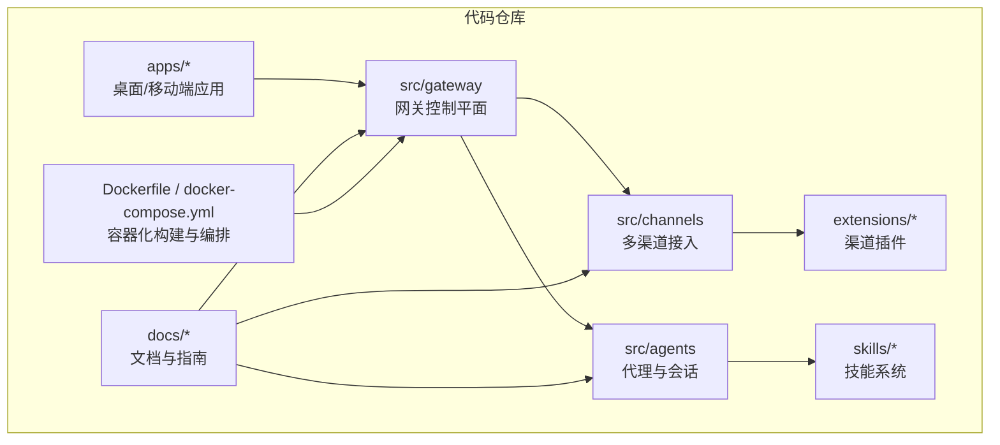
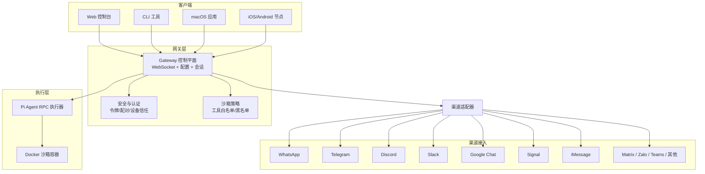
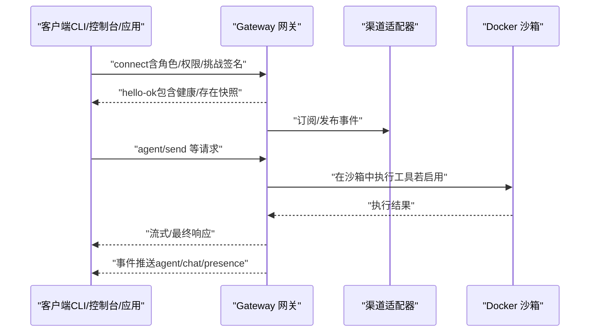
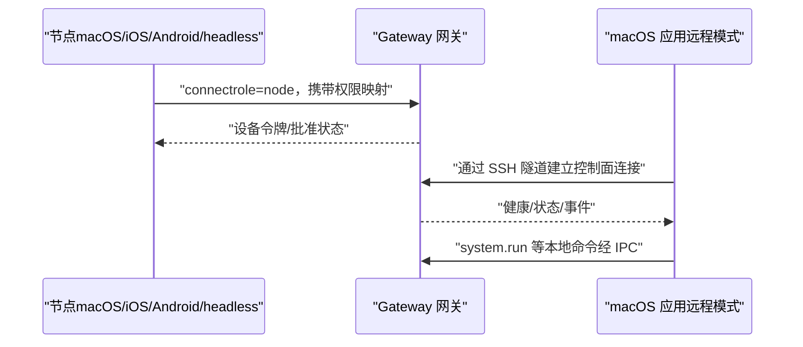
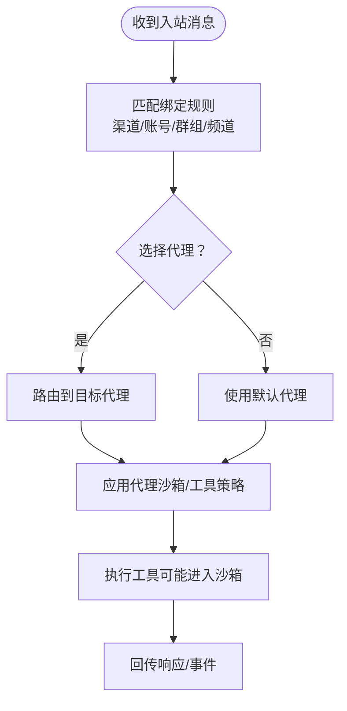
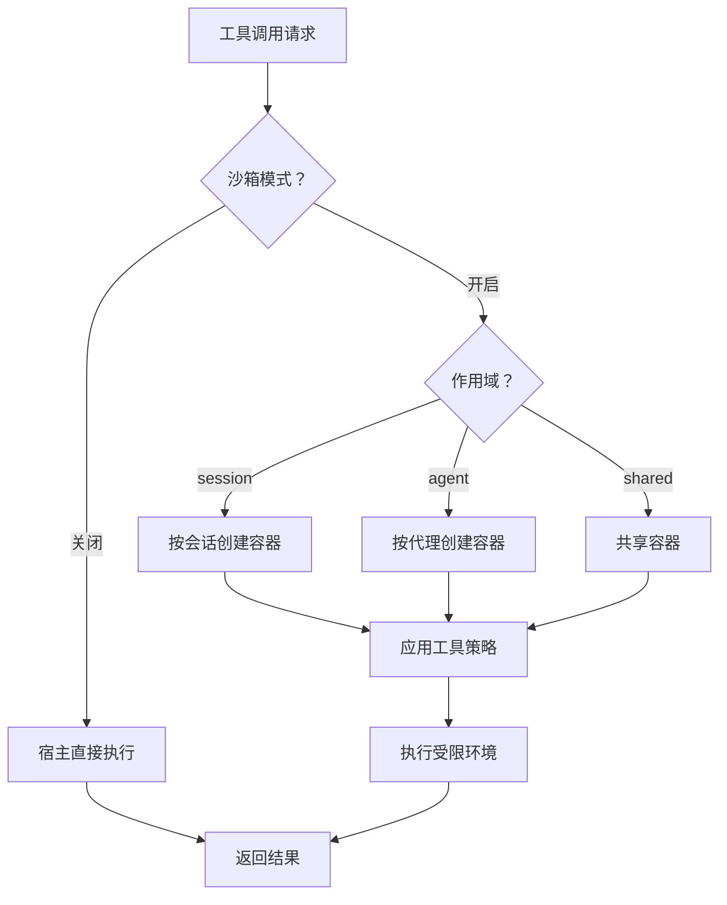
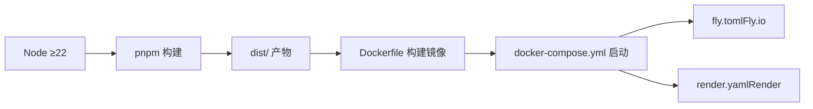
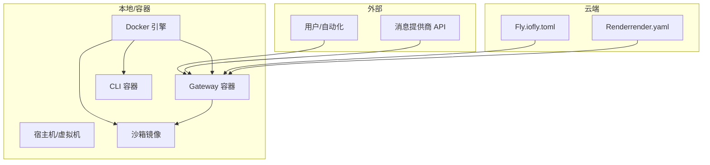
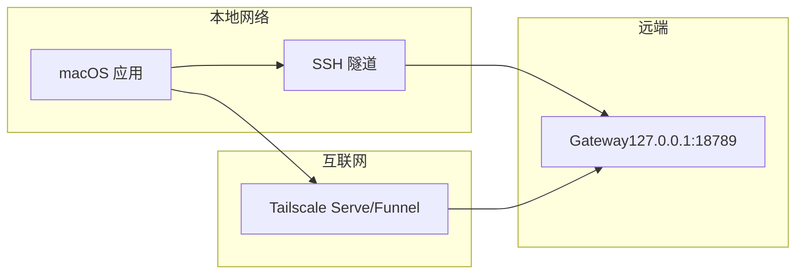
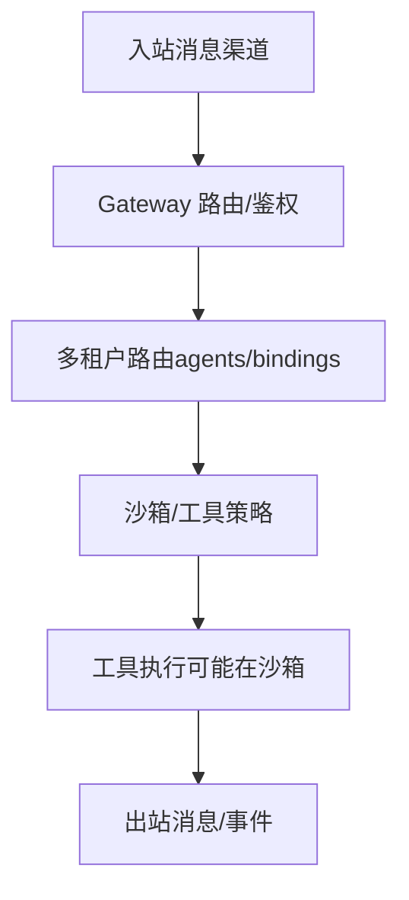

# 系统边界与部署拓扑

## 目录
1. [引言](#引言)
2. [项目结构](#项目结构)
3. [核心组件](#核心组件)
4. [架构总览](#架构总览)
5. [详细组件分析](#详细组件分析)
6. [依赖关系分析](#依赖关系分析)
7. [性能考量](#性能考量)
8. [故障排查指南](#故障排查指南)
9. [结论](#结论)
10. [附录](#附录)

## 引言
本文件聚焦 OpenClaw 的系统边界与部署拓扑，围绕以下目标展开：
- 明确系统物理边界与逻辑边界，界定客户端、网关服务器、渠道插件、代理执行器等组件的职责与部署位置。
- 解释微服务架构下的服务拆分原则与边界划分策略（以“网关控制平面 + 多通道接入 + 沙箱工具执行”为核心）。
- 深入分析容器化部署优势（Docker 安全沙箱、资源隔离、环境一致性），并给出不同部署场景的配置方案与最佳实践。
- 提供部署拓扑图、网络架构图与数据流向图，帮助读者快速理解端到端链路。
- 给出基础设施要求、硬件规格建议与性能基准参考。

## 项目结构
OpenClaw 是一个以 TypeScript 编写的个人 AI 助手平台，核心运行时为 Node（推荐版本 ≥22）。项目采用多模块组织方式，包含：
- 核心网关与协议实现（src/gateway、src/channels、src/agents 等）
- 多平台配套应用（apps/macos、apps/ios、apps/android）
- 插件生态（extensions/*）与技能系统（skills/*）
- 文档与部署脚本（docs/*、scripts/*、Dockerfile、docker-compose.yml）

## 核心组件
- 网关（Gateway）：单一长连接的 WebSocket 控制平面，负责维护各消息渠道连接、事件分发、会话管理与安全控制。
- 客户端（Clients）：macOS 应用、CLI、Web 控制台、自动化触发器，均通过 WebSocket 连接网关。
- 节点（Nodes）：macOS/iOS/Android/headless 设备节点，以 role=node 连接网关，暴露本地能力（如 Canvas、Camera、Screen Record、System 命令等）。
- 渠道插件（Channel Plugins）：针对 WhatsApp、Telegram、Discord、Slack、Google Chat、Signal、iMessage、Matrix、Zalo 等平台的接入适配器。
- 代理执行器（Agent Executor）：基于 Pi Agent 的 RPC 执行器，承载推理与工具调用；在沙箱模式下，工具执行被隔离在 Docker 容器中。
- 配置与安全（Config & Security）：严格配置校验、令牌认证、设备配对、沙箱策略与工具白名单/黑名单。

## 架构总览
OpenClaw 采用“网关控制平面 + 多客户端 + 多渠道 + 沙箱工具执行”的微服务化架构。其关键边界如下：
- 物理边界：网关运行于宿主机或容器内；客户端与节点可分布于本地或远程；渠道插件通过各自 SDK/协议接入。
- 逻辑边界：网关作为唯一控制面，负责身份认证、配对、路由、事件分发与会话状态；工具执行在沙箱中进行，避免对宿主造成影响。
- 数据边界：所有控制面交互经由 WebSocket；媒体与文件通过网关中转与存储；远程访问可通过 Tailscale 或 SSH 隧道。

## 详细组件分析

### 网关（Gateway）与协议
- 单一控制平面：维护 Baileys、grammY、Slack Bolt、discord.js 等渠道连接；提供类型化 WebSocket API（请求/响应/事件推送）。
- 认证与配对：支持 Token 认证与设备配对；本地连接可自动批准，非本地连接需签名挑战并通过批准。
- 事件模型：推送 agent/chat/presence/health/heartbeat/cron 等事件，客户端订阅消费。
- 远程访问：支持 Tailscale Serve/Funnel 或 SSH 隧道，统一握手与鉴权流程。

### 客户端与节点
- 客户端：macOS 应用、CLI、Web 控制台，均通过 WebSocket 连接网关，发送请求并订阅事件。
- 节点：macOS/iOS/Android/headless 设备节点以 role=node 连接，声明能力与权限；在远程模式下，macOS 应用通过 SSH 隧道将本地 UI 组件与远程网关通信。

### 渠道插件与多租户路由
- 渠道插件：针对不同消息平台（WhatsApp、Telegram、Discord、Slack、Google Chat、Signal、iMessage、Matrix、Zalo 等）提供独立适配器。
- 多租户路由：通过 `agents.list` 与 `bindings` 实现按渠道/账号/群组/频道的多代理隔离与路由，确保不同业务域的会话与工具策略相互隔离。

### 代理执行器与沙箱
- 执行器：Pi Agent RPC 执行器承载推理与工具调用；在非 main 会话中默认启用沙箱，工具执行被隔离在 Docker 容器中。
- 沙箱策略：支持模式（off/non-main/all）、作用域（session/agent/shared）、工作区访问（none/ro/rw）、网络与资源限制、工具白名单/黑名单等。

## 依赖关系分析
- 运行时与包管理：Node ≥22，推荐使用 pnpm；Dockerfile 使用 node:22-bookworm，内置 Bun 与 Corepack。
- 多平台支持：macOS（菜单栏应用 + 权限管理）、Linux（systemd 用户服务）、Windows（WSL2 推荐）。
- 容器化与编排：Dockerfile 定义生产镜像；docker-compose.yml 提供网关与 CLI 服务编排；fly.toml/render.yaml 提供云原生部署示例。

## 性能考量
- 容器化优势：Docker 提供进程级隔离、资源限制（CPU/内存/句柄/进程数）、网络与 DNS 隔离，以及一致的运行环境，降低“在我机器上能跑”的差异。
- 沙箱执行：工具执行在容器内进行，避免对宿主文件系统与进程空间的影响，同时可按会话/代理/共享三种粒度控制隔离强度。
- 远程访问：Tailscale Serve/Funnel 与 SSH 隧道在保持网关仅监听环回的前提下，提供安全的远程访问路径。
- 平台建议：Linux 与 macOS 作为首选宿主平台；Windows 推荐 WSL2 以获得更稳定的工具链与二进制兼容性。

## 故障排查指南
- 网关健康检查：通过 WebSocket health 方法或容器内健康检查命令验证网关状态。
- 配置校验：严格配置校验失败会导致网关拒绝启动；使用 doctor 命令诊断并修复配置问题。
- Docker 权限：容器以非 root 用户运行，确保挂载目录拥有正确的 UID/GID（默认 node 用户 uid 1000）。
- 远程连接：确认 SSH 隧道或 Tailscale 服务已正确建立；必要时检查防火墙与端口转发设置。

## 结论
OpenClaw 通过“网关控制平面 + 多客户端 + 多渠道 + 沙箱工具执行”的架构实现了清晰的系统边界与可扩展的部署拓扑。容器化与沙箱机制提供了强大的安全与隔离能力，结合多平台支持与云原生部署模板，能够满足从单机到集群再到云原生的多样化需求。建议在生产环境中优先采用 Docker 沙箱与严格配置校验，并结合 Tailscale/SSH 隧道实现安全的远程访问。

## 附录

### 部署拓扑图（单机/容器/云原生）

### 网络架构图（远程访问与隧道）

### 数据流向图（消息与工具调用）

### 不同部署场景与配置要点
- 单机部署（推荐开发/个人使用）
  - 使用本地 Node 运行网关，安装守护进程（macOS 使用 launchd，Linux 使用 systemd 用户服务）。
  - 通过 SSH 隧道或 Tailscale 访问网关。
- 容器化部署（Docker Compose）
  - 使用 docker-compose.yml 启动网关与 CLI；挂载配置与工作区目录；设置 `OPENCLAW_GATEWAY_TOKEN`。
  - 可选：持久化 /home/node 目录或额外挂载，安装 Playwright 浏览器缓存。
- 云原生部署（Fly.io/Render）
  - Fly.io：Dockerfile 构建镜像，fly.toml 配置 VM 规格与健康检查；挂载 /data 作为状态目录。
  - Render：Docker 运行时，设置健康检查路径与数据盘挂载；生成 `OPENCLAW_GATEWAY_TOKEN`。

### 基础设施与硬件规格建议
- 最低建议
  - CPU：2 核心以上（多渠道并发与工具执行）
  - 内存：2–4 GB（根据工具与会话数量调整）
  - 存储：5–10 GB 可写空间（日志、缓存、工作区）
- 生产建议
  - CPU：4 核心以上（多代理/多会话）
  - 内存：8 GB 以上（启用沙箱与浏览器工具）
  - 存储：SSD 至少 20–50 GB（日志、缓存、媒体）
- 平台差异
  - Linux：systemd 用户服务，适合长期运行与自启动。
  - macOS：菜单栏应用 + 权限管理，适合本地与远程混合场景。
  - Windows：WSL2 推荐，获得稳定工具链与二进制兼容性。