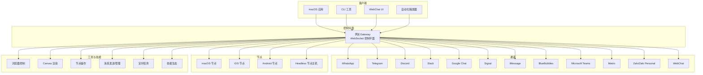
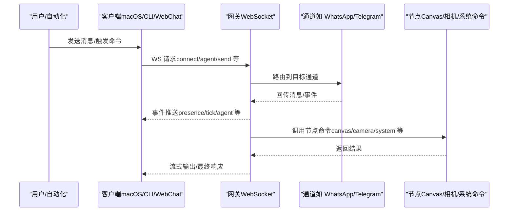
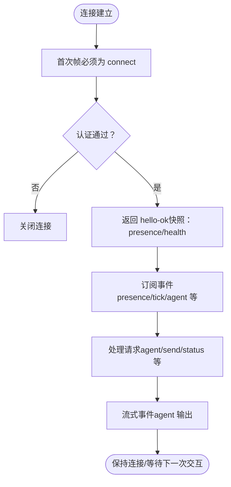
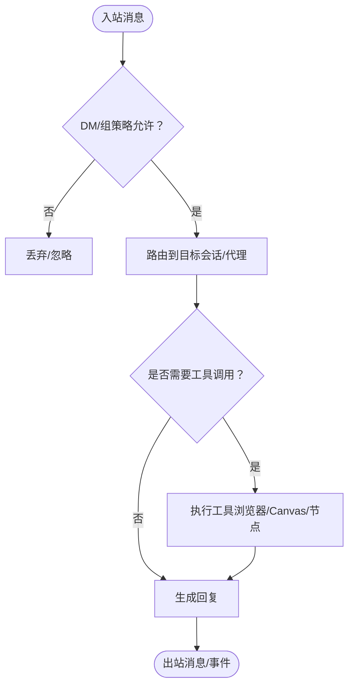
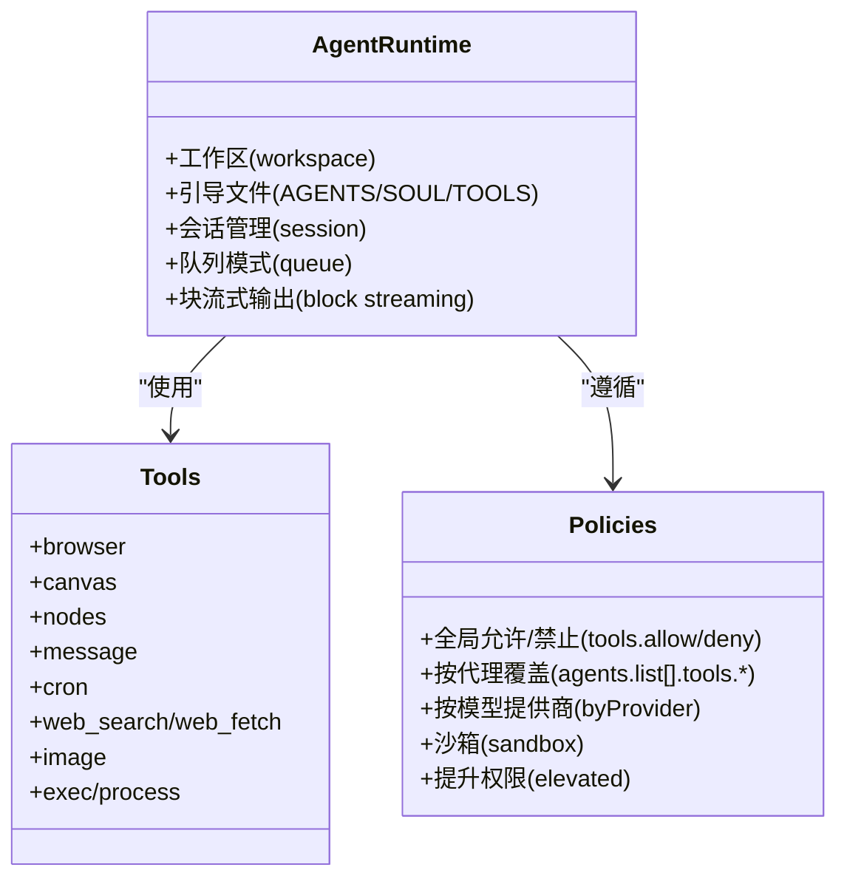
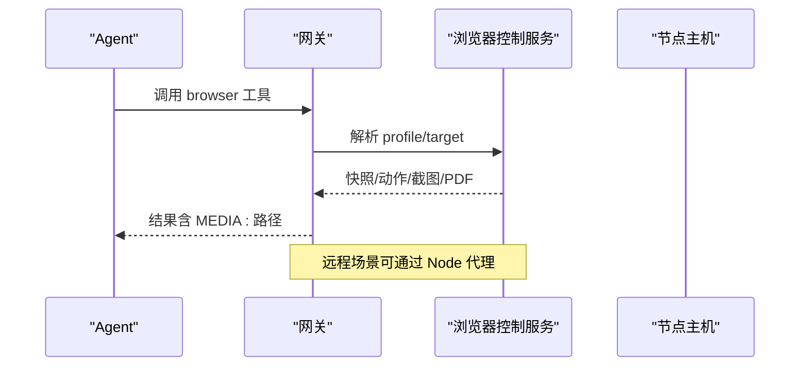
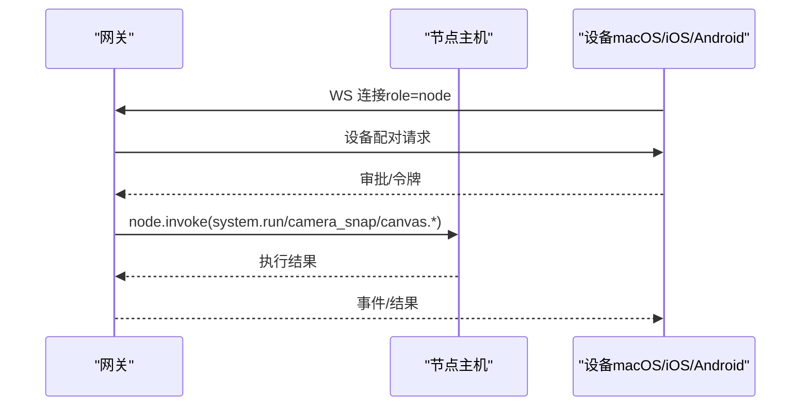
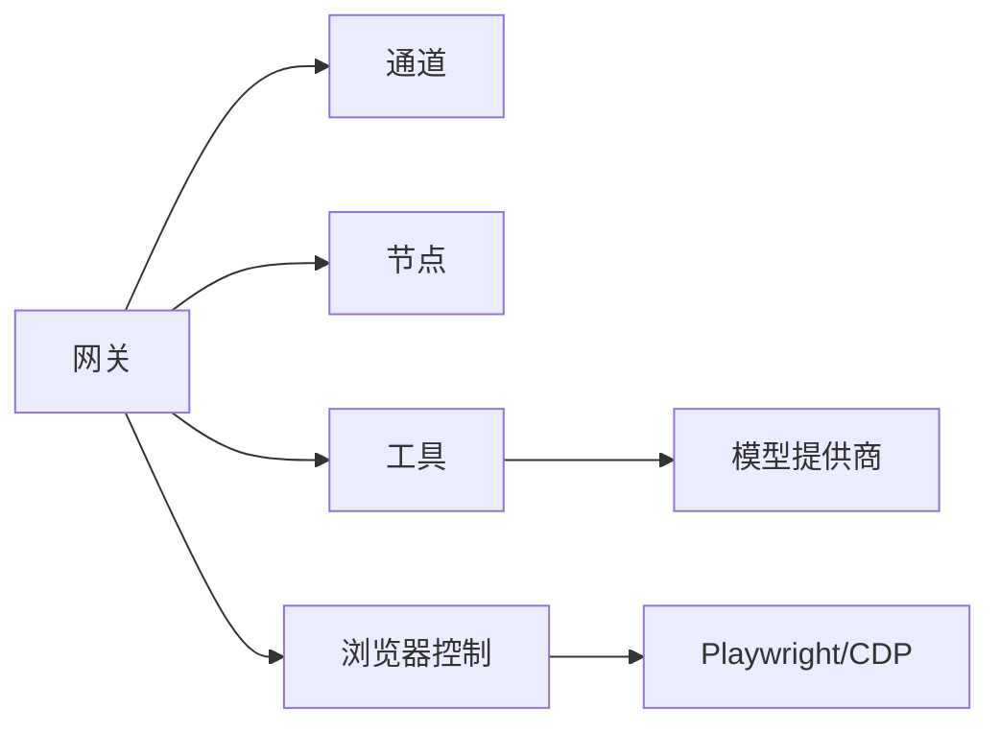

# 核心价值与定位

## 目录
1. [引言](#引言)
2. [项目结构](#项目结构)
3. [核心组件](#核心组件)
4. [架构总览](#架构总览)
5. [详细组件分析](#详细组件分析)
6. [依赖关系分析](#依赖关系分析)
7. [性能考量](#性能考量)
8. [故障排查指南](#故障排查指南)
9. [结论](#结论)
10. [附录](#附录)

## 引言
OpenClaw 是一款“个人 AI 助手”，强调“本地优先”的安全架构、实时 WebSocket 控制平面、以及跨平台设备连接能力。其核心价值在于：
- 在用户设备上运行，提供本地、快速、始终在线的体验；
- 通过统一的网关控制平面，连接 20+ 渠道（WhatsApp、Telegram、Slack、Discord、Google Chat、Signal、iMessage、BlueBubbles、Microsoft Teams、Matrix、Zalo、Zalo Personal、WebChat 等），实现无缝跨平台沟通；
- 借助 Pi Agent 提供强大的 AI 能力，并通过工具系统实现浏览器控制、Canvas 渲染、节点操作等自动化；
- 以安全为先，提供分层访问控制、沙箱隔离、远程暴露最小化等策略。

## 项目结构
OpenClaw 采用“网关 + 多客户端 + 工具与技能”的分层架构。核心由以下部分组成：
- 网关（Gateway）：单点控制平面，负责会话、通道、工具与事件管理；通过 WebSocket 对外提供统一 API；
- 客户端：包括 macOS 应用、CLI、WebChat、自动化触发器等，均通过 WebSocket 连接网关；
- 节点（Nodes）：macOS/iOS/Android/headless 设备以“节点”形式接入，提供 Canvas、相机、屏幕录制、系统命令等能力；
- 工具与技能：内置工具（浏览器、Canvas、节点、消息、定时任务等）与可扩展技能生态；
- 通道（Channels）：对 WhatsApp、Telegram、Discord、Slack 等平台进行桥接与路由。

## 核心组件
- 网关（Gateway）
  - 单一控制平面，维护各通道连接、会话状态、事件推送与健康检查；
  - 通过 WebSocket 提供统一请求/响应与事件流，支持配对与本地信任机制；
  - 支持远程访问（Tailscale/SSH 隧道），并提供 HTTP 接口用于工具调用与控制 UI。
- 客户端
  - macOS 应用、CLI、WebChat、自动化触发器等，均通过 WebSocket 与网关交互；
  - 支持心跳、存在性（presence）、事件订阅等机制。
- 节点（Nodes）
  - 设备以“节点”身份接入，声明能力与命令集，支持 Canvas、相机、屏幕录制、系统命令等；
  - 通过 `node.invoke` 执行命令，支持远程节点主机与本地节点模式。
- 工具与技能
  - 内置工具：浏览器、Canvas、节点、消息、定时任务等；
  - 技能生态：可扩展的技能注册表（ClawHub），支持安装与自动发现；
  - 工具策略：全局/按代理/按模型提供商的工具允许/禁止列表，支持沙箱与提升权限控制。
- 通道（Channels）
  - 支持 20+ 渠道，统一通过网关进行消息收发、群组路由与权限控制；
  - 默认 DM 配对策略与组内提及门控，降低误触发风险。

## 架构总览
OpenClaw 的“网关 + 客户端 + 节点 + 工具”的架构，确保了：
- 控制面集中：所有通道、会话、工具与事件由网关统一管理；
- 传输层统一：WebSocket 作为唯一控制面协议，简化部署与安全；
- 执行面分散：工具执行与设备能力由节点或网关主机承担，结合沙箱与权限策略；
- 可扩展性：插件与技能生态，支持持续扩展。

## 详细组件分析

### 组件 A：网关（Gateway）与 WebSocket 控制平面
- 角色与职责
  - 维护通道连接与会话状态；
  - 提供类型化 WebSocket API（请求/响应/事件）；
  - 支持配对与本地信任、远程访问（Tailscale/SSH 隧道）、HTTP 工具接口与 Canvas 文件服务。
- 安全与认证
  - 默认要求网关认证（token/password），支持 Tailscale 身份头；
  - mDNS 广播可配置为最小化模式，避免泄露敏感信息；
  - 严格错误码与重放策略，保障连接稳定性。
- 运维与可观测性
  - 健康检查、存在性（presence）与心跳事件；
  - 日志与审计工具，支持安全审计与修复建议。

### 组件 B：多渠道消息通信（20+ 渠道）
- 渠道覆盖
  - WhatsApp、Telegram、Discord、Slack、Google Chat、Signal、iMessage、BlueBubbles、Microsoft Teams、Matrix、Zalo、Zalo Personal、WebChat 等；
  - 各渠道通过网关统一路由，支持文本、媒体与反应等差异化能力。
- 安全与权限
  - 默认 DM 配对策略（pairing/allowlist/open/disabled）；
  - 组内提及门控与组允许列表，避免“总是开启”的公共机器人；
  - 允许列表与访问组策略，限制命令执行范围。

### 组件 C：Pi Agent 与工具系统
- Pi Agent 运行时
  - 使用嵌入式 Pi 运行时（基于 pi-mono），工作区注入 AGENTS/SOUL/TOOLS 等引导文件；
  - 支持会话管理、队列模式（steer/followup/collect）与块流式输出。
- 工具系统
  - 内置工具：浏览器、Canvas、节点、消息、定时任务等；
  - 工具策略：全局/按代理/按模型提供商的允许/禁止列表；
  - 沙箱与提升权限：针对高风险工具（exec/browser/web）提供隔离与审批流程。

### 组件 D：浏览器控制与 Canvas 渲染
- 浏览器控制
  - 开放式浏览器配置（openclaw/chrome/远程 CDP），支持多配置文件与远程代理；
  - 通过 Playwright 实现截图、快照、动作与 PDF 导出；
  - 安全建议：避免公网暴露、使用尾网（Tailscale）或 SSH 隧道。
- Canvas 渲染
  - 通过节点 Canvas 或 A2UI 推送/重置，支持可视化工作区；
  - 支持快照与评估（eval）等操作。

### 组件 E：节点系统（Canvas/相机/屏幕/系统命令）
- 节点角色
  - 设备以“节点”接入，声明能力与命令集（canvas.*、camera.*、screen.record、location.get、system.run 等）；
  - 支持远程节点主机与本地节点模式，配合配对与权限映射。
- 远程节点主机
  - 将系统命令执行从网关主机迁移到节点主机，结合执行审批与允许清单；
  - 通过 SSH 隧道或 Tailscale 保证安全连接。

### 组件 F：安全模型与最佳实践
- 访问控制优先
  - 身份（谁可以触发）、作用域（在哪里执行）、模型（受什么约束）三步走；
  - DM 配对、组允许列表、提及门控、工具策略与沙箱共同构成纵深防御。
- 远程暴露最小化
  - 默认仅监听回环地址，通过 Tailscale Serve/Funnel 或 SSH 隧道暴露；
  - mDNS 广播最小化，避免泄露路径与 SSH 信息。
- 敏感数据与日志
  - 会话日志与转储可能包含敏感信息，需严格权限与脱敏策略；
  - 建议启用工具摘要脱敏、自定义脱敏规则与定期清理。

## 依赖关系分析
- 组件耦合
  - 网关与通道：强耦合（统一路由与权限控制）；
  - 网关与节点：弱耦合（通过 WS 与 `node.invoke`）；
  - 网关与工具：策略解耦（工具策略与沙箱独立配置）。
- 外部依赖
  - 通道 SDK（Baileys/gramMY/discord.js/Bolt/Chat API 等）；
  - 浏览器驱动（CDP/Playwright）；
  - 模型提供商（OpenAI/Anthropic 等）。
- 循环依赖
  - 未见循环依赖迹象；工具与通道通过网关中转，形成清晰的单向依赖。

## 性能考量
- 本地优先：网关与工具在本地运行，减少网络往返延迟；
- 事件驱动：WebSocket 事件推送与心跳机制，降低轮询开销；
- 工具缓存：Web 搜索/抓取具备缓存策略，降低重复调用成本；
- 沙箱与隔离：在需要时启用沙箱，避免高风险工具对系统造成影响；
- 远程场景：通过节点代理与隧道降低远端执行的网络与安全成本。

## 故障排查指南
- 常见问题
  - 网关无法连接：检查绑定地址、认证令牌与防火墙设置；
  - 通道未就绪：确认凭据、配对与允许列表；
  - 浏览器控制失败：检查 profile、远程 CDP 与 Playwright 安装；
  - 节点不可达：核对配对、隧道与权限映射。
- 审计与诊断
  - 使用安全审计命令（`security audit`）与健康检查（`health/status`）；
  - 查看日志与会话转储，结合脱敏策略分享诊断信息；
  - 使用 `doctor` 命令进行配置与服务状态检查。

## 结论
OpenClaw 以“本地优先 + 安全可控 + 跨平台连接 + 智能代理 + 工具执行”为核心，构建了面向现代数字生活的个人 AI 助手体系。通过统一的网关控制平面与 WebSocket 协议，OpenClaw 将复杂的消息通道、设备节点与工具系统整合为一致的用户体验，既满足初学者的易用性，也为高级用户提供可扩展的安全边界与执行能力。

## 附录
- 快速开始与入门
  - 参考入门指南与个人助理设置，完成网关安装、通道配对与工作区初始化；
  - 使用 WebChat、CLI 或 macOS 应用进行日常操作与调试。
- 社区案例
  - 展示页收录了社区构建的自动化、技能与集成案例，体现 OpenClaw 的可扩展性与实用性。