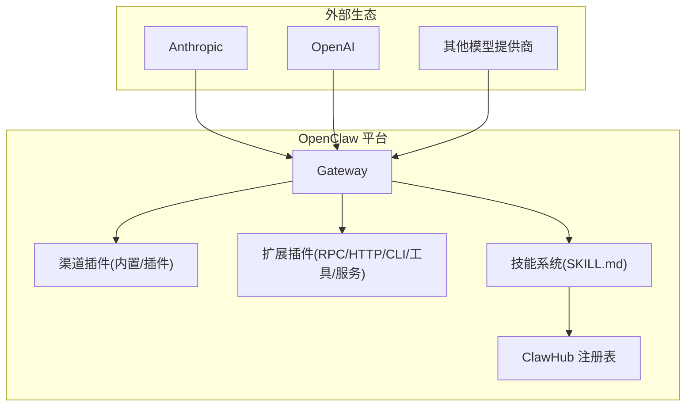
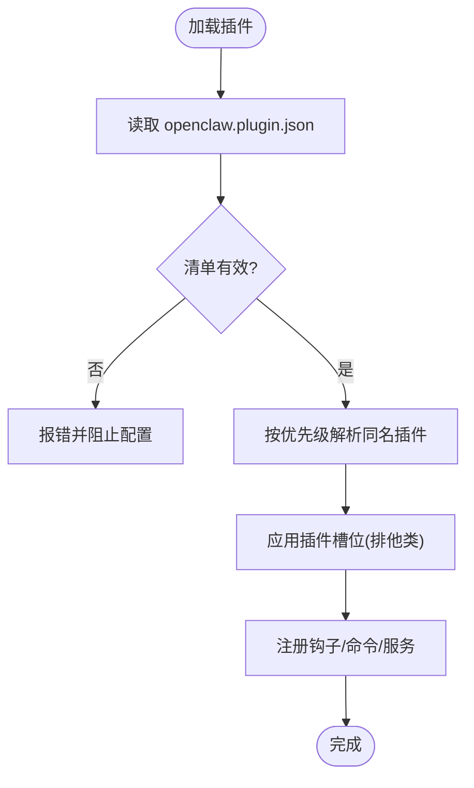
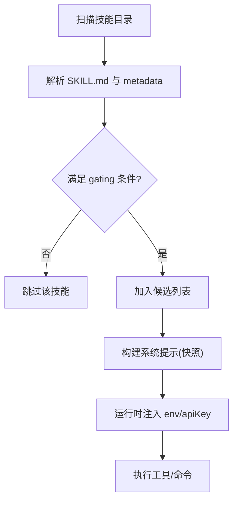
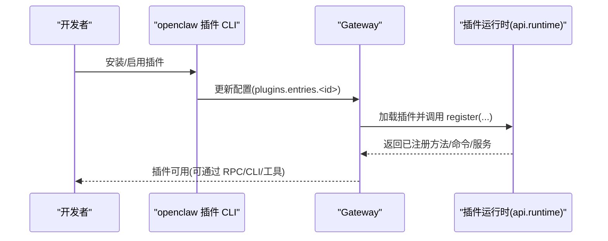
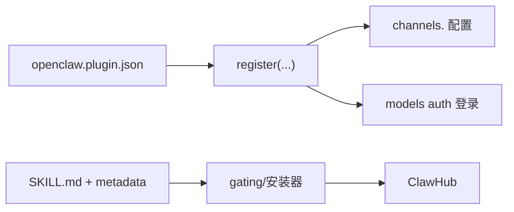

# 生态系统与合作伙伴

## 目录
1. [简介](#简介)
2. [项目结构](#项目结构)
3. [核心组件](#核心组件)
4. [架构总览](#架构总览)
5. [详细组件分析](#详细组件分析)
6. [依赖分析](#依赖分析)
7. [性能考虑](#性能考虑)
8. [故障排查指南](#故障排查指南)
9. [结论](#结论)
10. [附录](#附录)

## 简介
本文件面向 OpenClaw 的生态系统与合作伙伴，系统性阐述以下主题：
- 与主要 AI 模型提供商（Anthropic Claude Pro/Max、OpenAI ChatGPT/Codex）的关系与认证方式
- 渠道插件生态（WhatsApp、Telegram、Discord、Slack、Google Chat、Signal、iMessage、BlueBubbles、Microsoft Teams、LINE、Matrix、Nostr、Tlon、Twitch、Zalo、Zalo Personal、WebChat 等）
- 技能插件与记忆插件体系
- 提供程序（模型认证）插件与第三方扩展机制
- 插件开发标准流程、API 接口与集成方式
- ClawHub 技能注册表的作用与使用方法
- 社区贡献机制、插件发布流程与质量保证标准
- 成功案例与最佳实践

## 项目结构
OpenClaw 采用“核心平台 + 多通道 + 插件扩展 + 技能生态”的分层设计：
- 核心平台：Gateway 控制平面、会话与路由、媒体管线、节点与工具
- 渠道层：多聊天渠道接入（内置与插件化）
- 插件层：扩展 Gateway 能力（RPC 方法、HTTP 处理器、Agent 工具、CLI 命令、后台服务、自动回复命令、技能与提供程序）
- 技能层：以 `SKILL.md` 为核心的可发现、可配置、可安全加载的技能系统
- 注册表：ClawHub 公共技能注册表，支持搜索、安装、更新、发布与同步

```mermaid
graph TB
subgraph "核心平台"
GW["Gateway 控制平面"]
CFG["配置与策略"]
MEM["内存/会话"]
TOOLS["工具与节点"]
end
subgraph "渠道层"
CH_WA["WhatsApp"]
CH_TG["Telegram"]
CH_DC["Discord"]
CH_SL["Slack"]
CH_GC["Google Chat"]
CH_SG["Signal"]
CH_IM["iMessage"]
CH_BB["BlueBubbles"]
CH_MT["Microsoft Teams(插件)"]
CH_LN["LINE(插件)"]
CH_MX["Matrix(插件)"]
CH_NS["Nostr(插件)"]
CH_TL["Tlon(插件)"]
CH_TW["Twitch(插件)"]
CH_ZL["Zalo(插件)"]
CH_ZP["Zalo Personal(插件)"]
CH_WEB["WebChat"]
end
subgraph "插件层"
PL_VOICE["语音通话插件"]
PL_MEM["记忆插件(core/lancedb)"]
PL_AUTH["提供程序认证插件"]
PL_SKILLS["技能插件(由插件自带)"]
end
subgraph "技能层"
SK_CLAWHUB["ClawHub 技能(Skill)"]
SK_USER["用户自定义技能"]
end
subgraph "注册表"
HUB["ClawHub 技能注册表"]
end
GW --> CH_WA
GW --> CH_TG
GW --> CH_DC
GW --> CH_SL
GW --> CH_GC
GW --> CH_SG
GW --> CH_IM
GW --> CH_BB
GW --> CH_MT
GW --> CH_LN
GW --> CH_MX
GW --> CH_NS
GW --> CH_TL
GW --> CH_TW
GW --> CH_ZL
GW --> CH_ZP
GW --> CH_WEB
GW --> PL_VOICE
GW --> PL_MEM
GW --> PL_AUTH
GW --> PL_SKILLS
SK_CLAWHUB --> HUB
SK_USER --> GW
PL_SKILLS --> GW
```

## 核心组件
- 模型提供方与认证
  - Anthropic Claude Pro/Max（API Key 或 Setup-Token）
  - OpenAI ChatGPT/Codex（API Key 或 Codex 订阅）
- 渠道插件生态
  - 内置与插件化双路径，统一通过插件清单与 JSON Schema 验证
- 插件系统
  - 扩展 Gateway RPC/HTTP/CLI/工具/后台服务/自动回复命令/技能/提供程序认证
  - 严格清单校验与优先级规则
- 技能系统
  - AgentSkills 兼容的 `SKILL.md`，支持 gating、环境注入、安装器与 watcher
- ClawHub 注册表
  - 公共技能注册表，支持搜索、安装、更新、发布与同步

## 架构总览
OpenClaw 的“插件 + 渠道 + 技能 + 注册表”四层架构，确保了：
- 渠道接入的统一抽象与可插拔性
- 插件能力的最小暴露面与严格验证
- 技能的可发现、可配置、可安全执行
- 公共注册表驱动的生态繁荣与协作

## 详细组件分析

### 模型提供方与认证（Anthropic / OpenAI）
- Anthropic
  - 支持 API Key 与 Setup-Token 两种认证方式
  - 提供 prompt caching 参数配置与默认行为
- OpenAI
  - 支持 API Key 与 Codex 订阅（ChatGPT 登录或 API Key）
- 使用建议
  - 优先选择与长上下文与抗提示注入更强的模型组合
  - 在多代理或多会话场景中合理设置默认模型与参数

### 渠道插件生态（WhatsApp、Telegram、Discord、Slack、Google Chat、Signal、iMessage、BlueBubbles、Microsoft Teams、LINE、Matrix、Nostr、Tlon、Twitch、Zalo、Zalo Personal、WebChat）
- 支持列表与特性概览
  - 文本通用；媒体与反应支持因渠道而异
  - 可同时运行多个渠道，按聊天路由
- 安全与配置
  - DM 配对与白名单策略
  - 各渠道的特定配置键与最佳实践
- 插件化趋势
  - 多数渠道以插件形式提供，便于独立维护与升级

### 插件系统（扩展点、清单、API、钩子、提供程序认证、自动回复命令、后台服务）
- 扩展点
  - Gateway RPC 方法、HTTP 处理器、Agent 工具、CLI 命令、后台服务、可选配置校验、技能、自动回复命令
- 清单与验证
  - 必须提供 `openclaw.plugin.json`，包含 `id` 与 `configSchema`
  - 严格校验未知字段与插件 id，缺失或错误将阻断配置
- 发现与优先级
  - 配置路径 → 工作区扩展 → 全局扩展 → 内置扩展
  - 同名插件以首次出现为准
- 插件槽位
  - 排他类别（如 memory）通过 `plugins.slots` 选择当前生效插件
- 控制 UI 与标签
  - 通过 `uiHints` 为配置字段提供标签、占位符与敏感标记
- CLI
  - 列表、信息、安装、更新、启用/禁用、诊断
- 提供程序认证插件
  - 注册 provider auth 流程，支持 OAuth、API Key、设备码等
- 自动回复命令
  - 不触发 AI 即可执行的快捷命令
- 后台服务
  - 注册生命周期服务

### 技能系统（AgentSkills 兼容、gating、环境注入、安装器、ClawHub）
- 结构与位置
  - 三种来源：内置、托管/本地 (`~/.openclaw/skills`)、工作区 (`<workspace>/skills`)
  - 工作区 > 托管/本地 > 内置
- AgentSkills 兼容
  - `SKILL.md` 包含 YAML frontmatter 与指令
  - `metadata.openclaw` 支持 gating、安装器、主页等
- gating 规则
  - bins/env/config/os/primaryEnv/install 等
- 环境注入
  - per-agent 运行时注入，结束后恢复
- watcher 与快照
  - 新会话快照，变更在新会话生效
- ClawHub
  - 搜索、安装、更新、发布、同步
  - 默认安装到工作区，下个会话生效

### ClawHub 技能注册表（作用、使用、CLI、发布与同步）
- 作用
  - 公共技能注册表，公开、可见、可复用
- 使用
  - 搜索、安装、更新、发布、报告与举报
- CLI
  - login/whoami/logout、search、install、update、list、publish、delete/undelete、sync
- 版本与标签
  - 语义化版本、标签（latest 等）、变更日志
- 安全与审核
  - 上线要求、举报与审核、Moderator 权限

### 插件开发标准流程、API 与集成方式
- 开发流程
  - 编写 `openclaw.plugin.json`（id、configSchema、kind、channels/providers/skills/uiHints 等）
  - 实现插件入口（函数或对象），注册所需能力
  - 通过 CLI 安装/启用/更新/诊断
- API 与钩子
  - registerGatewayMethod/registerCli/registerCommand/registerService/registerProvider/registerChannel
  - 插件钩子目录与注册
- 插件 SDK 与运行时重构计划
  - 统一 SDK（类型、工具、配置助手）与运行时（仅通过 `api.runtime` 访问核心行为）
  - 分阶段迁移现有连接器，最终禁止插件直接导入 `src/**`
- 示例插件
  - 语音通话插件（Twilio/Telnyx/Plivo/mock）与相关配置项
  - 记忆插件（core/lancedb）

### 成功案例与最佳实践
- 展示案例
  - PR Review → Telegram 反馈、Wine Cellar Skill、Tesco Shop Autopilot、SNAG 截图转 Markdown、Agents UI、Telegram 语音笔记、CodexMonitor、Bambu 3D 打印机控制、Vienna Transport、R2 Upload、iOS 应用 via Telegram、Oura Ring 健康助理、多代理编排团队、Linear CLI、Beeper CLI 等
- 最佳实践
  - 从 ClawHub 搜索与安装技能，保持更新
  - 使用 gating 限制技能在合适环境运行
  - 对第三方技能进行安全审查
  - 使用插件 SDK 与运行时，避免直接导入核心源码
  - 通过插件槽位管理排他类能力（如记忆）

## 依赖分析
- 渠道与插件
  - 渠道插件通过统一的插件清单与 JSON Schema 进行声明与校验
  - 插件通过 `api.registerChannel` 注册，配置位于 `channels.<id>`
- 技能与注册表
  - 技能通过 `SKILL.md` 与 `metadata.openclaw` 进行 gating
  - ClawHub 作为公共注册表，提供搜索、安装、更新、发布与同步
- 提供程序认证
  - 插件通过 `api.registerProvider` 注册认证流程，统一在 CLI 中登录与管理

## 性能考虑
- 技能列表注入成本
  - 基础开销与每技能字符数决定 token 影响
  - 建议控制技能数量与描述长度，或在高成本模型上谨慎启用
- 插件与渠道
  - 严格清单与优先级减少无效加载
  - 合理使用插件槽位，避免重复实现
- 认证与网络
  - 提供程序认证尽量本地化，减少网络往返
  - 合理设置超时与重试策略

## 故障排查指南
- 插件清单与配置
  - 缺失或无效清单将导致配置验证失败
  - 未知插件 `id`、未知 `channels` 键将报错
- 渠道安全
  - DM 配对与白名单策略需正确配置
  - 使用 `doctor` 检查 DM 策略风险
- 认证问题
  - Anthropic Setup-Token 或 API Key 有效性检查
  - OpenAI Codex 订阅登录与模型引用
- 技能问题
  - gating 不满足导致技能不可见
  - 环境变量未注入或被覆盖
  - watcher 未启用导致变更不生效

## 结论
OpenClaw 通过“模型提供方 + 渠道插件 + 插件扩展 + 技能生态 + 注册表”的协同，构建了开放、可扩展且安全的个人 AI 助手平台。依托严格的插件清单与验证、可发现可配置的技能系统、以及公共的 ClawHub 注册表，开发者与用户可以快速扩展能力、共享技能并形成繁荣的生态。

## 附录
- 社区贡献与路线图
  - 维护者与贡献渠道
  - 当前关注点：稳定性、UX、技能生态、性能
- 技能创作与管理
  - 从创建 `SKILL.md` 到刷新与测试
  - 使用 ClawHub 进行安装、更新与发布