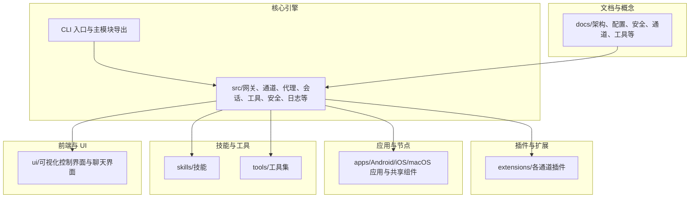
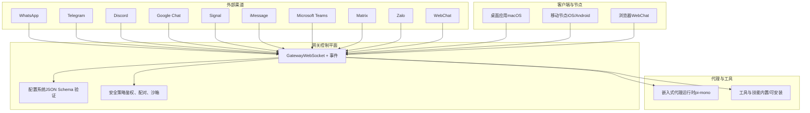
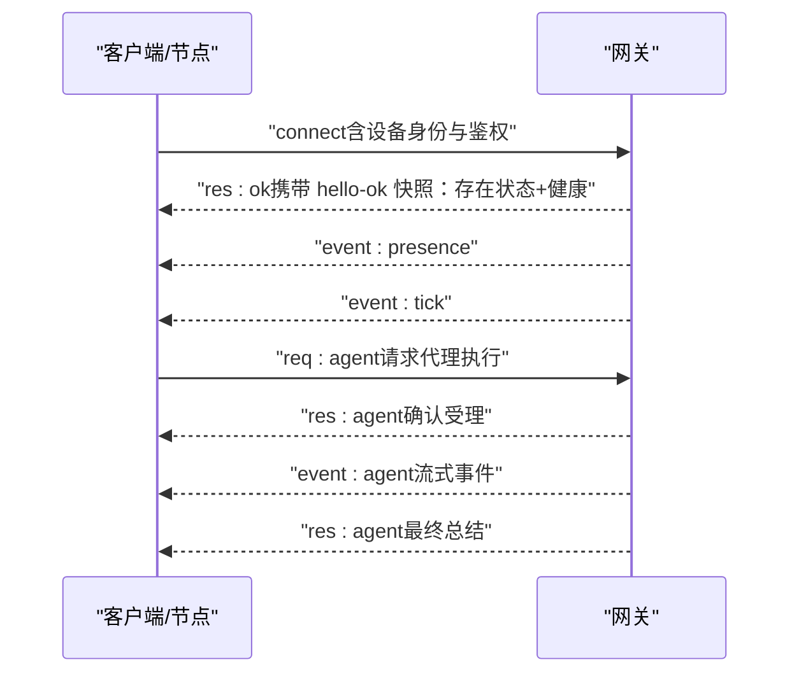
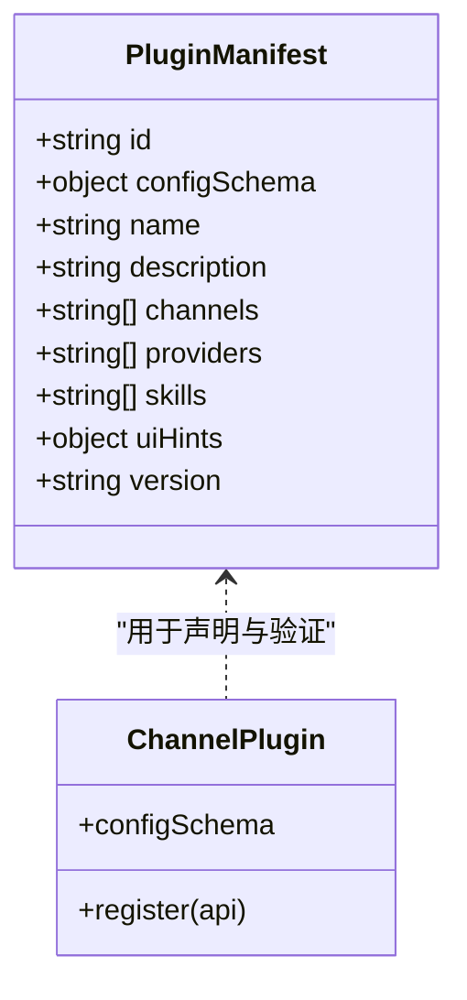
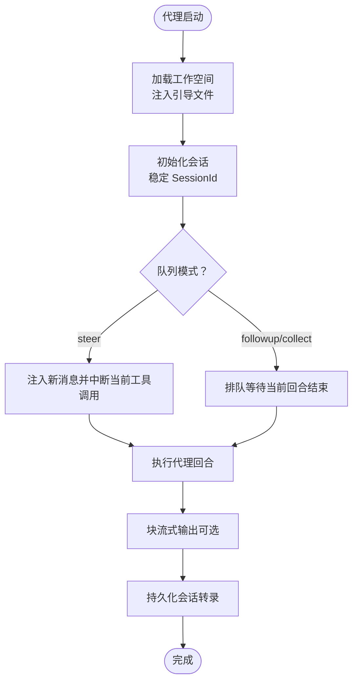
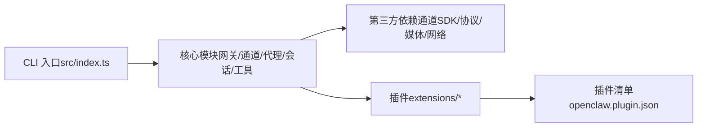

# 项目概述

## 目录
1. [简介](#简介)
2. [项目结构](#项目结构)
3. [核心组件](#核心组件)
4. [架构总览](#架构总览)
5. [详细组件分析](#详细组件分析)
6. [依赖关系分析](#依赖关系分析)
7. [性能考量](#性能考量)
8. [故障排查指南](#故障排查指南)
9. [结论](#结论)
10. [附录](#附录)

## 简介
OpenClaw 是一个运行在用户设备上的个人 AI 助手，强调“本地优先、安全可控、多通道聚合、智能代理协作”。其核心价值主张是：在一个统一的网关控制平面上，将多种即时通讯渠道（如 WhatsApp、Telegram、Discord、Google Chat、Signal、iMessage、Microsoft Teams 等）与跨平台节点（macOS/iOS/Android）连接起来，形成可扩展、可治理、可审计的个人智能体系统。

- 多渠道消息通信：通过插件化通道适配器接入主流 IM 平台，支持群聊路由、提及触发、媒体处理与分片发送。
- 智能代理系统：内置基于 pi-mono 的嵌入式代理运行时，支持工作空间注入、会话管理、工具策略与沙箱隔离。
- 跨平台设备连接：通过 WebSocket 控制平面连接桌面应用、移动节点与浏览器，实现设备级权限与命令转发。
- 本地优先安全架构：默认最小暴露面（回环绑定）、严格配置校验、设备配对与令牌鉴权、可选 Docker 沙箱与工具白名单。
- 实时 WebSocket 控制平面：统一的请求/响应与事件推送协议，支持心跳、存在状态、健康检查与远程访问隧道。
- 插件化扩展机制：通过插件清单与 JSON Schema 进行声明式配置验证，支持通道、技能与提供方扩展。

## 项目结构
从仓库组织看，OpenClaw 采用“核心引擎 + 多语言生态 + 插件扩展”的分层结构：
- 核心引擎与 CLI：位于 `src/`，包含网关、通道、代理、会话、工具、安全、日志等子系统；入口为 CLI 入口与主模块导出。
- 文档与概念：`docs/` 提供架构、配置、安全、通道、工具等深度说明。
- 插件与扩展：`extensions/` 下的各通道插件以独立包形式提供注册与运行时设置。
- 应用与节点：`apps/` 包含 Android、iOS、macOS 应用与共享组件；`shared/OpenClawKit` 提供跨平台 SDK。
- 技能与工具：`skills/` 与 `tools/` 提供可安装的技能与自动化工具集。
- 前端与 UI：`ui/` 为可视化控制界面与聊天界面提供前端支撑。

## 核心组件
- 网关（Gateway）：单实例守护进程，负责维护各渠道连接、暴露 WebSocket 控制平面、事件分发与健康状态。
- 通道插件（Channel Plugins）：以插件形式接入不同 IM 平台，提供认证、路由、消息收发与媒体处理。
- 代理运行时（Agent Runtime）：基于 pi-mono 的嵌入式代理，支持工作空间注入、会话管理、工具调用与流式输出。
- 客户端与节点（Clients & Nodes）：桌面应用、移动端节点与浏览器通过 WebSocket 连接网关，执行命令、订阅事件。
- 配置系统（Configuration）：严格 JSON Schema 验证，支持部分更新、包含指令与环境变量替换。
- 插件清单（Plugin Manifest）：每个插件必须提供 `openclaw.plugin.json`，声明 ID、配置模式与 UI 提示。

## 架构总览
OpenClaw 的系统边界清晰：网关作为控制平面，承载所有外部渠道连接与内部代理运行时；客户端与节点通过 WebSocket 与其交互；通道插件与技能通过插件机制扩展；配置与安全策略贯穿全链路。

## 详细组件分析

### 组件 A：网关 WebSocket 控制平面
- 单一长连接：客户端、节点与网关之间通过 WebSocket 保持长连接，首帧必须为 connect 握手。
- 请求/响应与事件：请求形如 `{type:"req", id, method, params}`，响应形如 `{type:"res", id, ok, payload|error}`；事件形如 `{type:"event", event, payload, seq?, stateVersion?}`。
- 鉴权与幂等：支持 `OPENCLAW_GATEWAY_TOKEN` 或 `--token`；对带副作用方法需提供幂等键去重。
- 设备配对与信任：connect 中包含设备身份，新设备需配对批准；本地连接可自动批准，远程连接需签名挑战。
- 运维快照：启动方式、健康查询与监督机制（launchd/systemd）。

### 组件 B：插件化通道扩展（以 Discord/Telegram/WhatsApp 为例）
- 插件注册：每个通道插件在 `index.ts` 中通过 `registerChannel` 注册，并设置运行时。
- 清单要求：插件必须提供 `openclaw.plugin.json`，包含 `id` 与 `configSchema`；未通过验证将阻断配置。
- 扩展边界：通道插件仅负责接入与路由，不直接执行业务逻辑；业务由代理与工具完成。

### 组件 C：代理运行时与工作空间
- 工作空间：`agents.defaults.workspace` 为代理唯一工作目录，注入 `AGENTS.md`、`SOUL.md`、`TOOLS.md` 等引导文件。
- 会话管理：会话转录存储于 `~/.openclaw/agents/<agentId>/sessions/<SessionId>.jsonl`，支持队列模式与块流式输出。
- 工具与技能：内置系统工具与用户维护的技能，可通过配置启用/禁用或按代理粒度限制。
- 多代理路由：通过 `agents.list` 与 `bindings` 将不同来源的消息路由到隔离的代理实例。

### 组件 D：配置系统与严格验证
- JSON5 配置：支持注释与尾随逗号，读取 `~/.openclaw/openclaw.json`。
- 严格校验：未知键、类型错误或无效值将拒绝启动；Doctor 命令提供诊断与修复建议。
- 部分更新：`config.patch` 支持 JSON 合并补丁语义，避免覆盖无关键。
- 包含指令：`$include` 支持拆分配置、共享通用设置与分离敏感信息。
- 环境变量：支持 `.env` 加载与内联替换，避免覆盖既有环境变量。

### 组件 E：安全模型与本地优先
- 默认最小暴露：网关默认绑定回环地址，结合 Tailscale/SSH 隧道进行远程访问。
- 设备配对：connect 中的设备身份需经批准；本地连接可自动批准，远程连接需签名挑战。
- 工具与沙箱：非主会话可启用 Docker 沙箱，默认允许 bash、process、读写等有限工具，禁止 browser/canvas/nodes 等高风险操作。
- 权限与节点命令：macOS 节点通过 `node.invoke` 执行本地命令，需遵循 TCC 权限与可选提升开关。

## 依赖关系分析
- CLI 入口：`src/index.ts` 导出构建程序、会话存储、端口检测与错误处理等能力，供 `openclaw` 命令使用。
- 核心依赖：`package.json` 展示了通道 SDK（Baileys、grammY、Slack Bolt、discord.js 等）、协议与类型系统（TypeBox、Zod）、WebSocket（ws）、HTTP（Hono/Express）、媒体处理（Sharp/PDF.js/Playwright）等。
- 插件生态：各通道插件通过 `openclaw/plugin-sdk` 导入空配置模式与注册接口，确保清单与配置严格一致。

## 性能考量
- 本地优先：网关运行在用户设备上，减少网络往返与云端依赖，提升响应速度与隐私保护。
- 流式输出：块流式与工具摘要可降低长文本传输成本，配合分片与压缩优化媒体传输。
- 沙箱隔离：非主会话启用 Docker 沙箱可降低资源争用与安全风险，但会引入额外开销。
- 媒体管线：图片/音频/视频的尺寸限制与临时文件生命周期管理有助于控制磁盘与内存占用。
- 心跳与超时：合理配置心跳间隔与代理超时，避免频繁调用与资源浪费。

## 故障排查指南
- 健康检查：通过 WS health 查询与 hello-ok 快照获取网关状态。
- 日志定位：默认日志文件位于 `/tmp/openclaw/openclaw-YYYY-MM-DD.log`，可调整控制台级别与敏感信息脱敏。
- Doctor 诊断：`openclaw doctor` 提供严格配置校验、迁移修复与问题提示。
- 端口冲突：使用 `ensurePortAvailable` 与 `handlePortError` 检测与报告端口占用。
- 远程访问：Tailscale Serve/Funnel 或 SSH 隧道需正确配置鉴权与绑定地址。

## 结论
OpenClaw 以“本地优先、安全可控、插件扩展”为核心理念，通过单一网关控制平面整合多渠道与多设备，结合严格的配置验证与设备配对机制，为个人用户提供可审计、可扩展且贴近本地体验的智能助手解决方案。对于初学者，推荐从向导与最小配置入手；对于开发者，可利用插件清单与通道 SDK 扩展新的渠道与技能，同时依托严格的安全与沙箱策略保障系统稳定与数据安全。

## 附录
- 快速开始：安装后运行 `openclaw onboard` 初始化网关与配对流程，随后启动 `openclaw gateway` 并通过 CLI/桌面/浏览器进行交互。
- 最小配置：至少设置 `agents.defaults.workspace` 与 `channels.<channel>.allowFrom`，确保仅允许受信来源触发。
- 远程访问：结合 Tailscale 或 SSH 隧道，安全地从异地访问本地网关与节点。